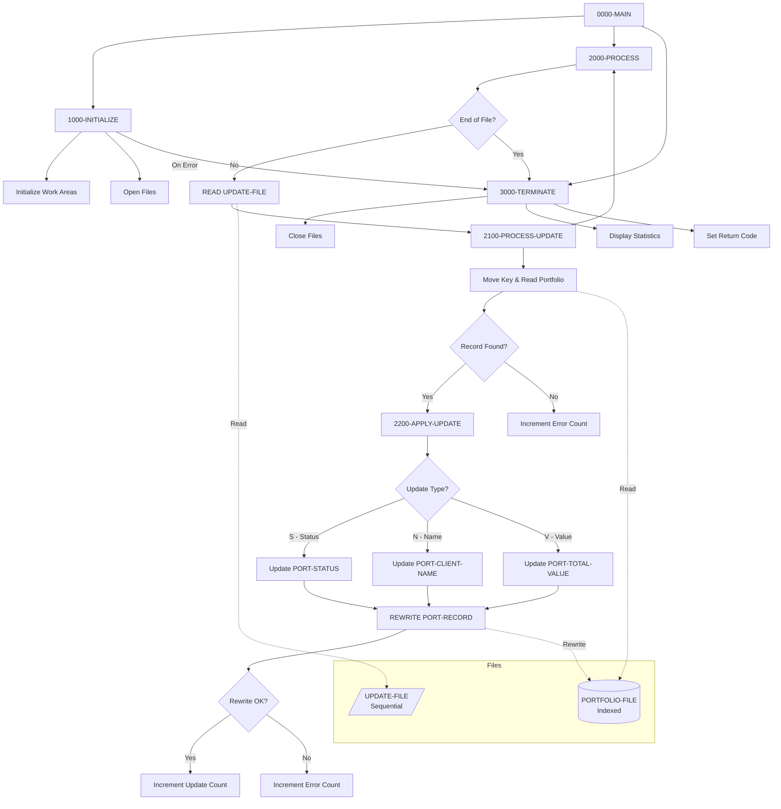
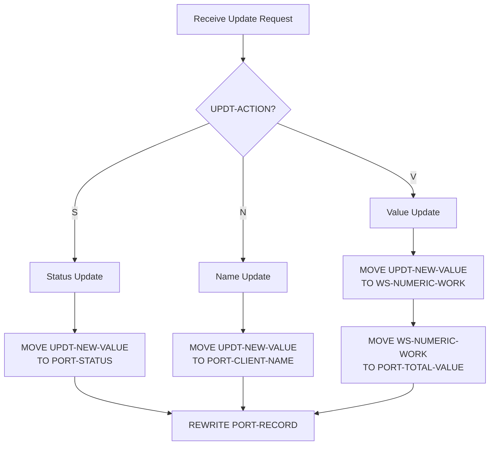

## Overview

PORTUPDT is a batch program that processes updates to existing portfolio records in the portfolio master file. It reads update requests from a sequential input file and applies changes to the corresponding records in the indexed portfolio file.

The program supports three types of updates:
- **Status updates** - Change the portfolio status (Active, Closed, Suspended)
- **Name updates** - Change the client name
- **Value updates** - Change the total portfolio value

This program is typically used for batch maintenance operations such as processing bulk status changes, name corrections, or value adjustments that come from external systems or reconciliation processes.

## Program Structure



## Data Structures

### File Section

#### PORTFOLIO-FILE (from PORTFLIO copybook)

| Level | Name | Picture | Description |
|-------|------|---------|-------------|
| 01 | PORT-RECORD | - | Portfolio master record |
| 05 | PORT-KEY | - | Composite record key |
| 10 | PORT-ID | X(8) | Portfolio identifier |
| 10 | PORT-ACCOUNT-NO | X(10) | Account number |
| 05 | PORT-CLIENT-INFO | - | Client information group |
| 10 | PORT-CLIENT-NAME | X(30) | Client name |
| 10 | PORT-CLIENT-TYPE | X(1) | Client type code |
| 05 | PORT-PORTFOLIO-INFO | - | Portfolio information group |
| 10 | PORT-CREATE-DATE | 9(8) | Creation date (YYYYMMDD) |
| 10 | PORT-LAST-MAINT | 9(8) | Last maintenance date |
| 10 | PORT-STATUS | X(1) | Portfolio status |
| 05 | PORT-FINANCIAL-INFO | - | Financial data group |
| 10 | PORT-TOTAL-VALUE | S9(13)V99 COMP-3 | Total portfolio value |
| 10 | PORT-CASH-BALANCE | S9(13)V99 COMP-3 | Cash balance |
| 05 | PORT-AUDIT-INFO | - | Audit information group |
| 10 | PORT-LAST-USER | X(8) | Last user to modify |
| 10 | PORT-LAST-TRANS | 9(8) | Last transaction date |
| 05 | PORT-FILLER | X(50) | Reserved space |

**Client Type Values (PORT-CLIENT-TYPE):**
- `I` - Individual
- `C` - Corporate
- `T` - Trust

**Portfolio Status Values (PORT-STATUS):**
- `A` - Active
- `C` - Closed
- `S` - Suspended

#### UPDATE-FILE

| Level | Name | Picture | Description |
|-------|------|---------|-------------|
| 01 | UPDATE-RECORD | - | Update request record |
| 05 | UPDT-KEY | - | Key of record to update |
| 10 | UPDT-ID | X(8) | Portfolio ID |
| 10 | UPDT-ACCT-NO | X(10) | Account number |
| 05 | UPDT-ACTION | X(1) | Type of update to apply |
| 05 | UPDT-NEW-VALUE | X(50) | New value to apply |

**Update Action Codes (88-levels):**

| Code | Condition Name | Description | Target Field |
|------|---------------|-------------|--------------|
| S | UPDT-STATUS | Status update | PORT-STATUS |
| V | UPDT-VALUE | Value update | PORT-TOTAL-VALUE |
| N | UPDT-NAME | Name update | PORT-CLIENT-NAME |

### Working Storage

#### WS-CONSTANTS

| Level | Name | Picture | Value | Description |
|-------|------|---------|-------|-------------|
| 05 | WS-PROGRAM-NAME | X(8) | 'PORTUPDT' | Program identifier |
| 05 | WS-SUCCESS | S9(4) | +0 | Success return code |
| 05 | WS-ERROR | S9(4) | +8 | Error return code |

#### WS-SWITCHES

| Level | Name | Picture | Description |
|-------|------|---------|-------------|
| 05 | WS-FILE-STATUS | X(2) | Portfolio file status |
| 05 | WS-UPDT-STATUS | X(2) | Update file status |
| 05 | WS-END-OF-FILE-SW | X | End of file switch |

**File Status 88-Level Conditions:**

| Condition | Value | Meaning |
|-----------|-------|---------|
| WS-SUCCESS-STATUS | 00 | Successful operation |
| WS-EOF-STATUS | 10 | End of file reached |
| WS-REC-NOT-FND | 23 | Record not found |
| WS-UPDT-SUCCESS | 00 | Update file success |
| WS-UPDT-EOF | 10 | Update file EOF |

**End of File Conditions:**
- `END-OF-FILE` (Y) - End of update file reached
- `NOT-END-OF-FILE` (N) - More records to process

#### WS-WORK-AREAS

| Level | Name | Picture | Description |
|-------|------|---------|-------------|
| 05 | WS-UPDATE-COUNT | 9(7) | Successfully updated records |
| 05 | WS-ERROR-COUNT | 9(7) | Records with errors |
| 05 | WS-RETURN-CODE | S9(4) | Program return code |
| 05 | WS-NUMERIC-WORK | S9(13)V99 | Numeric conversion work area |

## File I/O

### PORTFOLIO-FILE

| Attribute | Value |
|-----------|-------|
| Logical Name | PORTFOLIO-FILE |
| DD Name | PORTFILE |
| Organization | Indexed |
| Access Mode | Random |
| Record Key | PORT-KEY |
| Open Mode | I-O (Input-Output) |
| File Status | WS-FILE-STATUS |

### UPDATE-FILE

| Attribute | Value |
|-----------|-------|
| Logical Name | UPDATE-FILE |
| DD Name | UPDTFILE |
| Organization | Sequential |
| Open Mode | Input |
| File Status | WS-UPDT-STATUS |

### File Operations Summary

| Operation | File | Paragraph | Description |
|-----------|------|-----------|-------------|
| OPEN I-O | PORTFOLIO-FILE | 1000-INITIALIZE | Open for read and update |
| OPEN INPUT | UPDATE-FILE | 1000-INITIALIZE | Open for reading requests |
| READ | UPDATE-FILE | 2000-PROCESS | Read next update request |
| READ | PORTFOLIO-FILE | 2100-PROCESS-UPDATE | Read record to update |
| REWRITE | PORTFOLIO-FILE | 2200-APPLY-UPDATE | Write updated record |
| CLOSE | Both files | 3000-TERMINATE | Close all files |

## Control Flow

### Main Processing Logic

1. **0000-MAIN** - Program entry point
   - Calls initialization
   - Processes updates until end of file
   - Calls termination

2. **1000-INITIALIZE** - Setup
   - Initializes counters and work areas
   - Opens portfolio file for I-O (read/update)
   - Opens update file for input
   - If any file fails to open, displays error and terminates

3. **2000-PROCESS** - Read Loop
   - Reads next record from UPDATE-FILE
   - On AT END, sets end-of-file switch
   - On NOT AT END, performs update processing

4. **2100-PROCESS-UPDATE** - Update Logic
   - Moves update key to portfolio key
   - Reads the portfolio record for update
   - If found, applies the update
   - If not found, increments error counter and displays message

5. **2200-APPLY-UPDATE** - Apply Changes
   - Uses EVALUATE TRUE to determine update type:
     - `UPDT-STATUS`: Moves new value to PORT-STATUS
     - `UPDT-NAME`: Moves new value to PORT-CLIENT-NAME
     - `UPDT-VALUE`: Converts and moves to PORT-TOTAL-VALUE
   - Rewrites the portfolio record
   - On success: Increments update counter
   - On failure: Increments error counter

6. **3000-TERMINATE** - Cleanup
   - Closes all files
   - Displays processing statistics
   - Sets program return code

### Update Type Processing



## Dependencies

### Copybooks

- **PORTFLIO** - Portfolio master record layout defining the structure of records in the portfolio file

### Called Programs

This program does not call any external programs.

### Related Programs

**Programs using PORTFLIO copybook:**
- PORTADD - Portfolio addition program
- PORTDEL - Portfolio deletion program
- PORTREAD - Portfolio read/inquiry program
- PORTTEST - Portfolio testing program
- TSTGEN00 - Test data generation

## Technical Notes

### COBOL Concepts Used

- **INDEXED File Organization**: The portfolio file uses indexed organization with random access mode, enabling direct access to records by key for efficient updates.

- **OPEN I-O**: Opens the portfolio file for both input and output operations, required for the READ and REWRITE sequence.

- **READ for Update**: The READ statement retrieves the record and positions the file for a subsequent REWRITE operation.

- **REWRITE Statement**: The COBOL REWRITE statement updates an existing record in place. The record must first be read successfully, and the key cannot be changed.

- **EVALUATE TRUE with 88-Levels**: Uses condition names (88-levels) in EVALUATE TRUE for clear, readable branching based on update type.

- **Numeric Conversion**: For value updates, the program moves the alphanumeric input to a numeric work field before moving to the COMP-3 target field. This handles the data type conversion.

### Data Type Conversion

For value updates, the program performs a two-step conversion:

```cobol
MOVE UPDT-NEW-VALUE TO WS-NUMERIC-WORK
MOVE WS-NUMERIC-WORK TO PORT-TOTAL-VALUE
```

This is necessary because:
1. `UPDT-NEW-VALUE` is PIC X(50) (alphanumeric)
2. `WS-NUMERIC-WORK` is PIC S9(13)V99 (numeric display)
3. `PORT-TOTAL-VALUE` is PIC S9(13)V99 COMP-3 (packed decimal)

The intermediate numeric field allows proper conversion from character to packed decimal format.

### Return Codes

| Code | Meaning |
|------|---------|
| 0 | Successful completion |
| 8 | Error occurred (file open failure) |

### Processing Statistics

The program displays the following statistics at termination:
- Updates processed - Successful updates
- Errors occurred - Failed reads or rewrites

### JCL Requirements

```jcl
//PORTUPDT EXEC PGM=PORTUPDT
//PORTFILE DD DSN=your.portfolio.file,DISP=OLD
//UPDTFILE DD DSN=your.update.requests,DISP=SHR
//SYSOUT   DD SYSOUT=*
```

**Notes:**
- PORTFILE requires DISP=OLD for exclusive access during updates
- UPDTFILE contains the update requests to process

### Update Request File Format

Each update request record contains:

| Position | Length | Field | Description |
|----------|--------|-------|-------------|
| 1-8 | 8 | Portfolio ID | Identifies the portfolio |
| 9-18 | 10 | Account Number | Account within portfolio |
| 19 | 1 | Action Code | S=Status, V=Value, N=Name |
| 20-69 | 50 | New Value | Value to apply |

**Example Update Records:**

```
PORT0001ACCT000001SA                                                
PORT0002ACCT000002NJOHN DOE UPDATED                                 
PORT0003ACCT000003V000000150000.00                                  
```

- First record: Changes status to 'A' (Active)
- Second record: Changes name to 'JOHN DOE UPDATED'
- Third record: Changes total value to 150,000.00

### Error Handling

The program handles several error conditions:
1. **File open failures** - Displays status codes and terminates with RC=8
2. **Record not found** - Displays message, counts error, continues processing
3. **Rewrite failures** - Displays message, counts error, continues processing

The program continues processing even when individual records fail, ensuring maximum throughput while tracking all errors.

### Limitations

- The record key (PORT-KEY) cannot be changed via update
- Only one field can be updated per request record
- No validation is performed on the new values before applying
- No audit trail is written (unlike PORTDEL)
