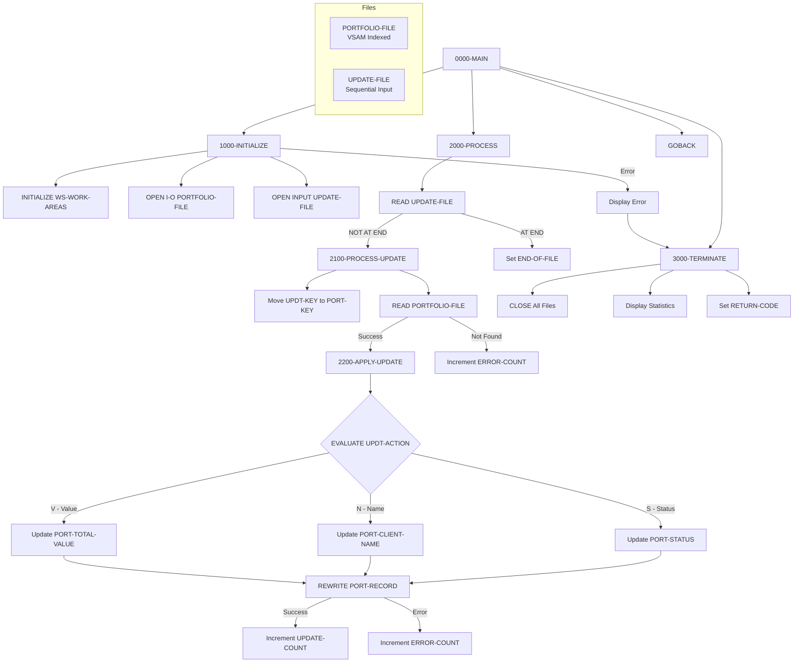

## Overview

PORTUPDT is a batch program that processes portfolio update requests. It reads update transactions from an input file and applies changes to existing portfolio records in the master file. The program supports updating different fields based on an action code in the update request.

Key features:
- **Batch Update Processing**: Reads sequential file of update requests
- **VSAM Random Access**: Uses random access to efficiently locate and update specific portfolio records
- **Multiple Update Types**: Supports status changes, client name updates, and portfolio value adjustments
- **Error Handling**: Tracks and reports records not found and update failures
- **Statistics Reporting**: Displays counts of successful updates and errors at completion

This program is typically run as part of portfolio maintenance batch jobs to apply bulk changes to portfolio records.

## Program Structure



## Data Structures

### File Section

#### PORTFOLIO-FILE (PORTFLIO Copybook)

| Level | Name | Picture | Description |
|-------|------|---------|-------------|
| 01 | PORT-RECORD | - | Portfolio master record |
| 05 | PORT-KEY | - | Composite primary key |
| 10 | PORT-ID | X(8) | Portfolio identifier |
| 10 | PORT-ACCOUNT-NO | X(10) | Account number |
| 05 | PORT-CLIENT-INFO | - | Client information |
| 10 | PORT-CLIENT-NAME | X(30) | Client name |
| 10 | PORT-CLIENT-TYPE | X(1) | Client type code |
| 05 | PORT-PORTFOLIO-INFO | - | Portfolio information |
| 10 | PORT-CREATE-DATE | 9(8) | Creation date |
| 10 | PORT-LAST-MAINT | 9(8) | Last maintenance date |
| 10 | PORT-STATUS | X(1) | Portfolio status |
| 05 | PORT-FINANCIAL-INFO | - | Financial data |
| 10 | PORT-TOTAL-VALUE | S9(13)V99 COMP-3 | Total portfolio value |
| 10 | PORT-CASH-BALANCE | S9(13)V99 COMP-3 | Cash balance |
| 05 | PORT-AUDIT-INFO | - | Audit information |
| 10 | PORT-LAST-USER | X(8) | Last user to modify |
| 10 | PORT-LAST-TRANS | 9(8) | Last transaction date |
| 05 | PORT-FILLER | X(50) | Reserved space |

##### Client Type Values (PORT-CLIENT-TYPE)

| Value | 88-Level Name | Meaning |
|-------|---------------|---------|
| `'I'` | PORT-INDIVIDUAL | Individual account |
| `'C'` | PORT-CORPORATE | Corporate account |
| `'T'` | PORT-TRUST | Trust account |

##### Portfolio Status Values (PORT-STATUS)

| Value | 88-Level Name | Meaning |
|-------|---------------|---------|
| `'A'` | PORT-ACTIVE | Active portfolio |
| `'C'` | PORT-CLOSED | Closed portfolio |
| `'S'` | PORT-SUSPENDED | Suspended portfolio |

#### UPDATE-FILE

| Level | Name | Picture | Description |
|-------|------|---------|-------------|
| 01 | UPDATE-RECORD | - | Update request record |
| 05 | UPDT-KEY | - | Key of record to update |
| 10 | UPDT-ID | X(8) | Portfolio ID |
| 10 | UPDT-ACCT-NO | X(10) | Account number |
| 05 | UPDT-ACTION | X(1) | Update action code |
| 05 | UPDT-NEW-VALUE | X(50) | New value to apply |

##### Update Action Codes (UPDT-ACTION)

| Value | 88-Level Name | Target Field | Description |
|-------|---------------|--------------|-------------|
| `'S'` | UPDT-STATUS | PORT-STATUS | Update portfolio status |
| `'V'` | UPDT-VALUE | PORT-TOTAL-VALUE | Update total value |
| `'N'` | UPDT-NAME | PORT-CLIENT-NAME | Update client name |

### Working Storage

#### Constants

| Level | Name | Picture | Value | Description |
|-------|------|---------|-------|-------------|
| 01 | WS-CONSTANTS | - | - | Program constants |
| 05 | WS-PROGRAM-NAME | X(8) | `'PORTUPDT'` | Program identifier |
| 05 | WS-SUCCESS | S9(4) | +0 | Success return code |
| 05 | WS-ERROR | S9(4) | +8 | Error return code |

#### File Status Switches

| Level | Name | Picture | Description |
|-------|------|---------|-------------|
| 01 | WS-SWITCHES | - | Status switches |
| 05 | WS-FILE-STATUS | X(2) | Portfolio file status |
| 05 | WS-UPDT-STATUS | X(2) | Update file status |
| 05 | WS-END-OF-FILE-SW | X | EOF indicator |

##### Portfolio File Status (WS-FILE-STATUS)

| Value | 88-Level Name | Meaning |
|-------|---------------|---------|
| `'00'` | WS-SUCCESS-STATUS | Successful operation |
| `'10'` | WS-EOF-STATUS | End of file |
| `'23'` | WS-REC-NOT-FND | Record not found |

##### Update File Status (WS-UPDT-STATUS)

| Value | 88-Level Name | Meaning |
|-------|---------------|---------|
| `'00'` | WS-UPDT-SUCCESS | Successful operation |
| `'10'` | WS-UPDT-EOF | End of file |

##### End of File Switch (WS-END-OF-FILE-SW)

| Value | 88-Level Name | Meaning |
|-------|---------------|---------|
| `'Y'` | END-OF-FILE | End of file reached |
| `'N'` | NOT-END-OF-FILE | More records to process |

#### Work Areas

| Level | Name | Picture | Initial | Description |
|-------|------|---------|---------|-------------|
| 01 | WS-WORK-AREAS | - | - | Work area group |
| 05 | WS-UPDATE-COUNT | 9(7) | ZERO | Successful updates |
| 05 | WS-ERROR-COUNT | 9(7) | ZERO | Processing errors |
| 05 | WS-RETURN-CODE | S9(4) | +0 | Program return code |
| 05 | WS-NUMERIC-WORK | S9(13)V99 | - | Numeric conversion area |

## File I/O

### PORTFOLIO-FILE

| Property | Value |
|----------|-------|
| DD Name | PORTFILE |
| Organization | INDEXED (VSAM KSDS) |
| Access Mode | RANDOM |
| Record Key | PORT-KEY (PORT-ID + PORT-ACCOUNT-NO) |
| File Status | WS-FILE-STATUS |
| Open Mode | I-O (Input-Output) |

The portfolio file is opened for I-O to allow both READ and REWRITE operations.

### UPDATE-FILE

| Property | Value |
|----------|-------|
| DD Name | UPDTFILE |
| Organization | SEQUENTIAL |
| File Status | WS-UPDT-STATUS |
| Open Mode | INPUT |

Sequential input file containing update requests.

### File Operations Summary

| Paragraph | File | Operation |
|-----------|------|-----------|
| 1000-INITIALIZE | PORTFOLIO-FILE | OPEN I-O |
| 1000-INITIALIZE | UPDATE-FILE | OPEN INPUT |
| 2000-PROCESS | UPDATE-FILE | READ |
| 2100-PROCESS-UPDATE | PORTFOLIO-FILE | READ (random) |
| 2200-APPLY-UPDATE | PORTFOLIO-FILE | REWRITE |
| 3000-TERMINATE | Both files | CLOSE |

## Control Flow

### 0000-MAIN

The main entry point that orchestrates the update process:
1. **PERFORM 1000-INITIALIZE**: Set up files and work areas
2. **PERFORM 2000-PROCESS UNTIL END-OF-FILE**: Process all update requests
3. **PERFORM 3000-TERMINATE**: Close files and report statistics
4. **GOBACK**: Return to caller/operating system

### 1000-INITIALIZE

Performs program initialization:
1. **INITIALIZE WS-WORK-AREAS**: Clears counters and work fields
2. **OPEN files**: Opens PORTFOLIO-FILE for I-O and UPDATE-FILE for INPUT
3. **Error check**: If either file fails to open:
   - Displays error message with file statuses
   - Sets WS-RETURN-CODE to WS-ERROR (8)
   - Performs 3000-TERMINATE to clean up

### 2000-PROCESS

Reads and processes update requests in a loop:
1. **READ UPDATE-FILE**: Reads next update request
   - AT END: Sets END-OF-FILE flag to stop loop
   - NOT AT END: Performs 2100-PROCESS-UPDATE

### 2100-PROCESS-UPDATE

Processes a single update request:
1. **MOVE UPDT-KEY TO PORT-KEY**: Sets up key for portfolio lookup
2. **READ PORTFOLIO-FILE**: Random read using the key
3. **Check status**:
   - **WS-SUCCESS-STATUS**: Record found, perform 2200-APPLY-UPDATE
   - **Otherwise**: Record not found, increment WS-ERROR-COUNT, display message

### 2200-APPLY-UPDATE

Applies the update to the portfolio record:
1. **EVALUATE TRUE** based on UPDT-ACTION:
   - **UPDT-STATUS (`'S'`)**: Moves UPDT-NEW-VALUE to PORT-STATUS
   - **UPDT-NAME (`'N'`)**: Moves UPDT-NEW-VALUE to PORT-CLIENT-NAME
   - **UPDT-VALUE (`'V'`)**: Converts UPDT-NEW-VALUE to numeric and moves to PORT-TOTAL-VALUE
2. **REWRITE PORT-RECORD**: Updates the record in the file
3. **Check status**:
   - **Success**: Increment WS-UPDATE-COUNT
   - **Error**: Increment WS-ERROR-COUNT, display failure message

### 3000-TERMINATE

Performs cleanup and reporting:
1. **CLOSE all files**: Closes PORTFOLIO-FILE and UPDATE-FILE
2. **Display statistics**:
   - Updates processed count
   - Errors occurred count
3. **MOVE WS-RETURN-CODE TO RETURN-CODE**: Sets job return code

## Update Types

### Status Update (`'S'`)

Updates the portfolio status field. Valid status values:
- `'A'` - Active
- `'C'` - Closed
- `'S'` - Suspended

**Example update record:**
```
PORT0001 1234567890S A
```
This sets portfolio PORT0001/1234567890 to Active status.

### Name Update (`'N'`)

Updates the client name field (up to 30 characters from the 50-character input).

**Example update record:**
```
PORT0001 1234567890N JOHN DOE ENTERPRISES LLC
```

### Value Update (`'V'`)

Updates the total portfolio value. The value is converted from alphanumeric to packed decimal.

**Example update record:**
```
PORT0001 1234567890V 000000125000000
```
This sets the portfolio value to 1,250,000.00.

## Processing Flow Diagram

```
┌─────────────────────────────────────────────────────────────┐
│                   PORTUPDT Processing                        │
├─────────────────────────────────────────────────────────────┤
│                                                              │
│  UPDATE-FILE ──────► Read Request                            │
│       │                   │                                  │
│       │                   ▼                                  │
│       │         ┌─────────────────┐                         │
│       │         │ Lookup in       │                         │
│       │         │ PORTFOLIO-FILE  │                         │
│       │         └────────┬────────┘                         │
│       │                  │                                   │
│       │         ┌────────┴────────┐                         │
│       │         │                 │                         │
│       │         ▼                 ▼                         │
│       │      Found           Not Found                       │
│       │         │                 │                         │
│       │         ▼                 ▼                         │
│       │   Apply Update      Log Error                       │
│       │         │                                           │
│       │         ▼                                           │
│       │   REWRITE Record                                    │
│       │         │                                           │
│       │         ▼                                           │
│       │   Update Statistics                                 │
│       │                                                      │
│       └──────► Next Request (loop until EOF)                │
│                                                              │
└─────────────────────────────────────────────────────────────┘
```

## Sample JCL

```jcl
//PORTUPDT EXEC PGM=PORTUPDT
//STEPLIB  DD DSN=your.loadlib,DISP=SHR
//PORTFILE DD DSN=your.portfolio.vsam.file,DISP=SHR
//UPDTFILE DD DSN=your.update.requests,DISP=SHR
//SYSOUT   DD SYSOUT=*
```

## Sample Update File

```
PORT0001 1234567890S A                                          
PORT0002 9876543210N ACME CORPORATION                           
PORT0003 5555555555V 000000250000000                            
PORT0001 1234567890N SMITH, JOHN Q.                             
```

Each record contains:
- Positions 1-8: Portfolio ID
- Positions 9-18: Account Number
- Position 19: Action Code (S/N/V)
- Positions 20-69: New Value

## Dependencies

### Copybooks

- **PORTFLIO** - Portfolio master record layout with client, financial, and audit information

### Called Programs

None - PORTUPDT is a standalone batch program.

### Related Programs

- **PORTDEL** - Portfolio deletion program
- **PORTADD** - Portfolio creation program (if exists)
- **PORTMSTR** - Portfolio master maintenance

## Return Codes

| Code | Meaning |
|------|---------|
| 0 | Successful completion (may include not-found errors) |
| 8 | Error during processing (file open failure) |

## Console Output

The program produces console output for monitoring:

**Error Messages:**
- `Error opening files: PORT=xx UPDT=xx` - File open failure
- `Record not found: [key]` - Update request for non-existent record
- `Update failed for: [key]` - REWRITE operation failed

**Statistics (at termination):**
```
Updates processed: 0000125
Errors occurred:   0000003
```

## Technical Notes

### COBOL Constructs Used

- **INDEXED File with RANDOM Access**: The PORTFOLIO-FILE uses random access mode to directly locate records by key for efficient update processing.

- **REWRITE Statement**: Updates an existing record in an indexed file. The record must first be successfully read before it can be rewritten (establishes record currency).

- **OPEN I-O**: Opens the file for both input and output operations, required for read-then-update processing.

- **EVALUATE TRUE**: Multi-way branch based on 88-level condition names. Determines which field to update based on UPDT-ACTION code.

- **Numeric Conversion**: For value updates, the alphanumeric UPDT-NEW-VALUE is moved to WS-NUMERIC-WORK (a numeric field) before moving to the COMP-3 PORT-TOTAL-VALUE field.

- **PERFORM UNTIL**: Loop construct that continues processing until the END-OF-FILE condition becomes true.

### File Status Codes

| Status | Meaning |
|--------|---------|
| `'00'` | Successful operation |
| `'10'` | End of file (sequential read) |
| `'23'` | Record not found (random read) |

### Data Conversion

When updating the total value (action `'V'`):
1. UPDT-NEW-VALUE (PIC X(50)) is moved to WS-NUMERIC-WORK (PIC S9(13)V99)
2. WS-NUMERIC-WORK is then moved to PORT-TOTAL-VALUE (PIC S9(13)V99 COMP-3)

This two-step conversion ensures proper handling of the alphanumeric-to-packed-decimal conversion.

### Processing Characteristics

- **In-place updates**: Records are read and rewritten in the same location
- **Single-field updates**: Each update request modifies only one field
- **No validation**: The program does not validate new values (e.g., status codes)
- **Sequential processing**: Update requests are processed in file order
- **No duplicate handling**: Multiple updates to the same record are allowed
