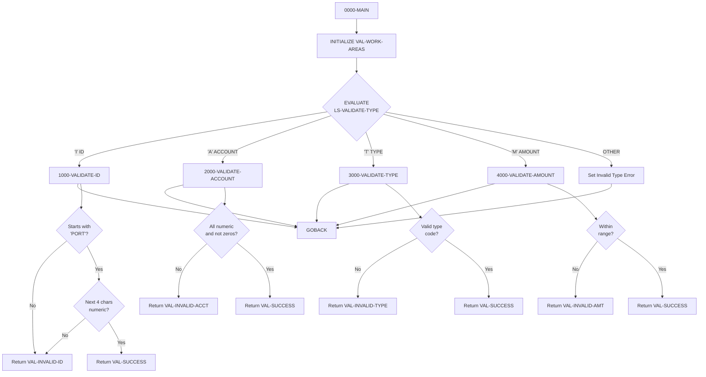

## Overview

PORTVALD is a callable validation subroutine that provides centralized data validation for portfolio-related fields. It is designed to be called by other programs that need to validate portfolio data before processing, ensuring consistent validation rules across the application.

The program supports four validation types:
- **I (ID)** - Validate portfolio ID format
- **A (Account)** - Validate account number format
- **T (Type)** - Validate investment type code
- **M (Amount)** - Validate monetary amount range

Key features include:
- **Centralized validation logic** - Single source of truth for validation rules
- **Consistent error messages** - Standardized error messages defined in PORTVAL copybook
- **Numeric return codes** - Specific codes for each validation failure type
- **Reusable design** - Can be called from batch, online, or other service programs

This approach eliminates duplicate validation code across programs and ensures that any changes to validation rules are applied consistently throughout the system.

## Program Structure



## Data Structures

### Linkage Section (Interface)

| Level | Name | Picture | Description |
|-------|------|---------|-------------|
| 01 | LS-VALIDATION-REQUEST | - | Main interface structure |
| 05 | LS-VALIDATE-TYPE | PIC X(1) | Validation type code |
| 05 | LS-INPUT-VALUE | PIC X(50) | Value to validate |
| 05 | LS-RETURN-CODE | PIC S9(4) COMP | Validation result code |
| 05 | LS-ERROR-MSG | PIC X(50) | Error message (if validation fails) |

### Validation Type Codes (88-Level Conditions)

| Condition Name | Value | Description |
|----------------|-------|-------------|
| LS-VAL-ID | `I` | Validate portfolio ID |
| LS-VAL-ACCT | `A` | Validate account number |
| LS-VAL-TYPE | `T` | Validate investment type |
| LS-VAL-AMT | `M` | Validate monetary amount |

### Return Codes (from PORTVAL copybook)

| Name | Value | Description |
|------|-------|-------------|
| VAL-SUCCESS | +0 | Validation passed |
| VAL-INVALID-ID | +1 | Invalid portfolio ID format |
| VAL-INVALID-ACCT | +2 | Invalid account number format |
| VAL-INVALID-TYPE | +3 | Invalid investment type |
| VAL-INVALID-AMT | +4 | Amount outside valid range |

### Error Messages (from PORTVAL copybook)

| Name | Message |
|------|---------|
| VAL-ERR-ID | "Invalid Portfolio ID format" |
| VAL-ERR-ACCT | "Invalid Account Number format" |
| VAL-ERR-TYPE | "Invalid Investment Type" |
| VAL-ERR-AMT | "Amount outside valid range" |

### Validation Constants (from PORTVAL copybook)

| Name | Picture | Value | Description |
|------|---------|-------|-------------|
| VAL-MIN-AMOUNT | PIC S9(13)V99 | -9999999999999.99 | Minimum allowed amount |
| VAL-MAX-AMOUNT | PIC S9(13)V99 | +9999999999999.99 | Maximum allowed amount |
| VAL-ID-PREFIX | PIC X(4) | `'PORT'` | Required portfolio ID prefix |

### Working Storage (from PORTVAL copybook)

| Level | Name | Picture | Description |
|-------|------|---------|-------------|
| 01 | VAL-WORK-AREAS | - | Working storage group |
| 05 | VAL-NUMERIC-CHECK | PIC X(10) | Field for numeric validation |
| 05 | VAL-TEMP-NUM | PIC S9(13)V99 | Temporary numeric field for amount |
| 05 | VAL-ERROR-CODE | PIC S9(4) | Working error code |
| 05 | VAL-ERROR-MSG | PIC X(50) | Working error message |

## File I/O

This program does not perform any file I/O operations. It is a pure validation routine that operates entirely on data passed through the linkage section.

## Control Flow

### 0000-MAIN

The main entry point that:
1. Initializes all working storage areas
2. Evaluates the validation type code to dispatch to the appropriate validation paragraph
3. Handles invalid validation type codes with a specific error
4. Returns to caller via GOBACK

### 1000-VALIDATE-ID (Portfolio ID Validation)

Validates that a portfolio ID follows the required format:

**Rule**: Must start with `'PORT'` followed by exactly 4 numeric digits (e.g., `PORT0001`, `PORT1234`)

**Logic**:
```cobol
IF LS-INPUT-VALUE(1:4) NOT = VAL-ID-PREFIX
    MOVE VAL-INVALID-ID TO LS-RETURN-CODE
    MOVE VAL-ERR-ID TO LS-ERROR-MSG
    EXIT PARAGRAPH
END-IF

MOVE LS-INPUT-VALUE(5:4) TO VAL-NUMERIC-CHECK
IF VAL-NUMERIC-CHECK IS NOT NUMERIC
    MOVE VAL-INVALID-ID TO LS-RETURN-CODE
    MOVE VAL-ERR-ID TO LS-ERROR-MSG
    EXIT PARAGRAPH
END-IF
```

Uses reference modification (`LS-INPUT-VALUE(1:4)` and `LS-INPUT-VALUE(5:4)`) to extract and validate portions of the ID.

### 2000-VALIDATE-ACCOUNT (Account Number Validation)

Validates that an account number is properly formatted:

**Rule**: Must be entirely numeric and cannot be all zeros

**Logic**:
```cobol
IF LS-INPUT-VALUE IS NOT NUMERIC
OR LS-INPUT-VALUE = ZEROS
    MOVE VAL-INVALID-ACCT TO LS-RETURN-CODE
    MOVE VAL-ERR-ACCT TO LS-ERROR-MSG
    EXIT PARAGRAPH
END-IF
```

The `IS NOT NUMERIC` test ensures all characters are digits 0-9. The `= ZEROS` test rejects account numbers that are all zeros (e.g., `0000000000`).

### 3000-VALIDATE-TYPE (Investment Type Validation)

Validates that an investment type code is one of the allowed values:

**Rule**: Must be one of: `STK`, `BND`, `MMF`, or `ETF`

**Valid Investment Types**:
| Code | Description |
|------|-------------|
| `STK` | Stock |
| `BND` | Bond |
| `MMF` | Money Market Fund |
| `ETF` | Exchange-Traded Fund |

**Logic**:
```cobol
IF LS-INPUT-VALUE NOT = 'STK'
   AND NOT = 'BND'
   AND NOT = 'MMF'
   AND NOT = 'ETF'
    MOVE VAL-INVALID-TYPE TO LS-RETURN-CODE
    MOVE VAL-ERR-TYPE TO LS-ERROR-MSG
    EXIT PARAGRAPH
END-IF
```

### 4000-VALIDATE-AMOUNT (Amount Range Validation)

Validates that a monetary amount falls within acceptable bounds:

**Rule**: Amount must be between -9,999,999,999,999.99 and +9,999,999,999,999.99

**Logic**:
```cobol
MOVE LS-INPUT-VALUE TO VAL-TEMP-NUM

IF VAL-TEMP-NUM < VAL-MIN-AMOUNT
OR VAL-TEMP-NUM > VAL-MAX-AMOUNT
    MOVE VAL-INVALID-AMT TO LS-RETURN-CODE
    MOVE VAL-ERR-AMT TO LS-ERROR-MSG
    EXIT PARAGRAPH
END-IF
```

The input value is moved to a numeric working field (`VAL-TEMP-NUM` with `PIC S9(13)V99`) for proper numeric comparison.

### EXIT PARAGRAPH Pattern

All validation paragraphs use `EXIT PARAGRAPH` to return early when validation fails. This provides:
- Clean, readable code without deeply nested IF statements
- Immediate exit when an error is detected
- Single success path at the end of each paragraph

## Dependencies

### Copybooks

- **PORTVAL** - Portfolio validation rules containing:
  - Return code definitions (VAL-SUCCESS, VAL-INVALID-ID, etc.)
  - Error message constants (VAL-ERR-ID, VAL-ERR-ACCT, etc.)
  - Validation constants (VAL-MIN-AMOUNT, VAL-MAX-AMOUNT, VAL-ID-PREFIX)
  - Working storage areas (VAL-WORK-AREAS)

### Called Programs

This program does not call any other programs. It is designed to be called by other programs.

### Related Programs

Programs that may call PORTVALD for validation:
- PORTMSTR - Portfolio master maintenance
- Portfolio transaction processing programs
- Online inquiry programs requiring input validation
- Batch processing programs loading portfolio data

## Usage Example

To call PORTVALD from another program:

```cobol
WORKING-STORAGE SECTION.
01  WS-VALIDATION-REQUEST.
    05  WS-VALIDATE-TYPE    PIC X(1).
    05  WS-INPUT-VALUE      PIC X(50).
    05  WS-RETURN-CODE      PIC S9(4) COMP.
    05  WS-ERROR-MSG        PIC X(50).

PROCEDURE DIVISION.
    * Validate a portfolio ID
    MOVE 'I' TO WS-VALIDATE-TYPE
    MOVE 'PORT1234' TO WS-INPUT-VALUE
    CALL 'PORTVALD' USING WS-VALIDATION-REQUEST
    
    IF WS-RETURN-CODE NOT = 0
        DISPLAY 'Validation failed: ' WS-ERROR-MSG
        PERFORM ERROR-ROUTINE
    END-IF
    
    * Validate an account number
    MOVE 'A' TO WS-VALIDATE-TYPE
    MOVE '1234567890' TO WS-INPUT-VALUE
    CALL 'PORTVALD' USING WS-VALIDATION-REQUEST
    
    IF WS-RETURN-CODE NOT = 0
        DISPLAY 'Validation failed: ' WS-ERROR-MSG
        PERFORM ERROR-ROUTINE
    END-IF
    
    * Validate an investment type
    MOVE 'T' TO WS-VALIDATE-TYPE
    MOVE 'STK' TO WS-INPUT-VALUE
    CALL 'PORTVALD' USING WS-VALIDATION-REQUEST
    
    IF WS-RETURN-CODE NOT = 0
        DISPLAY 'Validation failed: ' WS-ERROR-MSG
        PERFORM ERROR-ROUTINE
    END-IF
    
    * Validate an amount
    MOVE 'M' TO WS-VALIDATE-TYPE
    MOVE 100000.00 TO WS-INPUT-VALUE
    CALL 'PORTVALD' USING WS-VALIDATION-REQUEST
    
    IF WS-RETURN-CODE NOT = 0
        DISPLAY 'Validation failed: ' WS-ERROR-MSG
        PERFORM ERROR-ROUTINE
    END-IF
```

## Validation Rules Summary

| Type | Code | Rule | Example Valid | Example Invalid |
|------|------|------|---------------|-----------------|
| Portfolio ID | `I` | `PORT` + 4 numeric digits | `PORT0001` | `PORTABCD`, `ACCT0001` |
| Account Number | `A` | All numeric, not all zeros | `1234567890` | `12345ABCDE`, `0000000000` |
| Investment Type | `T` | STK, BND, MMF, or ETF | `STK` | `ABC`, `STOCK` |
| Amount | `M` | Within ±9,999,999,999,999.99 | `100000.00` | `99999999999999.99` |

## Technical Notes

### Reference Modification

The program uses COBOL reference modification to extract substrings:
- `LS-INPUT-VALUE(1:4)` - Characters 1-4 (the `PORT` prefix)
- `LS-INPUT-VALUE(5:4)` - Characters 5-8 (the numeric portion)

Syntax: `field-name(start-position:length)`

### IS NUMERIC Test

The `IS NUMERIC` class test checks if a field contains only:
- Digits 0-9
- Optional sign (+ or -)
- Optional decimal point

For unsigned fields (like account numbers), it checks for digits only.

### Implicit Numeric Conversion

When moving `LS-INPUT-VALUE` to `VAL-TEMP-NUM` for amount validation, COBOL performs an implicit conversion from alphanumeric to numeric. The input should contain a valid numeric representation for this to work correctly.

### Stateless Design

The program initializes all working storage at entry, ensuring no residual data from previous calls affects validation. This makes the program safe for repeated calls within the same run unit.
