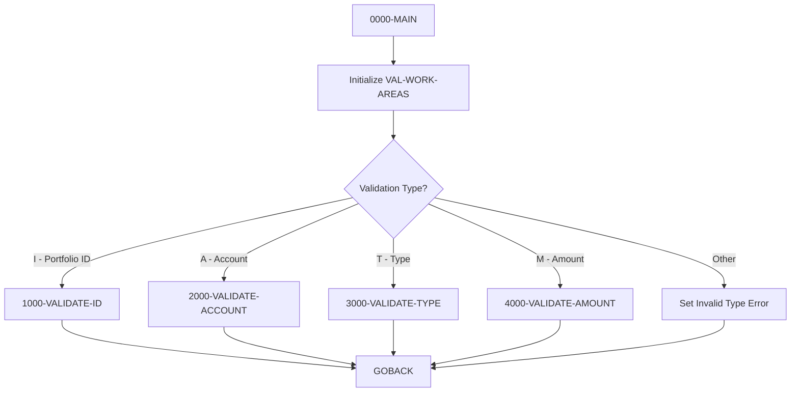

## Overview

PORTVALD is a reusable COBOL validation subroutine that provides centralized data validation services for the portfolio management system. It validates individual data elements against defined business rules and returns appropriate error codes and messages.

The program supports four types of validations:

- **Portfolio ID** (`I`): Validates the format of portfolio identifiers
- **Account Number** (`A`): Validates account number format and content
- **Investment Type** (`T`): Validates against allowed investment type codes
- **Amount** (`M`): Validates monetary amounts within acceptable ranges

By centralizing validation logic in a single subprogram, PORTVALD ensures consistent data quality across all applications that create or modify portfolio data. The program is designed to be called by other programs and returns specific error codes and descriptive messages when validation fails.

## Program Structure



## Data Structures

### Linkage Section (Calling Interface)

| Level | Name | Picture | Description |
|-------|------|---------|-------------|
| 01 | LS-VALIDATION-REQUEST | - | Main parameter structure |
| 05 | LS-VALIDATE-TYPE | X(1) | Validation type code (see table below) |
| 05 | LS-INPUT-VALUE | X(50) | Value to be validated |
| 05 | LS-RETURN-CODE | S9(4) COMP | Return code (0=success) |
| 05 | LS-ERROR-MSG | X(50) | Error message if validation fails |

### Validation Type Codes

| Code | 88-Level Name | Description |
|------|---------------|-------------|
| `I` | LS-VAL-ID | Validate portfolio ID |
| `A` | LS-VAL-ACCT | Validate account number |
| `T` | LS-VAL-TYPE | Validate investment type |
| `M` | LS-VAL-AMT | Validate amount |

### Return Codes (from PORTVAL copybook)

| Code | Constant | Description |
|------|----------|-------------|
| 0 | VAL-SUCCESS | Validation passed |
| 1 | VAL-INVALID-ID | Invalid portfolio ID format |
| 2 | VAL-INVALID-ACCT | Invalid account number format |
| 3 | VAL-INVALID-TYPE | Invalid investment type |
| 4 | VAL-INVALID-AMT | Amount outside valid range |

### Error Messages (from PORTVAL copybook)

| Constant | Message |
|----------|---------|
| VAL-ERR-ID | "Invalid Portfolio ID format" |
| VAL-ERR-ACCT | "Invalid Account Number format" |
| VAL-ERR-TYPE | "Invalid Investment Type" |
| VAL-ERR-AMT | "Amount outside valid range" |

### Validation Constants (from PORTVAL copybook)

| Constant | Value | Description |
|----------|-------|-------------|
| VAL-ID-PREFIX | 'PORT' | Required prefix for portfolio IDs |
| VAL-MIN-AMOUNT | -9999999999999.99 | Minimum allowed amount |
| VAL-MAX-AMOUNT | +9999999999999.99 | Maximum allowed amount |

### Working Areas (from PORTVAL copybook)

| Level | Name | Picture | Description |
|-------|------|---------|-------------|
| 05 | VAL-NUMERIC-CHECK | X(10) | Work field for numeric validation |
| 05 | VAL-TEMP-NUM | S9(13)V99 | Temporary numeric field |
| 05 | VAL-ERROR-CODE | S9(4) | Internal error code |
| 05 | VAL-ERROR-MSG | X(50) | Internal error message |

## File I/O

This program does not perform any file I/O operations. It is a pure validation routine that operates solely on data passed through the linkage section.

## Control Flow

### Main Entry Point (0000-MAIN)

1. Initializes VAL-WORK-AREAS to clear any residual data
2. Uses EVALUATE to dispatch to the appropriate validation paragraph based on LS-VALIDATE-TYPE
3. If an unknown validation type is provided, returns error code 1 with message "Invalid validation type"
4. Returns to caller via GOBACK

### Validate Portfolio ID (1000-VALIDATE-ID)

Validates that a portfolio ID follows the required format:

**Rules:**
1. Positions 1-4 must be literal 'PORT' (VAL-ID-PREFIX)
2. Positions 5-8 must be 4 numeric digits

**Process:**
1. Checks if first 4 characters equal 'PORT'
   - If not: Returns VAL-INVALID-ID (1) with VAL-ERR-ID message
2. Moves positions 5-8 to VAL-NUMERIC-CHECK
3. Validates that these characters are numeric
   - If not: Returns VAL-INVALID-ID (1) with VAL-ERR-ID message
4. If both checks pass: Returns VAL-SUCCESS (0) with blank error message

**Valid Examples:**
- `PORT0001` ✓
- `PORT9999` ✓

**Invalid Examples:**
- `ACCT0001` ✗ (wrong prefix)
- `PORTABCD` ✗ (non-numeric suffix)

### Validate Account Number (2000-VALIDATE-ACCOUNT)

Validates that an account number is a valid numeric value:

**Rules:**
1. Must be numeric (no alphabetic or special characters)
2. Must not be all zeros

**Process:**
1. Checks if LS-INPUT-VALUE is NOT NUMERIC or equals ZEROS
   - If either: Returns VAL-INVALID-ACCT (2) with VAL-ERR-ACCT message
2. If valid: Returns VAL-SUCCESS (0) with blank error message

**Valid Examples:**
- `1234567890` ✓
- `0000000001` ✓

**Invalid Examples:**
- `ABCDEFGHIJ` ✗ (non-numeric)
- `0000000000` ✗ (all zeros)
- `123-456-78` ✗ (contains special characters)

### Validate Investment Type (3000-VALIDATE-TYPE)

Validates that an investment type code is one of the allowed values:

**Allowed Values:**
| Code | Description |
|------|-------------|
| `STK` | Stocks |
| `BND` | Bonds |
| `MMF` | Money Market Funds |
| `ETF` | Exchange-Traded Funds |

**Process:**
1. Checks if LS-INPUT-VALUE matches any of the four valid codes
   - If not: Returns VAL-INVALID-TYPE (3) with VAL-ERR-TYPE message
2. If valid: Returns VAL-SUCCESS (0) with blank error message

**Valid Examples:**
- `STK` ✓
- `BND` ✓
- `MMF` ✓
- `ETF` ✓

**Invalid Examples:**
- `MUT` ✗ (not in allowed list)
- `STOCK` ✗ (wrong format)

### Validate Amount (4000-VALIDATE-AMOUNT)

Validates that a monetary amount falls within the acceptable range:

**Rules:**
1. Amount must be >= VAL-MIN-AMOUNT (-9,999,999,999,999.99)
2. Amount must be <= VAL-MAX-AMOUNT (+9,999,999,999,999.99)

**Process:**
1. Moves LS-INPUT-VALUE to VAL-TEMP-NUM (numeric conversion)
2. Checks if value is within valid range
   - If not: Returns VAL-INVALID-AMT (4) with VAL-ERR-AMT message
3. If valid: Returns VAL-SUCCESS (0) with blank error message

**Valid Examples:**
- `1000.00` ✓
- `-500.00` ✓ (negative amounts allowed)
- `0.00` ✓

**Note:** The extremely large range (-9.9 trillion to +9.9 trillion) accommodates virtually any portfolio value while still providing boundary validation.

## Dependencies

### Copybooks

- **PORTVAL** - Portfolio validation rules, return codes, error messages, and constants

### Called Programs

This program does not call any other programs. It is designed to be called by other programs.

### Related Programs

Programs likely to call PORTVALD for data validation:

| Program | Description |
|---------|-------------|
| PORTMSTR | Portfolio master maintenance (CRUD operations) |
| PORTADD | Portfolio addition |
| PORTUPDT | Portfolio updates |
| PORTTRAN | Portfolio transactions |

## Technical Notes

### Calling Convention

To call PORTVALD from another COBOL program:

```cobol
WORKING-STORAGE SECTION.
01  WS-VALIDATION-REQUEST.
    05  WS-VALIDATE-TYPE    PIC X(1).
    05  WS-INPUT-VALUE      PIC X(50).
    05  WS-RETURN-CODE      PIC S9(4) COMP.
    05  WS-ERROR-MSG        PIC X(50).

PROCEDURE DIVISION.
* Validate a portfolio ID
    MOVE 'I' TO WS-VALIDATE-TYPE
    MOVE 'PORT0001' TO WS-INPUT-VALUE
    
    CALL 'PORTVALD' USING WS-VALIDATION-REQUEST
    
    IF WS-RETURN-CODE NOT = 0
        DISPLAY 'Validation failed: ' WS-ERROR-MSG
    END-IF

* Validate an account number
    MOVE 'A' TO WS-VALIDATE-TYPE
    MOVE '1234567890' TO WS-INPUT-VALUE
    
    CALL 'PORTVALD' USING WS-VALIDATION-REQUEST
    
    IF WS-RETURN-CODE NOT = 0
        DISPLAY 'Validation failed: ' WS-ERROR-MSG
    END-IF

* Validate an investment type
    MOVE 'T' TO WS-VALIDATE-TYPE
    MOVE 'STK' TO WS-INPUT-VALUE
    
    CALL 'PORTVALD' USING WS-VALIDATION-REQUEST
    
    IF WS-RETURN-CODE NOT = 0
        DISPLAY 'Validation failed: ' WS-ERROR-MSG
    END-IF

* Validate an amount
    MOVE 'M' TO WS-VALIDATE-TYPE
    MOVE '10000.00' TO WS-INPUT-VALUE
    
    CALL 'PORTVALD' USING WS-VALIDATION-REQUEST
    
    IF WS-RETURN-CODE NOT = 0
        DISPLAY 'Validation failed: ' WS-ERROR-MSG
    END-IF
```

### Best Practices for Callers

1. **Always check return code**: A non-zero return code indicates validation failure
2. **Use error message for display**: The LS-ERROR-MSG provides user-friendly error text
3. **Validate all fields**: Call PORTVALD for each field that requires validation
4. **Handle errors appropriately**: Don't proceed with invalid data

### EXIT PARAGRAPH Usage

The program uses `EXIT PARAGRAPH` statements to provide early returns from validation paragraphs when errors are detected. This is a standard COBOL pattern that:
- Immediately exits the current paragraph
- Avoids deeply nested IF statements
- Makes the validation logic more readable

### Investment Type Extensibility

To add new investment types, modify the 3000-VALIDATE-TYPE paragraph:

```cobol
           IF LS-INPUT-VALUE NOT = 'STK'
              AND NOT = 'BND'
              AND NOT = 'MMF'
              AND NOT = 'ETF'
              AND NOT = 'NEW'    *> Add new type here
               MOVE VAL-INVALID-TYPE TO LS-RETURN-CODE
               ...
```

Consider maintaining the list of valid types in the PORTVAL copybook for easier maintenance.

### Numeric Validation Considerations

The account number validation (`IS NOT NUMERIC`) checks for:
- Alphabetic characters
- Special characters
- Spaces within the value

However, leading/trailing spaces may cause issues depending on how the input is prepared. Callers should ensure data is properly justified before validation.
