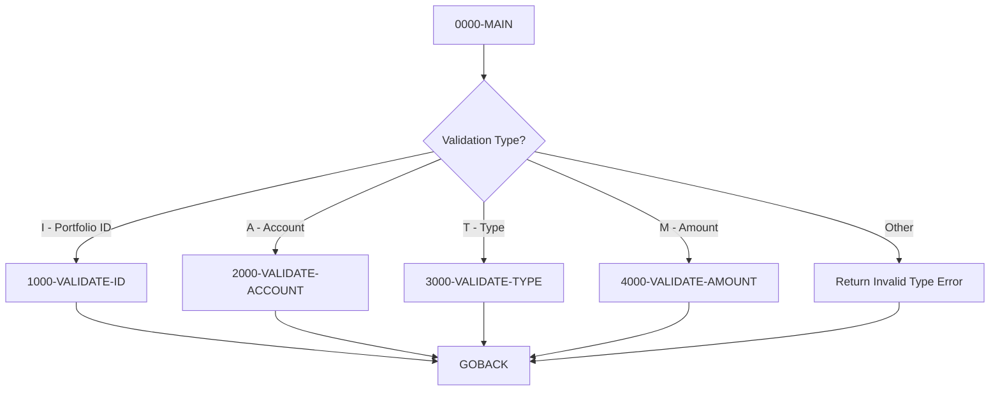

## Overview

PORTVALD is a reusable COBOL validation subroutine that validates various portfolio data elements. It provides a single entry point for multiple validation types, making it easy for calling programs to perform consistent data validation across the portfolio management system.

The program supports four types of validation:
- **Portfolio ID** - Validates the format of portfolio identifiers
- **Account Number** - Validates account number format
- **Investment Type** - Validates investment type codes
- **Amount** - Validates monetary amounts are within acceptable ranges

This centralized validation approach ensures consistent business rules are applied throughout the application and simplifies maintenance when validation requirements change.

## Program Structure



## Data Structures

### Linkage Section (Interface)

The program receives a single parameter block `LS-VALIDATION-REQUEST`:

| Level | Name | Picture | Description |
|-------|------|---------|-------------|
| 01 | LS-VALIDATION-REQUEST | - | Validation request block |
| 05 | LS-VALIDATE-TYPE | PIC X(1) | Type of validation to perform |
| 05 | LS-INPUT-VALUE | PIC X(50) | Value to validate |
| 05 | LS-RETURN-CODE | PIC S9(4) COMP | Validation result code |
| 05 | LS-ERROR-MSG | PIC X(50) | Error message if validation fails |

### Validation Type Codes (88-levels)

| Condition Name | Value | Description |
|----------------|-------|-------------|
| LS-VAL-ID | 'I' | Validate Portfolio ID |
| LS-VAL-ACCT | 'A' | Validate Account Number |
| LS-VAL-TYPE | 'T' | Validate Investment Type |
| LS-VAL-AMT | 'M' | Validate Amount |

### Working Storage (from PORTVAL copybook)

The PORTVAL copybook provides validation constants and work areas:

| Field | Description |
|-------|-------------|
| VAL-WORK-AREAS | Work area group |
| VAL-NUMERIC-CHECK | Temporary field for numeric validation |
| VAL-TEMP-NUM | Temporary numeric field for amount validation |
| VAL-ID-PREFIX | Expected prefix for portfolio IDs ('PORT') |
| VAL-SUCCESS | Success return code (0) |
| VAL-INVALID-ID | Invalid ID return code |
| VAL-INVALID-ACCT | Invalid account return code |
| VAL-INVALID-TYPE | Invalid type return code |
| VAL-INVALID-AMT | Invalid amount return code |
| VAL-ERR-ID | Error message for invalid ID |
| VAL-ERR-ACCT | Error message for invalid account |
| VAL-ERR-TYPE | Error message for invalid type |
| VAL-ERR-AMT | Error message for invalid amount |
| VAL-MIN-AMOUNT | Minimum allowed amount |
| VAL-MAX-AMOUNT | Maximum allowed amount |

## Control Flow

### 0000-MAIN

Entry point that dispatches to the appropriate validation routine:

1. Initializes VAL-WORK-AREAS
2. Evaluates LS-VALIDATE-TYPE to determine validation type
3. Performs the corresponding validation paragraph
4. If invalid type code, sets error return code and message
5. Returns to caller via GOBACK

### 1000-VALIDATE-ID

Validates Portfolio ID format:

**Rule**: Portfolio ID must start with 'PORT' followed by 4 numeric digits

**Validation Steps**:
1. Check if first 4 characters equal VAL-ID-PREFIX ('PORT')
2. If not, return VAL-INVALID-ID with VAL-ERR-ID message
3. Extract characters 5-8 into VAL-NUMERIC-CHECK
4. Verify these characters are numeric
5. If not numeric, return VAL-INVALID-ID with VAL-ERR-ID message
6. If valid, return VAL-SUCCESS with empty error message

**Valid Format**: `PORTnnnn` where `n` is a digit (0-9)

**Examples**:
| Input | Result | Reason |
|-------|--------|--------|
| `PORT0001` | Valid | Correct format |
| `PORT9999` | Valid | Correct format |
| `ACCT0001` | Invalid | Wrong prefix |
| `PORTABCD` | Invalid | Non-numeric suffix |
| `PORT001` | Invalid | Insufficient digits |

### 2000-VALIDATE-ACCOUNT

Validates Account Number format:

**Rule**: Account number must be numeric and non-zero

**Validation Steps**:
1. Check if LS-INPUT-VALUE is numeric
2. Check if LS-INPUT-VALUE is not all zeros
3. If either check fails, return VAL-INVALID-ACCT with VAL-ERR-ACCT message
4. If valid, return VAL-SUCCESS with empty error message

**Examples**:
| Input | Result | Reason |
|-------|--------|--------|
| `1234567890` | Valid | All numeric, non-zero |
| `0000000001` | Valid | Numeric, non-zero |
| `0000000000` | Invalid | All zeros |
| `123456789A` | Invalid | Contains non-numeric |
| `ABCDEFGHIJ` | Invalid | All non-numeric |

### 3000-VALIDATE-TYPE

Validates Investment Type code:

**Rule**: Investment type must be one of the predefined valid codes

**Valid Investment Types**:
| Code | Description |
|------|-------------|
| STK | Stock |
| BND | Bond |
| MMF | Money Market Fund |
| ETF | Exchange-Traded Fund |

**Validation Steps**:
1. Check if LS-INPUT-VALUE equals 'STK', 'BND', 'MMF', or 'ETF'
2. If not a valid code, return VAL-INVALID-TYPE with VAL-ERR-TYPE message
3. If valid, return VAL-SUCCESS with empty error message

**Examples**:
| Input | Result | Reason |
|-------|--------|--------|
| `STK` | Valid | Stock |
| `BND` | Valid | Bond |
| `MMF` | Valid | Money Market Fund |
| `ETF` | Valid | Exchange-Traded Fund |
| `MUT` | Invalid | Not a valid type |
| `STOCK` | Invalid | Not a valid code |

### 4000-VALIDATE-AMOUNT

Validates monetary amounts:

**Rule**: Amount must be within the defined minimum and maximum range

**Validation Steps**:
1. Move LS-INPUT-VALUE to VAL-TEMP-NUM (numeric conversion)
2. Check if value is less than VAL-MIN-AMOUNT
3. Check if value is greater than VAL-MAX-AMOUNT
4. If out of range, return VAL-INVALID-AMT with VAL-ERR-AMT message
5. If valid, return VAL-SUCCESS with empty error message

**Note**: The actual minimum and maximum values are defined in the PORTVAL copybook.

## Calling Interface

### How to Call PORTVALD

```cobol
WORKING-STORAGE SECTION.
01  WS-VALIDATION-REQUEST.
    05  WS-VAL-TYPE        PIC X(1).
    05  WS-VAL-INPUT       PIC X(50).
    05  WS-VAL-RETURN      PIC S9(4) COMP.
    05  WS-VAL-ERROR       PIC X(50).

PROCEDURE DIVISION.
    *> Validate a Portfolio ID
    MOVE 'I' TO WS-VAL-TYPE
    MOVE 'PORT0001' TO WS-VAL-INPUT
    CALL 'PORTVALD' USING WS-VALIDATION-REQUEST
    
    IF WS-VAL-RETURN = 0
        DISPLAY 'Portfolio ID is valid'
    ELSE
        DISPLAY 'Validation failed: ' WS-VAL-ERROR
    END-IF
    
    *> Validate an Account Number
    MOVE 'A' TO WS-VAL-TYPE
    MOVE '1234567890' TO WS-VAL-INPUT
    CALL 'PORTVALD' USING WS-VALIDATION-REQUEST
    
    IF WS-VAL-RETURN = 0
        DISPLAY 'Account number is valid'
    ELSE
        DISPLAY 'Validation failed: ' WS-VAL-ERROR
    END-IF
    
    *> Validate an Investment Type
    MOVE 'T' TO WS-VAL-TYPE
    MOVE 'STK' TO WS-VAL-INPUT
    CALL 'PORTVALD' USING WS-VALIDATION-REQUEST
    
    IF WS-VAL-RETURN = 0
        DISPLAY 'Investment type is valid'
    ELSE
        DISPLAY 'Validation failed: ' WS-VAL-ERROR
    END-IF
    
    *> Validate an Amount
    MOVE 'M' TO WS-VAL-TYPE
    MOVE '10000.00' TO WS-VAL-INPUT
    CALL 'PORTVALD' USING WS-VALIDATION-REQUEST
    
    IF WS-VAL-RETURN = 0
        DISPLAY 'Amount is valid'
    ELSE
        DISPLAY 'Validation failed: ' WS-VAL-ERROR
    END-IF
```

### Return Codes

| Code | Constant | Meaning |
|------|----------|---------|
| 0 | VAL-SUCCESS | Validation passed |
| Non-zero | VAL-INVALID-ID | Portfolio ID validation failed |
| Non-zero | VAL-INVALID-ACCT | Account number validation failed |
| Non-zero | VAL-INVALID-TYPE | Investment type validation failed |
| Non-zero | VAL-INVALID-AMT | Amount validation failed |

**Note**: Specific non-zero values are defined in the PORTVAL copybook.

## Dependencies

### Copybooks

- **PORTVAL** - Contains validation constants, error messages, return codes, work areas, and range limits

### Called Programs

None - this is a leaf-level validation routine.

### Calling Programs

This program is designed to be called by any program that needs to validate portfolio-related data, including:
- Portfolio maintenance programs
- Transaction entry programs
- Data import/export utilities
- Online inquiry programs

## Validation Rules Summary

| Type | Code | Rule | Format/Values |
|------|------|------|---------------|
| Portfolio ID | I | Must start with 'PORT' + 4 digits | `PORTnnnn` |
| Account Number | A | Must be numeric and non-zero | 10 numeric digits |
| Investment Type | T | Must be valid type code | STK, BND, MMF, ETF |
| Amount | M | Must be within min/max range | Defined in PORTVAL |

## Technical Notes

### EXIT PARAGRAPH Usage

The program uses `EXIT PARAGRAPH` to exit validation paragraphs early when validation fails. This COBOL statement:
- Immediately exits the current paragraph
- Control returns to the statement following the PERFORM
- Avoids nested IF statements and improves readability

### Input Value Size

The LS-INPUT-VALUE field is defined as PIC X(50), which accommodates:
- Portfolio IDs (8 characters)
- Account numbers (10 characters)
- Investment types (3 characters)
- Formatted amounts (up to 50 characters)

Callers should left-justify values and pad with spaces as needed.

### Numeric Validation

For amount validation, the program moves the input value to a numeric field (VAL-TEMP-NUM). If the input contains non-numeric characters (other than valid numeric formatting), the MOVE will result in unpredictable values. Callers should ensure amount values are properly formatted before calling.

### Thread Safety

This program is reentrant - it uses only:
- Linkage section data (passed by caller)
- Working storage that is initialized on each call

Multiple callers can use this program simultaneously without interference.

### Extensibility

To add new validation types:
1. Add new 88-level condition in LS-VALIDATE-TYPE
2. Add WHEN clause in 0000-MAIN EVALUATE
3. Create new validation paragraph
4. Add constants/messages to PORTVAL copybook
