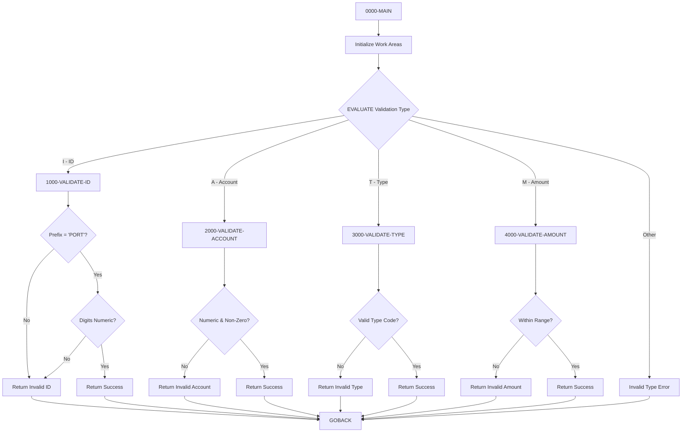

## Overview

PORTVALD is a callable validation subroutine that provides centralized data validation services for portfolio-related fields. It validates four types of data elements commonly used in portfolio management applications:

- **Portfolio ID** - Validates format (PORTnnnn)
- **Account Number** - Validates numeric format
- **Investment Type** - Validates against allowed type codes
- **Amount** - Validates within acceptable range

By centralizing validation logic in a single subprogram, PORTVALD ensures consistent data quality across all programs that handle portfolio data. The program returns specific error codes and descriptive messages for each validation failure, enabling calling programs to provide meaningful feedback to users.

## Program Structure



## Data Structures

### Linkage Section (Calling Interface)

| Level | Name | Picture | Description |
|-------|------|---------|-------------|
| 01 | LS-VALIDATION-REQUEST | | Main request structure |
| 05 | LS-VALIDATE-TYPE | X(1) | Validation type code |
| 05 | LS-INPUT-VALUE | X(50) | Value to validate |
| 05 | LS-RETURN-CODE | S9(4) COMP | Return code (0=success) |
| 05 | LS-ERROR-MSG | X(50) | Error message (if failed) |

### Validation Type Codes

| Code | 88-Level Name | Description |
|------|---------------|-------------|
| I | LS-VAL-ID | Validate Portfolio ID |
| A | LS-VAL-ACCT | Validate Account Number |
| T | LS-VAL-TYPE | Validate Investment Type |
| M | LS-VAL-AMT | Validate Amount |

### Return Codes (PORTVAL Copybook)

| Code | Constant | Description |
|------|----------|-------------|
| 0 | VAL-SUCCESS | Validation passed |
| 1 | VAL-INVALID-ID | Invalid Portfolio ID format |
| 2 | VAL-INVALID-ACCT | Invalid Account Number format |
| 3 | VAL-INVALID-TYPE | Invalid Investment Type |
| 4 | VAL-INVALID-AMT | Amount outside valid range |

### Error Messages (PORTVAL Copybook)

| Constant | Message |
|----------|---------|
| VAL-ERR-ID | "Invalid Portfolio ID format" |
| VAL-ERR-ACCT | "Invalid Account Number format" |
| VAL-ERR-TYPE | "Invalid Investment Type" |
| VAL-ERR-AMT | "Amount outside valid range" |

### Validation Constants (PORTVAL Copybook)

| Constant | Value | Description |
|----------|-------|-------------|
| VAL-ID-PREFIX | 'PORT' | Required portfolio ID prefix |
| VAL-MIN-AMOUNT | -9999999999999.99 | Minimum allowed amount |
| VAL-MAX-AMOUNT | +9999999999999.99 | Maximum allowed amount |

### Work Areas (PORTVAL Copybook)

| Level | Name | Picture | Description |
|-------|------|---------|-------------|
| 01 | VAL-WORK-AREAS | | Working storage group |
| 05 | VAL-NUMERIC-CHECK | X(10) | Temporary for numeric validation |
| 05 | VAL-TEMP-NUM | S9(13)V99 | Temporary for amount validation |
| 05 | VAL-ERROR-CODE | S9(4) | Internal error code |
| 05 | VAL-ERROR-MSG | X(50) | Internal error message |

## Calling Interface

### COBOL Call Example

```cobol
       01  WS-VALIDATION-REQUEST.
           05  WS-VAL-TYPE         PIC X(1).
           05  WS-INPUT-VALUE      PIC X(50).
           05  WS-RETURN-CODE      PIC S9(4) COMP.
           05  WS-ERROR-MSG        PIC X(50).
       
       * Validate Portfolio ID
           MOVE 'I' TO WS-VAL-TYPE
           MOVE 'PORT1234' TO WS-INPUT-VALUE
           CALL 'PORTVALD' USING WS-VALIDATION-REQUEST
           IF WS-RETURN-CODE NOT = 0
               DISPLAY 'ID Error: ' WS-ERROR-MSG
           END-IF
       
       * Validate Account Number
           MOVE 'A' TO WS-VAL-TYPE
           MOVE '1234567890' TO WS-INPUT-VALUE
           CALL 'PORTVALD' USING WS-VALIDATION-REQUEST
           IF WS-RETURN-CODE NOT = 0
               DISPLAY 'Account Error: ' WS-ERROR-MSG
           END-IF
       
       * Validate Investment Type
           MOVE 'T' TO WS-VAL-TYPE
           MOVE 'STK' TO WS-INPUT-VALUE
           CALL 'PORTVALD' USING WS-VALIDATION-REQUEST
           IF WS-RETURN-CODE NOT = 0
               DISPLAY 'Type Error: ' WS-ERROR-MSG
           END-IF
       
       * Validate Amount
           MOVE 'M' TO WS-VAL-TYPE
           MOVE '1000000.00' TO WS-INPUT-VALUE
           CALL 'PORTVALD' USING WS-VALIDATION-REQUEST
           IF WS-RETURN-CODE NOT = 0
               DISPLAY 'Amount Error: ' WS-ERROR-MSG
           END-IF
```

## Control Flow

### 0000-MAIN

Main entry point:
1. Initializes VAL-WORK-AREAS to clear previous values
2. Evaluates LS-VALIDATE-TYPE to determine validation routine
3. Dispatches to appropriate validation paragraph
4. If invalid type code, sets error return code and message
5. Returns to caller via GOBACK

### 1000-VALIDATE-ID

Validates Portfolio ID format:

**Rules:**
- First 4 characters must be 'PORT'
- Characters 5-8 must be numeric digits

**Logic:**
1. Checks if positions 1-4 equal VAL-ID-PREFIX ('PORT')
2. If not, returns VAL-INVALID-ID with VAL-ERR-ID message
3. Extracts positions 5-8 into VAL-NUMERIC-CHECK
4. Validates extracted portion is numeric
5. If not numeric, returns VAL-INVALID-ID with VAL-ERR-ID message
6. If all checks pass, returns VAL-SUCCESS with empty message

**Valid Examples:** PORT0001, PORT1234, PORT9999  
**Invalid Examples:** ACCT1234, PORT12AB, PORTabcd

### 2000-VALIDATE-ACCOUNT

Validates Account Number format:

**Rules:**
- Must be entirely numeric
- Cannot be all zeros

**Logic:**
1. Checks if LS-INPUT-VALUE is numeric
2. Checks if LS-INPUT-VALUE equals ZEROS
3. If either check fails, returns VAL-INVALID-ACCT with VAL-ERR-ACCT message
4. If all checks pass, returns VAL-SUCCESS with empty message

**Valid Examples:** 1234567890, 0000000001  
**Invalid Examples:** 123ABC7890, 0000000000, ABCDEFGHIJ

### 3000-VALIDATE-TYPE

Validates Investment Type code:

**Rules:**
- Must be one of the allowed type codes

**Allowed Values:**
| Code | Description |
|------|-------------|
| STK | Stocks |
| BND | Bonds |
| MMF | Money Market Funds |
| ETF | Exchange-Traded Funds |

**Logic:**
1. Checks if LS-INPUT-VALUE matches any valid type code
2. If no match, returns VAL-INVALID-TYPE with VAL-ERR-TYPE message
3. If match found, returns VAL-SUCCESS with empty message

**Valid Examples:** STK, BND, MMF, ETF  
**Invalid Examples:** MUT, OPT, FUT, ABC

### 4000-VALIDATE-AMOUNT

Validates Amount within acceptable range:

**Rules:**
- Must be between VAL-MIN-AMOUNT and VAL-MAX-AMOUNT
- Range: -9,999,999,999,999.99 to +9,999,999,999,999.99

**Logic:**
1. Moves LS-INPUT-VALUE to VAL-TEMP-NUM (numeric field)
2. Compares against VAL-MIN-AMOUNT and VAL-MAX-AMOUNT
3. If outside range, returns VAL-INVALID-AMT with VAL-ERR-AMT message
4. If within range, returns VAL-SUCCESS with empty message

**Valid Examples:** 0.00, 1000000.00, -500.50, 9999999999999.99  
**Invalid Examples:** Values exceeding ±9,999,999,999,999.99

## File I/O

This program does not perform any file I/O operations. All data exchange occurs through the linkage section parameter (LS-VALIDATION-REQUEST).

## Dependencies

### Copybooks

- **PORTVAL** - Portfolio validation rules containing:
  - Return code constants (VAL-SUCCESS, VAL-INVALID-*)
  - Error message constants (VAL-ERR-*)
  - Validation constants (VAL-MIN-AMOUNT, VAL-MAX-AMOUNT, VAL-ID-PREFIX)
  - Work areas for validation processing

### Called Programs

None - this program does not call other programs.

### Related Programs

Programs that may call PORTVALD for data validation:
- **PORTMSTR** - Portfolio master file maintenance
- **PORTTRAN** - Portfolio transaction processing
- Portfolio inquiry programs
- Data entry validation routines
- Batch processing programs that handle portfolio data

## Technical Notes

### Validation Type Selection

The program uses an EVALUATE statement with 88-level condition names for clear, readable type selection:

```cobol
EVALUATE TRUE
    WHEN LS-VAL-ID      PERFORM 1000-VALIDATE-ID
    WHEN LS-VAL-ACCT    PERFORM 2000-VALIDATE-ACCOUNT
    WHEN LS-VAL-TYPE    PERFORM 3000-VALIDATE-TYPE
    WHEN LS-VAL-AMT     PERFORM 4000-VALIDATE-AMOUNT
    WHEN OTHER          [Error handling]
END-EVALUATE
```

### EXIT PARAGRAPH Usage

Each validation paragraph uses `EXIT PARAGRAPH` to provide early exit when validation fails. This COBOL statement immediately transfers control to the end of the current paragraph, avoiding nested IF statements and improving readability.

### Numeric Validation

The program uses COBOL's built-in `IS NUMERIC` class condition to validate numeric fields. This check verifies that all characters in the field are valid numeric digits (0-9) and optional sign.

### Amount Range

The amount validation uses a very wide range (±9,999,999,999,999.99) to accommodate large institutional portfolios. The S9(13)V99 picture clause provides:
- 13 integer positions
- 2 decimal positions
- Signed (positive or negative)

### Input Value Format

The LS-INPUT-VALUE field is defined as PIC X(50), providing a flexible character buffer that can hold any type of input. For amount validation, the value is moved to VAL-TEMP-NUM for numeric comparison.

### Thread Safety

The program initializes VAL-WORK-AREAS at the start of each call, ensuring clean state for each validation. This makes the program suitable for use in multi-threaded environments (e.g., CICS) where working storage is shared.

### Error Message Design

Error messages are defined as constants in the PORTVAL copybook, providing:
- Consistent messaging across all callers
- Easy maintenance (change in one place)
- Translation-ready structure for internationalization
