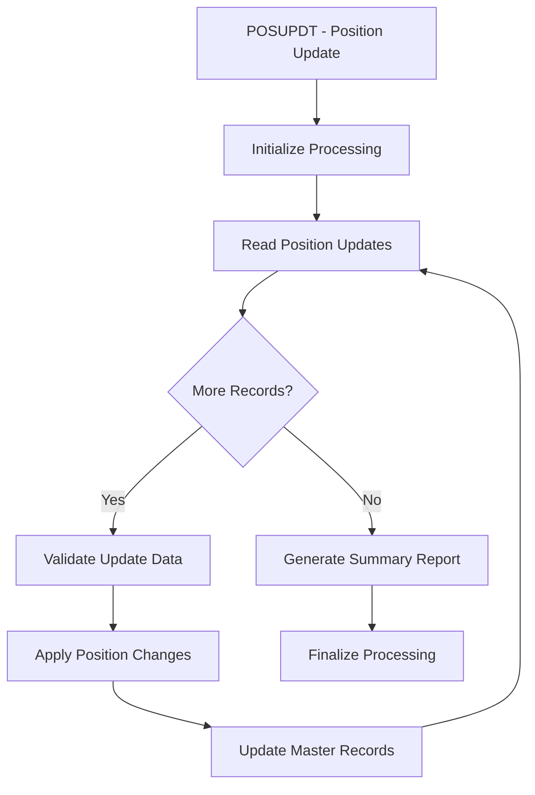

## Overview

POSUPDT (Position Update) is a batch COBOL program intended for updating position data. Based on the program name and its location in the batch processing directory, this program appears designed to handle position update operations, likely updating portfolio positions based on transaction activity.

**Current Status:** This program is currently a stub/placeholder with no implemented code. The source file exists but contains no COBOL statements.

## Program Structure

Since POSUPDT is currently a placeholder program, no program structure exists. When implemented, this program would typically include:

*Note: This flowchart represents expected functionality based on the program name and context.*

## Data Structures

### Working Storage

No data structures are currently defined in this program.

When implemented, typical position update programs would include:

| Level | Name | Picture | Description |
|-------|------|---------|-------------|
| 01 | WS-POSITION-RECORD | - | Position record structure |
| 05 | WS-ACCOUNT-ID | PIC X(10) | Account identifier |
| 05 | WS-SECURITY-ID | PIC X(12) | Security identifier |
| 05 | WS-QUANTITY | PIC S9(15)V99 COMP-3 | Position quantity |
| 05 | WS-MARKET-VALUE | PIC S9(15)V99 COMP-3 | Current market value |

*Note: This table represents expected data structures for documentation purposes.*

## File I/O

No file definitions are currently implemented in this program.

When implemented, a position update program would typically process:

- **Input File:** Transaction or position change records
- **Master File:** Position master file (indexed or VSAM)
- **Output File:** Updated position records or audit trail
- **Report File:** Processing summary report

## Control Flow

This program is currently unimplemented. When completed, the expected control flow would be:

1. **Initialization**
   - Open input and output files
   - Initialize counters and accumulators
   - Set processing date

2. **Main Processing Loop**
   - Read position update records
   - Validate update data
   - Locate corresponding master record
   - Apply position changes
   - Write updated records

3. **Finalization**
   - Write processing summary
   - Close all files
   - Set return code

## Dependencies

### Copybooks

No copybooks are currently referenced. When implemented, this program would likely use:

- Common date/time routines
- Position record layouts
- Error handling structures

### Called Programs

No external programs are currently called.

### Related Programs

Based on the program's location in the batch processing suite:

- **RPTPOS00** - Position reporting program
- **PRCSEQ00** - Sequential processing utilities
- **HISTLD00** - Historical data loading

## Implementation Notes

:::warning Stub Program
This program file exists but contains no implementation. It may be:
- A placeholder for future development
- A deprecated program that has been emptied
- Part of a template structure for the batch processing suite
:::

### Recommended Implementation

When implementing this program, consider:

1. **Input Validation** - Validate all position updates before applying
2. **Audit Trail** - Log all position changes for compliance
3. **Error Handling** - Implement robust error recovery
4. **Restart/Recovery** - Support checkpoint/restart for large batches
5. **Reconciliation** - Include balancing totals for verification

## Source Location

**File Path:** `/src/programs/batch/POSUPDT.cbl`

**Status:** Empty/Stub - No executable code
