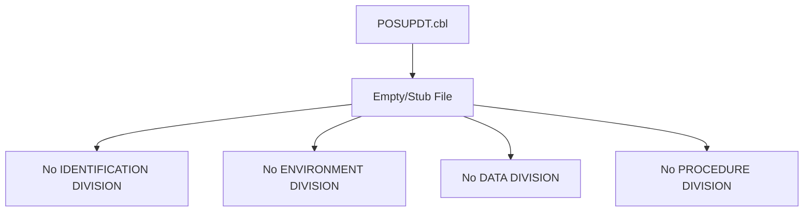

## Overview

POSUPDT is a batch program file that currently exists as a placeholder with no implementation code. Based on the program naming convention used in this codebase (where "POS" typically refers to position-related operations and "UPDT" indicates an update function), this program is likely intended to handle position update processing in the batch subsystem.

The source file exists at `/src/programs/batch/POSUPDT.cbl` but contains no COBOL code, indicating this is either:
- A planned feature awaiting implementation
- A stub created for future development
- A program whose implementation was moved or deleted

## Program Structure



## Current Status

| Attribute | Value |
|-----------|-------|
| Program ID | Not defined |
| File Location | `/src/programs/batch/POSUPDT.cbl` |
| Implementation Status | **Not Implemented** |
| Lines of Code | 0 (whitespace only) |

## Data Structures

No data structures are defined in this program.

### Working Storage

*None defined*

### Linkage Section

*None defined*

## File I/O

No file definitions or I/O operations are present in this program.

## Control Flow

No control flow exists as the program has no procedure division.

## Dependencies

### Copybooks

*None*

### Called Programs

*None*

### Related Programs

Based on naming conventions, this program may be related to other batch programs in the system:
- Other batch programs in `/src/programs/batch/` directory

## Implementation Notes

:::warning Implementation Required
This program file exists but contains no implementation. Before this program can be used in production:

1. Add the standard COBOL division structure (IDENTIFICATION, ENVIRONMENT, DATA, PROCEDURE)
2. Define appropriate data structures for position updates
3. Implement the position update logic
4. Add proper error handling
5. Include relevant copybooks for data consistency
:::

## Recommended Implementation Pattern

Based on other batch programs in this codebase, a typical implementation would include:

```cobol
       IDENTIFICATION DIVISION.
       PROGRAM-ID. POSUPDT.
      *
       ENVIRONMENT DIVISION.
       CONFIGURATION SECTION.
       INPUT-OUTPUT SECTION.
       FILE-CONTROL.
      *    SELECT statements for input/output files
      *
       DATA DIVISION.
       FILE SECTION.
      *    FD entries for files
      *
       WORKING-STORAGE SECTION.
      *    Working variables and copybooks
      *
       PROCEDURE DIVISION.
      *    Main processing logic
           STOP RUN.
```
