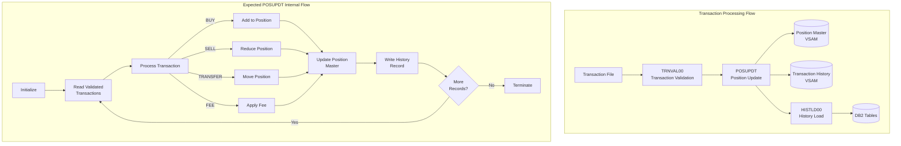

import Admonition from '@theme/Admonition';

<Admonition type="caution" title="Implementation Status">
This program is currently a placeholder/stub. The source file exists but contains no implementation code. 
This documentation describes the program's intended functionality based on system architecture documentation.
</Admonition>

## Overview

POSUPDT (Position Update) is a batch program designed to update portfolio position records based on validated transaction data. It serves as a core component in the Investment Portfolio Management System's transaction processing flow, positioned between transaction validation (TRNVAL00) and history loading (HISTLD00).

The program's primary responsibilities include:
- Updating position records with buy/sell transaction effects
- Maintaining accurate cost basis calculations
- Recording transaction history for audit purposes
- Managing position status transitions

POSUPDT processes transactions that have been validated by upstream programs and applies them to the Position Master VSAM file, ensuring that portfolio holdings accurately reflect all executed trades.

## Program Structure

The following diagram illustrates POSUPDT's role in the batch processing flow:



## Data Structures

### Position Record (POSREC)

The program would update the Position Master VSAM file using the POSREC copybook structure:

| Level | Name | Picture | Description |
|-------|------|---------|-------------|
| 01 | POSITION-RECORD | - | Position record group |
| 05 | POS-KEY | - | Composite key group |
| 10 | POS-PORTFOLIO-ID | X(08) | Portfolio identifier |
| 10 | POS-DATE | X(08) | Position date (YYYYMMDD) |
| 10 | POS-INVESTMENT-ID | X(10) | Investment/security identifier |
| 05 | POS-DATA | - | Position data group |
| 10 | POS-QUANTITY | S9(11)V9(4) COMP-3 | Holding quantity |
| 10 | POS-COST-BASIS | S9(13)V9(2) COMP-3 | Total cost basis |
| 10 | POS-MARKET-VALUE | S9(13)V9(2) COMP-3 | Current market value |
| 10 | POS-CURRENCY | X(03) | Currency code |
| 10 | POS-STATUS | X(01) | Status: A=Active, C=Closed, P=Pending |
| 05 | POS-AUDIT | - | Audit information group |
| 10 | POS-LAST-MAINT-DATE | X(26) | Last maintenance timestamp |
| 10 | POS-LAST-MAINT-USER | X(08) | Last maintenance user ID |

### Transaction Record (TRNREC)

Input transactions would use the TRNREC copybook structure:

| Level | Name | Picture | Description |
|-------|------|---------|-------------|
| 01 | TRANSACTION-RECORD | - | Transaction record group |
| 05 | TRN-KEY | - | Composite key group |
| 10 | TRN-DATE | X(08) | Transaction date (YYYYMMDD) |
| 10 | TRN-TIME | X(06) | Transaction time (HHMMSS) |
| 10 | TRN-PORTFOLIO-ID | X(08) | Portfolio identifier |
| 10 | TRN-SEQUENCE-NO | X(06) | Sequence number |
| 05 | TRN-DATA | - | Transaction data group |
| 10 | TRN-INVESTMENT-ID | X(10) | Investment identifier |
| 10 | TRN-TYPE | X(02) | Type: BU=Buy, SL=Sell, TR=Transfer, FE=Fee |
| 10 | TRN-QUANTITY | S9(11)V9(4) COMP-3 | Transaction quantity |
| 10 | TRN-PRICE | S9(11)V9(4) COMP-3 | Transaction price |
| 10 | TRN-AMOUNT | S9(13)V9(2) COMP-3 | Transaction amount |
| 10 | TRN-CURRENCY | X(03) | Currency code |
| 10 | TRN-STATUS | X(01) | Status: P=Pending, D=Done, F=Failed, R=Reversed |

### History Record (HISTREC)

History records would be written using the HISTREC copybook:

| Level | Name | Picture | Description |
|-------|------|---------|-------------|
| 01 | HISTORY-RECORD | - | History record group |
| 05 | HIST-KEY | - | Composite key group |
| 10 | HIST-PORTFOLIO-ID | X(08) | Portfolio identifier |
| 10 | HIST-DATE | X(08) | History date (YYYYMMDD) |
| 10 | HIST-TIME | X(06) | History time (HHMMSS) |
| 10 | HIST-SEQ-NO | X(04) | Sequence number |
| 05 | HIST-DATA | - | History data group |
| 10 | HIST-RECORD-TYPE | X(02) | Type: PT=Portfolio, PS=Position, TR=Transaction |
| 10 | HIST-ACTION-CODE | X(01) | Action: A=Add, C=Change, D=Delete |
| 10 | HIST-BEFORE-IMAGE | X(400) | Record before change |
| 10 | HIST-AFTER-IMAGE | X(400) | Record after change |
| 10 | HIST-REASON-CODE | X(04) | Reason for change |

## File I/O

### Expected File Definitions

When implemented, POSUPDT would use the following files:

| File | Type | Access | Description |
|------|------|--------|-------------|
| TRANFILE | Sequential | Input | Validated transaction file |
| POSMASTR | VSAM KSDS | I-O | Position Master file |
| HISTFILE | Sequential | Output | Transaction history output |
| ERRFILE | Sequential | Output | Error/exception records |

### Expected Operations

- **INPUT**: Read validated transactions sequentially from TRANFILE
- **I-O**: Read and update position records in POSMASTR (VSAM KSDS)
- **OUTPUT**: Write history records to HISTFILE for downstream processing
- **OUTPUT**: Write error records to ERRFILE for exception handling

## Control Flow

### Intended Processing Logic

Based on the system architecture, POSUPDT would implement the following logic:

1. **Initialization**
   - Open all required files
   - Initialize working storage areas
   - Set up checkpoint/restart processing

2. **Main Processing Loop**
   - Read next validated transaction
   - Locate corresponding position record
   - Apply transaction based on type:
     - **BUY**: Increase quantity, recalculate cost basis
     - **SELL**: Decrease quantity, calculate realized gain/loss
     - **TRANSFER**: Move position between portfolios
     - **FEE**: Apply fee to position cost basis
   - Update position record
   - Write history record with before/after images
   - Update transaction status to `'D'` (Done)

3. **Cost Basis Calculation**
   - For buys: Add (quantity × price) to existing cost basis
   - For sells: Reduce cost basis proportionally (average cost method)

4. **Termination**
   - Close all files
   - Write processing statistics
   - Return appropriate completion code

### COBOL Concepts

**COMP-3 (Packed Decimal)**: The numeric fields like `POS-QUANTITY` and `POS-COST-BASIS` use COMP-3 format, which stores two digits per byte plus a sign nibble. This is efficient for decimal arithmetic on mainframes.

**VSAM KSDS**: The Position Master uses a Key-Sequenced Data Set, allowing both sequential and random access by the composite key (Portfolio ID + Date + Investment ID).

## Dependencies

### Expected Copybooks

- POSREC - Position record structure
- TRNREC - Transaction record structure
- HISTREC - History record structure
- COMMON - Common field definitions
- ERRHAND - Error handling routines
- CKPRST - Checkpoint/restart support

### Called Programs

Based on the architecture, POSUPDT would likely call:
- ERRPROC - Error processing subroutine
- AUDPROC - Audit logging subroutine

### Related Programs

| Program | Relationship | Description |
|---------|--------------|-------------|
| TRNVAL00 | Upstream | Validates transactions before POSUPDT processing |
| HISTLD00 | Downstream | Loads history records to DB2 |
| RPTPOS00 | Consumer | Generates position reports from updated data |
| PORTMSTR | Related | Portfolio master file maintenance |
| PORTTRAN | Related | Transaction processing controller |

## Implementation Notes

<Admonition type="info" title="For Developers">
When implementing POSUPDT, consider the following requirements from the system architecture:

1. **Checkpoint/Restart**: Implement using the CKPRST copybook for recovery
2. **Batch Control**: Integrate with BCHCTL00 for process status management
3. **Error Handling**: Use standard ERRPROC patterns for consistency
4. **Audit Trail**: Write HISTREC records for all position changes
5. **Performance**: Consider commit frequency for large transaction volumes
</Admonition>

### File Assignments

```cobol
       SELECT TRANFILE ASSIGN TO TRANFILE
           ORGANIZATION IS SEQUENTIAL
           FILE STATUS IS WS-TRAN-STATUS.
       
       SELECT POSMASTR ASSIGN TO POSMASTR
           ORGANIZATION IS INDEXED
           ACCESS MODE IS DYNAMIC
           RECORD KEY IS POS-KEY
           FILE STATUS IS WS-POS-STATUS.
       
       SELECT HISTFILE ASSIGN TO HISTFILE
           ORGANIZATION IS SEQUENTIAL
           FILE STATUS IS WS-HIST-STATUS.
```

### Return Codes

| Code | Meaning |
|------|---------|
| 0 | Successful completion |
| 4 | Completed with warnings |
| 8 | Completed with errors |
| 12 | Processing failed |
| 16 | Critical failure |

## Issues

<Admonition type="warning" title="Current Issues">

**No Implementation**: The source file `/src/programs/batch/POSUPDT.cbl` is currently empty. This program requires implementation to fulfill its role in the transaction processing flow.

**Missing JCL**: No corresponding JCL file exists for POSUPDT execution.

</Admonition>
