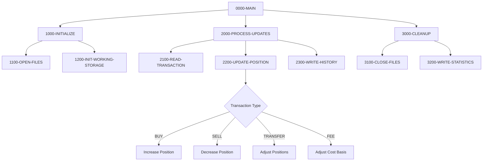
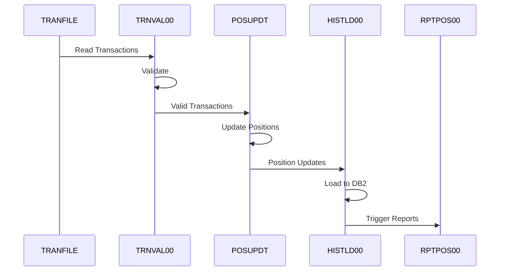

## Overview

POSUPDT (Position Update) is a batch COBOL program designed to update portfolio position records based on validated transactions. It is a core component of the Investment Portfolio Management System's batch processing layer.

**Current Status**: This program is a **stub awaiting implementation**. The source file exists at `/src/programs/batch/POSUPDT.cbl` but contains no executable code. The documentation below describes the intended functionality based on the system architecture specifications.

According to the system architecture, POSUPDT is responsible for:
- Updating position records in the Position Master VSAM file
- Maintaining accurate cost basis calculations
- Recording transaction history for audit purposes

## Intended Program Structure

Based on the system architecture documentation, POSUPDT would follow the standard batch processing flow:

## Expected Data Structures

### Position Master Record

The program would work with the Position Master VSAM file using the POSREC copybook:

| Level | Name | Picture | Description |
|-------|------|---------|-------------|
| 01 | POSITION-RECORD | - | Position record structure |
| 05 | POS-KEY | - | Composite key |
| 10 | POS-PORTFOLIO-ID | X(08) | Portfolio identifier |
| 10 | POS-DATE | X(08) | Position date (YYYYMMDD) |
| 10 | POS-INVESTMENT-ID | X(10) | Investment identifier |
| 05 | POS-DATA | - | Position data fields |
| 10 | POS-QUANTITY | S9(11)V9(4) COMP-3 | Holding quantity |
| 10 | POS-COST-BASIS | S9(13)V9(2) COMP-3 | Total cost basis |
| 10 | POS-MARKET-VALUE | S9(13)V9(2) COMP-3 | Current market value |
| 10 | POS-CURRENCY | X(03) | Currency code |
| 10 | POS-STATUS | X(01) | Status: A=Active, C=Closed, P=Pending |
| 05 | POS-AUDIT | - | Audit fields |
| 10 | POS-LAST-MAINT-DATE | X(26) | Last maintenance timestamp |
| 10 | POS-LAST-MAINT-USER | X(08) | Last maintenance user |

### Transaction Record

Input transactions would use the TRNREC copybook structure:

| Level | Name | Picture | Description |
|-------|------|---------|-------------|
| 01 | TRANSACTION-RECORD | - | Transaction record structure |
| 05 | TRN-KEY | - | Composite key |
| 10 | TRN-DATE | X(08) | Transaction date |
| 10 | TRN-TIME | X(06) | Transaction time |
| 10 | TRN-PORTFOLIO-ID | X(08) | Portfolio identifier |
| 10 | TRN-SEQUENCE-NO | X(06) | Sequence number |
| 05 | TRN-DATA | - | Transaction data fields |
| 10 | TRN-INVESTMENT-ID | X(10) | Investment identifier |
| 10 | TRN-TYPE | X(02) | Type: BU=Buy, SL=Sell, TR=Transfer, FE=Fee |
| 10 | TRN-QUANTITY | S9(11)V9(4) COMP-3 | Transaction quantity |
| 10 | TRN-PRICE | S9(11)V9(4) COMP-3 | Transaction price |
| 10 | TRN-AMOUNT | S9(13)V9(2) COMP-3 | Transaction amount |
| 10 | TRN-STATUS | X(01) | Status: P=Pending, D=Done, F=Failed, R=Reversed |

## Expected File I/O

When implemented, POSUPDT would use the following files:

| File | Type | Mode | Description |
|------|------|------|-------------|
| TRANFILE | VSAM KSDS | INPUT | Validated transaction input |
| POSMSTRE | VSAM KSDS | I-O | Position Master file |
| TRANHIST | VSAM KSDS | OUTPUT | Transaction History file |
| ERRFILE | Sequential | OUTPUT | Error/exception report |

## Expected Control Flow

### Transaction Type Processing

1. **BUY Transactions (`TRN-TYPE = 'BU'`)**
   - Add quantity to existing position
   - Update cost basis: `POS-COST-BASIS = POS-COST-BASIS + TRN-AMOUNT`
   - Create or update position record

2. **SELL Transactions (`TRN-TYPE = 'SL'`)**
   - Reduce quantity from position
   - Proportionally reduce cost basis
   - Mark position as closed if quantity reaches zero

3. **TRANSFER Transactions (`TRN-TYPE = 'TR'`)**
   - Decrease source portfolio position
   - Increase target portfolio position
   - Maintain cost basis through transfer

4. **FEE Transactions (`TRN-TYPE = 'FE'`)**
   - Adjust cost basis for fees
   - No quantity change

### Error Handling

The program would use standard error handling via the ERRHAND copybook, with typical mainframe patterns:
- VSAM file status checking
- Transaction validation errors
- Checkpoint/restart support via CKPRST copybook

## Dependencies

### Expected Copybooks

Based on the system design, POSUPDT would use:
- POSREC - Position record structure
- TRNREC - Transaction record structure  
- ERRHAND - Error handling routines
- RTNCODE - Return code definitions
- CKPRST - Checkpoint/restart support

### Called Programs

The program may call:
- ERRPROC - Error processing utility
- AUDPROC - Audit logging utility

### Related Programs

Programs that interact with POSUPDT in the batch processing flow:

| Program | Relationship | Description |
|---------|--------------|-------------|
| PORTTRAN | Predecessor | Validates transactions before POSUPDT |
| HISTLD00 | Successor | Loads history to DB2 after position updates |
| RPTPOS00 | Consumer | Generates position reports from updated data |
| RPTAUD00 | Consumer | Generates audit reports from transaction history |

## System Integration

### Batch Processing Flow

## Issues

:::warning Implementation Required
This program is currently a stub with no executable code. The source file at `/src/programs/batch/POSUPDT.cbl` is empty and requires implementation according to the specifications in the system architecture documentation.
:::

### Implementation Tasks

Based on the development backlog, the following functionality needs to be implemented:

1. VSAM file operations for Position Master
2. Transaction processing logic for all transaction types (BUY, SELL, TRANSFER, FEE)
3. Cost basis calculation and maintenance
4. Checkpoint/restart integration
5. Error handling and audit logging
6. Statistics collection for batch control

## Notes

- The program is also referred to as POSUPD00 in some architecture documentation
- Designed for z/OS batch execution with standard JES2 job control
- Uses COMP-3 (packed decimal) for all monetary and quantity fields for efficient storage
- Position records use a composite key of Portfolio ID + Date + Investment ID
