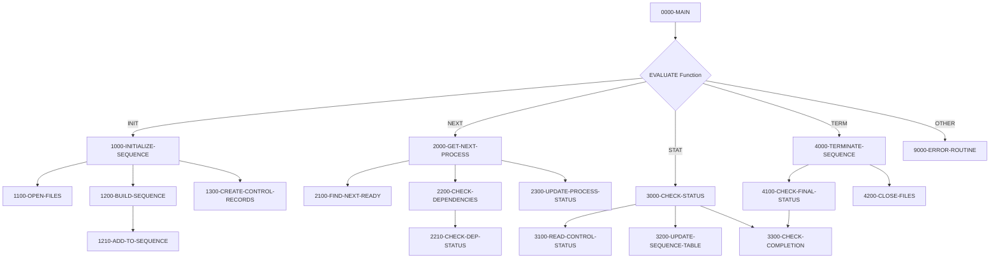

## Overview

PRCSEQ00 is a batch process sequence manager that orchestrates the execution order of batch jobs within the system. It serves as a critical component in the batch processing infrastructure, managing job dependencies, tracking process status, and ensuring proper execution sequencing.

The program operates as a callable service, accepting function codes via a linkage section interface to perform different operations: initialization of a process sequence, retrieval of the next process to execute, status checking, and termination. This design allows it to be invoked by job schedulers or other control programs to manage complex batch workflows with inter-process dependencies.

PRCSEQ00 maintains an in-memory process table that tracks up to 100 processes, along with indexed VSAM files for persistent storage of sequence definitions and batch control records.

## Program Structure



## Data Structures

### Linkage Section Interface

The program receives control through a standardized sequence request structure:

| Level | Name | Picture | Description |
|-------|------|---------|-------------|
| 01 | LS-SEQUENCE-REQUEST | - | Main linkage area for caller communication |
| 05 | LS-FUNCTION | X(4) | Function code: INIT, NEXT, STAT, or TERM |
| 05 | LS-PROCESS-DATE | X(8) | Processing date in CCYYMMDD format |
| 05 | LS-SEQUENCE-TYPE | X(3) | Sequence type filter (INI, PRC, RPT, TRM) |
| 05 | LS-NEXT-PROCESS | X(8) | Output: Next process ID to execute |
| 05 | LS-RETURN-CODE | S9(4) COMP | Return code from operation |

### Working Storage

| Level | Name | Picture | Description |
|-------|------|---------|-------------|
| 05 | WS-PSR-STATUS | X(2) | File status for process sequence file |
| 05 | WS-BCT-STATUS | X(2) | File status for batch control file |
| 05 | WS-CURRENT-TIME | X(26) | Current timestamp for processing |
| 05 | WS-SEQUENCE-IX | 9(4) COMP | Sequence table index |
| 05 | WS-PROCESS-COUNT | 9(4) COMP | Total processes in sequence |
| 05 | WS-ACTIVE-COUNT | 9(4) COMP | Count of active processes |
| 05 | WS-ERROR-COUNT | 9(4) COMP | Count of processes in error |

### Process Table (In-Memory)

| Level | Name | Picture | Description |
|-------|------|---------|-------------|
| 01 | WS-PROCESS-TABLE | - | Internal table for up to 100 processes |
| 10 | WS-PROC-ID | X(8) | Process identifier |
| 10 | WS-PROC-SEQ | 9(4) COMP | Sequence number |
| 10 | WS-PROC-STATUS | X(1) | Current status (R/A/W/D/E) |
| 10 | WS-PROC-RC | S9(4) COMP | Return code |

## File I/O

### Process Sequence File (PRCSEQ)

| Attribute | Value |
|-----------|-------|
| DDname | PRCSEQ |
| Organization | Indexed |
| Access Mode | Dynamic |
| Record Key | PSR-KEY (Process ID + Version) |

**Operations:**
- START - Position to beginning of date range
- READ NEXT - Sequential read to build process table
- READ - Direct read to check process dependencies

### Batch Control File (BCHCTL)

| Attribute | Value |
|-----------|-------|
| DDname | BCHCTL |
| Organization | Indexed |
| Access Mode | Dynamic |
| Record Key | BCT-KEY (Job Name + Process Date + Sequence No) |

**Operations:**
- READ - Retrieve control records for status checking
- WRITE - Create new control records during initialization
- REWRITE - Update process status and timestamps

## Control Flow

### Initialization (FUNC-INIT)

1. **Open Files**: Opens both PROCESS-SEQ-FILE and BATCH-CONTROL-FILE in I-O mode
2. **Build Sequence**: Reads process sequence records for the given date and type, populating the in-memory process table with up to 100 entries
3. **Create Control Records**: Writes batch control records for each process in the sequence, initializing them with READY status

### Get Next Process (FUNC-NEXT)

1. **Find Next Ready**: Scans the process table for the first process with READY status
2. **Check Dependencies**: For hard dependencies, verifies prerequisite jobs have completed successfully; checks return codes against acceptable thresholds
3. **Update Status**: If dependencies are satisfied, marks the process as ACTIVE and records the start timestamp

### Check Status (FUNC-STAT)

1. **Read Control Status**: Retrieves the current status from the batch control file
2. **Update Sequence Table**: Synchronizes the in-memory table with persistent status
3. **Check Completion**: Counts active and errored processes to determine overall sequence state

### Terminate (FUNC-TERM)

1. **Check Final Status**: Determines overall completion status based on error and active counts
2. **Close Files**: Closes both data files and verifies successful closure
3. **Set Return Code**: Returns SUCCESS (0), WARNING (4) if processes still active, or ERROR (8) if any failures

## Return Codes

| Code | Constant | Meaning |
|------|----------|---------|
| 0 | BCT-RC-SUCCESS | Operation completed successfully |
| 4 | BCT-RC-WARNING | Warning condition (e.g., processes still active) |
| 8 | BCT-RC-ERROR | Error condition (e.g., failed processes, file errors) |

## Dependencies

### Copybooks

- **PRCSEQ** - Process sequence record definition with scheduling and dependency information
- **BCHCTL** - Batch control record definition for job-level tracking
- **BCHCON** - Batch control constants including status values and return codes
- **ERRHAND** - Standard error handling definitions and message structure

### Called Programs

- **ERRPROC** - Error processing routine for logging and handling errors

### Related Programs

Programs that share copybooks or have caller/callee relationships:
- BCHCTL00 - Batch control program (uses BCHCTL, BCHCON, ERRHAND)
- HISTLD00 - History loader (uses BCHCTL, BCHCON, ERRHAND)
- RCVPRC00 - Recovery processing (uses PRCSEQ, BCHCTL, BCHCON, ERRHAND)
- RPTSTA00 - Status reporting (uses BCHCTL, ERRHAND)

## Usage Example

```cobol
*---------------------------------------------------------*
* Initialize a daily process sequence
*---------------------------------------------------------*
    MOVE 'INIT' TO LS-FUNCTION
    MOVE '20240315' TO LS-PROCESS-DATE
    MOVE 'PRC' TO LS-SEQUENCE-TYPE
    CALL 'PRCSEQ00' USING LS-SEQUENCE-REQUEST

*---------------------------------------------------------*
* Get and execute processes in sequence
*---------------------------------------------------------*
    PERFORM UNTIL LS-NEXT-PROCESS = SPACES
        MOVE 'NEXT' TO LS-FUNCTION
        CALL 'PRCSEQ00' USING LS-SEQUENCE-REQUEST
        IF LS-NEXT-PROCESS NOT = SPACES
            CALL LS-NEXT-PROCESS
            MOVE 'STAT' TO LS-FUNCTION
            CALL 'PRCSEQ00' USING LS-SEQUENCE-REQUEST
        END-IF
    END-PERFORM

*---------------------------------------------------------*
* Terminate the sequence
*---------------------------------------------------------*
    MOVE 'TERM' TO LS-FUNCTION
    CALL 'PRCSEQ00' USING LS-SEQUENCE-REQUEST
```

## Technical Notes

1. **Dynamic File Access**: Uses COBOL's dynamic access mode allowing both sequential and random operations on indexed files
2. **88-Level Conditions**: Extensively uses condition names for status checking (e.g., `FUNC-INIT`, `BCT-STATUS-DONE`)
3. **PERFORM VARYING**: Uses indexed loops for table processing with early exit capability via EXIT PERFORM
4. **Dependency Types**: Supports both hard (`PSR-DEP-HARD`) and soft dependencies with return code thresholds
5. **COMP Fields**: Uses computational fields (COMP) for efficient numeric storage and arithmetic operations
