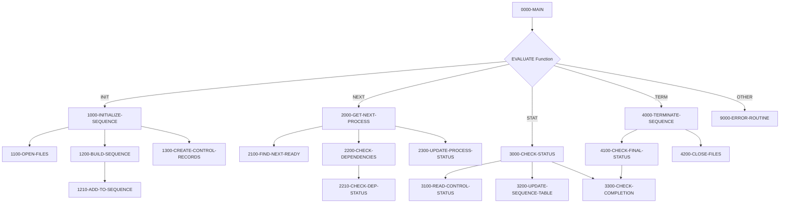

## Overview

PRCSEQ00 is a Process Sequence Manager program that orchestrates batch job execution in a mainframe environment. It manages the order in which batch processes run, handles inter-process dependencies, and tracks the execution status of each process in a sequence.

The program operates as a callable service that provides four main functions: initializing a batch sequence (INIT), retrieving the next process to execute (NEXT), checking process status (STAT), and terminating the sequence (TERM). This design enables a job scheduler or control program to dynamically manage batch workflows based on real-time dependency resolution.

PRCSEQ00 uses two VSAM indexed files: a Process Sequence File that defines the execution order and dependencies, and a Batch Control File that tracks the runtime status of each process. The program supports both hard dependencies (process must complete successfully) and soft dependencies (process must complete but return code threshold is more lenient).

## Program Structure

## Data Structures

### Linkage Section (Input/Output Parameters)

| Level | Name | Picture | Description |
|-------|------|---------|-------------|
| 01 | LS-SEQUENCE-REQUEST | - | Main parameter block passed by caller |
| 05 | LS-FUNCTION | X(4) | Function code: INIT, NEXT, STAT, or TERM |
| 05 | LS-PROCESS-DATE | X(8) | Processing date for the batch sequence |
| 05 | LS-SEQUENCE-TYPE | X(3) | Type of sequence (INI/PRC/RPT/TRM) |
| 05 | LS-NEXT-PROCESS | X(8) | Output: name of next process to run |
| 05 | LS-RETURN-CODE | S9(4) COMP | Return code (0=success, 4=warning, 8=error) |

### Working Storage

| Level | Name | Picture | Description |
|-------|------|---------|-------------|
| 01 | WS-FILE-STATUS | - | File status indicators |
| 05 | WS-PSR-STATUS | X(2) | Process Sequence File status |
| 05 | WS-BCT-STATUS | X(2) | Batch Control File status |
| 01 | WS-WORK-AREAS | - | Working variables |
| 05 | WS-CURRENT-TIME | X(26) | Timestamp for status updates |
| 05 | WS-SEQUENCE-IX | 9(4) COMP | Index for traversing sequences |
| 05 | WS-PROCESS-COUNT | 9(4) COMP | Total processes in sequence |
| 05 | WS-ACTIVE-COUNT | 9(4) COMP | Number of currently active processes |
| 05 | WS-ERROR-COUNT | 9(4) COMP | Number of processes in error |

### Process Table (Internal Tracking)

| Level | Name | Picture | Description |
|-------|------|---------|-------------|
| 01 | WS-PROCESS-TABLE | - | In-memory process tracking (100 entries) |
| 10 | WS-PROC-ID | X(8) | Process identifier |
| 10 | WS-PROC-SEQ | 9(4) COMP | Sequence number |
| 10 | WS-PROC-STATUS | X(1) | Status: R=Ready, A=Active, D=Done, E=Error |
| 10 | WS-PROC-RC | S9(4) COMP | Process return code |

## File I/O

### PROCESS-SEQ-FILE (PRCSEQ)

- **Organization**: VSAM Indexed
- **Access Mode**: Dynamic (sequential and random)
- **Record Key**: PSR-KEY (Process ID + Version)

| Operation | Paragraph | Description |
|-----------|-----------|-------------|
| OPEN I-O | 1100-OPEN-FILES | Opens for read/write access |
| START | 1200-BUILD-SEQUENCE | Positions to start of date sequence |
| READ NEXT | 1200-BUILD-SEQUENCE | Sequential read to build process table |
| READ | 2200-CHECK-DEPENDENCIES | Random read for dependency lookup |
| CLOSE | 4200-CLOSE-FILES | Closes file at termination |

### BATCH-CONTROL-FILE (BCHCTL)

- **Organization**: VSAM Indexed
- **Access Mode**: Dynamic
- **Record Key**: BCT-KEY (Job Name + Process Date + Sequence No)

| Operation | Paragraph | Description |
|-----------|-----------|-------------|
| OPEN I-O | 1100-OPEN-FILES | Opens for read/write access |
| WRITE | 1300-CREATE-CONTROL-RECORDS | Creates control record for each process |
| READ | 2210-CHECK-DEP-STATUS, 2300-UPDATE-PROCESS-STATUS, 3100-READ-CONTROL-STATUS | Reads process status |
| REWRITE | 2300-UPDATE-PROCESS-STATUS | Updates status to ACTIVE with start time |
| CLOSE | 4200-CLOSE-FILES | Closes file at termination |

## Control Flow

### Initialization (FUNC-INIT)

1. **1100-OPEN-FILES**: Opens both VSAM files for I/O operations. If either file fails to open, triggers error handling.

2. **1200-BUILD-SEQUENCE**: Builds the in-memory process table by:
   - Positioning to the requested process date in PROCESS-SEQ-FILE using START
   - Sequentially reading all processes matching the requested sequence type
   - Adding each matching process via 1210-ADD-TO-SEQUENCE

3. **1300-CREATE-CONTROL-RECORDS**: Creates a batch control record for each process using PERFORM VARYING loop. Each record is initialized with READY status.

### Get Next Process (FUNC-NEXT)

1. **2100-FIND-NEXT-READY**: Scans the process table for the first entry with READY status. Returns SPACES in LS-NEXT-PROCESS if no ready processes remain.

2. **2200-CHECK-DEPENDENCIES**: For the candidate process:
   - Reads its definition from PROCESS-SEQ-FILE
   - Iterates through all defined dependencies (PSR-DEP-COUNT entries)
   - Calls 2210-CHECK-DEP-STATUS to verify each dependency

3. **2210-CHECK-DEP-STATUS**: For each dependency:
   - If dependency is not DONE and is a hard dependency (`PSR-DEP-HARD`), returns warning code
   - If dependency is DONE but return code exceeds threshold (PSR-DEP-RC), returns error code

4. **2300-UPDATE-PROCESS-STATUS**: If dependencies are satisfied:
   - Marks the process as ACTIVE in the batch control file
   - Records the start timestamp
   - Rewrites the control record

### Check Status (FUNC-STAT)

1. **3100-READ-CONTROL-STATUS**: Reads current status from batch control file for the specified process.

2. **3200-UPDATE-SEQUENCE-TABLE**: Updates the in-memory process table with current status and return code from the control file.

3. **3300-CHECK-COMPLETION**: Counts processes in ACTIVE and ERROR states to determine overall sequence status.

### Terminate (FUNC-TERM)

1. **4100-CHECK-FINAL-STATUS**: Performs final status check to determine sequence completion:
   - If any errors exist: returns error code (8)
   - If processes still active: returns warning code (4)
   - Otherwise: returns success (0)

2. **4200-CLOSE-FILES**: Closes both VSAM files and verifies successful closure.

### Error Handling

**9000-ERROR-ROUTINE**: Centralized error handler that:
- Sets program name to 'PRCSEQ00' in error message
- Sets return code to BCT-RC-ERROR (8)
- Calls ERRPROC program with error message details

## Dependencies

### Copybooks

| Copybook | Section | Description |
|----------|---------|-------------|
| PRCSEQ | FILE SECTION | Process Sequence Record definition - defines process order, timing, and dependencies |
| BCHCTL | FILE SECTION | Batch Control Record definition - tracks runtime status of each process |
| BCHCON | WORKING-STORAGE | Batch Control Constants - status values and return code thresholds |
| ERRHAND | WORKING-STORAGE | Error Handling definitions - error message structure and standard return codes |

### Called Programs

| Program | Purpose |
|---------|---------|
| ERRPROC | Error logging and reporting utility |

### Related Programs

Programs that share copybooks or have caller/callee relationships with this program:

- **RCVPRC00** - Uses PRCSEQ, BCHCTL, BCHCON copybooks (likely a recovery processor)
- **BCHCTL00** - Uses BCHCTL, BCHCON copybooks (batch control program)
- **HISTLD00** - Uses BCHCTL, BCHCON copybooks (history loader)
- **RPTSTA00** - Uses BCHCTL copybook (status reporting)

## Return Codes

| Code | Constant | Meaning |
|------|----------|---------|
| 0 | BCT-RC-SUCCESS | All processes completed successfully |
| 4 | BCT-RC-WARNING | Processes still active or soft dependency not met |
| 8 | BCT-RC-ERROR | Hard error occurred or dependency failed |

## Technical Notes

- The program uses **PERFORM VARYING** loops with COMP (binary) indexes for efficient iteration through process tables
- **Dynamic file access** allows both sequential scanning (building sequence) and random access (dependency checking)
- The **88-level condition names** (FUNC-INIT, FUNC-NEXT, etc.) provide readable function code validation
- Maximum of **100 processes** can be managed in a single sequence (WS-PROC-ENTRY OCCURS 100 TIMES)
- Maximum of **10 dependencies** per process (PSR-DEP-ENTRY OCCURS 10 TIMES)
- Uses **GOBACK** instead of STOP RUN to properly return control to the calling program
