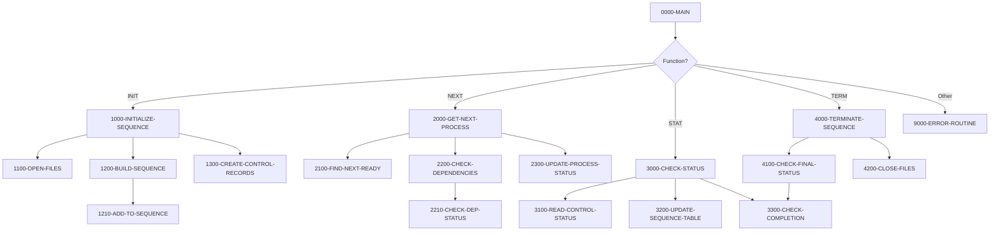

## Overview

PRCSEQ00 is a batch process sequence manager that orchestrates the execution order of batch jobs in an IBM z/OS environment. It serves as a central coordinator for batch processing, managing job dependencies, sequencing, and status tracking.

The program operates as a callable subprogram that receives function requests through its linkage section. It supports four main operations: initializing a process sequence, retrieving the next eligible process, checking execution status, and terminating a sequence. This design allows a batch scheduler or driver program to control the flow of multiple batch jobs based on defined dependencies and completion statuses.

PRCSEQ00 maintains an in-memory process table that tracks up to 100 processes, their execution sequence, current status, and return codes. It interfaces with two indexed VSAM files: a process sequence definition file (PRCSEQ) that contains the job definitions and dependencies, and a batch control file (BCHCTL) that tracks runtime status and execution history.

## Program Structure



## Data Structures

### Linkage Section - Input/Output Parameters

| Level | Name | Picture | Description |
|-------|------|---------|-------------|
| 01 | LS-SEQUENCE-REQUEST | - | Main communication area |
| 05 | LS-FUNCTION | X(4) | Function code: INIT, NEXT, STAT, TERM |
| 05 | LS-PROCESS-DATE | X(8) | Processing date (YYYYMMDD) |
| 05 | LS-SEQUENCE-TYPE | X(3) | Sequence type filter (INI, PRC, RPT, TRM) |
| 05 | LS-NEXT-PROCESS | X(8) | Output: Next process ID to execute |
| 05 | LS-RETURN-CODE | S9(4) COMP | Return code (0=success, 4=warning, 8=error) |

### Working Storage

| Level | Name | Picture | Description |
|-------|------|---------|-------------|
| 01 | WS-FILE-STATUS | - | File status indicators |
| 05 | WS-PSR-STATUS | X(2) | Process sequence file status |
| 05 | WS-BCT-STATUS | X(2) | Batch control file status |
| 01 | WS-WORK-AREAS | - | Working variables |
| 05 | WS-CURRENT-TIME | X(26) | Timestamp for status updates |
| 05 | WS-SEQUENCE-IX | 9(4) COMP | Loop counter for sequence iteration |
| 05 | WS-PROCESS-COUNT | 9(4) COMP | Total processes in sequence |
| 05 | WS-ACTIVE-COUNT | 9(4) COMP | Count of currently active processes |
| 05 | WS-ERROR-COUNT | 9(4) COMP | Count of processes in error status |

### Process Table (In-Memory)

| Level | Name | Picture | Description |
|-------|------|---------|-------------|
| 01 | WS-PROCESS-TABLE | - | In-memory process tracking (100 entries) |
| 10 | WS-PROC-ID | X(8) | Process identifier |
| 10 | WS-PROC-SEQ | 9(4) COMP | Execution sequence number |
| 10 | WS-PROC-STATUS | X(1) | Current status (R/A/W/D/E) |
| 10 | WS-PROC-RC | S9(4) COMP | Return code from execution |

## File I/O

### File Definitions

| File Name | DD Name | Organization | Access | Key | Description |
|-----------|---------|--------------|--------|-----|-------------|
| PROCESS-SEQ-FILE | PRCSEQ | Indexed (VSAM) | Dynamic | PSR-KEY | Process sequence definitions |
| BATCH-CONTROL-FILE | BCHCTL | Indexed (VSAM) | Dynamic | BCT-KEY | Runtime batch control records |

### I/O Operations

| File | Operation | Paragraph | Purpose |
|------|-----------|-----------|---------|
| PROCESS-SEQ-FILE | OPEN I-O | 1100-OPEN-FILES | Open for read/update |
| PROCESS-SEQ-FILE | START | 1200-BUILD-SEQUENCE | Position for sequential read |
| PROCESS-SEQ-FILE | READ NEXT | 1200-BUILD-SEQUENCE | Sequential read of sequence |
| PROCESS-SEQ-FILE | READ | 2200-CHECK-DEPENDENCIES | Random read for dependency check |
| PROCESS-SEQ-FILE | CLOSE | 4200-CLOSE-FILES | Close file |
| BATCH-CONTROL-FILE | OPEN I-O | 1100-OPEN-FILES | Open for read/update |
| BATCH-CONTROL-FILE | WRITE | 1300-CREATE-CONTROL-RECORDS | Create new control records |
| BATCH-CONTROL-FILE | READ | 2210-CHECK-DEP-STATUS | Read dependency status |
| BATCH-CONTROL-FILE | READ | 2300-UPDATE-PROCESS-STATUS | Read before update |
| BATCH-CONTROL-FILE | REWRITE | 2300-UPDATE-PROCESS-STATUS | Update process status |
| BATCH-CONTROL-FILE | CLOSE | 4200-CLOSE-FILES | Close file |

## Control Flow

### Function: INIT (Initialize Sequence)

1. **1100-OPEN-FILES**: Opens both the process sequence file and batch control file in I-O mode. If either file fails to open, the program invokes the error routine.

2. **1200-BUILD-SEQUENCE**: Builds an in-memory table of processes for the requested date and sequence type:
   - Initializes the process table and counters
   - Positions to the start of records for the given process date using START
   - Reads sequentially through matching records
   - For each record matching the sequence type, calls 1210-ADD-TO-SEQUENCE

3. **1210-ADD-TO-SEQUENCE**: Adds each qualifying process to the in-memory table with READY status.

4. **1300-CREATE-CONTROL-RECORDS**: Creates batch control records for each process in the sequence using PERFORM VARYING to iterate through the process count.

### Function: NEXT (Get Next Process)

1. **2100-FIND-NEXT-READY**: Scans the in-memory process table to find the first process with READY status. Returns the process ID or spaces if none available.

2. **2200-CHECK-DEPENDENCIES**: Validates that all dependencies for the selected process are satisfied:
   - Reads the process definition to get dependency list
   - For each dependency, calls 2210-CHECK-DEP-STATUS
   - Hard dependencies must complete successfully before the process can run
   - Soft dependencies generate warnings but don't block execution

3. **2210-CHECK-DEP-STATUS**: Checks a single dependency's status in the batch control file:
   - If the dependency is not done and is a hard dependency, returns warning
   - If the dependency completed but exceeded the allowed return code threshold, returns error

4. **2300-UPDATE-PROCESS-STATUS**: If dependencies are satisfied, marks the process as ACTIVE and records the start timestamp.

### Function: STAT (Check Status)

1. **3100-READ-CONTROL-STATUS**: Reads the current status from the batch control file.

2. **3200-UPDATE-SEQUENCE-TABLE**: Updates the in-memory table with the current status and return code from the control file.

3. **3300-CHECK-COMPLETION**: Counts active and errored processes to determine overall sequence status.

### Function: TERM (Terminate Sequence)

1. **4100-CHECK-FINAL-STATUS**: Determines the final return code:
   - Error (8) if any processes are in error status
   - Warning (4) if any processes are still active
   - Success (0) if all processes completed successfully

2. **4200-CLOSE-FILES**: Closes both files and verifies successful closure.

## Dependencies

### Copybooks

- **PRCSEQ** - Process sequence record definition containing job definitions, timing, dependencies, and scheduling rules
- **BCHCTL** - Batch control record definition for runtime job tracking and status management
- **BCHCON** - Batch control constants including status values, return code thresholds, and process types
- **ERRHAND** - Standard error handling definitions and message structures

### Called Programs

- **ERRPROC** - Error processing routine called via 9000-ERROR-ROUTINE when errors occur

### Related Programs

Programs that share copybooks or have caller/callee relationships with this program:

- **RCVPRC00** - Uses PRCSEQ, BCHCTL, BCHCON, and ERRHAND copybooks
- **BCHCTL00** - Uses BCHCTL, BCHCON, and ERRHAND copybooks
- **HISTLD00** - Uses BCHCTL, BCHCON, and ERRHAND copybooks
- **RPTSTA00** - Uses BCHCTL and ERRHAND copybooks

## Technical Notes

### Status Values

| Code | Status | Description |
|------|--------|-------------|
| R | Ready | Process is ready to execute |
| A | Active | Process is currently executing |
| W | Waiting | Process is waiting for dependencies |
| D | Done | Process completed successfully |
| E | Error | Process failed with error |

### Return Codes

| Code | Meaning |
|------|---------|
| 0 | Success - operation completed normally |
| 4 | Warning - operation completed with conditions |
| 8 | Error - operation failed |
| 12 | Severe - serious error occurred |
| 16 | Critical - terminal error |

### Dependency Types

The program supports two types of dependencies:
- **Hard dependencies** (type 'H'): Must complete before the dependent process can start
- **Soft dependencies** (type 'S'): Generate warnings but do not block execution

### Usage Pattern

```
1. Scheduler calls PRCSEQ00 with INIT to set up the day's sequence
2. Scheduler loops:
   a. Call PRCSEQ00 with NEXT to get next process
   b. Submit the returned process for execution
   c. Call PRCSEQ00 with STAT to update status after completion
3. When no more READY processes, call PRCSEQ00 with TERM to finalize
```
