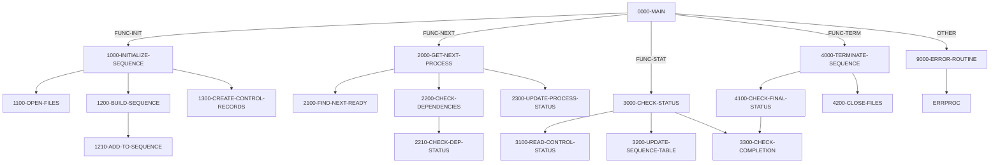

## Overview

PRCSEQ00 is a batch utility program that manages the execution sequence of batch processes. It acts as a coordinator that determines which batch jobs should run next based on their defined dependencies and completion status.

The program provides four primary functions accessed through a linkage section interface:
- **INIT** - Initialize a processing sequence for a given date and type
- **NEXT** - Get the next ready process that can be executed
- **STAT** - Check and update the status of processes in the sequence
- **TERM** - Terminate the sequence and report final status

This program is typically called by a batch scheduler or control program to orchestrate the execution of multiple batch jobs in the correct order while respecting inter-job dependencies.

## Program Structure

## Data Structures

### Linkage Section - Request Interface

The program receives requests through the `LS-SEQUENCE-REQUEST` structure:

| Field | Picture | Description |
|-------|---------|-------------|
| LS-FUNCTION | X(4) | Function code: INIT, NEXT, STAT, or TERM |
| LS-PROCESS-DATE | X(8) | Processing date for the sequence |
| LS-SEQUENCE-TYPE | X(3) | Sequence type filter (e.g., INI, PRC, RPT, TRM) |
| LS-NEXT-PROCESS | X(8) | Output: Next process ID to execute |
| LS-RETURN-CODE | S9(4) COMP | Return status code |

### Working Storage

#### File Status Fields

| Level | Name | Picture | Description |
|-------|------|---------|-------------|
| 05 | WS-PSR-STATUS | X(2) | Process sequence file status |
| 05 | WS-BCT-STATUS | X(2) | Batch control file status |

#### Work Areas

| Level | Name | Picture | Description |
|-------|------|---------|-------------|
| 05 | WS-CURRENT-TIME | X(26) | Current timestamp for status updates |
| 05 | WS-SEQUENCE-IX | 9(4) COMP | Sequence iteration index |
| 05 | WS-PROCESS-COUNT | 9(4) COMP | Total processes in sequence |
| 05 | WS-ACTIVE-COUNT | 9(4) COMP | Count of currently active processes |
| 05 | WS-ERROR-COUNT | 9(4) COMP | Count of processes in error status |

#### Process Table

An in-memory table that holds up to 100 processes:

| Level | Name | Picture | Description |
|-------|------|---------|-------------|
| 05 | WS-PROC-ENTRY | - | Occurs 100 times, indexed by WS-PROC-IX |
| 10 | WS-PROC-ID | X(8) | Process identifier |
| 10 | WS-PROC-SEQ | 9(4) COMP | Sequence number |
| 10 | WS-PROC-STATUS | X(1) | Current status (R/A/W/D/E) |
| 10 | WS-PROC-RC | S9(4) COMP | Process return code |

## File I/O

### Process Sequence File (PRCSEQ)

An indexed VSAM file containing process definitions with dependencies.

| Operation | Description |
|-----------|-------------|
| OPEN I-O | Opened for read/write access during initialization |
| START | Positions to first record for a given date |
| READ NEXT | Sequential read to build process sequence |
| READ | Random read to get process definition and dependencies |
| CLOSE | Closed during termination |

**Record Structure (PRCSEQ copybook):**
- `PSR-KEY`: Composite key (process ID + version)
- `PSR-TYPE`: Process type (INI, PRC, RPT, TRM)
- `PSR-DEPENDENCIES`: Up to 10 dependencies with hard/soft indicators and acceptable return codes
- `PSR-CONTROL`: Program name, parameters, and restart capability

### Batch Control File (BCHCTL)

An indexed VSAM file for tracking job execution status.

| Operation | Description |
|-----------|-------------|
| OPEN I-O | Opened for read/write access during initialization |
| WRITE | Creates control records for each process in sequence |
| READ | Reads status of processes and dependencies |
| REWRITE | Updates process status (READY → ACTIVE → DONE/ERROR) |
| CLOSE | Closed during termination |

**Record Structure (BCHCTL copybook):**
- `BCT-KEY`: Composite key (job name + process date + sequence number)
- `BCT-STATUS`: Current status (R=Ready, A=Active, W=Waiting, D=Done, E=Error)
- `BCT-PROCESS-CONTROL`: Step name, program name, start/end times
- `BCT-RETURN-INFO`: Return code and error description

## Control Flow

### Initialization (FUNC-INIT)

1. **Open Files**: Opens both the process sequence file and batch control file for I/O
2. **Build Sequence**: 
   - Starts at records matching the process date
   - Reads sequentially and filters by sequence type
   - Builds an in-memory table of up to 100 processes
3. **Create Control Records**: Writes a batch control record for each process with initial READY status

### Get Next Process (FUNC-NEXT)

1. **Find Next Ready**: Scans the process table for the first process with READY status
2. **Check Dependencies**: 
   - Reads the process definition to get dependency list
   - For each dependency, verifies completion status in the control file
   - Hard dependencies must complete successfully before proceeding
   - Return codes are validated against acceptable thresholds
3. **Update Status**: Changes the process status from READY to ACTIVE and records the start timestamp

### Check Status (FUNC-STAT)

1. **Read Control Status**: Retrieves current status from the batch control file
2. **Update Sequence Table**: Synchronizes the in-memory table with file-based status
3. **Check Completion**: Counts active and errored processes

### Terminate Sequence (FUNC-TERM)

1. **Check Final Status**: 
   - If any errors exist, returns BCT-RC-ERROR (8)
   - If processes still active, returns BCT-RC-WARNING (4)
   - Otherwise returns BCT-RC-SUCCESS (0)
2. **Close Files**: Closes both VSAM files

### Error Handling

Errors invoke `9000-ERROR-ROUTINE` which:
- Sets the program name to 'PRCSEQ00'
- Sets return code to BCT-RC-ERROR (8)
- Calls the ERRPROC utility for standardized error logging

## Dependencies

### Copybooks

- **PRCSEQ** - Process sequence record definition with dependency structures
- **BCHCTL** - Batch control record definition for job tracking
- **BCHCON** - Batch control constants (status values, return codes, thresholds)
- **ERRHAND** - Standard error handling structures and codes

### Called Programs

- **ERRPROC** - Standard error processing utility

### Related Programs

Programs that share copybooks or have caller/callee relationships:

- **RCVPRC00** - Also uses PRCSEQ, BCHCTL, BCHCON, and ERRHAND copybooks
- **BCHCTL00** - Batch control utility sharing BCHCTL and BCHCON
- **HISTLD00** - History loader sharing BCHCTL, BCHCON, and ERRHAND
- **RPTSTA00** - Status reporting sharing BCHCTL and ERRHAND

## Return Codes

| Code | Constant | Description |
|------|----------|-------------|
| 0 | BCT-RC-SUCCESS | Successful completion |
| 4 | BCT-RC-WARNING | Warning - processes still active or soft dependency not met |
| 8 | BCT-RC-ERROR | Error condition - hard dependency failed or I/O error |
| 12 | BCT-RC-SEVERE | Severe error |
| 16 | BCT-RC-CRITICAL | Critical error |

## Technical Notes

1. **Dynamic File Access**: Both files use ACCESS MODE IS DYNAMIC, allowing both sequential and random access patterns.

2. **Dependency Types**: 
   - Hard dependencies (`PSR-DEP-HARD = 'H'`) must complete successfully before a process can start
   - Soft dependencies (`PSR-DEP-SOFT = 'S'`) issue warnings but don't block execution

3. **Process Table Limit**: The in-memory table supports up to 100 processes per sequence. Sequences larger than this would need to be split into multiple runs.

4. **COMP Fields**: The program uses `PIC 9(4) COMP` (binary) for counters and indexes, which is efficient for arithmetic operations on IBM mainframes.

5. **Timestamp Handling**: The program uses `ACCEPT ... FROM TIME STAMP` to capture precise timing for process start times.
