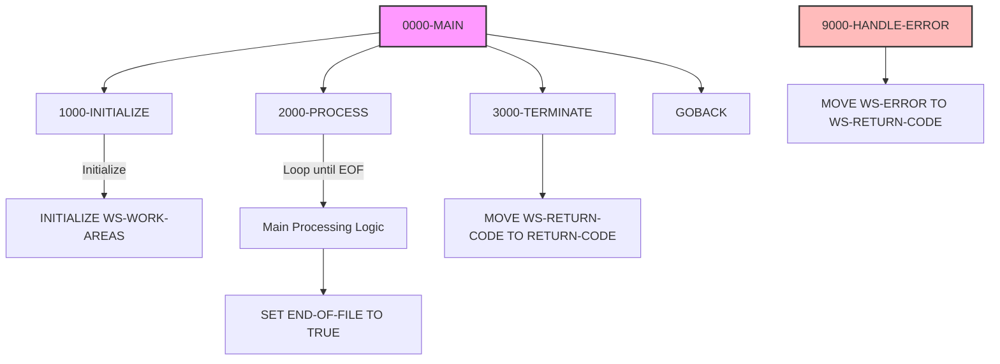

## Overview

PROGNAME is a standard COBOL program template that provides a consistent, well-structured starting point for developing new batch programs in the portfolio management system. This template establishes coding conventions, standard paragraph organization, and common data structures that should be used across all batch programs.

The template implements the recommended program structure with clearly defined sections for:

- **Initialization**: Setup and resource allocation
- **Main Processing**: Core business logic with loop control
- **Termination**: Cleanup and return code handling
- **Error Handling**: Centralized error management

Using this template ensures consistency across the codebase, simplifies code reviews, and makes programs easier to maintain and understand.

## Program Structure



## Template Sections

### IDENTIFICATION DIVISION

```cobol
      *================================================================*
      * Program Name: PROGNAME
      * Description: [Description of program purpose]
      * Author: [Author name]
      * Date Written: [Date]
      * Maintenance Log:
      * Date       Author        Description
      * ---------- ------------- -------------------------------------
      * [Date]     [Author]      Initial Creation
      *================================================================*
       IDENTIFICATION DIVISION.
       PROGRAM-ID. PROGNAME.
```

The header comment block provides essential documentation:
- **Program Name**: The 8-character program identifier
- **Description**: Brief explanation of program purpose
- **Author**: Developer who created the program
- **Date Written**: Creation date
- **Maintenance Log**: Change history with date, author, and description

### ENVIRONMENT DIVISION

```cobol
       ENVIRONMENT DIVISION.
       CONFIGURATION SECTION.
       SOURCE-COMPUTER. IBM-ZOS.
       OBJECT-COMPUTER. IBM-ZOS.
       
       INPUT-OUTPUT SECTION.
       FILE-CONTROL.
           *> File control entries will go here
```

Standard IBM z/OS configuration with placeholder for file definitions.

### DATA DIVISION

```cobol
       DATA DIVISION.
       FILE SECTION.
           *> File descriptions will go here
       
       WORKING-STORAGE SECTION.
       ...
       
       LINKAGE SECTION.
           *> Parameters passed to program will go here
```

Three standard sections for data definitions.

## Data Structures

### Working Storage

#### WS-CONSTANTS

| Level | Name | Picture | Value | Description |
|-------|------|---------|-------|-------------|
| 01 | WS-CONSTANTS | - | - | Program constants group |
| 05 | WS-PROGRAM-NAME | X(8) | 'PROGNAME' | Program identifier for messages |
| 05 | WS-SUCCESS | S9(4) | +0 | Success return code constant |
| 05 | WS-ERROR | S9(4) | +8 | Error return code constant |

#### WS-SWITCHES

| Level | Name | Picture | Value | Description |
|-------|------|---------|-------|-------------|
| 01 | WS-SWITCHES | - | - | Processing switches group |
| 05 | WS-END-OF-FILE-SW | X | 'N' | End of file indicator |

**Condition Names (88-levels):**

| Condition | Value | Description |
|-----------|-------|-------------|
| END-OF-FILE | 'Y' | Processing complete |
| NOT-END-OF-FILE | 'N' | Continue processing |

#### WS-WORK-AREAS

| Level | Name | Picture | Value | Description |
|-------|------|---------|-------|-------------|
| 01 | WS-WORK-AREAS | - | - | Working variables group |
| 05 | WS-RETURN-CODE | S9(4) | +0 | Program return code |

## Control Flow

### 0000-MAIN

The main paragraph orchestrates the standard three-phase processing:

```cobol
       0000-MAIN.
           PERFORM 1000-INITIALIZE
           
           PERFORM 2000-PROCESS
              UNTIL END-OF-FILE
           
           PERFORM 3000-TERMINATE
           
           GOBACK.
```

1. **Initialization**: Performs setup once
2. **Processing Loop**: Repeats main logic until END-OF-FILE is true
3. **Termination**: Performs cleanup once
4. **Exit**: Returns control via GOBACK

### 1000-INITIALIZE

Initialization paragraph for setup tasks:

```cobol
       1000-INITIALIZE.
           INITIALIZE WS-WORK-AREAS
           .
```

**Typical additions:**
- Open files
- Initialize counters and accumulators
- Read control parameters
- Establish database connections
- Write report headers

### 2000-PROCESS

Main processing paragraph:

```cobol
       2000-PROCESS.
           *> Main processing logic will go here
           SET END-OF-FILE TO TRUE
           .
```

**Typical additions:**
- Read input records
- Validate data
- Apply business rules
- Write output records
- Update counters

:::note
The template sets END-OF-FILE to TRUE immediately to prevent infinite loops. In actual programs, this should be set based on input file status or other termination conditions.
:::

### 3000-TERMINATE

Termination paragraph for cleanup:

```cobol
       3000-TERMINATE.
           MOVE WS-RETURN-CODE TO RETURN-CODE
           .
```

**Typical additions:**
- Close files
- Write summary statistics
- Disconnect from databases
- Display completion messages

### 9000-HANDLE-ERROR

Centralized error handling:

```cobol
       9000-HANDLE-ERROR.
           *> Error handling logic will go here
           MOVE WS-ERROR TO WS-RETURN-CODE
           .
```

**Typical additions:**
- Log error details
- Display error messages
- Perform recovery actions
- Set appropriate return code

## Dependencies

### Copybooks

This template does not include any copybooks. Programs based on this template should add:
- Common data structures (COMMON.cpy)
- Error handling definitions (ERRHAND.cpy)
- Application-specific record layouts

### Called Programs

This template does not call any external programs. Programs based on this template may add calls to:
- Error logging routines (ERRPROC)
- Audit trail processing (AUDPROC)
- Utility functions

## Return Codes

| Code | Constant | Description |
|------|----------|-------------|
| 0 | WS-SUCCESS | Successful completion |
| 8 | WS-ERROR | Error occurred |

## Usage Guidelines

### Creating a New Program

1. **Copy the template** to a new file with your program name
2. **Update PROGRAM-ID** to match your program name
3. **Complete the header** with description, author, and date
4. **Add file definitions** in FILE-CONTROL and FILE SECTION
5. **Add copybooks** for common structures
6. **Implement initialization** in 1000-INITIALIZE
7. **Implement processing** in 2000-PROCESS
8. **Implement termination** in 3000-TERMINATE
9. **Implement error handling** in 9000-HANDLE-ERROR

### Naming Conventions

| Element | Convention | Example |
|---------|------------|---------|
| Program Name | 8 characters, uppercase | PORTUPDT |
| Paragraph Names | NNNN-DESCRIPTION | 2100-VALIDATE-INPUT |
| Working Storage | WS-NAME | WS-RECORD-COUNT |
| File Section | Record name matches file | INPUT-RECORD |
| Switches | WS-xxx-SW with 88-levels | WS-END-OF-FILE-SW |
| Constants | WS-xxx in WS-CONSTANTS | WS-PROGRAM-NAME |

### Paragraph Numbering

| Range | Purpose |
|-------|---------|
| 0000 | Main entry point |
| 1000-1999 | Initialization routines |
| 2000-2999 | Main processing routines |
| 3000-3999 | Termination routines |
| 9000-9999 | Error handling routines |

Sub-paragraphs use increments of 100 (e.g., 2100, 2200) or 10 (e.g., 2110, 2120) for related routines.

## Example: Extended Template

```cobol
       WORKING-STORAGE SECTION.
       01  WS-CONSTANTS.
           05  WS-PROGRAM-NAME     PIC X(08) VALUE 'MYPROG  '.
           05  WS-SUCCESS          PIC S9(4) VALUE +0.
           05  WS-WARNING          PIC S9(4) VALUE +4.
           05  WS-ERROR            PIC S9(4) VALUE +8.
           05  WS-SEVERE           PIC S9(4) VALUE +12.
           
       01  WS-SWITCHES.
           05  WS-END-OF-FILE-SW   PIC X     VALUE 'N'.
               88  END-OF-FILE               VALUE 'Y'.
               88  NOT-END-OF-FILE           VALUE 'N'.
           05  WS-ERROR-SW         PIC X     VALUE 'N'.
               88  ERROR-OCCURRED            VALUE 'Y'.
               88  NO-ERROR                  VALUE 'N'.
               
       01  WS-COUNTERS.
           05  WS-RECORDS-READ     PIC 9(7)  VALUE ZERO.
           05  WS-RECORDS-WRITTEN  PIC 9(7)  VALUE ZERO.
           05  WS-RECORDS-ERROR    PIC 9(7)  VALUE ZERO.
           
       01  WS-WORK-AREAS.
           05  WS-RETURN-CODE      PIC S9(4) VALUE +0.
           05  WS-FILE-STATUS      PIC X(2).
           05  WS-TIMESTAMP        PIC X(26).
```

## Technical Notes

### GOBACK vs STOP RUN

The template uses `GOBACK` rather than `STOP RUN`:
- **GOBACK**: Returns control to the calling program or operating system; preferred for subprograms and modern batch programs
- **STOP RUN**: Terminates the entire run unit; should only be used when you explicitly want to end all processing

### INITIALIZE Statement

The `INITIALIZE WS-WORK-AREAS` statement sets:
- Numeric fields to zeros
- Alphanumeric fields to spaces
- Does not affect FILLER items or items with REDEFINES

### 88-Level Condition Names

The template demonstrates the use of 88-level condition names:
```cobol
       05  WS-END-OF-FILE-SW    PIC X     VALUE 'N'.
           88  END-OF-FILE                VALUE 'Y'.
           88  NOT-END-OF-FILE            VALUE 'N'.
```

This allows readable conditional logic:
```cobol
       IF END-OF-FILE
          ...
       SET END-OF-FILE TO TRUE
```

### Comment Style

The template uses two comment styles:
- **Asterisk in column 7**: Traditional COBOL comment for documentation blocks
- **\*>**: Inline comment (COBOL 2002+) for brief notes
