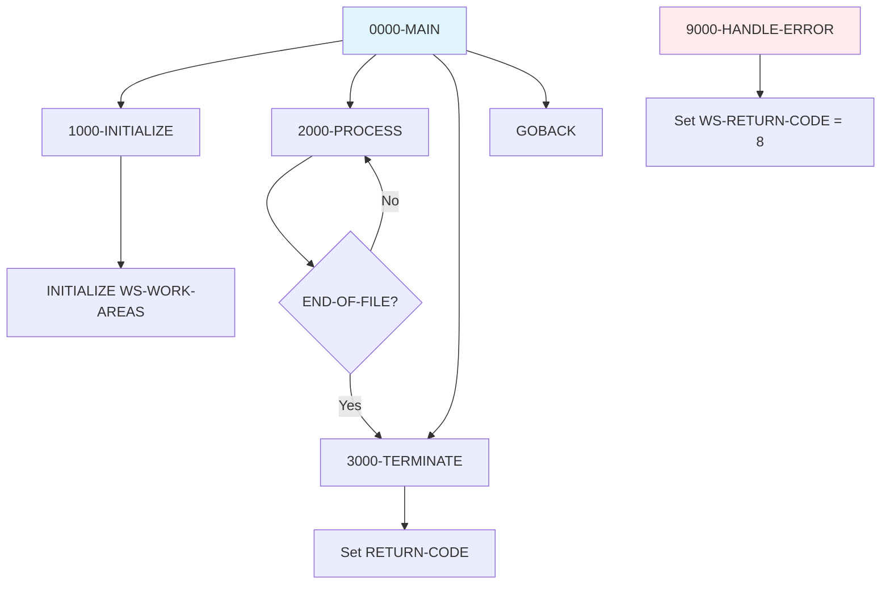

## Overview

PROGNAME is a standard COBOL program template that provides a baseline structure for developing new batch programs. It establishes the fundamental coding patterns, paragraph organization, and working storage layout that should be followed when creating new programs in the system.

This template is not intended to be executed directly but rather serves as a starting point for developers creating new COBOL programs. It demonstrates the standard program structure with initialization, main processing loop, termination, and error handling paragraphs.

The template follows mainframe COBOL best practices including proper division organization, consistent naming conventions, standard return code handling, and placeholder sections for file definitions, copybooks, and linkage parameters.

## Program Structure



## Data Structures

### Working Storage

#### Constants (WS-CONSTANTS)

| Level | Name | Picture | Value | Description |
|-------|------|---------|-------|-------------|
| 01 | WS-CONSTANTS | | | Program constants group |
| 05 | WS-PROGRAM-NAME | X(8) | 'PROGNAME' | Program identifier |
| 05 | WS-SUCCESS | S9(4) | +0 | Success return code |
| 05 | WS-ERROR | S9(4) | +8 | Error return code |

#### Switches (WS-SWITCHES)

| Level | Name | Picture | Initial | Description |
|-------|------|---------|---------|-------------|
| 01 | WS-SWITCHES | | | Processing control switches |
| 05 | WS-END-OF-FILE-SW | X | 'N' | End of file indicator |

**88-level Conditions:**
- `END-OF-FILE` - Value 'Y' - Processing complete
- `NOT-END-OF-FILE` - Value 'N' - Continue processing

#### Work Areas (WS-WORK-AREAS)

| Level | Name | Picture | Initial | Description |
|-------|------|---------|---------|-------------|
| 01 | WS-WORK-AREAS | | | Working variables group |
| 05 | WS-RETURN-CODE | S9(4) | +0 | Program return code |

### Placeholder Sections

The template includes placeholder comments for:

- **FILE SECTION**: File descriptions (FD entries)
- **LINKAGE SECTION**: Parameters passed to the program
- **FILE-CONTROL**: SELECT statements for file definitions

## Control Flow

### Main Processing (0000-MAIN)

The standard batch processing pattern:

```
1. PERFORM 1000-INITIALIZE
2. PERFORM 2000-PROCESS UNTIL END-OF-FILE
3. PERFORM 3000-TERMINATE
4. GOBACK
```

### Initialization (1000-INITIALIZE)

Standard initialization tasks:
- Initializes WS-WORK-AREAS to default values
- **Customize**: Add file opens, parameter validation, initial reads

### Main Processing (2000-PROCESS)

The main processing loop placeholder:
- Currently sets END-OF-FILE to TRUE (exits immediately)
- **Customize**: Add actual business logic, file reads, record processing

### Termination (3000-TERMINATE)

Standard termination tasks:
- Moves WS-RETURN-CODE to RETURN-CODE (system return code)
- **Customize**: Add file closes, summary displays, cleanup logic

### Error Handling (9000-HANDLE-ERROR)

Standard error handling placeholder:
- Sets WS-RETURN-CODE to WS-ERROR (+8)
- **Customize**: Add error logging, cleanup, specific error handling

## Usage Guidelines

### Creating a New Program from Template

1. **Copy the template** to a new source file with the actual program name
2. **Update PROGRAM-ID** in the IDENTIFICATION DIVISION
3. **Update WS-PROGRAM-NAME** constant
4. **Add file definitions** in FILE-CONTROL and FILE SECTION
5. **Add copybook references** with COPY statements
6. **Add linkage section** if program receives parameters
7. **Implement business logic** in 2000-PROCESS
8. **Add initialization logic** (file opens) in 1000-INITIALIZE
9. **Add termination logic** (file closes) in 3000-TERMINATE
10. **Implement error handling** in 9000-HANDLE-ERROR

### Naming Conventions

| Element | Convention | Example |
|---------|------------|---------|
| Working Storage | WS- prefix | WS-CUSTOMER-NAME |
| File Status | WS-xxx-STATUS | WS-FILE-STATUS |
| Switches | WS-xxx-SW | WS-END-OF-FILE-SW |
| Counters | WS-xxx-COUNT | WS-RECORD-COUNT |
| Linkage Section | LS- prefix | LS-INPUT-PARM |

### Paragraph Numbering

| Range | Purpose |
|-------|---------|
| 0000-0999 | Main control paragraphs |
| 1000-1999 | Initialization paragraphs |
| 2000-2999 | Main processing paragraphs |
| 3000-3999 | Termination paragraphs |
| 9000-9999 | Error handling paragraphs |

## Return Codes

| Code | Constant | Meaning |
|------|----------|---------|
| 0 | WS-SUCCESS | Successful completion |
| 8 | WS-ERROR | Error occurred |

Additional return codes can be added as needed:
- 4 = Warning
- 12 = Severe error
- 16 = Terminal error

## Dependencies

### Copybooks
None - Template does not include copybooks. Add as needed:
- Common data structures
- File record layouts
- Error handling definitions

### Called Programs
None - Template does not call external programs. Add as needed.

## Template Customization Example

### Adding a File

```cobol
INPUT-OUTPUT SECTION.
FILE-CONTROL.
    SELECT INPUT-FILE
        ASSIGN TO INFILE
        ORGANIZATION IS SEQUENTIAL
        FILE STATUS IS WS-INPUT-STATUS.

FILE SECTION.
FD  INPUT-FILE.
01  INPUT-RECORD              PIC X(80).

WORKING-STORAGE SECTION.
01  WS-FILE-STATUS.
    05  WS-INPUT-STATUS       PIC X(2).
        88  WS-INPUT-OK       VALUE '00'.
        88  WS-INPUT-EOF      VALUE '10'.
```

### Adding Initialization Logic

```cobol
1000-INITIALIZE.
    INITIALIZE WS-WORK-AREAS
    
    OPEN INPUT INPUT-FILE
    IF NOT WS-INPUT-OK
        DISPLAY 'Error opening input file: ' WS-INPUT-STATUS
        PERFORM 9000-HANDLE-ERROR
    END-IF
    
    PERFORM 1100-READ-FIRST-RECORD
    .
```

### Adding Processing Logic

```cobol
2000-PROCESS.
    *> Process current record
    PERFORM 2100-PROCESS-RECORD
    
    *> Read next record
    READ INPUT-FILE
        AT END
            SET END-OF-FILE TO TRUE
        NOT AT END
            ADD 1 TO WS-RECORD-COUNT
    END-READ
    .
```

### Adding Termination Logic

```cobol
3000-TERMINATE.
    CLOSE INPUT-FILE
    
    DISPLAY 'Records processed: ' WS-RECORD-COUNT
    
    MOVE WS-RETURN-CODE TO RETURN-CODE
    .
```

## Technical Notes

### GOBACK vs STOP RUN

The template uses `GOBACK` rather than `STOP RUN`. GOBACK returns control to the calling program or operating system, making it suitable for both standalone programs and subprograms. STOP RUN would terminate the entire run unit.

### RETURN-CODE Special Register

The template moves WS-RETURN-CODE to RETURN-CODE in the termination paragraph. RETURN-CODE is a COBOL special register that sets the return code passed back to the operating system or calling program.

### INITIALIZE Statement

The template uses `INITIALIZE WS-WORK-AREAS` to set working storage fields to their default values (spaces for alphanumeric, zeros for numeric). This ensures a clean starting state.

### 88-Level Conditions

The template demonstrates the use of 88-level condition names (END-OF-FILE, NOT-END-OF-FILE) for improved readability. Use `SET condition-name TO TRUE` to set these flags.

### Comment Style

The template uses two comment styles:
- `*` in column 7 for full-line comments
- `*>` for inline comments (COBOL 2002+)

For maximum compatibility, use `*` in column 7 for all comments.
