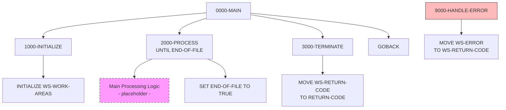

## Overview

PROGNAME is a standard COBOL program template that provides a skeleton structure for creating new batch programs. It establishes the foundational pattern used across the application portfolio, including standard paragraph naming conventions, working storage organization, and control flow structure.

This template serves as a starting point for developers creating new programs. It includes:
- **Standard Division Structure**: All four COBOL divisions with placeholder sections
- **Naming Conventions**: Consistent paragraph numbering scheme (0000, 1000, 2000, 3000, 9000)
- **Working Storage Organization**: Constants, switches, and work areas grouped logically
- **Control Flow Pattern**: Initialize → Process → Terminate with error handling
- **Documentation Headers**: Maintenance log template for tracking changes

When creating a new program, developers should copy this template, rename PROGNAME to the new program ID, and implement the placeholder sections.

## Program Structure



## Data Structures

### Working Storage

#### Constants

| Level | Name | Picture | Value | Description |
|-------|------|---------|-------|-------------|
| 01 | WS-CONSTANTS | - | - | Program constants group |
| 05 | WS-PROGRAM-NAME | X(8) | `'PROGNAME'` | Program identifier |
| 05 | WS-SUCCESS | S9(4) | +0 | Success return code |
| 05 | WS-ERROR | S9(4) | +8 | Error return code |

#### Switches

| Level | Name | Picture | Value | Description |
|-------|------|---------|-------|-------------|
| 01 | WS-SWITCHES | - | - | Processing switches group |
| 05 | WS-END-OF-FILE-SW | X | `'N'` | End-of-file indicator |

##### End of File Switch (WS-END-OF-FILE-SW)

| Value | 88-Level Name | Meaning |
|-------|---------------|---------|
| `'Y'` | END-OF-FILE | Processing complete |
| `'N'` | NOT-END-OF-FILE | Continue processing |

#### Work Areas

| Level | Name | Picture | Value | Description |
|-------|------|---------|-------|-------------|
| 01 | WS-WORK-AREAS | - | - | Work areas group |
| 05 | WS-RETURN-CODE | S9(4) | +0 | Program return code |

### Placeholder Sections

The following sections contain placeholder comments for implementation:

| Section | Purpose |
|---------|---------|
| FILE-CONTROL | File SELECT statements |
| FILE SECTION | FD entries and record layouts |
| LINKAGE SECTION | Parameters passed to program |

## Control Flow

### 0000-MAIN

The main entry point that orchestrates program execution:
1. **PERFORM 1000-INITIALIZE**: Set up the program
2. **PERFORM 2000-PROCESS UNTIL END-OF-FILE**: Execute main logic loop
3. **PERFORM 3000-TERMINATE**: Clean up and exit
4. **GOBACK**: Return to caller

This is the standard "IPO" (Initialize-Process-Output/Terminate) pattern used in batch COBOL programs.

### 1000-INITIALIZE

Performs program initialization:
- **INITIALIZE WS-WORK-AREAS**: Clears work area fields to default values

**Customization points:**
- Open files
- Initialize counters and accumulators
- Read control cards or parameters
- Perform first read (priming read) for sequential processing

### 2000-PROCESS

Main processing paragraph (placeholder implementation):
- Currently sets END-OF-FILE to TRUE immediately (single iteration)

**Customization points:**
- Read input records
- Apply business logic
- Write output records
- Update counters
- Handle record-level errors

### 3000-TERMINATE

Performs cleanup and sets the return code:
- **MOVE WS-RETURN-CODE TO RETURN-CODE**: Sets the job step return code

**Customization points:**
- Close files
- Write control totals
- Display statistics
- Write audit records

### 9000-HANDLE-ERROR

Error handling routine (placeholder):
- **MOVE WS-ERROR TO WS-RETURN-CODE**: Sets return code to 8

**Customization points:**
- Log error details
- Write to error file
- Display error messages
- Determine if processing should continue or abort

## Template Usage

### Creating a New Program

1. **Copy the template:**
   ```
   cp standard-program.cbl NEWPROG.cbl
   ```

2. **Update identifiers:**
   - Change `PROGRAM-ID. PROGNAME` to your program name
   - Update `WS-PROGRAM-NAME` value
   - Fill in documentation header fields

3. **Add file definitions:**
   ```cobol
   FILE-CONTROL.
       SELECT INPUT-FILE ASSIGN TO INFILE
           FILE STATUS IS WS-INPUT-STATUS.
   ```

4. **Define record layouts:**
   ```cobol
   FILE SECTION.
   FD  INPUT-FILE.
   01  INPUT-RECORD    PIC X(80).
   ```

5. **Implement processing logic:**
   ```cobol
   2000-PROCESS.
       READ INPUT-FILE
           AT END
               SET END-OF-FILE TO TRUE
           NOT AT END
               PERFORM 2100-PROCESS-RECORD
       END-READ.
   ```

### Naming Conventions

| Range | Purpose |
|-------|---------|
| 0000-0999 | Main control paragraphs |
| 1000-1999 | Initialization paragraphs |
| 2000-2999 | Processing paragraphs |
| 3000-3999 | Termination paragraphs |
| 9000-9999 | Error handling paragraphs |

### Recommended Additions

When implementing a production program, consider adding:

| Category | Items to Add |
|----------|--------------|
| **Files** | Input files, output files, report files |
| **Copybooks** | Record layouts, error handling, common routines |
| **Counters** | Records read, processed, written, errors |
| **Timestamps** | Start time, end time for logging |
| **Error handling** | File status checks, validation errors |
| **Audit trail** | Processing statistics, control totals |

## Configuration Section

The template includes standard IBM z/OS configuration:

```cobol
CONFIGURATION SECTION.
SOURCE-COMPUTER. IBM-ZOS.
OBJECT-COMPUTER. IBM-ZOS.
```

This specifies the compilation and execution environment.

## Return Codes

| Code | Constant | Meaning |
|------|----------|---------|
| 0 | WS-SUCCESS | Successful completion |
| 8 | WS-ERROR | Error occurred |

Additional return codes can be defined as needed:
- 4: Warning (processing completed with warnings)
- 12: Severe error
- 16: Fatal error (immediate termination)

## Dependencies

### Copybooks

None - this is a minimal template. Production programs should include:
- Record layout copybooks
- Error handling copybooks (ERRHAND)
- Common definitions (COMMON)

### Called Programs

None - placeholder for subprogram calls.

## Technical Notes

### COBOL Constructs Used

- **INITIALIZE**: Sets all elementary items in a group to their default values (spaces for alphanumeric, zeros for numeric). Used to clear work areas at program start.

- **PERFORM UNTIL**: Loop construct that continues executing 2000-PROCESS until the END-OF-FILE condition becomes true. The condition is tested before each iteration.

- **88-Level Conditions**: Boolean condition names (END-OF-FILE, NOT-END-OF-FILE) provide readable condition testing in PERFORM UNTIL and IF statements.

- **SET TO TRUE**: Sets an 88-level condition to true by moving its associated value to the parent field. `SET END-OF-FILE TO TRUE` moves `'Y'` to WS-END-OF-FILE-SW.

- **GOBACK**: Returns control to the calling program or operating system. Preferred over STOP RUN for subprograms and modern batch programs.

- **RETURN-CODE**: Special register that sets the job step return code. The value is passed to JCL for conditional step execution.

### Comment Style

The template uses two comment styles:
- **Asterisk in column 7**: Traditional COBOL comments for documentation blocks
- **`*>` inline comments**: COBOL 2002 style for end-of-line comments

### Documentation Header

The header template includes:
```cobol
*================================================================*
* Program Name: PROGNAME
* Description: [Description of program purpose]
* Author: [Author name]
* Date Written: [Date]
* Maintenance Log:
* Date       Author        Description
* ---------- ------------- -------------------------------------
* [Date]     [Author]      Initial Creation
*================================================================*
```

This provides standardized program documentation and change history tracking.
