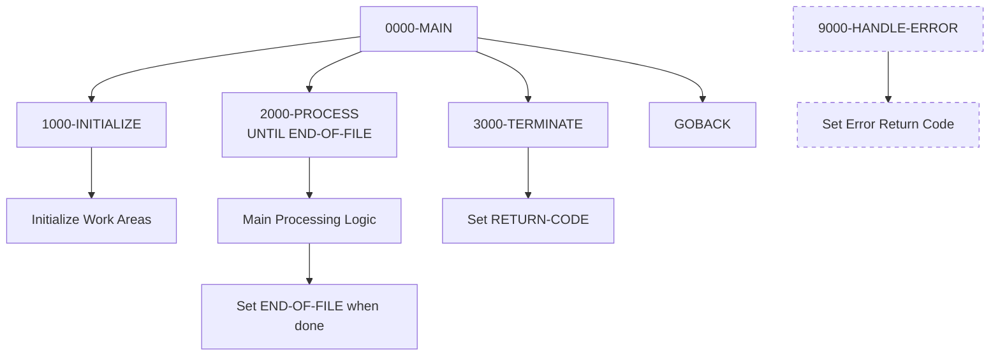
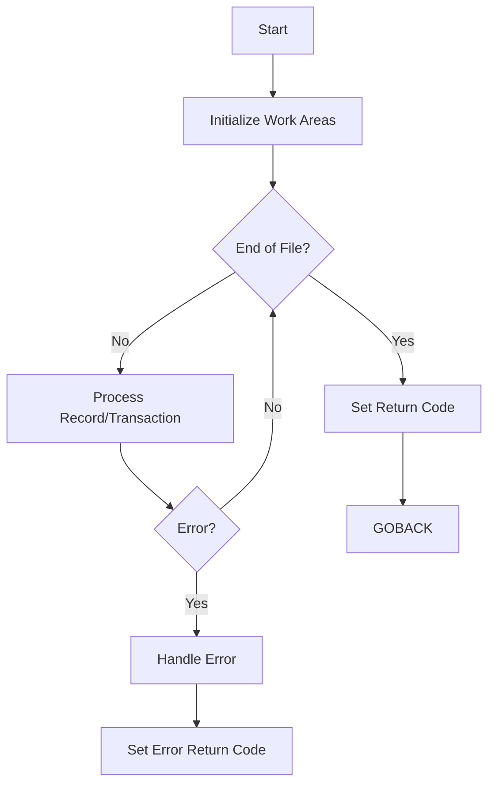

## Overview

PROGNAME is a standard COBOL program template that provides a consistent foundation for developing new batch programs. It establishes the recommended program structure, naming conventions, and basic processing patterns used throughout the application.

This template serves as a starting point for developers creating new programs and ensures consistency across the codebase. It includes:
- Standard division structure (Identification, Environment, Data, Procedure)
- Placeholder sections for file definitions
- Basic working storage with constants and switches
- Standard paragraph naming conventions
- Main processing loop pattern
- Error handling framework

When creating a new program, developers should copy this template and customize it for their specific requirements.

## Program Structure



## Data Structures

### Working Storage

#### WS-CONSTANTS

| Level | Name | Picture | Value | Description |
|-------|------|---------|-------|-------------|
| 01 | WS-CONSTANTS | - | - | Program constants group |
| 05 | WS-PROGRAM-NAME | X(8) | 'PROGNAME' | Program identifier |
| 05 | WS-SUCCESS | S9(4) | +0 | Success return code |
| 05 | WS-ERROR | S9(4) | +8 | Error return code |

#### WS-SWITCHES

| Level | Name | Picture | Value | Description |
|-------|------|---------|-------|-------------|
| 01 | WS-SWITCHES | - | - | Processing switches group |
| 05 | WS-END-OF-FILE-SW | X | 'N' | End of file indicator |

**88-Level Conditions:**
- `END-OF-FILE` (Y) - Processing complete
- `NOT-END-OF-FILE` (N) - Continue processing

#### WS-WORK-AREAS

| Level | Name | Picture | Value | Description |
|-------|------|---------|-------|-------------|
| 01 | WS-WORK-AREAS | - | - | Work areas group |
| 05 | WS-RETURN-CODE | S9(4) | +0 | Program return code |

### File Section

The FILE SECTION is a placeholder for file definitions. When implementing a program based on this template, add FD entries for each file the program will access.

### Linkage Section

The LINKAGE SECTION is a placeholder for parameters passed to the program. Add data items here if the program will be called by other programs with parameters.

## Control Flow

### Main Processing Logic

1. **0000-MAIN** - Program entry point
   - Performs initialization
   - Executes main processing loop until END-OF-FILE
   - Performs termination
   - Returns to caller via GOBACK

2. **1000-INITIALIZE** - Setup
   - Initializes WS-WORK-AREAS to default values
   - Add file opens and other initialization here

3. **2000-PROCESS** - Main Processing Loop
   - Contains the main business logic
   - Sets END-OF-FILE to TRUE when processing is complete
   - In the template, immediately sets END-OF-FILE (placeholder)

4. **3000-TERMINATE** - Cleanup
   - Moves WS-RETURN-CODE to RETURN-CODE
   - Add file closes and final processing here

5. **9000-HANDLE-ERROR** - Error Handler
   - Sets WS-RETURN-CODE to WS-ERROR (+8)
   - Called when errors occur during processing

### Processing Flow



## Template Customization Guide

### Step 1: Copy and Rename

1. Copy `standard-program.cbl` to a new file
2. Rename PROGRAM-ID from PROGNAME to your program name
3. Update WS-PROGRAM-NAME constant

### Step 2: Add File Definitions

In FILE-CONTROL, add SELECT statements:

```cobol
SELECT INPUT-FILE
    ASSIGN TO INFILE
    ORGANIZATION IS SEQUENTIAL
    FILE STATUS IS WS-INPUT-STATUS.
```

In FILE SECTION, add FD entries:

```cobol
FD  INPUT-FILE
    RECORDING MODE IS F
    BLOCK CONTAINS 0 RECORDS.
01  INPUT-RECORD    PIC X(80).
```

### Step 3: Expand Working Storage

Add file status variables:

```cobol
01  WS-FILE-STATUS.
    05  WS-INPUT-STATUS    PIC XX.
        88  WS-INPUT-OK    VALUE '00'.
        88  WS-INPUT-EOF   VALUE '10'.
```

Add processing counters and work fields as needed.

### Step 4: Implement Initialization

Expand 1000-INITIALIZE:

```cobol
1000-INITIALIZE.
    INITIALIZE WS-WORK-AREAS
    OPEN INPUT INPUT-FILE
    IF NOT WS-INPUT-OK
        DISPLAY 'Error opening input file: ' WS-INPUT-STATUS
        PERFORM 9000-HANDLE-ERROR
    END-IF
    .
```

### Step 5: Implement Main Processing

Replace the placeholder in 2000-PROCESS:

```cobol
2000-PROCESS.
    READ INPUT-FILE
        AT END
            SET END-OF-FILE TO TRUE
        NOT AT END
            PERFORM 2100-PROCESS-RECORD
    END-READ
    .
```

### Step 6: Implement Termination

Expand 3000-TERMINATE:

```cobol
3000-TERMINATE.
    CLOSE INPUT-FILE
    DISPLAY 'Records processed: ' WS-RECORD-COUNT
    MOVE WS-RETURN-CODE TO RETURN-CODE
    .
```

### Step 7: Enhance Error Handling

Expand 9000-HANDLE-ERROR:

```cobol
9000-HANDLE-ERROR.
    DISPLAY 'Error in ' WS-PROGRAM-NAME
    DISPLAY 'Error details: ' WS-ERROR-MESSAGE
    MOVE WS-ERROR TO WS-RETURN-CODE
    PERFORM 3000-TERMINATE
    GOBACK
    .
```

## Dependencies

### Copybooks

This template does not include any copybooks. Add COPY statements as needed:

```cobol
WORKING-STORAGE SECTION.
    COPY ERRHAND.
    COPY RTNCODE.
```

### Called Programs

This template does not call any external programs. Add CALL statements as needed:

```cobol
CALL 'ERRPROC' USING WS-ERROR-REQUEST
```

## Technical Notes

### COBOL Concepts Used

- **PERFORM UNTIL**: The main loop `PERFORM 2000-PROCESS UNTIL END-OF-FILE` continues until the END-OF-FILE condition is true.

- **88-Level Conditions**: The template uses condition names for clear, readable code. `SET END-OF-FILE TO TRUE` is more readable than `MOVE 'Y' TO WS-END-OF-FILE-SW`.

- **INITIALIZE Statement**: `INITIALIZE WS-WORK-AREAS` sets all numeric fields to zero and alphanumeric fields to spaces.

- **GOBACK Statement**: Returns control to the calling program or operating system. Preferred over STOP RUN for programs that may be called as subroutines.

- **RETURN-CODE Special Register**: The system return code passed back to the operating system or calling program. Set via `MOVE WS-RETURN-CODE TO RETURN-CODE`.

### Return Codes

| Code | Constant | Meaning |
|------|----------|---------|
| 0 | WS-SUCCESS | Successful completion |
| 8 | WS-ERROR | Error occurred |

Additional return codes can be defined as needed:

```cobol
05  WS-WARNING        PIC S9(4) VALUE +4.
05  WS-SEVERE         PIC S9(4) VALUE +12.
05  WS-CRITICAL       PIC S9(4) VALUE +16.
```

### Naming Conventions

The template follows these naming conventions:

| Element | Convention | Example |
|---------|------------|---------|
| Paragraphs | NNNN-DESCRIPTION | 1000-INITIALIZE |
| Working Storage | WS-NAME | WS-RETURN-CODE |
| File Status | WS-FILE-STATUS | WS-INPUT-STATUS |
| Switches | WS-XXX-SW | WS-END-OF-FILE-SW |
| Condition Names | DESCRIPTIVE | END-OF-FILE |

### Paragraph Numbering

| Range | Purpose |
|-------|---------|
| 0000-0999 | Main control |
| 1000-1999 | Initialization |
| 2000-2999 | Main processing |
| 3000-3999 | Termination |
| 9000-9999 | Error handling |

## Related Templates

Other templates in the templates directory:

- **file-handling.cbl** - Template for file processing programs
- **db2-handling.cbl** - Template for DB2 database programs
- **error-handling.cbl** - Error handling patterns and routines

## JCL Template

```jcl
//PROGNAME EXEC PGM=PROGNAME
//STEPLIB  DD DSN=your.load.library,DISP=SHR
//*
//* Add DD statements for files here:
//* //INFILE   DD DSN=your.input.file,DISP=SHR
//* //OUTFILE  DD DSN=your.output.file,DISP=(NEW,CATLG,DELETE),
//*              DCB=(RECFM=FB,LRECL=80,BLKSIZE=0)
//*
//SYSOUT   DD SYSOUT=*
```
