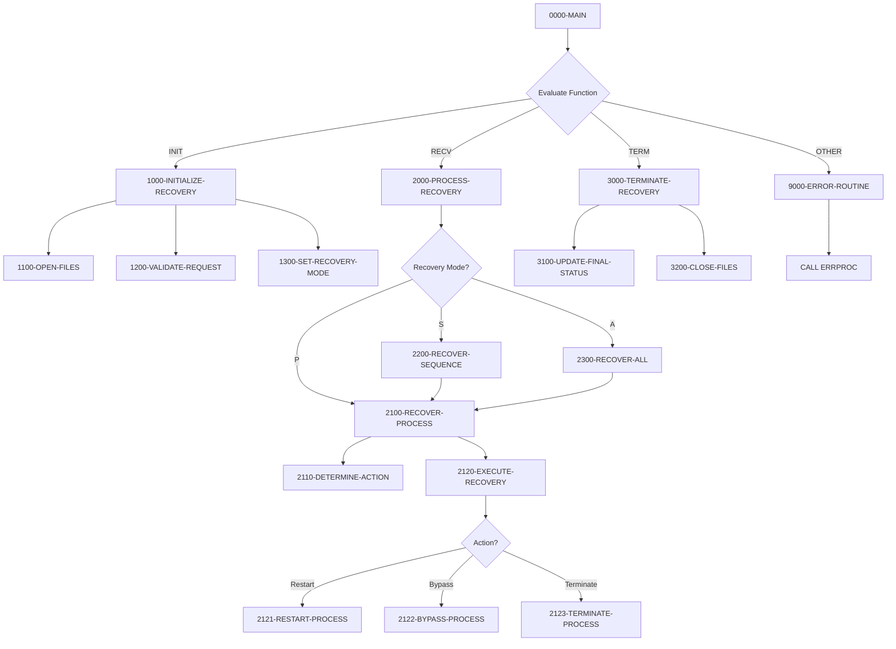

## Overview

RCVPRC00 is a batch process recovery handler that provides automated recovery capabilities for failed or interrupted batch processes. It operates as a callable subprogram, receiving recovery requests through its linkage section and executing appropriate recovery actions based on process definitions and current state.

The program supports three recovery scopes: recovering a single process, recovering all processes for a specific date, or recovering all processes in the system. For each failed process, it determines the appropriate recovery action (restart, bypass, or terminate) based on the process definition and the number of previous restart attempts.

This utility is essential for maintaining batch processing continuity by providing a standardized mechanism to handle process failures and resume normal operations without manual intervention.

## Program Structure



## Data Structures

### Linkage Section (Input/Output Parameters)

The program receives a recovery request structure through the linkage section:

| Level | Name | Picture | Description |
|-------|------|---------|-------------|
| 01 | LS-RECOVERY-REQUEST | - | Main request structure |
| 05 | LS-FUNCTION | X(4) | Function code: `INIT`, `RECV`, `TERM` |
| 05 | LS-PROCESS-DATE | X(8) | Processing date (YYYYMMDD format) |
| 05 | LS-PROCESS-ID | X(8) | Process identifier (for single process recovery) |
| 05 | LS-RECOVERY-TYPE | X(1) | Recovery scope: `P`, `S`, or `A` |
| 05 | LS-RECOVERY-PARM | X(50) | Additional recovery parameters |
| 05 | LS-RETURN-CODE | S9(4) COMP | Return code from operation |

### Recovery Type Values

| Value | Description |
|-------|-------------|
| `P` | Process - Recover a single specified process |
| `S` | Sequence - Recover all processes for a specific date |
| `A` | All - Recover all processes in the control file |

### Working Storage

| Level | Name | Picture | Description |
|-------|------|---------|-------------|
| 05 | WS-BCT-STATUS | X(2) | Batch control file status code |
| 05 | WS-PSR-STATUS | X(2) | Process sequence file status code |
| 05 | WS-CURRENT-TIME | X(26) | Current timestamp for restart tracking |
| 05 | WS-RECOVERY-MODE | X(1) | Current recovery mode (`P`/`S`/`A`) |
| 05 | WS-RECOVERY-ACTION | X(1) | Determined action (`R`/`B`/`T`) |

#### Recovery Action Values (88-level conditions)

| Condition | Value | Description |
|-----------|-------|-------------|
| WS-ACTION-RESTART | `R` | Restart the process |
| WS-ACTION-BYPASS | `B` | Bypass/skip the process |
| WS-ACTION-TERMINATE | `T` | Terminate the process |

## File I/O

### BATCH-CONTROL-FILE

An indexed VSAM file that stores batch control records for job management.

| Property | Value |
|----------|-------|
| Logical Name | BATCH-CONTROL-FILE |
| DD Name | BCHCTL |
| Organization | INDEXED |
| Access Mode | DYNAMIC |
| Open Mode | I-O (Input-Output) |
| Record Key | BCT-KEY |
| File Status | WS-BCT-STATUS |

**Operations:**
- READ (random by key)
- READ NEXT (sequential after START)
- START (position for sequential reading)
- REWRITE (update existing records)

### PROCESS-SEQ-FILE

An indexed VSAM file containing process sequence definitions.

| Property | Value |
|----------|-------|
| Logical Name | PROCESS-SEQ-FILE |
| DD Name | PRCSEQ |
| Organization | INDEXED |
| Access Mode | DYNAMIC |
| Open Mode | INPUT |
| Record Key | PSR-KEY |
| File Status | WS-PSR-STATUS |

**Operations:**
- READ (random by key to get process definitions)

## Control Flow

### Main Routing (0000-MAIN)

The program uses an `EVALUATE TRUE` statement to dispatch requests based on the function code:

1. **FUNC-INIT** → Initialize recovery environment
2. **FUNC-RECV** → Execute recovery operations
3. **FUNC-TERM** → Finalize and terminate
4. **Other** → Error handling for invalid function codes

### Initialize Recovery (1000-INITIALIZE-RECOVERY)

Prepares the recovery environment:
1. **1100-OPEN-FILES**: Opens control file for I-O and sequence file for INPUT
2. **1200-VALIDATE-REQUEST**: Validates that process date is provided and recovery type is valid (`P`, `S`, or `A`)
3. **1300-SET-RECOVERY-MODE**: Sets the recovery mode and validates that process ID is provided for single process recovery

### Process Recovery (2000-PROCESS-RECOVERY)

Routes to the appropriate recovery handler based on mode:

#### Single Process Recovery (2100-RECOVER-PROCESS)

1. Builds the key from process ID and date
2. Reads the batch control record
3. Calls **2110-DETERMINE-ACTION** to decide recovery action
4. Calls **2120-EXECUTE-RECOVERY** to perform the action

#### Determine Action Logic (2110-DETERMINE-ACTION)

The action is determined based on process configuration:

```
IF process is restartable (PSR-RESTARTABLE = 'Y')
    Action = RESTART
ELSE IF restart count > maximum restarts allowed
    Action = TERMINATE
ELSE
    Action = BYPASS
```

#### Execute Recovery (2120-EXECUTE-RECOVERY)

Performs the determined action:

| Action | Paragraph | Status Set | Return Code |
|--------|-----------|------------|-------------|
| Restart | 2121-RESTART-PROCESS | READY | (unchanged) |
| Bypass | 2122-BYPASS-PROCESS | DONE | WARNING (4) |
| Terminate | 2123-TERMINATE-PROCESS | ERROR | ERROR (8) |

**Restart Process (2121):**
- Sets status to READY for re-execution
- Increments restart count
- Records attempt timestamp

**Bypass Process (2122):**
- Sets status to DONE (completed)
- Sets return code to WARNING
- Records bypass reason in error description

**Terminate Process (2123):**
- Sets status to ERROR
- Sets return code to ERROR
- Records termination reason in error description

#### Sequence Recovery (2200-RECOVER-SEQUENCE)

Recovers all processes for a specific date:
1. Positions to the first record for the date using START
2. Reads sequentially through all records
3. For each record matching the process date, calls 2100-RECOVER-PROCESS

#### Full Recovery (2300-RECOVER-ALL)

Recovers all processes in the control file:
1. Positions to the beginning of the file using START with LOW-VALUES
2. Reads sequentially through all records
3. Calls 2100-RECOVER-PROCESS for each record

### Terminate Recovery (3000-TERMINATE-RECOVERY)

Finalizes the recovery operation:
1. **3100-UPDATE-FINAL-STATUS**: Logs completion message (success or with errors)
2. **3200-CLOSE-FILES**: Closes both files and checks for errors

### Error Handling (9000-ERROR-ROUTINE)

Handles errors by:
1. Setting program name to 'RCVPRC00'
2. Setting return code to BCT-RC-ERROR (8)
3. Calling ERRPROC to log the error

## Recovery Decision Matrix

| Restartable? | Restart Count | Action | Result |
|--------------|---------------|--------|--------|
| Yes | Any | RESTART | Process queued for re-execution |
| No | ≤ Max | BYPASS | Process marked complete with warning |
| No | > Max | TERMINATE | Process marked as error |

## Return Codes

| Code | Constant | Description |
|------|----------|-------------|
| 0 | BCT-RC-SUCCESS | Recovery completed successfully |
| 4 | BCT-RC-WARNING | Process bypassed during recovery |
| 8 | BCT-RC-ERROR | Error occurred or process terminated |

## Dependencies

### Copybooks

- **BCHCTL** - Batch control file record definition
- **PRCSEQ** - Process sequence definitions (includes restart configuration)
- **BCHCON** - Batch control constants (status values, return codes)
- **ERRHAND** - Standard error handling definitions

### Called Programs

- **ERRPROC** - Error processing routine for logging and handling errors

### Related Programs

Programs that share the BCHCTL copybook (batch control integration):
- BCHCTL00 - Batch control processor
- HISTLD00 - History load processing
- PRCSEQ00 - Process sequencing
- RPTSTA00 - Status reporting

Programs that share the PRCSEQ copybook:
- PRCSEQ00 - Process sequencing

Programs that share the BCHCON copybook:
- BCHCTL00
- HISTLD00
- PRCSEQ00

## Usage Example

To recover all failed processes for a specific date:

```cobol
* Initialize recovery
MOVE 'INIT'     TO LS-FUNCTION
MOVE '20240115' TO LS-PROCESS-DATE
MOVE 'S'        TO LS-RECOVERY-TYPE
CALL 'RCVPRC00' USING LS-RECOVERY-REQUEST

* Execute recovery
IF LS-RETURN-CODE = 0
    MOVE 'RECV' TO LS-FUNCTION
    CALL 'RCVPRC00' USING LS-RECOVERY-REQUEST
END-IF

* Terminate
MOVE 'TERM' TO LS-FUNCTION
CALL 'RCVPRC00' USING LS-RECOVERY-REQUEST
```

To recover a single process:

```cobol
MOVE 'INIT'     TO LS-FUNCTION
MOVE '20240115' TO LS-PROCESS-DATE
MOVE 'MYJOB001' TO LS-PROCESS-ID
MOVE 'P'        TO LS-RECOVERY-TYPE
CALL 'RCVPRC00' USING LS-RECOVERY-REQUEST
```

## Technical Notes

- The program uses **DYNAMIC** access mode for both files, enabling both random and sequential access
- The **START** statement positions the file for sequential reading without retrieving a record
- **REWRITE** is used to update records in place, requiring the file to be opened for I-O
- The **ACCEPT ... FROM TIME STAMP** retrieves the current system timestamp in ISO format
- File status `'10'` indicates end-of-file condition during sequential reading
- Recovery of sequences and all processes reuses the single process recovery logic for consistency
