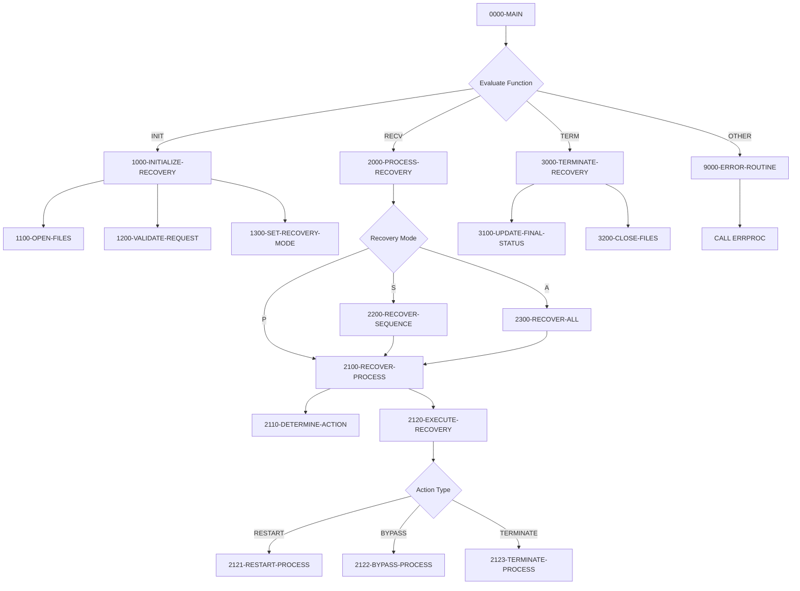
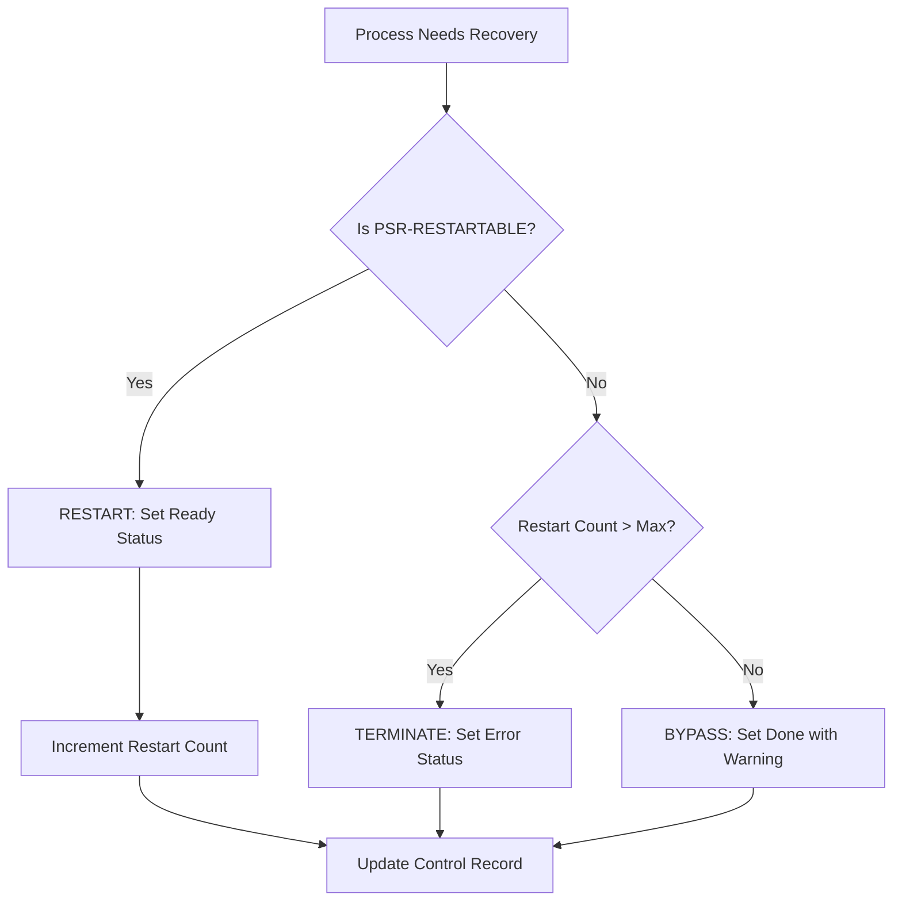

## Overview

RCVPRC00 is a process recovery handler that provides recovery operations for failed or interrupted batch processes. It works in conjunction with the batch control infrastructure (BCHCTL00) to restart, bypass, or terminate processes that did not complete successfully.

The program supports three recovery modes: single process recovery, sequence-based recovery (all processes for a specific date), and full recovery (all processes in the control file). For each process requiring recovery, the program evaluates whether it is restartable based on the process definition, determines the appropriate recovery action, and updates the batch control records accordingly.

Recovery decisions are based on the process definition in the Process Sequence File (PRCSEQ) and the current state in the Batch Control File (BCHCTL). The program considers factors such as whether the process is marked as restartable and whether the maximum restart count has been exceeded.

## Program Structure



## Data Structures

### Working Storage

| Level | Name | Picture | Description |
|-------|------|---------|-------------|
| 01 | WS-FILE-STATUS | - | File status group |
| 05 | WS-BCT-STATUS | X(2) | Batch control file status |
| 05 | WS-PSR-STATUS | X(2) | Process sequence file status |
| 01 | WS-WORK-AREAS | - | Working area group |
| 05 | WS-CURRENT-TIME | X(26) | Current timestamp |
| 05 | WS-RECOVERY-MODE | X(1) | Recovery mode indicator |
| 05 | WS-RECOVERY-ACTION | X(1) | Determined recovery action |

#### WS-RECOVERY-MODE Condition Names

| Condition | Value | Description |
|-----------|-------|-------------|
| WS-RECOVER-PROCESS | 'P' | Recover a single process |
| WS-RECOVER-SEQUENCE | 'S' | Recover all processes for a date |
| WS-RECOVER-ALL | 'A' | Recover all processes |

#### WS-RECOVERY-ACTION Condition Names

| Condition | Value | Description |
|-----------|-------|-------------|
| WS-ACTION-RESTART | 'R' | Restart the process |
| WS-ACTION-BYPASS | 'B' | Bypass the process (mark done with warning) |
| WS-ACTION-TERMINATE | 'T' | Terminate the process (mark as error) |

### Linkage Section

| Level | Name | Picture | Description |
|-------|------|---------|-------------|
| 01 | LS-RECOVERY-REQUEST | - | Recovery request from caller |
| 05 | LS-FUNCTION | X(4) | Function code (INIT/RECV/TERM) |
| 05 | LS-PROCESS-DATE | X(8) | Date of processes to recover |
| 05 | LS-PROCESS-ID | X(8) | Specific process ID (for mode P) |
| 05 | LS-RECOVERY-TYPE | X(1) | Recovery type (P/S/A) |
| 05 | LS-RECOVERY-PARM | X(50) | Additional recovery parameters |
| 05 | LS-RETURN-CODE | S9(4) COMP | Return code from operation |

#### LS-FUNCTION Condition Names

| Condition | Value | Description |
|-----------|-------|-------------|
| FUNC-INIT | 'INIT' | Initialize recovery processing |
| FUNC-RECV | 'RECV' | Execute recovery operations |
| FUNC-TERM | 'TERM' | Terminate recovery processing |

### Process Sequence Record (from PRCSEQ copybook)

| Level | Name | Picture | Description |
|-------|------|---------|-------------|
| 01 | PROCESS-SEQUENCE-RECORD | - | Process definition record |
| 05 | PSR-KEY | - | Composite key |
| 10 | PSR-PROCESS-ID | X(8) | Process identifier |
| 10 | PSR-VERSION | 9(2) | Process version number |
| 10 | PSR-DESCRIPTION | X(30) | Process description |
| 10 | PSR-TYPE | X(3) | Process type (INI/PRC/RPT/TRM) |
| 15 | PSR-FREQ | X(1) | Execution frequency (D/W/M) |
| 15 | PSR-START-TIME | 9(4) | Scheduled start time |
| 15 | PSR-MAX-TIME | 9(4) | Maximum execution time |
| 15 | PSR-DEP-COUNT | 9(2) COMP | Number of dependencies |
| 15 | PSR-DEP-ENTRY | OCCURS 10 | Dependency entries |
| 15 | PSR-PROGRAM | X(8) | Program to execute |
| 15 | PSR-RESTART | X(1) | Restartable flag (Y/N) |
| 10 | PSR-RECOVERY-PGM | X(8) | Custom recovery program |
| 10 | PSR-RECOVERY-PARM | X(50) | Recovery parameters |
| 10 | PSR-ERROR-LIMIT | 9(4) COMP | Error threshold |

#### PSR-TYPE Condition Names

| Condition | Value | Description |
|-----------|-------|-------------|
| PSR-TYPE-INIT | 'INI' | Initialization process |
| PSR-TYPE-PROC | 'PRC' | Main processing |
| PSR-TYPE-RPT | 'RPT' | Report generation |
| PSR-TYPE-TERM | 'TRM' | Termination process |

#### PSR-FREQ Condition Names

| Condition | Value | Description |
|-----------|-------|-------------|
| PSR-DAILY | 'D' | Daily execution |
| PSR-WEEKLY | 'W' | Weekly execution |
| PSR-MONTHLY | 'M' | Monthly execution |

#### PSR-RESTART Condition Names

| Condition | Value | Description |
|-----------|-------|-------------|
| PSR-RESTARTABLE | 'Y' | Process can be restarted |
| PSR-NO-RESTART | 'N' | Process cannot be restarted |

## File I/O

### BATCH-CONTROL-FILE

| Attribute | Value |
|-----------|-------|
| DD Name | BCHCTL |
| Organization | INDEXED (VSAM KSDS) |
| Access Mode | DYNAMIC |
| Record Key | BCT-KEY |
| File Status | WS-BCT-STATUS |
| Open Mode | I-O (Input-Output) |

Operations performed:
- **READ** - Retrieve process control records by key
- **START** - Position for sequential reading
- **READ NEXT** - Sequential reading for sequence/all recovery
- **REWRITE** - Update process status after recovery action

### PROCESS-SEQ-FILE

| Attribute | Value |
|-----------|-------|
| DD Name | PRCSEQ |
| Organization | INDEXED (VSAM KSDS) |
| Access Mode | DYNAMIC |
| Record Key | PSR-KEY |
| File Status | WS-PSR-STATUS |
| Open Mode | INPUT |

Operations performed:
- **READ** - Retrieve process definition to determine restartability

## Control Flow

### Main Processing Logic (0000-MAIN)

The main entry point evaluates the function code and dispatches to the appropriate routine:

1. **INIT** - Initialize recovery environment
2. **RECV** - Execute recovery operations
3. **TERM** - Finalize and close resources
4. **Other** - Handle invalid function codes

### Initialize Recovery (1000-INITIALIZE-RECOVERY)

Prepares the recovery environment:
1. **1100-OPEN-FILES** - Opens both control and sequence files
2. **1200-VALIDATE-REQUEST** - Validates required parameters (process date, recovery type)
3. **1300-SET-RECOVERY-MODE** - Sets internal mode and validates mode-specific requirements

### Process Recovery (2000-PROCESS-RECOVERY)

Dispatches to the appropriate recovery mode:

#### Single Process Recovery (2100-RECOVER-PROCESS)

Recovers a specific process:
1. Reads the batch control record for the specified process
2. **2110-DETERMINE-ACTION** - Reads process definition and determines action:
   - If `PSR-RESTARTABLE` = 'Y' → Restart
   - Else if restart count exceeded → Terminate
   - Else → Bypass
3. **2120-EXECUTE-RECOVERY** - Executes the determined action

#### Sequence Recovery (2200-RECOVER-SEQUENCE)

Recovers all processes for a specific date:
1. Positions at start of records for the given date
2. Reads sequentially through all matching records
3. Calls 2100-RECOVER-PROCESS for each record found

#### Full Recovery (2300-RECOVER-ALL)

Recovers all processes in the control file:
1. Positions at the beginning of the file
2. Reads all records sequentially
3. Calls 2100-RECOVER-PROCESS for each record

### Recovery Actions

#### Restart Process (2121-RESTART-PROCESS)

Prepares a process for re-execution:
- Sets status to 'R' (Ready)
- Increments restart count
- Records attempt timestamp
- Rewrites the control record

#### Bypass Process (2122-BYPASS-PROCESS)

Marks a process as bypassed:
- Sets status to 'D' (Done)
- Sets return code to warning (4)
- Records bypass description
- Rewrites the control record

#### Terminate Process (2123-TERMINATE-PROCESS)

Marks a process as terminated:
- Sets status to 'E' (Error)
- Sets return code to error (8)
- Records termination description
- Rewrites the control record

### Terminate Recovery (3000-TERMINATE-RECOVERY)

Finalizes recovery processing:
1. **3100-UPDATE-FINAL-STATUS** - Logs completion status via ERRPROC
2. **3200-CLOSE-FILES** - Closes all files with error checking

## Recovery Decision Logic



## Dependencies

### Copybooks

- **BCHCTL** - Batch control file record layout (used for control record I/O)
- **PRCSEQ** - Process sequence definitions (used to determine restartability)
- **BCHCON** - Batch control constants (status values, return codes)
- **ERRHAND** - Standard error handling definitions

### Called Programs

- **ERRPROC** - External error processing routine for logging

### Related Programs

- **BCHCTL00** - Batch Control Processor (manages normal batch control operations)
- **PRCSEQ00** - Process Sequencer (likely manages process sequence definitions)

## Usage Example

A typical recovery scenario using RCVPRC00:

```cobol
*  Initialize recovery processing
   MOVE 'INIT' TO LS-FUNCTION
   MOVE '20240115' TO LS-PROCESS-DATE
   MOVE 'P' TO LS-RECOVERY-TYPE
   CALL 'RCVPRC00' USING LS-RECOVERY-REQUEST
   IF LS-RETURN-CODE NOT = ZERO
       DISPLAY 'Recovery initialization failed'
       STOP RUN
   END-IF

*  Recover a specific process
   MOVE 'RECV' TO LS-FUNCTION
   MOVE 'BATCHJOB' TO LS-PROCESS-ID
   CALL 'RCVPRC00' USING LS-RECOVERY-REQUEST
   
*  Terminate recovery
   MOVE 'TERM' TO LS-FUNCTION
   CALL 'RCVPRC00' USING LS-RECOVERY-REQUEST
```

## Technical Notes

- The program uses `ACCEPT ... FROM TIME STAMP` to capture the current timestamp for restart tracking
- File access is DYNAMIC, enabling both keyed and sequential access within the same run
- The START statement with `KEY >` positions for sequential reading after a specific key value
- `LOW-VALUES` is used to position at the beginning of the file for full recovery
- File status '10' indicates end-of-file condition during sequential reads
- Recovery actions are persisted immediately via REWRITE after each decision
- The program validates inputs before processing to ensure data integrity

## Error Handling

All error conditions route through 9000-ERROR-ROUTINE, which:
1. Sets the program name ('RCVPRC00') in the error message
2. Sets return code to BCT-RC-ERROR (8)
3. Calls ERRPROC for centralized error logging

Error conditions detected:
- File open failures (control file, sequence file)
- Missing process date
- Invalid recovery type
- Missing process ID for single-process recovery
- Record not found conditions
- Record update failures
- File close failures
