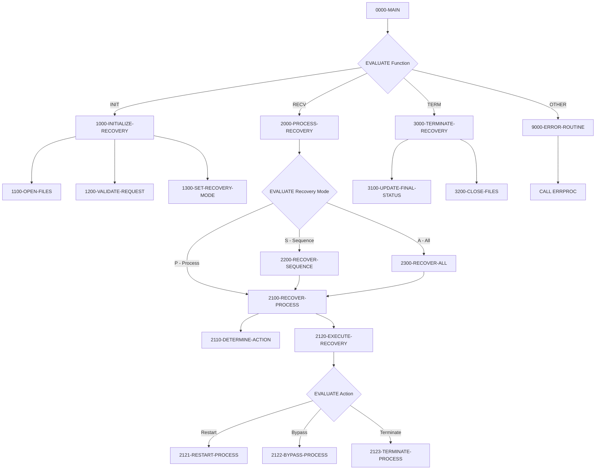
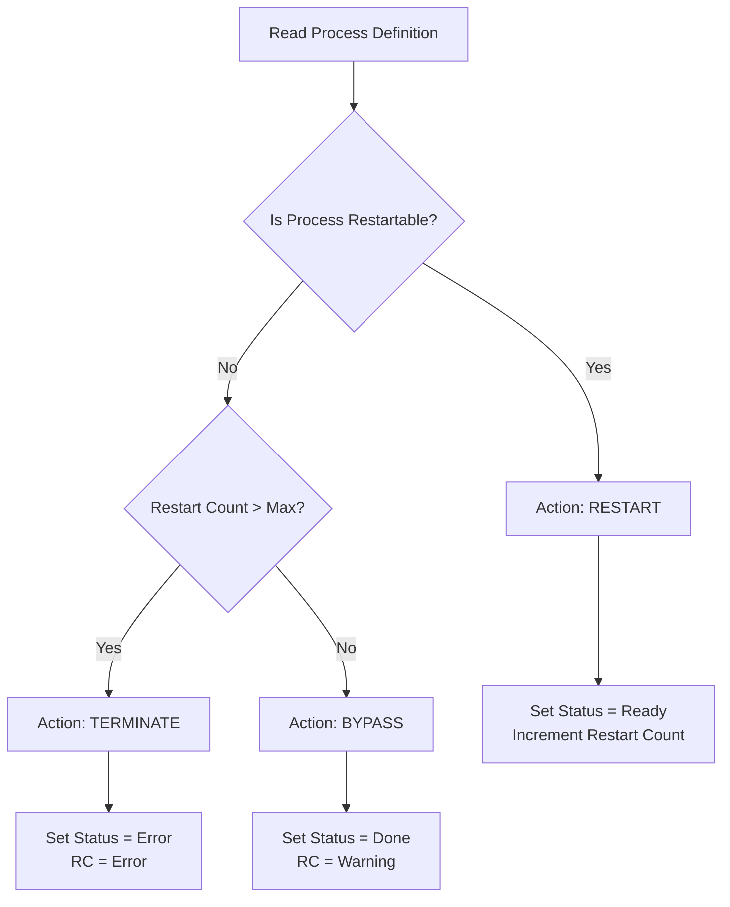

## Overview

RCVPRC00 is a Process Recovery Handler that manages recovery operations for failed or interrupted batch processes. It provides intelligent recovery logic that can restart, bypass, or terminate processes based on their configuration and current state.

The program operates as a callable subprogram that examines both the batch control file (runtime state) and the process sequence file (configuration) to determine the appropriate recovery action. It supports three recovery modes: single process recovery, sequence-based recovery (all processes for a date), and full recovery (all processes in the system).

RCVPRC00 is designed to be invoked by job schedulers or operations staff when batch processing encounters failures. It implements configurable recovery behavior that respects maximum restart limits and process-specific restartability settings defined in the PRCSEQ file.

## Program Structure



## Data Structures

### Linkage Section

The program receives recovery requests via the linkage section:

| Level | Name | Picture | Description |
|-------|------|---------|-------------|
| 01 | LS-RECOVERY-REQUEST | | Recovery request structure |
| 05 | LS-FUNCTION | X(4) | Function code: `INIT`, `RECV`, or `TERM` |
| 05 | LS-PROCESS-DATE | X(8) | Processing date for recovery scope |
| 05 | LS-PROCESS-ID | X(8) | Specific process ID (for mode `P`) |
| 05 | LS-RECOVERY-TYPE | X(1) | Recovery type: `P`=Process, `S`=Sequence, `A`=All |
| 05 | LS-RECOVERY-PARM | X(50) | Additional recovery parameters |
| 05 | LS-RETURN-CODE | S9(4) COMP | Return code from operation |

### Working Storage

| Level | Name | Picture | Description |
|-------|------|---------|-------------|
| 05 | WS-BCT-STATUS | X(2) | File status for BATCH-CONTROL-FILE |
| 05 | WS-PSR-STATUS | X(2) | File status for PROCESS-SEQ-FILE |
| 05 | WS-CURRENT-TIME | X(26) | Current timestamp |
| 05 | WS-RECOVERY-MODE | X(1) | Active recovery mode (`P`, `S`, or `A`) |
| 05 | WS-RECOVERY-ACTION | X(1) | Determined action (`R`=Restart, `B`=Bypass, `T`=Terminate) |

### Recovery Mode Values

| Value | Condition Name | Description |
|-------|----------------|-------------|
| `P` | WS-RECOVER-PROCESS | Recover a single specific process |
| `S` | WS-RECOVER-SEQUENCE | Recover all processes for a date |
| `A` | WS-RECOVER-ALL | Recover all processes in system |

### Recovery Action Values

| Value | Condition Name | Description |
|-------|----------------|-------------|
| `R` | WS-ACTION-RESTART | Reset process to Ready status for re-execution |
| `B` | WS-ACTION-BYPASS | Mark process as Done with warning |
| `T` | WS-ACTION-TERMINATE | Mark process as Error and stop |

## File I/O

### BATCH-CONTROL-FILE

| Attribute | Value |
|-----------|-------|
| DD Name | BCHCTL |
| Organization | Indexed (VSAM KSDS) |
| Access Mode | Dynamic |
| Open Mode | I-O (read/update) |
| Record Key | BCT-KEY |
| Copybook | BCHCTL |

Operations:
- **READ** - Retrieve control record by key or sequential
- **REWRITE** - Update process status after recovery action
- **START** - Position for sequential reading by date

### PROCESS-SEQ-FILE

| Attribute | Value |
|-----------|-------|
| DD Name | PRCSEQ |
| Organization | Indexed (VSAM KSDS) |
| Access Mode | Dynamic |
| Open Mode | INPUT (read-only) |
| Record Key | PSR-KEY |
| Copybook | PRCSEQ |

Operations:
- **READ** - Retrieve process definition to check restartability

## Control Flow

### Function: INIT (Initialize Recovery)

1. **1100-OPEN-FILES** - Opens BATCH-CONTROL-FILE for I-O and PROCESS-SEQ-FILE for input
2. **1200-VALIDATE-REQUEST** - Validates that process date is provided and recovery type is valid (`P`, `S`, or `A`)
3. **1300-SET-RECOVERY-MODE** - Sets the working storage recovery mode; validates that process ID is provided for process-level recovery

### Function: RECV (Process Recovery)

The recovery processing branches based on the recovery mode:

#### Mode P - Single Process Recovery (2100-RECOVER-PROCESS)

1. Reads the batch control record for the specified job/date
2. **2110-DETERMINE-ACTION** - Reads process definition from PRCSEQ to check:
   - If `PSR-RESTARTABLE` = 'Y', sets action to Restart
   - If restart count exceeds `BCT-MAX-RESTARTS`, sets action to Terminate
   - Otherwise, sets action to Bypass
3. **2120-EXECUTE-RECOVERY** - Executes the determined action:

| Action | Paragraph | Status | Return Code | Description |
|--------|-----------|--------|-------------|-------------|
| Restart | 2121 | Ready (`R`) | (unchanged) | Increments restart count, updates attempt timestamp |
| Bypass | 2122 | Done (`D`) | Warning (4) | Sets "Process bypassed by recovery" |
| Terminate | 2123 | Error (`E`) | Error (8) | Sets "Process terminated by recovery" |

#### Mode S - Sequence Recovery (2200-RECOVER-SEQUENCE)

1. Positions to start of records for the specified process date using START
2. Reads sequentially through all records matching the date
3. Calls 2100-RECOVER-PROCESS for each matching record
4. Continues until end-of-file (status `10`)

#### Mode A - Full Recovery (2300-RECOVER-ALL)

1. Positions to beginning of BATCH-CONTROL-FILE using LOW-VALUES
2. Reads all records sequentially
3. Calls 2100-RECOVER-PROCESS for each record
4. Continues until end-of-file

### Function: TERM (Terminate Recovery)

1. **3100-UPDATE-FINAL-STATUS** - Logs completion message via ERRPROC (success or with errors based on return code)
2. **3200-CLOSE-FILES** - Closes both files, reports any close errors

### Error Handling

All errors invoke 9000-ERROR-ROUTINE which:
- Sets ERR-PROGRAM to 'RCVPRC00'
- Sets return code to BCT-RC-ERROR (8)
- Calls ERRPROC for centralized error logging

## Recovery Decision Logic



## Dependencies

### Copybooks

- **BCHCTL** - Batch control file record definition with job status, dependencies, and restart statistics
- **PRCSEQ** - Process sequence definitions with restartability settings and dependencies
- **BCHCON** - Batch control constants including status values and return codes
- **ERRHAND** - Standard error handling definitions

### Called Programs

- **ERRPROC** - Error processing routine for centralized error logging

### Related Programs

Programs that share copybooks with RCVPRC00:

| Program | Shared Copybooks | Relationship |
|---------|-----------------|--------------|
| BCHCTL00 | BCHCTL, BCHCON, ERRHAND | Batch control processor - manages process lifecycle |
| PRCSEQ00 | BCHCTL, PRCSEQ, BCHCON, ERRHAND | Process sequencing - orchestrates process execution |
| HISTLD00 | BCHCTL, BCHCON, ERRHAND | History loading - batch data processing |
| RPTSTA00 | BCHCTL, ERRHAND | Status reporting - reports on batch status |

## Usage Example

```cobol
* Initialize recovery handler
MOVE 'INIT' TO LS-FUNCTION
MOVE '20240115' TO LS-PROCESS-DATE
MOVE 'P' TO LS-RECOVERY-TYPE
MOVE 'MYJOB001' TO LS-PROCESS-ID
CALL 'RCVPRC00' USING LS-RECOVERY-REQUEST

* Execute recovery for the specific process
MOVE 'RECV' TO LS-FUNCTION
CALL 'RCVPRC00' USING LS-RECOVERY-REQUEST

* Terminate and close files
MOVE 'TERM' TO LS-FUNCTION
CALL 'RCVPRC00' USING LS-RECOVERY-REQUEST

* Check result
IF LS-RETURN-CODE = ZERO
    DISPLAY 'Recovery completed successfully'
ELSE
    DISPLAY 'Recovery completed with errors: ' LS-RETURN-CODE
END-IF
```

### Recovery Type Examples

**Single Process Recovery:**
```cobol
MOVE 'P' TO LS-RECOVERY-TYPE
MOVE 'TRNVAL00' TO LS-PROCESS-ID
```

**All Processes for a Date:**
```cobol
MOVE 'S' TO LS-RECOVERY-TYPE
MOVE '20240115' TO LS-PROCESS-DATE
```

**Full System Recovery:**
```cobol
MOVE 'A' TO LS-RECOVERY-TYPE
```
