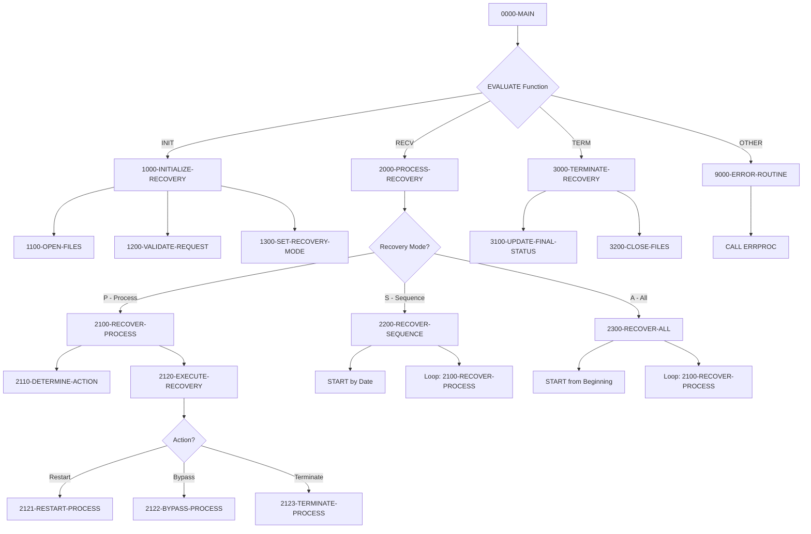
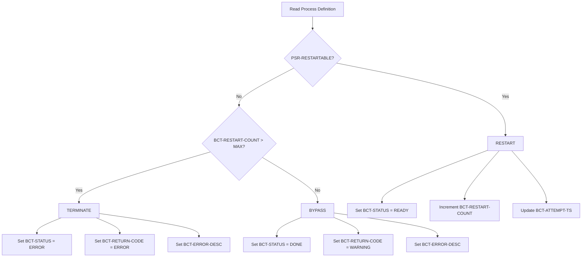

## Overview

RCVPRC00 is a batch process recovery handler that provides automated recovery capabilities for failed or incomplete batch processes. The program can recover individual processes, sequences of processes for a specific date, or all processes in the batch control system.

The recovery handler works with two key files: the BATCH-CONTROL-FILE (which tracks job execution status) and the PROCESS-SEQ-FILE (which defines process characteristics including restartability). Based on the process definition and current state, the program determines the appropriate recovery action: restart the process, bypass it with a warning, or terminate it with an error.

This program is essential for maintaining batch processing integrity after system failures or abends. It integrates with the batch control framework shared by BCHCTL00, HISTLD00, PRCSEQ00, and RPTSTA00, ensuring consistent recovery behavior across the batch environment.

## Program Structure

## Data Structures

### Linkage Section (Recovery Request)

The program receives recovery requests via the linkage section:

| Level | Name | Picture | Description |
|-------|------|---------|-------------|
| 01 | LS-RECOVERY-REQUEST | - | Recovery request parameter block |
| 05 | LS-FUNCTION | X(4) | Function code: INIT, RECV, TERM |
| 05 | LS-PROCESS-DATE | X(8) | Processing date for recovery |
| 05 | LS-PROCESS-ID | X(8) | Specific process ID to recover |
| 05 | LS-RECOVERY-TYPE | X(1) | Recovery type: P=Process, S=Sequence, A=All |
| 05 | LS-RECOVERY-PARM | X(50) | Additional recovery parameters |
| 05 | LS-RETURN-CODE | S9(4) COMP | Return code passed back to caller |

### Working Storage

| Level | Name | Picture | Description |
|-------|------|---------|-------------|
| 05 | WS-BCT-STATUS | X(2) | VSAM file status for control file |
| 05 | WS-PSR-STATUS | X(2) | VSAM file status for sequence file |
| 05 | WS-CURRENT-TIME | X(26) | Current timestamp for audit trail |
| 05 | WS-RECOVERY-MODE | X(1) | Active recovery mode (P/S/A) |
| 05 | WS-RECOVERY-ACTION | X(1) | Determined action (R=Restart, B=Bypass, T=Terminate) |

### Batch Control Record (BCHCTL Copybook)

Key fields used for recovery:

| Level | Name | Picture | Description |
|-------|------|---------|-------------|
| 10 | BCT-JOB-NAME | X(8) | Job identifier |
| 10 | BCT-PROCESS-DATE | X(8) | Processing date |
| 10 | BCT-STATUS | X(1) | Current status (R/A/W/D/E) |
| 10 | BCT-RESTART-COUNT | 9(2) COMP | Number of restart attempts |
| 15 | BCT-RETURN-CODE | S9(4) COMP | Process return code |
| 15 | BCT-ERROR-DESC | X(80) | Error description |
| 10 | BCT-ATTEMPT-TS | X(26) | Last attempt timestamp |

### Process Sequence Record (PRCSEQ Copybook)

Key fields used for recovery decisions:

| Level | Name | Picture | Description |
|-------|------|---------|-------------|
| 10 | PSR-PROCESS-ID | X(8) | Process identifier |
| 15 | PSR-RESTART | X(1) | Restartable flag (Y/N) |
| 15 | PSR-MAX-RC | S9(4) COMP | Maximum acceptable return code |
| 10 | PSR-RECOVERY-PGM | X(8) | Custom recovery program |
| 10 | PSR-RECOVERY-PARM | X(50) | Recovery program parameters |
| 10 | PSR-ERROR-LIMIT | 9(4) COMP | Maximum errors before termination |

## File I/O

### BATCH-CONTROL-FILE

| Attribute | Value |
|-----------|-------|
| Logical Name | BATCH-CONTROL-FILE |
| DD Name | BCHCTL |
| Organization | INDEXED (VSAM KSDS) |
| Access Mode | DYNAMIC |
| Record Key | BCT-KEY |
| Open Mode | I-O (Input-Output) |
| File Status | WS-BCT-STATUS |

Operations: OPEN I-O, READ, START, READ NEXT, REWRITE, CLOSE

### PROCESS-SEQ-FILE

| Attribute | Value |
|-----------|-------|
| Logical Name | PROCESS-SEQ-FILE |
| DD Name | PRCSEQ |
| Organization | INDEXED (VSAM KSDS) |
| Access Mode | DYNAMIC |
| Record Key | PSR-KEY |
| Open Mode | INPUT |
| File Status | WS-PSR-STATUS |

Operations: OPEN INPUT, READ, CLOSE

## Control Flow

### Initialization (FUNC-INIT)

1. **1100-OPEN-FILES**: Opens both VSAM files
   - BATCH-CONTROL-FILE opened for I-O (read and update)
   - PROCESS-SEQ-FILE opened for INPUT only
   - File status checked after each OPEN

2. **1200-VALIDATE-REQUEST**: Validates input parameters
   - Process date is required (cannot be spaces)
   - Recovery type must be 'P', 'S', or 'A'

3. **1300-SET-RECOVERY-MODE**: Sets the working storage mode
   - For process-level recovery ('P'), process ID is required

### Recovery Processing (FUNC-RECV)

The recovery mode determines which processes are recovered:

#### Single Process Recovery (Mode 'P')

**2100-RECOVER-PROCESS**:
1. Builds key from LS-PROCESS-ID and LS-PROCESS-DATE
2. Reads the batch control record
3. Calls 2110-DETERMINE-ACTION to decide recovery strategy
4. Calls 2120-EXECUTE-RECOVERY to perform the action

**2110-DETERMINE-ACTION**:
- Reads process definition from PROCESS-SEQ-FILE
- If `PSR-RESTARTABLE = 'Y'`: action is RESTART
- Else if restart count exceeds maximum: action is TERMINATE
- Else: action is BYPASS

**2120-EXECUTE-RECOVERY** dispatches to:

| Action | Paragraph | Result |
|--------|-----------|--------|
| Restart | 2121-RESTART-PROCESS | Sets status to READY, increments restart count, records timestamp |
| Bypass | 2122-BYPASS-PROCESS | Sets status to DONE with WARNING return code |
| Terminate | 2123-TERMINATE-PROCESS | Sets status to ERROR with ERROR return code |

#### Sequence Recovery (Mode 'S')

**2200-RECOVER-SEQUENCE**:
1. Uses START to position at first record for the given date
2. Reads sequentially through all records matching the date
3. Calls 2100-RECOVER-PROCESS for each matching record
4. Continues until end-of-file (status '10')

#### Full Recovery (Mode 'A')

**2300-RECOVER-ALL**:
1. Uses START from LOW-VALUES (beginning of file)
2. Reads through all records in the file
3. Calls 2100-RECOVER-PROCESS for each record
4. Continues until end-of-file

### Termination (FUNC-TERM)

1. **3100-UPDATE-FINAL-STATUS**: Logs completion message via ERRPROC
2. **3200-CLOSE-FILES**: Closes both files with status checking

## Recovery Action Logic

## Return Codes

| Code | Constant | Description |
|------|----------|-------------|
| 0 | BCT-RC-SUCCESS | Recovery completed successfully |
| 4 | BCT-RC-WARNING | Recovery completed with warnings (bypassed processes) |
| 8 | BCT-RC-ERROR | Recovery failed or processes terminated |

## Dependencies

### Copybooks

- **BCHCTL** - Batch control file record definition
- **PRCSEQ** - Process sequence record definition
- **BCHCON** - Batch control constants (status values, return codes)
- **ERRHAND** - Standard error handling definitions

### Called Programs

- **ERRPROC** - Error processing and logging routine

### Related Programs

Programs that share the batch control framework:

- **BCHCTL00** - Batch control processor (manages the control file)
- **HISTLD00** - History load program
- **PRCSEQ00** - Process sequence manager (manages the sequence file)
- **RPTSTA00** - Status reporting

## Technical Notes

1. **Dynamic File Access**: Both files use DYNAMIC access mode, allowing the program to use both random access (READ with key) and sequential access (START/READ NEXT) as needed for different recovery modes.

2. **START Statement**: The START statement positions the file pointer for subsequent sequential reads. Using `KEY > BCT-KEY` with LOW-VALUES starts at the beginning of the file.

3. **ACCEPT FROM TIME STAMP**: The `ACCEPT WS-CURRENT-TIME FROM TIME STAMP` statement retrieves the current system timestamp in ISO format for audit purposes.

4. **REWRITE Statement**: Updates existing records in place. The INVALID KEY clause handles cases where the record key has changed or record doesn't exist.

5. **Recovery Strategy**: The program implements a conservative recovery approach:
   - Restartable processes are always restarted
   - Non-restartable processes are bypassed (marked complete with warning) unless they've exceeded the retry limit
   - Processes exceeding retry limits are terminated to prevent infinite recovery loops

6. **File Status '10'**: Indicates end-of-file condition, used to control the sequential read loops in sequence and full recovery modes.
