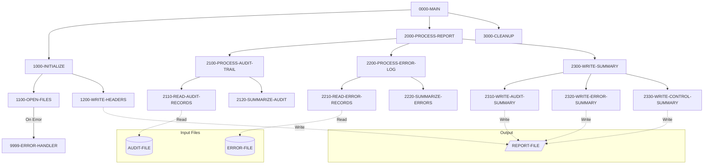

## Overview

RPTAUD00 is a batch audit report generator that produces comprehensive system audit reports. The program consolidates information from multiple sources to create a unified view of system activity, including security audit trails, process audit events, error summaries, and control verification data.

The report is designed to support compliance requirements and operational monitoring by providing a single document that captures all significant system events. It reads from indexed audit and error log files, processes the records, and outputs a formatted 132-character width report suitable for printing or archival.

This program is typically run as part of end-of-day or end-of-period batch processing to generate audit documentation for review by operations staff, auditors, or management.

## Program Structure

## Data Structures

### Working Storage

#### File Status Variables

| Level | Name | Picture | Description |
|-------|------|---------|-------------|
| 01 | WS-FILE-STATUS | - | Group for all file status codes |
| 05 | WS-AUDIT-STATUS | XX | Status for audit file operations |
| 05 | WS-ERROR-STATUS | XX | Status for error file operations |
| 05 | WS-REPORT-STATUS | XX | Status for report file operations |

#### Report Headers

| Level | Name | Picture | Description |
|-------|------|---------|-------------|
| 01 | WS-REPORT-HEADERS | - | Group for report header lines |
| 05 | WS-HEADER1 | X(132) | Border line (asterisks) |
| 05 | WS-HEADER2 | X(132) | Title line: "SYSTEM AUDIT REPORT" |
| 05 | WS-HEADER3 | - | Date line |
| 10 | WS-REPORT-DATE | X(10) | Current date from system |

#### Audit Detail Line

| Level | Name | Picture | Description |
|-------|------|---------|-------------|
| 01 | WS-AUDIT-DETAIL | - | Formatted audit record line |
| 05 | WS-AUD-TIMESTAMP | X(26) | Event timestamp |
| 05 | WS-AUD-PROGRAM | X(8) | Program that generated event |
| 05 | WS-AUD-TYPE | X(10) | Type of audit event |
| 05 | WS-AUD-MESSAGE | X(80) | Audit message text |

#### Error Detail Line

| Level | Name | Picture | Description |
|-------|------|---------|-------------|
| 01 | WS-ERROR-DETAIL | - | Formatted error record line |
| 05 | WS-ERR-TIMESTAMP | X(26) | Error timestamp |
| 05 | WS-ERR-PROGRAM | X(8) | Program that generated error |
| 05 | WS-ERR-CODE | X(4) | Error code |
| 05 | WS-ERR-MESSAGE | X(80) | Error message text |

### File Section

| Level | Name | Picture | Description |
|-------|------|---------|-------------|
| 01 | REPORT-RECORD | X(132) | Output report record |

### Copybook Structures

#### AUDITLOG - Audit Record Structure

| Level | Name | Picture | Description |
|-------|------|---------|-------------|
| 01 | AUDIT-RECORD | - | Complete audit record |
| 05 | AUD-HEADER | - | Header information |
| 10 | AUD-TIMESTAMP | X(26) | Event timestamp |
| 10 | AUD-SYSTEM-ID | X(8) | System identifier |
| 10 | AUD-USER-ID | X(8) | User who performed action |
| 10 | AUD-PROGRAM | X(8) | Program name |
| 10 | AUD-TERMINAL | X(8) | Terminal ID |
| 05 | AUD-TYPE | X(4) | Event type (TRAN/USER/SYST) |
| 05 | AUD-ACTION | X(8) | Action performed |
| 05 | AUD-STATUS | X(4) | Result status (SUCC/FAIL/WARN) |
| 05 | AUD-KEY-INFO | - | Business key information |
| 05 | AUD-BEFORE-IMAGE | X(100) | Data before change |
| 05 | AUD-AFTER-IMAGE | X(100) | Data after change |
| 05 | AUD-MESSAGE | X(100) | Descriptive message |

**Audit Type Values:**
- `TRAN` - Transaction event
- `USER` - User action event
- `SYST` - System event

**Audit Action Values:**
- `CREATE` - Record creation
- `UPDATE` - Record update
- `DELETE` - Record deletion
- `INQUIRE` - Record inquiry
- `LOGIN` - User login
- `LOGOUT` - User logout
- `STARTUP` - System startup
- `SHUTDOWN` - System shutdown

**Audit Status Values:**
- `SUCC` - Successful
- `FAIL` - Failed
- `WARN` - Warning

## File I/O

### Input Files

#### AUDIT-FILE

| Attribute | Value |
|-----------|-------|
| Logical Name | AUDIT-FILE |
| DD Name | AUDITLOG |
| Organization | Indexed |
| Access Mode | Sequential |
| Record Key | AUD-KEY |
| File Status | WS-AUDIT-STATUS |

Contains audit trail records from system operations including transactions, user actions, and system events.

#### ERROR-FILE

| Attribute | Value |
|-----------|-------|
| Logical Name | ERROR-FILE |
| DD Name | ERRLOG |
| Organization | Indexed |
| Access Mode | Sequential |
| Record Key | ERR-KEY |
| File Status | WS-ERROR-STATUS |

Contains error records generated by various system components.

### Output File

#### REPORT-FILE

| Attribute | Value |
|-----------|-------|
| Logical Name | REPORT-FILE |
| DD Name | RPTFILE |
| Organization | Sequential |
| Recording Mode | Fixed (F) |
| Record Length | 132 characters |
| File Status | WS-REPORT-STATUS |

The output report file with fixed-length 132-character records, suitable for standard line printer output.

## Control Flow

### Main Processing Logic

The program follows a standard batch processing pattern with initialization, processing, and cleanup phases:

1. **Initialization (1000-INITIALIZE)**
   - Opens all input and output files
   - Writes report header lines including title and current date
   - Uses `ACCEPT WS-REPORT-DATE FROM DATE` to get the system date

2. **Report Processing (2000-PROCESS-REPORT)**
   - Processes the audit trail by reading audit records and generating summaries
   - Processes the error log by reading error records and generating summaries
   - Writes three summary sections: audit summary, error summary, and control summary

3. **Cleanup (3000-CLEANUP)**
   - Closes all files (AUDIT-FILE, ERROR-FILE, REPORT-FILE)

### Error Handling

The program uses a centralized error handler (9999-ERROR-HANDLER) that:
- Displays the error message
- Sets return code to 12 (severe error)
- Terminates the program with GOBACK

Errors are detected during file open operations by checking file status codes against `'00'` (success).

### Report Sections

The generated report contains multiple sections:

1. **Header Section** - Report title and date
2. **Audit Trail Section** - Detailed audit events
3. **Error Log Section** - Detailed error records
4. **Audit Summary** - Statistical summary of audit activity
5. **Error Summary** - Statistical summary of errors
6. **Control Summary** - Control totals for verification

## Dependencies

### Copybooks

- **AUDITLOG** - Audit trail record definitions including type codes, action codes, and status values
- **ERRHAND** - Standard error handling definitions with categories, return codes, and VSAM status handling
- **RTNCODE** - Return code management structure for tracking processing status

### Called Programs

This program does not call any external programs.

### Related Programs

Programs that share the same copybooks and may generate data consumed by this report:

**Using AUDITLOG:**
- AUDPROC
- PORTTRAN

**Using ERRHAND:**
- BCHCTL00, HISTLD00, PRCSEQ00, RCVPRC00
- RPTPOS00, RPTSTA00
- DB2CMT, DB2CONN, DB2ERR, DB2STAT
- ERRPROC, PORTTEST, PORTTRAN
- TSTGEN00, TSTVAL00
- UTLMNT00, UTLMON00, UTLVAL00

**Using RTNCODE:**
- RPTPOS00, RPTSTA00, RTNCDE00
- TSTGEN00, TSTVAL00
- UTLMNT00, UTLMON00, UTLVAL00

## Technical Notes

### COBOL Concepts Used

- **ACCEPT FROM DATE**: Retrieves the current system date for the report header. The format depends on the system configuration but is typically YYMMDD or YYYYMMDD.

- **File Status Checking**: Each file operation is followed by a check of the two-character file status code. `'00'` indicates success; any other value indicates an error condition.

- **Recording Mode F**: The report file uses fixed-length records (132 characters), which is standard for mainframe print files.

- **BLOCK CONTAINS 0**: Allows the system to determine the optimal block size for the output file.

### Return Codes

| Code | Meaning |
|------|---------|
| 0 | Successful completion |
| 12 | Severe error (file open failure) |

### JCL Considerations

The program expects the following DD statements:
- `AUDITLOG` - Input audit trail file
- `ERRLOG` - Input error log file  
- `RPTFILE` - Output report file (RECFM=F, LRECL=132)
