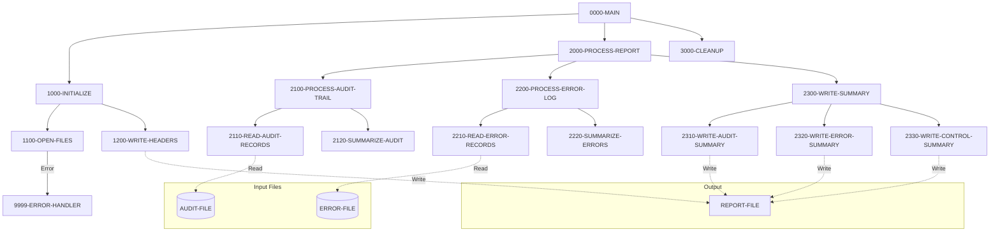

## Overview

RPTAUD00 is a batch report generation program that produces comprehensive system audit reports. The program reads from two indexed VSAM files—the audit trail log and the error log—and generates a formatted report containing security audit information, process audit details, error summaries, and control verification data.

The program serves as a critical component of the system's compliance and operational monitoring infrastructure, enabling administrators and auditors to review system activity, track user actions, identify errors, and verify control processes. The generated report follows a standard 132-character fixed-length record format suitable for printing or archival.

Key features include:
- **Security Audit Trail Processing**: Reads and summarizes audit records capturing user logins, transactions, and system events
- **Error Log Analysis**: Processes error records and generates error summaries by category
- **Control Verification**: Provides control totals and summary statistics for audit purposes

## Program Structure



## Data Structures

### Working Storage

#### File Status Variables

| Level | Name | Picture | Description |
|-------|------|---------|-------------|
| 01 | WS-FILE-STATUS | - | Group for all file status codes |
| 05 | WS-AUDIT-STATUS | XX | Status code for AUDIT-FILE |
| 05 | WS-ERROR-STATUS | XX | Status code for ERROR-FILE |
| 05 | WS-REPORT-STATUS | XX | Status code for REPORT-FILE |

#### Report Header Lines

| Level | Name | Picture | Description |
|-------|------|---------|-------------|
| 01 | WS-REPORT-HEADERS | - | Group for report headers |
| 05 | WS-HEADER1 | X(132) | Border line (asterisks) |
| 05 | WS-HEADER2 | X(132) | Report title "SYSTEM AUDIT REPORT" |
| 05 | WS-HEADER3 | X(132) | Report date line |
| 10 | WS-REPORT-DATE | X(10) | Date value from system |

#### Audit Detail Line

| Level | Name | Picture | Description |
|-------|------|---------|-------------|
| 01 | WS-AUDIT-DETAIL | - | Audit record print line |
| 05 | WS-AUD-TIMESTAMP | X(26) | Timestamp of audit event |
| 05 | WS-AUD-PROGRAM | X(8) | Program that generated the audit |
| 05 | WS-AUD-TYPE | X(10) | Type of audit event |
| 05 | WS-AUD-MESSAGE | X(80) | Audit message text |

#### Error Detail Line

| Level | Name | Picture | Description |
|-------|------|---------|-------------|
| 01 | WS-ERROR-DETAIL | - | Error record print line |
| 05 | WS-ERR-TIMESTAMP | X(26) | Timestamp of error |
| 05 | WS-ERR-PROGRAM | X(8) | Program that generated the error |
| 05 | WS-ERR-CODE | X(4) | Error code |
| 05 | WS-ERR-MESSAGE | X(80) | Error message text |

### File Section (from Copybooks)

#### AUDIT-RECORD (from AUDITLOG copybook)

| Level | Name | Picture | Description |
|-------|------|---------|-------------|
| 01 | AUDIT-RECORD | - | Complete audit trail record |
| 05 | AUD-HEADER | - | Audit record header group |
| 10 | AUD-TIMESTAMP | X(26) | Event timestamp |
| 10 | AUD-SYSTEM-ID | X(8) | System identifier |
| 10 | AUD-USER-ID | X(8) | User who performed action |
| 10 | AUD-PROGRAM | X(8) | Program name |
| 10 | AUD-TERMINAL | X(8) | Terminal ID |
| 05 | AUD-TYPE | X(4) | Audit type code |
| 05 | AUD-ACTION | X(8) | Action performed |
| 05 | AUD-STATUS | X(4) | Result status |
| 05 | AUD-KEY-INFO | - | Key information group |
| 10 | AUD-PORTFOLIO-ID | X(8) | Portfolio identifier |
| 10 | AUD-ACCOUNT-NO | X(10) | Account number |
| 05 | AUD-BEFORE-IMAGE | X(100) | Data before change |
| 05 | AUD-AFTER-IMAGE | X(100) | Data after change |
| 05 | AUD-MESSAGE | X(100) | Audit message |

**Audit Type Values (88-levels):**

| Condition | Value | Description |
|-----------|-------|-------------|
| AUD-TRANSACTION | 'TRAN' | Transaction audit |
| AUD-USER-ACTION | 'USER' | User action audit |
| AUD-SYSTEM-EVENT | 'SYST' | System event audit |

**Audit Action Values (88-levels):**

| Condition | Value | Description |
|-----------|-------|-------------|
| AUD-CREATE | 'CREATE' | Record creation |
| AUD-UPDATE | 'UPDATE' | Record update |
| AUD-DELETE | 'DELETE' | Record deletion |
| AUD-INQUIRE | 'INQUIRE' | Record inquiry |
| AUD-LOGIN | 'LOGIN' | User login |
| AUD-LOGOUT | 'LOGOUT' | User logout |
| AUD-STARTUP | 'STARTUP' | System startup |
| AUD-SHUTDOWN | 'SHUTDOWN' | System shutdown |

#### ERR-MESSAGE (from ERRHAND copybook)

| Level | Name | Picture | Description |
|-------|------|---------|-------------|
| 01 | ERR-MESSAGE | - | Error message structure |
| 05 | ERR-TIMESTAMP | - | Error timestamp group |
| 10 | ERR-DATE | X(10) | Error date |
| 10 | ERR-TIME | X(8) | Error time |
| 05 | ERR-PROGRAM | X(8) | Program name |
| 05 | ERR-CATEGORY | X(2) | Error category code |
| 05 | ERR-CODE | X(4) | Specific error code |
| 05 | ERR-SEVERITY | S9(4) COMP | Severity level |
| 05 | ERR-TEXT | X(80) | Error text |
| 05 | ERR-DETAILS | X(256) | Extended error details |

## File I/O

### Input Files

#### AUDIT-FILE

| Property | Value |
|----------|-------|
| Assign To | AUDITLOG |
| Organization | Indexed (VSAM KSDS) |
| Access Mode | Sequential |
| Record Key | AUD-KEY |
| File Status | WS-AUDIT-STATUS |

The audit file is an indexed VSAM file accessed sequentially to read all audit trail records in key order.

#### ERROR-FILE

| Property | Value |
|----------|-------|
| Assign To | ERRLOG |
| Organization | Indexed (VSAM KSDS) |
| Access Mode | Sequential |
| Record Key | ERR-KEY |
| File Status | WS-ERROR-STATUS |

The error file is an indexed VSAM file accessed sequentially to read all error log records in key order.

### Output File

#### REPORT-FILE

| Property | Value |
|----------|-------|
| Assign To | RPTFILE |
| Organization | Sequential |
| Recording Mode | Fixed (F) |
| Record Length | 132 characters |
| Block Contains | 0 (system-determined) |
| File Status | WS-REPORT-STATUS |

The report file is a sequential file with 132-character fixed-length records, suitable for standard print output.

### I/O Operations Summary

| Paragraph | File | Operation | Mode |
|-----------|------|-----------|------|
| 1100-OPEN-FILES | AUDIT-FILE | OPEN | INPUT |
| 1100-OPEN-FILES | ERROR-FILE | OPEN | INPUT |
| 1100-OPEN-FILES | REPORT-FILE | OPEN | OUTPUT |
| 1200-WRITE-HEADERS | REPORT-FILE | WRITE | FROM WS-HEADER1/2/3 |
| 3000-CLEANUP | AUDIT-FILE | CLOSE | - |
| 3000-CLEANUP | ERROR-FILE | CLOSE | - |
| 3000-CLEANUP | REPORT-FILE | CLOSE | - |

## Control Flow

### Main Processing Flow

1. **0000-MAIN**: Entry point that orchestrates the three major processing phases: initialization, report processing, and cleanup. After all processing completes, the program returns to the calling environment via GOBACK.

2. **1000-INITIALIZE**: Prepares the program for processing by opening all required files and writing the report header lines.

3. **2000-PROCESS-REPORT**: Main processing paragraph that coordinates audit trail processing, error log processing, and summary generation.

4. **3000-CLEANUP**: Closes all open files before program termination.

### Initialization Phase

- **1100-OPEN-FILES**: Opens all three files (AUDIT-FILE for input, ERROR-FILE for input, REPORT-FILE for output). Each file open is validated against file status `'00'`. If any file fails to open, an error message is displayed and the program terminates with return code 12.

- **1200-WRITE-HEADERS**: Accepts the current system date using `ACCEPT FROM DATE` and writes three header lines to the report: a border line of asterisks, the report title, and the report date.

### Report Processing Phase

- **2100-PROCESS-AUDIT-TRAIL**: Coordinates reading audit records (2110-READ-AUDIT-RECORDS) and summarizing the audit data (2120-SUMMARIZE-AUDIT).

- **2200-PROCESS-ERROR-LOG**: Coordinates reading error records (2210-READ-ERROR-RECORDS) and summarizing the error data (2220-SUMMARIZE-ERRORS).

- **2300-WRITE-SUMMARY**: Writes the three summary sections to the report:
  - **2310-WRITE-AUDIT-SUMMARY**: Audit trail summary statistics
  - **2320-WRITE-ERROR-SUMMARY**: Error log summary statistics
  - **2330-WRITE-CONTROL-SUMMARY**: Control totals and verification data

### Error Handling

- **9999-ERROR-HANDLER**: Centralized error handler that displays the error message stored in WS-ERROR-MESSAGE, sets the return code to 12 (severe error), and terminates the program via GOBACK.

## Dependencies

### Copybooks

- [AUDITLOG](/docs/copybooks/AUDITLOG) - Audit trail record definitions with audit types, actions, and status codes
- [ERRHAND](/docs/copybooks/ERRHAND) - Standard error handling definitions including error categories and VSAM status handling
- [RTNCODE](/docs/copybooks/RTNCODE) - Return code management structure for tracking program return codes

### Called Programs

This program does not call any external programs.

### Related Programs

Programs that share copybooks or have caller/callee relationships with this program:
- [AUDPROC](/docs/programs/AUDPROC) - Also uses AUDITLOG copybook (audit processing)
- [PORTTRAN](/docs/programs/PORTTRAN) - Also uses AUDITLOG and ERRHAND copybooks
- [BCHCTL00](/docs/programs/BCHCTL00), [HISTLD00](/docs/programs/HISTLD00), [PRCSEQ00](/docs/programs/PRCSEQ00), [RCVPRC00](/docs/programs/RCVPRC00) - Also use ERRHAND copybook
- [RPTPOS00](/docs/programs/RPTPOS00), [RPTSTA00](/docs/programs/RPTSTA00) - Also use ERRHAND and RTNCODE copybooks (related report programs)

## Return Codes

| Code | Description |
|------|-------------|
| 0 | Successful completion |
| 12 | Severe error (file open failure) |

## Report Format

The generated report follows this structure:

```
************************************************************************...
                                        SYSTEM AUDIT REPORT
REPORT DATE:  YYYY-MM-DD
[Audit Trail Section]
[Error Log Section]
[Audit Summary]
[Error Summary]
[Control Summary]
```

Each section contains detailed records and summary statistics appropriate for audit and compliance review.
