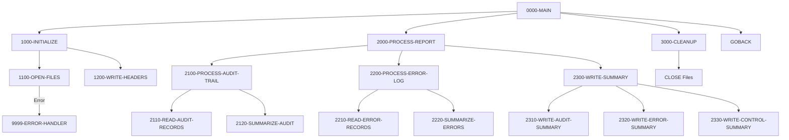

## Overview

RPTAUD00 is a batch report generation program that produces comprehensive audit reports from system audit trails and error logs. The program consolidates information from multiple indexed VSAM files and generates a formatted sequential report file.

The report includes:
- **Security audit trails** - User actions, login/logout events, and access patterns
- **Process audit reporting** - Transaction processing history and system events
- **Error summary reporting** - Consolidated error information across programs
- **Control verification** - Summary statistics for audit compliance

This program is typically run as part of daily or periodic batch processing to provide operations and compliance teams with visibility into system activity and errors.

## Program Structure



## Data Structures

### Working Storage

#### File Status Variables

| Level | Name | Picture | Description |
|-------|------|---------|-------------|
| 01 | WS-FILE-STATUS | - | File status group |
| 05 | WS-AUDIT-STATUS | XX | VSAM status for AUDIT-FILE |
| 05 | WS-ERROR-STATUS | XX | VSAM status for ERROR-FILE |
| 05 | WS-REPORT-STATUS | XX | Status for REPORT-FILE |

#### Report Headers

| Level | Name | Picture | Description |
|-------|------|---------|-------------|
| 01 | WS-REPORT-HEADERS | - | Report header group |
| 05 | WS-HEADER1 | X(132) | Border line (all asterisks) |
| 05 | WS-HEADER2 | X(132) | Title line: "SYSTEM AUDIT REPORT" |
| 05 | WS-HEADER3 | - | Date line |
| 10 | WS-REPORT-DATE | X(10) | Report date from system |

#### Audit Detail Line

| Level | Name | Picture | Description |
|-------|------|---------|-------------|
| 01 | WS-AUDIT-DETAIL | - | Audit record display line |
| 05 | WS-AUD-TIMESTAMP | X(26) | Audit event timestamp |
| 05 | WS-AUD-PROGRAM | X(8) | Source program name |
| 05 | WS-AUD-TYPE | X(10) | Audit type description |
| 05 | WS-AUD-MESSAGE | X(80) | Audit message text |

#### Error Detail Line

| Level | Name | Picture | Description |
|-------|------|---------|-------------|
| 01 | WS-ERROR-DETAIL | - | Error record display line |
| 05 | WS-ERR-TIMESTAMP | X(26) | Error event timestamp |
| 05 | WS-ERR-PROGRAM | X(8) | Source program name |
| 05 | WS-ERR-CODE | X(4) | Error code |
| 05 | WS-ERR-MESSAGE | X(80) | Error message text |

### File Section Records

#### AUDIT-RECORD (from AUDITLOG copybook)

| Level | Name | Picture | Description |
|-------|------|---------|-------------|
| 01 | AUDIT-RECORD | - | Audit trail record |
| 05 | AUD-HEADER | - | Header information |
| 10 | AUD-TIMESTAMP | X(26) | Event timestamp |
| 10 | AUD-SYSTEM-ID | X(8) | System identifier |
| 10 | AUD-USER-ID | X(8) | User identifier |
| 10 | AUD-PROGRAM | X(8) | Program name |
| 10 | AUD-TERMINAL | X(8) | Terminal ID |
| 05 | AUD-TYPE | X(4) | Audit type code |
| 05 | AUD-ACTION | X(8) | Action performed |
| 05 | AUD-STATUS | X(4) | Status code |
| 05 | AUD-KEY-INFO | - | Key information |
| 10 | AUD-PORTFOLIO-ID | X(8) | Portfolio ID |
| 10 | AUD-ACCOUNT-NO | X(10) | Account number |
| 05 | AUD-BEFORE-IMAGE | X(100) | Data before change |
| 05 | AUD-AFTER-IMAGE | X(100) | Data after change |
| 05 | AUD-MESSAGE | X(100) | Additional message |

##### Audit Type Values (AUD-TYPE)

| Value | 88-Level Name | Meaning |
|-------|---------------|---------|
| `'TRAN'` | AUD-TRANSACTION | Transaction event |
| `'USER'` | AUD-USER-ACTION | User-initiated action |
| `'SYST'` | AUD-SYSTEM-EVENT | System event |

##### Audit Action Values (AUD-ACTION)

| Value | 88-Level Name | Meaning |
|-------|---------------|---------|
| `'CREATE'` | AUD-CREATE | Record created |
| `'UPDATE'` | AUD-UPDATE | Record updated |
| `'DELETE'` | AUD-DELETE | Record deleted |
| `'INQUIRE'` | AUD-INQUIRE | Record viewed |
| `'LOGIN'` | AUD-LOGIN | User login |
| `'LOGOUT'` | AUD-LOGOUT | User logout |
| `'STARTUP'` | AUD-STARTUP | System startup |
| `'SHUTDOWN'` | AUD-SHUTDOWN | System shutdown |

##### Audit Status Values (AUD-STATUS)

| Value | 88-Level Name | Meaning |
|-------|---------------|---------|
| `'SUCC'` | AUD-SUCCESS | Successful operation |
| `'FAIL'` | AUD-FAILURE | Failed operation |
| `'WARN'` | AUD-WARNING | Warning issued |

#### ERR-MESSAGE (from ERRHAND copybook)

| Level | Name | Picture | Description |
|-------|------|---------|-------------|
| 01 | ERR-MESSAGE | - | Error message record |
| 05 | ERR-TIMESTAMP | - | Timestamp group |
| 10 | ERR-DATE | X(10) | Error date |
| 10 | ERR-TIME | X(8) | Error time |
| 05 | ERR-PROGRAM | X(8) | Source program |
| 05 | ERR-CATEGORY | X(2) | Error category |
| 05 | ERR-CODE | X(4) | Error code |
| 05 | ERR-SEVERITY | S9(4) COMP | Severity level |
| 05 | ERR-TEXT | X(80) | Error text |
| 05 | ERR-DETAILS | X(256) | Extended details |

#### REPORT-RECORD

| Level | Name | Picture | Description |
|-------|------|---------|-------------|
| 01 | REPORT-RECORD | X(132) | Output report line (132 columns) |

## File I/O

### Input Files

#### AUDIT-FILE

| Property | Value |
|----------|-------|
| DD Name | AUDITLOG |
| Organization | INDEXED (VSAM KSDS) |
| Access Mode | SEQUENTIAL |
| Record Key | AUD-KEY |
| File Status | WS-AUDIT-STATUS |
| Open Mode | INPUT |

Contains the system audit trail records with user actions, transactions, and system events.

#### ERROR-FILE

| Property | Value |
|----------|-------|
| DD Name | ERRLOG |
| Organization | INDEXED (VSAM KSDS) |
| Access Mode | SEQUENTIAL |
| Record Key | ERR-KEY |
| File Status | WS-ERROR-STATUS |
| Open Mode | INPUT |

Contains error log records captured from various system programs.

### Output Files

#### REPORT-FILE

| Property | Value |
|----------|-------|
| DD Name | RPTFILE |
| Organization | SEQUENTIAL |
| Recording Mode | F (Fixed) |
| Record Length | 132 bytes |
| File Status | WS-REPORT-STATUS |
| Open Mode | OUTPUT |

The generated audit report output file, formatted for 132-column printing.

### File Operations Summary

| Paragraph | File | Operation |
|-----------|------|-----------|
| 1100-OPEN-FILES | AUDIT-FILE | OPEN INPUT |
| 1100-OPEN-FILES | ERROR-FILE | OPEN INPUT |
| 1100-OPEN-FILES | REPORT-FILE | OPEN OUTPUT |
| 1200-WRITE-HEADERS | REPORT-RECORD | WRITE (3 times) |
| 3000-CLEANUP | AUDIT-FILE | CLOSE |
| 3000-CLEANUP | ERROR-FILE | CLOSE |
| 3000-CLEANUP | REPORT-FILE | CLOSE |

## Control Flow

### 0000-MAIN

The main entry point orchestrates the three major processing phases:
1. Initialize - Opens files and writes report headers
2. Process - Reads input files and generates report content
3. Cleanup - Closes all files and returns to caller

### 1000-INITIALIZE

Performs startup activities:
- **1100-OPEN-FILES**: Opens all three files with error checking. If any file fails to open, the program moves an error message and invokes the error handler, which terminates processing with return code 12.
- **1200-WRITE-HEADERS**: Accepts the current date from the system and writes the three report header lines.

### 2000-PROCESS-REPORT

The main processing paragraph that generates the report body:
- **2100-PROCESS-AUDIT-TRAIL**: Processes the audit file
  - **2110-READ-AUDIT-RECORDS**: Reads and processes audit records
  - **2120-SUMMARIZE-AUDIT**: Summarizes audit activity
- **2200-PROCESS-ERROR-LOG**: Processes the error file
  - **2210-READ-ERROR-RECORDS**: Reads and processes error records
  - **2220-SUMMARIZE-ERRORS**: Summarizes error activity
- **2300-WRITE-SUMMARY**: Writes summary sections
  - **2310-WRITE-AUDIT-SUMMARY**: Writes audit summary
  - **2320-WRITE-ERROR-SUMMARY**: Writes error summary
  - **2330-WRITE-CONTROL-SUMMARY**: Writes control totals

### 3000-CLEANUP

Closes all three files in a single CLOSE statement.

### 9999-ERROR-HANDLER

Error handling routine that:
1. Displays the error message
2. Sets RETURN-CODE to 12 (severe error)
3. Terminates the program via GOBACK

## Report Format

The output report has a 132-character fixed-length record format suitable for mainframe printing:

```
************************************************************...
                    SYSTEM AUDIT REPORT
REPORT DATE: YYYY-MM-DD
...
[Audit Trail Detail Section]
...
[Error Log Detail Section]
...
[Audit Summary Section]
[Error Summary Section]
[Control Summary Section]
```

## Dependencies

### Copybooks

- **AUDITLOG** - Audit trail record structure with audit types, actions, and status codes
- **ERRHAND** - Error handling definitions including categories, return codes, and message structures
- **RTNCODE** - Return code management structure for program status tracking

### Called Programs

None - this is a standalone batch report program.

### Related Programs

Programs that write to the audit log (AUDITLOG) or error log (ERRLOG) are data sources for this report. Any program using the AUDITLOG or ERRHAND copybooks to log events will have its data included in reports generated by RPTAUD00.

## JCL Requirements

Sample JCL for executing RPTAUD00:

```jcl
//RPTAUD00 EXEC PGM=RPTAUD00
//STEPLIB  DD DSN=your.loadlib,DISP=SHR
//AUDITLOG DD DSN=your.audit.vsam.file,DISP=SHR
//ERRLOG   DD DSN=your.error.vsam.file,DISP=SHR
//RPTFILE  DD DSN=your.report.output,
//            DISP=(NEW,CATLG,DELETE),
//            DCB=(RECFM=FB,LRECL=132,BLKSIZE=0),
//            SPACE=(TRK,(10,5),RLSE)
//SYSOUT   DD SYSOUT=*
```

## Technical Notes

### COBOL Constructs Used

- **ACCEPT FROM DATE**: Retrieves the current system date in YYMMDD format and stores it in WS-REPORT-DATE.

- **WRITE FROM**: Writes a record to the file using data from a working storage variable rather than the file's record area directly.

- **Multiple CLOSE**: COBOL allows closing multiple files in a single CLOSE statement by listing them sequentially.

- **RECORDING MODE IS F**: Specifies fixed-length records in the file description.

- **Sequential Access on Indexed File**: Although the AUDIT-FILE and ERROR-FILE are indexed (VSAM KSDS), they are opened with sequential access mode for reading all records in key order.

### Return Codes

| Code | Meaning |
|------|---------|
| 0 | Successful completion |
| 12 | Severe error (file open failure) |
