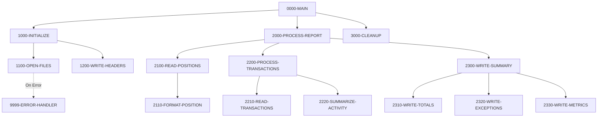

## Overview

RPTPOS00 is a batch reporting program that generates the daily position report for the portfolio management system. This report provides a comprehensive view of portfolio holdings, including position summaries, transaction activity, exceptions, and performance metrics.

The program reads from two VSAM indexed files—the Position Master and Transaction History—and produces a formatted sequential report file. It processes all positions sequentially, calculates percentage changes in value, and summarizes transaction activity for the reporting period.

Key report sections include:
- **Portfolio Position Summary** - Current holdings with quantities, values, and daily change percentages
- **Transaction Activity** - Summary of buys, sells, transfers, and fees
- **Exception Reporting** - Positions or transactions requiring attention
- **Performance Metrics** - Portfolio performance calculations

## Program Structure



## Data Structures

### Working Storage

| Level | Name | Picture | Description |
|-------|------|---------|-------------|
| 01 | WS-FILE-STATUS | | File status codes group |
| 05 | WS-POSITION-STATUS | XX | Position Master file status |
| 05 | WS-TRAN-STATUS | XX | Transaction History file status |
| 05 | WS-REPORT-STATUS | XX | Report output file status |

### Report Headers

| Level | Name | Picture | Description |
|-------|------|---------|-------------|
| 01 | WS-REPORT-HEADERS | | Report header lines group |
| 05 | WS-HEADER1 | X(132) | Separator line (asterisks) |
| 05 | WS-HEADER2 | X(132) | Report title line |
| 05 | WS-HEADER3 | X(132) | Report date line |
| 10 | WS-REPORT-DATE | X(10) | Current report date |

### Position Detail Line

| Level | Name | Picture | Description |
|-------|------|---------|-------------|
| 01 | WS-POSITION-DETAIL | | Formatted position output line |
| 05 | WS-POS-PORTFOLIO | X(10) | Portfolio identifier |
| 05 | WS-POS-DESCRIPTION | X(30) | Position description |
| 05 | WS-POS-QUANTITY | ZZZ,ZZZ,ZZ9.99 | Formatted quantity |
| 05 | WS-POS-VALUE | $$$$,$$$,$$9.99 | Formatted current value |
| 05 | WS-POS-CHANGE-PCT | +ZZ9.99 | Daily percentage change |

### Position Master Record (POSREC Copybook)

| Level | Name | Picture | Description |
|-------|------|---------|-------------|
| 01 | POSITION-RECORD | | Position master record |
| 05 | POS-KEY | | Composite key |
| 10 | POS-PORTFOLIO-ID | X(8) | Portfolio identifier |
| 10 | POS-DATE | X(8) | Position date (YYYYMMDD) |
| 10 | POS-INVESTMENT-ID | X(10) | Investment identifier |
| 05 | POS-DATA | | Position data |
| 10 | POS-QUANTITY | S9(11)V9(4) COMP-3 | Holding quantity |
| 10 | POS-COST-BASIS | S9(13)V9(2) COMP-3 | Total cost basis |
| 10 | POS-MARKET-VALUE | S9(13)V9(2) COMP-3 | Current market value |
| 10 | POS-CURRENCY | X(3) | Currency code |
| 10 | POS-STATUS | X(1) | A=Active, C=Closed, P=Pending |

### Transaction Record (TRNREC Copybook)

| Level | Name | Picture | Description |
|-------|------|---------|-------------|
| 01 | TRANSACTION-RECORD | | Transaction history record |
| 05 | TRN-KEY | | Composite key |
| 10 | TRN-DATE | X(8) | Transaction date (YYYYMMDD) |
| 10 | TRN-TIME | X(6) | Transaction time (HHMMSS) |
| 10 | TRN-PORTFOLIO-ID | X(8) | Portfolio identifier |
| 10 | TRN-SEQUENCE-NO | X(6) | Sequence number |
| 05 | TRN-DATA | | Transaction data |
| 10 | TRN-INVESTMENT-ID | X(10) | Investment identifier |
| 10 | TRN-TYPE | X(2) | BU=Buy, SL=Sell, TR=Transfer, FE=Fee |
| 10 | TRN-QUANTITY | S9(11)V9(4) COMP-3 | Transaction quantity |
| 10 | TRN-PRICE | S9(11)V9(4) COMP-3 | Unit price |
| 10 | TRN-AMOUNT | S9(13)V9(2) COMP-3 | Transaction amount |
| 10 | TRN-STATUS | X(1) | P=Pending, D=Done, F=Failed, R=Reversed |

## File I/O

### File Definitions

| File Name | DD Name | Type | Organization | Access Mode | Record Key |
|-----------|---------|------|--------------|-------------|------------|
| POSITION-MASTER | POSMSTRE | Input | Indexed (VSAM) | Sequential | POS-KEY |
| TRANSACTION-HISTORY | TRANHIST | Input | Indexed (VSAM) | Sequential | TRAN-KEY |
| REPORT-FILE | RPTFILE | Output | Sequential | Sequential | N/A |

### File Operations

| Paragraph | File | Operation | Notes |
|-----------|------|-----------|-------|
| 1100-OPEN-FILES | POSITION-MASTER | OPEN INPUT | Opens for sequential read |
| 1100-OPEN-FILES | TRANSACTION-HISTORY | OPEN INPUT | Opens for sequential read |
| 1100-OPEN-FILES | REPORT-FILE | OPEN OUTPUT | Opens for write |
| 1200-WRITE-HEADERS | REPORT-FILE | WRITE | Writes header lines |
| 2100-READ-POSITIONS | POSITION-MASTER | READ | Sequential read with AT END |
| 2110-FORMAT-POSITION | REPORT-FILE | WRITE | Writes position detail line |
| 3000-CLEANUP | All Files | CLOSE | Closes all files |

## Control Flow

### Initialization Phase (1000-INITIALIZE)

1. **Open Files (1100-OPEN-FILES)**: Opens all three files:
   - POSITION-MASTER for input (sequential read)
   - TRANSACTION-HISTORY for input (sequential read)
   - REPORT-FILE for output
   
   Each file open is validated; any error triggers the error handler with a descriptive message and return code 12.

2. **Write Headers (1200-WRITE-HEADERS)**: 
   - Accepts the current date from the system
   - Writes the three-line report header (separator, title, date)

### Processing Phase (2000-PROCESS-REPORT)

The main processing phase consists of three major sub-functions:

1. **Read Positions (2100-READ-POSITIONS)**:
   - Reads the first position record
   - Loops until END-OF-POSITIONS condition
   - For each position, calls 2110-FORMAT-POSITION
   - Continues reading until end of file

2. **Format Position (2110-FORMAT-POSITION)**:
   - Moves position fields to the detail line structure
   - Calculates the percentage change: `((Current Value - Previous Value) / Previous Value) * 100`
   - Writes the formatted detail line to the report

3. **Process Transactions (2200-PROCESS-TRANSACTIONS)**:
   - Calls 2210-READ-TRANSACTIONS to read transaction data
   - Calls 2220-SUMMARIZE-ACTIVITY to aggregate transaction totals

4. **Write Summary (2300-WRITE-SUMMARY)**:
   - Calls 2310-WRITE-TOTALS to output portfolio totals
   - Calls 2320-WRITE-EXCEPTIONS to report exception conditions
   - Calls 2330-WRITE-METRICS to output performance metrics

### Cleanup Phase (3000-CLEANUP)

Closes all three files (POSITION-MASTER, TRANSACTION-HISTORY, REPORT-FILE) to ensure proper resource release.

### Error Handling (9999-ERROR-HANDLER)

When an error occurs:
1. Displays the error message (WS-ERROR-MESSAGE)
2. Sets RETURN-CODE to 12 (severe error)
3. Terminates the program with GOBACK

## Report Output Format

The report is generated with a fixed record length of 132 characters. The format includes:

```
************************************************************************...
                                        DAILY POSITION REPORT
REPORT DATE: YYYY-MM-DD
PORTFOLIO   DESCRIPTION                    QUANTITY        VALUE      CHANGE%
XXXXXXXX    XXXXXXXXXXXXXXXXXXXXXXXXXXXXXX ZZZ,ZZZ,ZZ9.99 $$$$,$$$,$$9.99 +ZZ9.99
...
[Transaction Summary Section]
[Exception Section]
[Metrics Section]
```

### Numeric Formatting

- **Quantity**: Edited with comma separators and 2 decimal places (`ZZZ,ZZZ,ZZ9.99`)
- **Value**: Currency format with dollar sign and commas (`$$$$,$$$,$$9.99`)
- **Change %**: Signed percentage with explicit sign (`+ZZ9.99`)

## Dependencies

### Copybooks

- **POSREC** - Position record structure for the Position Master file
- **TRNREC** - Transaction record structure for the Transaction History file
- **RTNCODE** - Return code management definitions
- **ERRHAND** - Standard error handling definitions and VSAM status codes

### Called Programs

None - this program does not call external programs.

### Related Programs

Programs that share copybooks with RPTPOS00:
- **INQPORT** - Portfolio inquiry (uses POSREC)
- **PORTTRAN** - Portfolio transactions (uses TRNREC, ERRHAND)
- **UTLVAL00** - Validation utility (uses POSREC, TRNREC, RTNCODE, ERRHAND)
- **RPTAUD00**, **RPTSTA00** - Other report programs (use RTNCODE, ERRHAND)
- **TSTGEN00**, **TSTVAL00** - Test programs (use TRNREC, RTNCODE, ERRHAND)

## Technical Notes

### COMP-3 (Packed Decimal) Fields

The position and transaction files use COMP-3 (packed decimal) format for numeric fields such as POS-QUANTITY, POS-MARKET-VALUE, TRN-AMOUNT, etc. Packed decimal stores two digits per byte plus a sign nibble, providing efficient storage for financial calculations while maintaining decimal precision.

### Edited Picture Clauses

The report uses edited picture clauses for formatted output:
- `Z` suppresses leading zeros
- `,` inserts comma separators (suppressed if in leading zero area)
- `$` is a floating currency symbol
- `+` displays explicit sign (+ or -)

### Percentage Calculation

The daily change percentage is calculated as:
```
((POS-CURRENT-VALUE - POS-PREVIOUS-VALUE) / POS-PREVIOUS-VALUE) * 100
```

Note: The source references POS-CURRENT-VALUE and POS-PREVIOUS-VALUE, but the POSREC copybook defines POS-MARKET-VALUE. This suggests additional fields may be derived or the copybook may have variations.

### Return Codes

| Code | Meaning |
|------|---------|
| 0 | Successful completion |
| 12 | Severe error (file open failure) |
