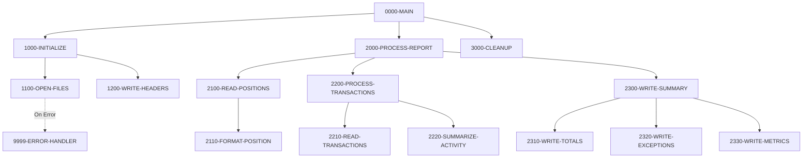

## Overview

RPTPOS00 is a batch COBOL program that generates the daily position report for portfolio management. The program reads position data from the Position Master file and transaction data from the Transaction History file, then produces a comprehensive report that includes portfolio position summaries, transaction activity, exception reporting, and performance metrics.

The report is formatted with a fixed 132-character record length, suitable for standard mainframe print output. Each position line displays the portfolio ID, description, quantity, current market value, and percentage change from the previous value.

This program is typically run as part of end-of-day batch processing to provide portfolio managers and operations staff with a complete view of daily position changes and trading activity.

## Program Structure



## Data Structures

### Working Storage

| Level | Name | Picture | Description |
|-------|------|---------|-------------|
| 01 | WS-FILE-STATUS | - | File status group |
| 05 | WS-POSITION-STATUS | PIC XX | Position master file status |
| 05 | WS-TRAN-STATUS | PIC XX | Transaction history file status |
| 05 | WS-REPORT-STATUS | PIC XX | Report output file status |

### Report Headers

| Level | Name | Picture | Description |
|-------|------|---------|-------------|
| 01 | WS-REPORT-HEADERS | - | Report header lines group |
| 05 | WS-HEADER1 | PIC X(132) | Asterisk border line |
| 05 | WS-HEADER2 | - | Title line "DAILY POSITION REPORT" |
| 05 | WS-HEADER3 | - | Report date line |
| 10 | WS-REPORT-DATE | PIC X(10) | Current date for report |

### Position Detail Line

| Level | Name | Picture | Description |
|-------|------|---------|-------------|
| 01 | WS-POSITION-DETAIL | - | Position detail line layout |
| 05 | WS-POS-PORTFOLIO | PIC X(10) | Portfolio identifier |
| 05 | WS-POS-DESCRIPTION | PIC X(30) | Position description |
| 05 | WS-POS-QUANTITY | PIC ZZZ,ZZZ,ZZ9.99 | Quantity with formatting |
| 05 | WS-POS-VALUE | PIC $$$$,$$$,$$9.99 | Market value with currency symbol |
| 05 | WS-POS-CHANGE-PCT | PIC +ZZ9.99 | Percentage change (signed) |

### File Section

| Level | Name | Picture | Description |
|-------|------|---------|-------------|
| 01 | REPORT-RECORD | PIC X(132) | Fixed-length report output record |

## File I/O

### File Definitions

| Logical Name | Physical Name | Organization | Access Mode | Record Key | Description |
|--------------|---------------|--------------|-------------|------------|-------------|
| POSITION-MASTER | POSMSTRE | Indexed | Sequential | POS-KEY | Input file with portfolio positions |
| TRANSACTION-HISTORY | TRANHIST | Indexed | Sequential | TRAN-KEY | Input file with transaction history |
| REPORT-FILE | RPTFILE | Sequential | Sequential | - | Output report file (132-byte records) |

### File Operations Summary

| File | Operations | Paragraphs |
|------|------------|------------|
| POSITION-MASTER | OPEN INPUT, READ, CLOSE | 1100-OPEN-FILES, 2100-READ-POSITIONS, 3000-CLEANUP |
| TRANSACTION-HISTORY | OPEN INPUT, CLOSE | 1100-OPEN-FILES, 3000-CLEANUP |
| REPORT-FILE | OPEN OUTPUT, WRITE, CLOSE | 1100-OPEN-FILES, 1200-WRITE-HEADERS, 2110-FORMAT-POSITION, 3000-CLEANUP |

## Control Flow

### Initialization Phase (1000-INITIALIZE)

1. **Open Files** (1100-OPEN-FILES): Opens all three files:
   - Position Master for input
   - Transaction History for input
   - Report File for output
   
   Each file open is validated; any error triggers the error handler which displays the error message, sets return code 12, and terminates the program.

2. **Write Headers** (1200-WRITE-HEADERS): 
   - Accepts the current date from the system
   - Writes the three header lines to the report (border, title, date)

### Processing Phase (2000-PROCESS-REPORT)

The main processing consists of three sub-phases:

#### Position Reading (2100-READ-POSITIONS)

Reads all positions from the Position Master file sequentially:
- Initial read to prime the loop
- Continues until END-OF-POSITIONS condition is set
- For each position, performs 2110-FORMAT-POSITION

#### Position Formatting (2110-FORMAT-POSITION)

For each position record:
1. Moves portfolio ID, description, quantity, and current value to the detail line
2. Calculates percentage change: `((Current Value - Previous Value) / Previous Value) * 100`
3. Writes the formatted detail line to the report

#### Transaction Processing (2200-PROCESS-TRANSACTIONS)

1. **Read Transactions** (2210-READ-TRANSACTIONS): Reads transaction records from history
2. **Summarize Activity** (2220-SUMMARIZE-ACTIVITY): Aggregates transaction data

#### Summary Writing (2300-WRITE-SUMMARY)

Produces three summary sections:
1. **Write Totals** (2310-WRITE-TOTALS): Portfolio totals
2. **Write Exceptions** (2320-WRITE-EXCEPTIONS): Exception conditions
3. **Write Metrics** (2330-WRITE-METRICS): Performance metrics

### Cleanup Phase (3000-CLEANUP)

Closes all three files:
- POSITION-MASTER
- TRANSACTION-HISTORY
- REPORT-FILE

### Error Handling (9999-ERROR-HANDLER)

When an error occurs:
1. Displays the error message (from WS-ERROR-MESSAGE)
2. Sets RETURN-CODE to 12 (indicating error)
3. Terminates program execution with GOBACK

## Report Layout

The report uses a 132-character fixed-width format:

```
************************************************************************************...
                                        DAILY POSITION REPORT                       ...
REPORT DATE:  2024-04-09                                                            ...
PORTFOLIO   DESCRIPTION                    QUANTITY        VALUE      CHANGE%       ...
PORTF001    Large Cap Equity Fund       1,234,567.89  $12,345,678.99   +12.34       ...
PORTF002    Fixed Income Bond Fund        987,654.32   $9,876,543.21    -2.15       ...
...
```

### Column Layout

| Column | Width | Field |
|--------|-------|-------|
| 1-10 | 10 | Portfolio ID |
| 11-12 | 2 | Spacing |
| 13-42 | 30 | Description |
| 43-44 | 2 | Spacing |
| 45-58 | 14 | Quantity |
| 59-60 | 2 | Spacing |
| 61-76 | 16 | Market Value |
| 77-78 | 2 | Spacing |
| 79-85 | 7 | Change % |
| 86-132 | 47 | Filler |

## Dependencies

### Copybooks

- **POSREC** - Position record layout (defines POS-KEY, POS-PORTFOLIO-ID, POS-DESCRIPTION, POS-QUANTITY, POS-CURRENT-VALUE, POS-PREVIOUS-VALUE, END-OF-POSITIONS condition)
- **TRNREC** - Transaction record layout (defines TRAN-KEY and transaction fields)
- **RTNCODE** - Return code definitions
- **ERRHAND** - Error handling data structures (defines WS-ERROR-MESSAGE)

### Called Programs

None - this program does not call external programs.

### Related Programs

Programs that share copybooks with RPTPOS00:

| Program | Shared Copybooks | Relationship |
|---------|------------------|--------------|
| INQPORT | POSREC | Portfolio inquiry - uses same position data |
| PORTTRAN | TRNREC, ERRHAND | Portfolio transactions - uses same transaction data |
| UTLVAL00 | POSREC, TRNREC, RTNCODE, ERRHAND | Validation utility |
| RPTAUD00 | RTNCODE, ERRHAND | Audit reporting |
| RPTSTA00 | RTNCODE, ERRHAND | Status reporting |
| TSTGEN00 | TRNREC, RTNCODE, ERRHAND | Test data generation |
| TSTVAL00 | RTNCODE, ERRHAND | Test validation |

## Technical Notes

### Report File Characteristics

- **Recording Mode F**: Fixed-length records
- **Block Contains 0**: System-determined blocking
- **Record Length**: 132 bytes (standard mainframe print width)

### Percentage Change Calculation

The change percentage is calculated as:

```
Change % = ((Current Value - Previous Value) / Previous Value) × 100
```

**Note**: If `POS-PREVIOUS-VALUE` is zero, this calculation will result in a divide-by-zero error. Production implementations should include validation to handle this edge case.

### Return Codes

| Code | Meaning |
|------|---------|
| 0 | Successful completion |
| 12 | Error occurred (file open failure) |

### JCL Considerations

The program expects three DD statements:
- `POSMSTRE` - Position Master indexed file
- `TRANHIST` - Transaction History indexed file  
- `RPTFILE` - Output report (typically SYSOUT or sequential dataset)
