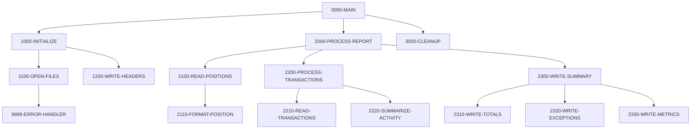

## Overview

RPTPOS00 is a batch COBOL program that generates the Daily Position Report for the portfolio management system. This report provides a comprehensive view of portfolio positions including current values, quantity holdings, and daily change percentages.

The program reads from two VSAM indexed files—the Position Master file and the Transaction History file—and produces a fixed-format sequential report file. The report includes:

- **Portfolio Position Summary**: Lists all positions with portfolio ID, description, quantity, current value, and percentage change
- **Transaction Activity**: Summarizes daily transaction activity
- **Exception Reporting**: Highlights positions or transactions requiring attention
- **Performance Metrics**: Key performance indicators for the reporting period

The program follows a standard batch processing pattern with initialization, processing, and cleanup phases, and includes error handling that sets a return code of 12 for any file operation failures.

## Program Structure



## Data Structures

### Working Storage

| Level | Name | Picture | Description |
|-------|------|---------|-------------|
| 01 | WS-FILE-STATUS | - | File status group |
| 05 | WS-POSITION-STATUS | XX | Position master file status |
| 05 | WS-TRAN-STATUS | XX | Transaction history file status |
| 05 | WS-REPORT-STATUS | XX | Report output file status |

### Report Headers

| Level | Name | Picture | Description |
|-------|------|---------|-------------|
| 01 | WS-REPORT-HEADERS | - | Report header lines group |
| 05 | WS-HEADER1 | X(132) | Border line (all asterisks) |
| 05 | WS-HEADER2 | X(132) | Report title line |
| 05 | WS-HEADER3 | X(132) | Report date line |
| 10 | WS-REPORT-DATE | X(10) | Current date from system |

### Position Detail Line

| Level | Name | Picture | Description |
|-------|------|---------|-------------|
| 01 | WS-POSITION-DETAIL | - | Position detail line group |
| 05 | WS-POS-PORTFOLIO | X(10) | Portfolio identifier |
| 05 | WS-POS-DESCRIPTION | X(30) | Position description |
| 05 | WS-POS-QUANTITY | ZZZ,ZZZ,ZZ9.99 | Formatted quantity with commas |
| 05 | WS-POS-VALUE | $$$$,$$$,$$9.99 | Formatted value with currency symbol |
| 05 | WS-POS-CHANGE-PCT | +ZZ9.99 | Percentage change (signed) |

### Position Record (from POSREC copybook)

| Level | Name | Picture | Description |
|-------|------|---------|-------------|
| 01 | POSITION-RECORD | - | Position master record |
| 05 | POS-KEY | - | Composite key |
| 10 | POS-PORTFOLIO-ID | X(08) | Portfolio identifier |
| 10 | POS-DATE | X(08) | Position date (YYYYMMDD) |
| 10 | POS-INVESTMENT-ID | X(10) | Investment identifier |
| 05 | POS-DATA | - | Position data group |
| 10 | POS-QUANTITY | S9(11)V9(4) COMP-3 | Holding quantity (packed decimal) |
| 10 | POS-COST-BASIS | S9(13)V9(2) COMP-3 | Total cost basis |
| 10 | POS-MARKET-VALUE | S9(13)V9(2) COMP-3 | Current market value |
| 10 | POS-CURRENCY | X(03) | Currency code |
| 10 | POS-STATUS | X(01) | Status: `A`=Active, `C`=Closed, `P`=Pending |

### Transaction Record (from TRNREC copybook)

| Level | Name | Picture | Description |
|-------|------|---------|-------------|
| 01 | TRANSACTION-RECORD | - | Transaction history record |
| 05 | TRN-KEY | - | Composite key |
| 10 | TRN-DATE | X(08) | Transaction date (YYYYMMDD) |
| 10 | TRN-TIME | X(06) | Transaction time (HHMMSS) |
| 10 | TRN-PORTFOLIO-ID | X(08) | Portfolio identifier |
| 10 | TRN-SEQUENCE-NO | X(06) | Sequence number |
| 05 | TRN-DATA | - | Transaction data group |
| 10 | TRN-INVESTMENT-ID | X(10) | Investment identifier |
| 10 | TRN-TYPE | X(02) | Type: `BU`=Buy, `SL`=Sell, `TR`=Transfer, `FE`=Fee |
| 10 | TRN-QUANTITY | S9(11)V9(4) COMP-3 | Transaction quantity |
| 10 | TRN-PRICE | S9(11)V9(4) COMP-3 | Transaction price |
| 10 | TRN-AMOUNT | S9(13)V9(2) COMP-3 | Transaction amount |
| 10 | TRN-STATUS | X(01) | Status: `P`=Pending, `D`=Done, `F`=Failed, `R`=Reversed |

## File I/O

### Input Files

| Logical Name | DD Name | Organization | Access Mode | Record Key | Description |
|--------------|---------|--------------|-------------|------------|-------------|
| POSITION-MASTER | POSMSTRE | Indexed (VSAM KSDS) | Sequential | POS-KEY | Position master file |
| TRANSACTION-HISTORY | TRANHIST | Indexed (VSAM KSDS) | Sequential | TRAN-KEY | Transaction history file |

### Output Files

| Logical Name | DD Name | Organization | Record Length | Description |
|--------------|---------|--------------|---------------|-------------|
| REPORT-FILE | RPTFILE | Sequential | 132 bytes | Daily position report output |

### File Operations Summary

| Paragraph | File | Operation |
|-----------|------|-----------|
| 1100-OPEN-FILES | POSITION-MASTER | OPEN INPUT |
| 1100-OPEN-FILES | TRANSACTION-HISTORY | OPEN INPUT |
| 1100-OPEN-FILES | REPORT-FILE | OPEN OUTPUT |
| 1200-WRITE-HEADERS | REPORT-FILE | WRITE (3 header lines) |
| 2100-READ-POSITIONS | POSITION-MASTER | READ (loop until EOF) |
| 2110-FORMAT-POSITION | REPORT-FILE | WRITE (detail line) |
| 3000-CLEANUP | All files | CLOSE |

## Control Flow

### Initialization (1000-INITIALIZE)

1. **Open Files (1100-OPEN-FILES)**: Opens all three files with appropriate access modes. If any file fails to open, an error message is displayed and the program terminates with return code 12.

2. **Write Headers (1200-WRITE-HEADERS)**: Accepts the current date from the system and writes three header lines to the report:
   - A border line of asterisks
   - The report title "DAILY POSITION REPORT"
   - The report date line

### Report Processing (2000-PROCESS-REPORT)

1. **Read Positions (2100-READ-POSITIONS)**: Reads through all position records sequentially. For each position record read, calls the formatting paragraph to output a detail line. Processing continues until end-of-file is reached on the position master.

2. **Format Position (2110-FORMAT-POSITION)**: For each position:
   - Moves portfolio ID and description to output fields
   - Formats quantity and value with editing characters (commas, currency symbol)
   - Calculates percentage change: `((Current Value - Previous Value) / Previous Value) * 100`
   - Writes the formatted detail line to the report

3. **Process Transactions (2200-PROCESS-TRANSACTIONS)**: 
   - **2210-READ-TRANSACTIONS**: Reads transaction history records
   - **2220-SUMMARIZE-ACTIVITY**: Summarizes transaction activity for the report

4. **Write Summary (2300-WRITE-SUMMARY)**:
   - **2310-WRITE-TOTALS**: Writes portfolio totals
   - **2320-WRITE-EXCEPTIONS**: Writes any exception conditions
   - **2330-WRITE-METRICS**: Writes performance metrics

### Cleanup (3000-CLEANUP)

Closes all three files (POSITION-MASTER, TRANSACTION-HISTORY, REPORT-FILE).

### Error Handling (9999-ERROR-HANDLER)

When an error occurs:
1. Displays the error message (stored in WS-ERROR-MESSAGE from ERRHAND copybook)
2. Sets RETURN-CODE to 12 (severe error)
3. Terminates the program with GOBACK

## Dependencies

### Copybooks

- **POSREC** - Position record structure for the position master file
- **TRNREC** - Transaction record structure for the transaction history file
- **RTNCODE** - Return code management and status definitions
- **ERRHAND** - Standard error handling definitions and error message structures

### Called Programs

This program does not call any external programs.

### Related Programs

Programs that share copybooks with RPTPOS00:

| Program | Shared Copybooks | Relationship |
|---------|------------------|--------------|
| INQPORT | POSREC | Online position inquiry |
| PORTTRAN | TRNREC, ERRHAND | Portfolio transaction processing |
| RPTAUD00 | RTNCODE, ERRHAND | Audit report generation |
| RPTSTA00 | RTNCODE, ERRHAND | Status report generation |
| TSTGEN00 | TRNREC, RTNCODE, ERRHAND | Test data generation |
| TSTVAL00 | RTNCODE, ERRHAND | Test validation |
| UTLVAL00 | POSREC, TRNREC, RTNCODE, ERRHAND | Utility validation program |
| UTLMNT00 | RTNCODE, ERRHAND | Utility maintenance |
| UTLMON00 | RTNCODE, ERRHAND | Utility monitoring |

## Technical Notes

### Report Format

The report uses a fixed 132-character record length, which is a standard mainframe report width. The position detail line layout:

```
Portfolio   Description                    Quantity          Value     Change%
XXXXXXXX    XXXXXXXXXXXXXXXXXXXXXXXXXXXXXX ZZZ,ZZZ,ZZ9.99 $$$$,$$$,$$9.99 +ZZ9.99
```

### Numeric Formatting

The program uses COBOL editing picture clauses for formatted output:
- `ZZZ,ZZZ,ZZ9.99` - Suppresses leading zeros, adds commas for thousands
- `$$$$,$$$,$$9.99` - Floating dollar sign with comma separators
- `+ZZ9.99` - Signed percentage with leading sign

### COMP-3 (Packed Decimal)

The input files use COMP-3 (packed decimal) format for numeric fields. This is an efficient storage format on IBM mainframes where each byte holds two decimal digits, with the last nibble containing the sign.

### Return Codes

| Code | Meaning |
|------|---------|
| 0 | Successful completion |
| 12 | Severe error (file open failure) |
