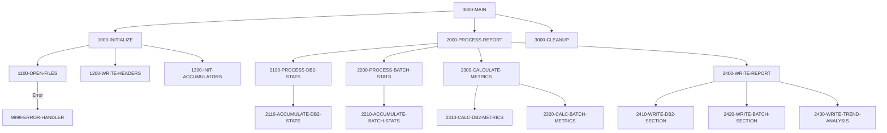

## Overview

RPTSTA00 is a batch COBOL program that generates comprehensive system statistics and performance reports. It consolidates data from two primary sources: DB2 database statistics and batch job execution statistics, then calculates performance metrics and produces a formatted report with trend analysis.

This program is a key component of the system monitoring and reporting infrastructure, providing operations teams and management with visibility into:
- Database call volumes and response times
- Batch job execution success rates
- System resource utilization trends
- Overall system health indicators

The program reads from indexed files containing pre-collected statistics, performs metric calculations, and writes a 132-character fixed-format report suitable for mainframe printing or archival.

## Program Structure



## Data Structures

### Working Storage

#### File Status Indicators

| Level | Name | Picture | Description |
|-------|------|---------|-------------|
| 01 | WS-FILE-STATUS | - | File status group |
| 05 | WS-DB2-STATUS | XX | DB2 stats file status |
| 05 | WS-BCH-STATUS | XX | Batch stats file status |
| 05 | WS-REPORT-STATUS | XX | Report output file status |

#### Report Headers

| Level | Name | Picture | Description |
|-------|------|---------|-------------|
| 01 | WS-REPORT-HEADERS | - | Header lines group |
| 05 | WS-HEADER1 | X(132) | Separator line (asterisks) |
| 05 | WS-HEADER2 | X(132) | Report title line |
| 05 | WS-HEADER3 | - | Date line |
| 10 | WS-REPORT-DATE | X(10) | Report generation date |

#### Performance Metrics

| Level | Name | Picture | Description |
|-------|------|---------|-------------|
| 01 | WS-PERFORMANCE-METRICS | - | Accumulated metrics group |
| 05 | WS-DB2-METRICS | - | DB2 performance data |
| 10 | WS-DB2-CALLS | 9(9) | Total DB2 call count |
| 10 | WS-DB2-ELAPSED | 9(9)V99 | Total elapsed time |
| 10 | WS-DB2-CPU | 9(9)V99 | Total CPU time |
| 10 | WS-DB2-WAIT | 9(9)V99 | Total wait time |
| 05 | WS-BATCH-METRICS | - | Batch job performance data |
| 10 | WS-BATCH-JOBS | 9(9) | Total batch jobs executed |
| 10 | WS-BATCH-SUCCESS | 9(9) | Successful job count |
| 10 | WS-BATCH-FAILED | 9(9) | Failed job count |
| 10 | WS-BATCH-ELAPSED | 9(9)V99 | Total batch elapsed time |

#### Detail Output Lines

| Level | Name | Picture | Description |
|-------|------|---------|-------------|
| 01 | WS-DETAIL-LINES | - | Formatted output lines |
| 05 | WS-DB2-DETAIL | - | DB2 statistics detail line |
| 10 | WS-DB2-CALLS-OUT | ZZZ,ZZZ,ZZ9 | Formatted call count |
| 10 | WS-DB2-AVG-RESP | ZZ,ZZ9.999 | Average response time |
| 05 | WS-BATCH-DETAIL | - | Batch statistics detail line |
| 10 | WS-BATCH-TOTAL | ZZZ,ZZ9 | Formatted job total |
| 10 | WS-SUCCESS-RATE | ZZ9.99 | Success rate percentage |

### File Section

| Level | Name | Picture | Description |
|-------|------|---------|-------------|
| 01 | REPORT-RECORD | X(132) | Output report record |

## File I/O

### File Definitions

| File Name | DD Name | Organization | Access | Key | Description |
|-----------|---------|--------------|--------|-----|-------------|
| DB2-STATS | DB2STATS | Indexed | Sequential | STAT-KEY | DB2 performance statistics |
| BATCH-STATS | BCHSTATS | Indexed | Sequential | BCH-KEY | Batch job execution statistics |
| REPORT-FILE | RPTFILE | Sequential | Sequential | - | Output report file |

### I/O Operations

| Paragraph | File | Operation | Purpose |
|-----------|------|-----------|---------|
| 1100-OPEN-FILES | DB2-STATS | OPEN INPUT | Open for reading statistics |
| 1100-OPEN-FILES | BATCH-STATS | OPEN INPUT | Open for reading statistics |
| 1100-OPEN-FILES | REPORT-FILE | OPEN OUTPUT | Open for writing report |
| 1200-WRITE-HEADERS | REPORT-RECORD | WRITE | Write header lines |
| 2100-PROCESS-DB2-STATS | DB2-STATS | READ | Read DB2 statistics records |
| 2200-PROCESS-BATCH-STATS | BATCH-STATS | READ | Read batch statistics records |
| 3000-CLEANUP | All files | CLOSE | Close all files |

## Control Flow

### Initialization Phase (1000-INITIALIZE)

1. **Open Files (1100-OPEN-FILES)**
   - Opens DB2-STATS and BATCH-STATS files for input
   - Opens REPORT-FILE for output
   - Validates file status for each open; triggers error handler on failure

2. **Write Headers (1200-WRITE-HEADERS)**
   - Accepts current date from system using `ACCEPT FROM DATE`
   - Writes three header lines: separator, title, and date

3. **Initialize Accumulators (1300-INIT-ACCUMULATORS)**
   - Uses `INITIALIZE` to clear all performance metric fields

### Processing Phase (2000-PROCESS-REPORT)

1. **Process DB2 Statistics (2100-PROCESS-DB2-STATS)**
   - Reads DB2-STATS file sequentially using a priming read pattern
   - For each record, calls 2110-ACCUMULATE-DB2-STATS
   - Accumulates call counts, elapsed time, CPU time, and wait time
   - Continues until end-of-file (sets `END-OF-DB2-STATS` condition)

2. **Process Batch Statistics (2200-PROCESS-BATCH-STATS)**
   - Reads BATCH-STATS file sequentially
   - For each record, calls 2210-ACCUMULATE-BATCH-STATS
   - Tracks total jobs, successful jobs, and failed jobs
   - Continues until end-of-file (sets `END-OF-BATCH-STATS` condition)

3. **Calculate Metrics (2300-CALCULATE-METRICS)**
   - **2310-CALC-DB2-METRICS**: Computes average response time from totals
   - **2320-CALC-BATCH-METRICS**: Computes success rate percentage

4. **Write Report (2400-WRITE-REPORT)**
   - **2410-WRITE-DB2-SECTION**: Outputs DB2 statistics section
   - **2420-WRITE-BATCH-SECTION**: Outputs batch statistics section
   - **2430-WRITE-TREND-ANALYSIS**: Outputs trend analysis section

### Cleanup Phase (3000-CLEANUP)

- Closes all three files in a single CLOSE statement
- Control returns to 0000-MAIN which executes GOBACK

### Error Handling (9999-ERROR-HANDLER)

- Displays error message to console/sysout
- Sets RETURN-CODE to 12 (severe error)
- Exits program immediately with GOBACK

## Dependencies

### Copybooks

| Copybook | Location | Description |
|----------|----------|-------------|
| DB2STAT | File Section | DB2 statistics file record definition with STAT-KEY |
| BCHCTL | File Section | Batch control record definition with BCH-KEY |
| RTNCODE | Working-Storage | Return code management structures |
| ERRHAND | Working-Storage | Error handling definitions and messages |

### Called Programs

This program does not call any external programs.

### Related Programs

Programs that share copybooks with RPTSTA00:

**DB2STAT copybook:**
- UTLMON00 - System Monitoring Utility

**BCHCTL copybook:**
- BCHCTL00 - Batch Control Program
- HISTLD00 - Historical Data Loader
- PRCSEQ00 - Sequential Processing Utility
- RCVPRC00 - Recovery Processing

**RTNCODE copybook:**
- RPTAUD00 - Audit Report Generator
- RPTPOS00 - Position Report Generator
- RTNCDE00 - Return Code Handler
- UTLMNT00 - Maintenance Utility
- UTLMON00 - System Monitoring Utility
- UTLVAL00 - Validation Utility

**ERRHAND copybook:**
- Multiple programs across batch, online, and utility categories

## Report Output Format

The generated report is 132 characters wide (standard mainframe print width) with the following sections:

```
********************************************************************************...
                   SYSTEM STATISTICS AND PERFORMANCE REPORT
REPORT DATE: YYYY-MM-DD

--- DB2 STATISTICS SECTION ---
DB2 CALLS:    999,999,999        AVG RESPONSE: 99,999.999

--- BATCH STATISTICS SECTION ---
BATCH JOBS:   999,999            SUCCESS RATE: 999.99%

--- TREND ANALYSIS SECTION ---
[Trend data and analysis]
```

## Technical Notes

### Priming Read Pattern
The program uses a common COBOL idiom called "priming read" where the first READ is performed before entering the processing loop. This ensures the AT END condition is properly checked before attempting to process records.

### File Status Checking
All file operations check the two-character file status field:
- `'00'` indicates successful operation
- Any other value triggers error handling

### 88-Level Conditions
The program uses 88-level condition names (like `END-OF-DB2-STATS` and `END-OF-BATCH-STATS`) for readable end-of-file handling, set via `SET condition-name TO TRUE`.

## JCL Requirements

```jcl
//RPTSTA00 EXEC PGM=RPTSTA00
//STEPLIB  DD  DSN=your.loadlib,DISP=SHR
//DB2STATS DD  DSN=your.db2.stats.file,DISP=SHR
//BCHSTATS DD  DSN=your.batch.stats.file,DISP=SHR
//RPTFILE  DD  DSN=your.report.output,DISP=(NEW,CATLG),
//             DCB=(RECFM=F,LRECL=132,BLKSIZE=0),
//             SPACE=(CYL,(1,1))
//SYSOUT   DD  SYSOUT=*
```

## Return Codes

| Code | Meaning |
|------|---------|
| 0 | Successful completion |
| 12 | Severe error (file open failure or processing error) |
