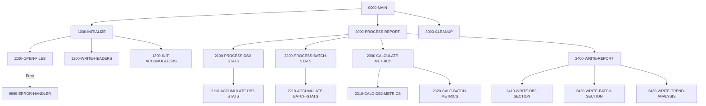

## Overview

RPTSTA00 is a batch COBOL program that generates comprehensive system statistics and performance reports. It collects and consolidates metrics from both DB2 operations and batch job execution, producing formatted reports that include:

- **Processing Statistics**: Record counts, transaction volumes, and throughput metrics
- **Performance Metrics**: CPU time, elapsed time, wait time, and response times
- **Resource Utilization**: DB2 call statistics and batch job execution rates
- **Trend Analysis**: Historical performance patterns and comparative metrics

This program is part of the Investment Portfolio Management System's reporting infrastructure, providing operational visibility into system health and performance.

## Program Structure



## Data Structures

### Working Storage

#### File Status Variables

| Level | Name | Picture | Description |
|-------|------|---------|-------------|
| 01 | WS-FILE-STATUS | - | File status container |
| 05 | WS-DB2-STATUS | XX | DB2 statistics file status |
| 05 | WS-BCH-STATUS | XX | Batch statistics file status |
| 05 | WS-REPORT-STATUS | XX | Report output file status |

#### Performance Metrics Accumulators

| Level | Name | Picture | Description |
|-------|------|---------|-------------|
| 01 | WS-PERFORMANCE-METRICS | - | Metrics accumulator area |
| 05 | WS-DB2-METRICS | - | DB2 performance data |
| 10 | WS-DB2-CALLS | 9(9) | Total DB2 call count |
| 10 | WS-DB2-ELAPSED | 9(9)V99 | Total elapsed time (seconds) |
| 10 | WS-DB2-CPU | 9(9)V99 | Total CPU time (seconds) |
| 10 | WS-DB2-WAIT | 9(9)V99 | Total wait time (seconds) |
| 05 | WS-BATCH-METRICS | - | Batch job metrics |
| 10 | WS-BATCH-JOBS | 9(9) | Total batch job count |
| 10 | WS-BATCH-SUCCESS | 9(9) | Successful job count |
| 10 | WS-BATCH-FAILED | 9(9) | Failed job count |
| 10 | WS-BATCH-ELAPSED | 9(9)V99 | Total batch elapsed time |

#### Report Detail Lines

| Level | Name | Picture | Description |
|-------|------|---------|-------------|
| 05 | WS-DB2-DETAIL | - | DB2 statistics line |
| 10 | WS-DB2-CALLS-OUT | ZZZ,ZZZ,ZZ9 | Formatted call count |
| 10 | WS-DB2-AVG-RESP | ZZ,ZZ9.999 | Average response time (ms) |
| 05 | WS-BATCH-DETAIL | - | Batch statistics line |
| 10 | WS-BATCH-TOTAL | ZZZ,ZZ9 | Total jobs formatted |
| 10 | WS-SUCCESS-RATE | ZZ9.99 | Success rate percentage |

### Report Headers

The program generates a 132-character wide report with formatted headers:

```
****************************************************************************************************
                        SYSTEM STATISTICS AND PERFORMANCE REPORT
REPORT DATE: YYYY-MM-DD
```

## File I/O

### File Definitions

| File Name | DD Name | Organization | Access | Key | Description |
|-----------|---------|--------------|--------|-----|-------------|
| DB2-STATS | DB2STATS | Indexed (VSAM KSDS) | Sequential | STAT-KEY | DB2 statistics records |
| BATCH-STATS | BCHSTATS | Indexed (VSAM KSDS) | Sequential | BCH-KEY | Batch control/statistics records |
| REPORT-FILE | RPTFILE | Sequential | Output | N/A | Fixed 132-byte report output |

### I/O Operations

| Operation | File | Paragraph | Description |
|-----------|------|-----------|-------------|
| OPEN INPUT | DB2-STATS | 1100-OPEN-FILES | Open DB2 stats for reading |
| OPEN INPUT | BATCH-STATS | 1100-OPEN-FILES | Open batch stats for reading |
| OPEN OUTPUT | REPORT-FILE | 1100-OPEN-FILES | Open report file for writing |
| READ | DB2-STATS | 2100-PROCESS-DB2-STATS | Read DB2 statistics records |
| READ | BATCH-STATS | 2200-PROCESS-BATCH-STATS | Read batch control records |
| WRITE | REPORT-RECORD | 1200-WRITE-HEADERS | Write report headers |
| CLOSE | All files | 3000-CLEANUP | Close all files |

## Control Flow

### Main Processing Logic

1. **Initialization Phase** (`1000-INITIALIZE`)
   - Opens all input and output files with status checking
   - Writes report headers with current date
   - Initializes all metric accumulators to zero

2. **Statistics Collection** (`2000-PROCESS-REPORT`)
   - **DB2 Statistics Processing** (`2100-PROCESS-DB2-STATS`): Reads through DB2 statistics file, accumulating call counts, elapsed time, CPU time, and wait time metrics
   - **Batch Statistics Processing** (`2200-PROCESS-BATCH-STATS`): Reads batch control records, counting total jobs, successes, and failures

3. **Metrics Calculation** (`2300-CALCULATE-METRICS`)
   - Calculates average response times from accumulated DB2 metrics
   - Computes batch job success rates as percentages
   - Derives performance trends from historical data

4. **Report Generation** (`2400-WRITE-REPORT`)
   - Writes DB2 performance section with call volumes and response times
   - Writes batch job section with success/failure rates
   - Generates trend analysis comparing current vs historical metrics

5. **Cleanup** (`3000-CLEANUP`)
   - Closes all files

### Error Handling

The program uses a centralized error handler (`9999-ERROR-HANDLER`) that:
- Displays the error message stored in `WS-ERROR-MESSAGE` (from ERRHAND copybook)
- Sets return code to 12 (severe error)
- Terminates program execution with GOBACK

File status codes are checked after each OPEN operation:
- `'00'` = Success
- Any other value triggers error handling

## Dependencies

### Copybooks

| Copybook | Location | Purpose |
|----------|----------|---------|
| DB2STAT | File Section | DB2 statistics record structure |
| BCHCTL | File Section | Batch control record structure |
| RTNCODE | Working-Storage | Return code management definitions |
| ERRHAND | Working-Storage | Standard error handling definitions |

### Related Programs

| Program | Relationship | Description |
|---------|--------------|-------------|
| DB2STAT | Data Source | Collects DB2 statistics used by this report |
| BCHCTL00 | Data Source | Manages batch control records read by this report |
| UTLMON00 | Related | System monitor that also uses DB2STAT copybook |
| RPTAUD00 | Sibling | Audit report generator (shares ERRHAND, RTNCODE) |
| RPTPOS00 | Sibling | Position report generator (shares ERRHAND, RTNCODE) |

### Shared Copybook Usage

The following programs share copybooks with RPTSTA00:

- **BCHCTL**: BCHCTL00, HISTLD00, PRCSEQ00, RCVPRC00
- **RTNCODE**: RPTAUD00, RPTPOS00, RTNCDE00, TSTGEN00, TSTVAL00, UTLMNT00, UTLMON00, UTLVAL00
- **ERRHAND**: Multiple batch, online, and utility programs
- **DB2STAT**: UTLMON00

## Report Output

### Sample Report Structure

```
************************************************************************
                 SYSTEM STATISTICS AND PERFORMANCE REPORT
REPORT DATE: 2024-04-09
************************************************************************

DB2 PERFORMANCE SECTION
-----------------------
DB2 CALLS:     123,456,789    AVG RESPONSE:   12.345 ms
[Additional DB2 metrics...]

BATCH JOB SECTION
-----------------
BATCH JOBS:   1,234    SUCCESS RATE:  98.75%
[Additional batch metrics...]

TREND ANALYSIS
--------------
[Historical comparison data...]
```

### Report Specifications

| Attribute | Value |
|-----------|-------|
| Record Length | 132 bytes |
| Recording Mode | Fixed (F) |
| Block Size | System-determined (0) |

## JCL Requirements

```jcl
//RPTSTA00 EXEC PGM=RPTSTA00
//STEPLIB  DD   DSN=your.load.library,DISP=SHR
//DB2STATS DD   DSN=your.db2.stats.vsam,DISP=SHR
//BCHSTATS DD   DSN=your.batch.stats.vsam,DISP=SHR
//RPTFILE  DD   DSN=your.stats.report,
//             DISP=(NEW,CATLG,DELETE),
//             SPACE=(CYL,(5,2),RLSE),
//             DCB=(RECFM=FB,LRECL=132,BLKSIZE=0)
//SYSOUT   DD   SYSOUT=*
//SYSPRINT DD   SYSOUT=*
```

## Technical Notes

- **VSAM Sequential Access**: Both input files are indexed VSAM files accessed sequentially, allowing efficient full-file scans for statistics collection
- **Numeric Precision**: Elapsed and CPU times use `9(9)V99` format providing up to 999,999,999.99 seconds capacity
- **Edit Patterns**: Output fields use Z-suppression (`ZZZ,ZZ9`) for clean numeric formatting with thousands separators
- **88-Level Conditions**: The program relies on 88-level condition names (e.g., `END-OF-DB2-STATS`, `END-OF-BATCH-STATS`) defined in copybooks for EOF detection
- **Return Codes**: Returns 0 for success, 12 for any error condition
