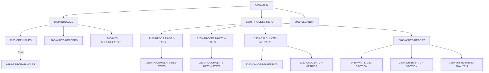

## Overview

RPTSTA00 is a batch report generation program that consolidates system performance data from multiple sources to produce a comprehensive statistics report. The program reads from two indexed input files—DB2 statistics and batch job statistics—and generates a formatted 132-character report file containing performance metrics, processing summaries, and trend analysis.

This program is part of the batch reporting subsystem and provides visibility into system health by tracking:
- **DB2 database operations**: Call counts, response times, CPU usage, and wait times
- **Batch job execution**: Job counts, success/failure rates, and elapsed times
- **Performance trends**: Calculated metrics for capacity planning and optimization

The report is designed for operations staff and system administrators to monitor system performance and identify potential bottlenecks or issues.

## Program Structure



## Data Structures

### Working Storage

#### File Status Variables

| Level | Name | Picture | Description |
|-------|------|---------|-------------|
| 01 | WS-FILE-STATUS | Group | File status codes container |
| 05 | WS-DB2-STATUS | XX | DB2 statistics file status |
| 05 | WS-BCH-STATUS | XX | Batch statistics file status |
| 05 | WS-REPORT-STATUS | XX | Report output file status |

#### Report Headers

| Level | Name | Picture | Description |
|-------|------|---------|-------------|
| 01 | WS-REPORT-HEADERS | Group | Report header lines |
| 05 | WS-HEADER1 | X(132) | Border line (asterisks) |
| 05 | WS-HEADER2 | X(132) | Report title line |
| 05 | WS-HEADER3 | Group | Date line |
| 10 | WS-REPORT-DATE | X(10) | Report generation date |

#### Performance Metrics Accumulators

| Level | Name | Picture | Description |
|-------|------|---------|-------------|
| 01 | WS-PERFORMANCE-METRICS | Group | Accumulated statistics |
| 05 | WS-DB2-METRICS | Group | DB2 performance data |
| 10 | WS-DB2-CALLS | 9(9) | Total DB2 call count |
| 10 | WS-DB2-ELAPSED | 9(9)V99 | Total elapsed time |
| 10 | WS-DB2-CPU | 9(9)V99 | Total CPU time |
| 10 | WS-DB2-WAIT | 9(9)V99 | Total wait time |
| 05 | WS-BATCH-METRICS | Group | Batch processing data |
| 10 | WS-BATCH-JOBS | 9(9) | Total batch jobs processed |
| 10 | WS-BATCH-SUCCESS | 9(9) | Successful job count |
| 10 | WS-BATCH-FAILED | 9(9) | Failed job count |
| 10 | WS-BATCH-ELAPSED | 9(9)V99 | Total batch elapsed time |

#### Detail Output Lines

| Level | Name | Picture | Description |
|-------|------|---------|-------------|
| 01 | WS-DETAIL-LINES | Group | Formatted output lines |
| 05 | WS-DB2-DETAIL | Group | DB2 statistics line |
| 10 | WS-DB2-CALLS-OUT | ZZZ,ZZZ,ZZ9 | Formatted call count |
| 10 | WS-DB2-AVG-RESP | ZZ,ZZ9.999 | Average response time |
| 05 | WS-BATCH-DETAIL | Group | Batch statistics line |
| 10 | WS-BATCH-TOTAL | ZZZ,ZZ9 | Formatted job count |
| 10 | WS-SUCCESS-RATE | ZZ9.99 | Success rate percentage |

### File Section

| Level | Name | Picture | Description |
|-------|------|---------|-------------|
| 01 | REPORT-RECORD | X(132) | Fixed-length report output record |

## File I/O

### File Definitions

| File Name | DD Name | Organization | Access | Key | Description |
|-----------|---------|--------------|--------|-----|-------------|
| DB2-STATS | DB2STATS | Indexed (VSAM KSDS) | Sequential | STAT-KEY | DB2 performance statistics |
| BATCH-STATS | BCHSTATS | Indexed (VSAM KSDS) | Sequential | BCH-KEY | Batch job execution statistics |
| REPORT-FILE | RPTFILE | Sequential | Sequential | N/A | Generated report output |

### I/O Operations

| Paragraph | File | Operation | Description |
|-----------|------|-----------|-------------|
| 1100-OPEN-FILES | DB2-STATS | OPEN INPUT | Open for sequential read |
| 1100-OPEN-FILES | BATCH-STATS | OPEN INPUT | Open for sequential read |
| 1100-OPEN-FILES | REPORT-FILE | OPEN OUTPUT | Open for report writing |
| 1200-WRITE-HEADERS | REPORT-RECORD | WRITE | Write report header lines |
| 2100-PROCESS-DB2-STATS | DB2-STATS | READ | Read DB2 statistics records |
| 2200-PROCESS-BATCH-STATS | BATCH-STATS | READ | Read batch statistics records |
| 3000-CLEANUP | All files | CLOSE | Close all files |

## Control Flow

### Main Processing Logic

1. **Initialization (1000-INITIALIZE)**
   - Opens all input and output files with error checking
   - Writes report headers including timestamp
   - Initializes all accumulator fields to zero

2. **Report Processing (2000-PROCESS-REPORT)**
   - **DB2 Statistics Processing**: Reads all records from DB2-STATS file sequentially, accumulating call counts, elapsed times, CPU times, and wait times
   - **Batch Statistics Processing**: Reads all records from BATCH-STATS file, counting total jobs, successful completions, and failures
   - **Metrics Calculation**: Computes derived metrics such as average response time and success rate percentages
   - **Report Writing**: Outputs formatted sections for DB2 statistics, batch statistics, and trend analysis

3. **Cleanup (3000-CLEANUP)**
   - Closes all open files

### Error Handling

The program uses a centralized error handler (9999-ERROR-HANDLER) that:
- Displays the error message stored in `WS-ERROR-MESSAGE` (from ERRHAND copybook)
- Sets return code 12 to indicate severe error
- Terminates processing via GOBACK

File status is checked after each OPEN operation, and errors trigger immediate termination.

### Processing Loops

The program uses COBOL's `PERFORM UNTIL` construct for reading input files:

```cobol
READ DB2-STATS
    AT END SET END-OF-DB2-STATS TO TRUE
END-READ

PERFORM UNTIL END-OF-DB2-STATS
    PERFORM 2110-ACCUMULATE-DB2-STATS
    READ DB2-STATS
        AT END SET END-OF-DB2-STATS TO TRUE
    END-READ
END-PERFORM
```

This pattern reads all records sequentially until end-of-file, accumulating statistics from each record.

## Dependencies

### Copybooks

| Copybook | Section | Description |
|----------|---------|-------------|
| DB2STAT | FILE SECTION | DB2 statistics file record layout |
| BCHCTL | FILE SECTION | Batch control file record layout with job status and timing data |
| RTNCODE | WORKING-STORAGE | Return code management and status flags |
| ERRHAND | WORKING-STORAGE | Standard error handling definitions and VSAM status codes |

### Called Programs

*None* - This program is a standalone batch report generator.

### Related Programs

Programs that share copybooks or have related functionality:

| Program | Relationship |
|---------|--------------|
| UTLMON00 | Also uses DB2STAT copybook for DB2 monitoring |
| BCHCTL00 | Uses BCHCTL copybook; manages batch control records |
| HISTLD00 | Uses BCHCTL copybook; batch history loading |
| PRCSEQ00 | Uses BCHCTL copybook; process sequencing |
| RCVPRC00 | Uses BCHCTL copybook; recovery processing |
| RPTAUD00 | Also uses RTNCODE/ERRHAND; audit reporting |
| RPTPOS00 | Also uses RTNCODE/ERRHAND; position reporting |

## JCL Requirements

The program requires JCL with the following DD statements:

```jcl
//STEPNAME EXEC PGM=RPTSTA00
//DB2STATS DD DSN=your.db2.stats.file,DISP=SHR
//BCHSTATS DD DSN=your.batch.stats.file,DISP=SHR
//RPTFILE  DD DSN=your.report.output,
//            DISP=(NEW,CATLG,DELETE),
//            DCB=(RECFM=F,LRECL=132,BLKSIZE=0),
//            SPACE=(CYL,(1,1))
```

## Return Codes

| Code | Meaning |
|------|---------|
| 0 | Successful completion |
| 12 | Severe error (file open failure or processing error) |

## Report Output Format

The generated report has a 132-character fixed record length with the following sections:

1. **Header Section**
   - Border line of asterisks
   - Centered title: "SYSTEM STATISTICS AND PERFORMANCE REPORT"
   - Report date

2. **DB2 Statistics Section**
   - Total DB2 calls with formatted count
   - Average response time

3. **Batch Statistics Section**
   - Total batch jobs processed
   - Success rate percentage

4. **Trend Analysis Section**
   - Performance trends and recommendations (written by 2430-WRITE-TREND-ANALYSIS)
