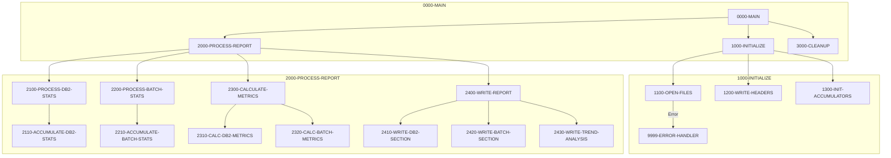

## Overview

RPTSTA00 is a batch report generation program that produces comprehensive system statistics and performance reports. It collects and analyzes metrics from two primary sources: DB2 database operations and batch job execution, then generates a formatted report with trend analysis.

The program serves as a key operational monitoring tool in the Investment Portfolio Management System, providing operations staff and management with visibility into:
- DB2 database call volumes and response times
- Batch job success and failure rates
- System performance trends over time
- Resource utilization metrics

This report supports capacity planning, performance tuning, and operational troubleshooting activities.

## Program Structure



## Data Structures

### Working Storage

#### File Status Variables

| Level | Name | Picture | Description |
|-------|------|---------|-------------|
| 01 | WS-FILE-STATUS | - | File status group |
| 05 | WS-DB2-STATUS | XX | DB2 statistics file status |
| 05 | WS-BCH-STATUS | XX | Batch statistics file status |
| 05 | WS-REPORT-STATUS | XX | Report output file status |

#### Performance Metrics

| Level | Name | Picture | Description |
|-------|------|---------|-------------|
| 01 | WS-PERFORMANCE-METRICS | - | Performance metrics group |
| 05 | WS-DB2-METRICS | - | DB2 metrics subgroup |
| 10 | WS-DB2-CALLS | 9(9) | Total DB2 call count |
| 10 | WS-DB2-ELAPSED | 9(9)V99 | Total elapsed time (seconds) |
| 10 | WS-DB2-CPU | 9(9)V99 | Total CPU time (seconds) |
| 10 | WS-DB2-WAIT | 9(9)V99 | Total wait time (seconds) |
| 05 | WS-BATCH-METRICS | - | Batch metrics subgroup |
| 10 | WS-BATCH-JOBS | 9(9) | Total batch job count |
| 10 | WS-BATCH-SUCCESS | 9(9) | Successful job count |
| 10 | WS-BATCH-FAILED | 9(9) | Failed job count |
| 10 | WS-BATCH-ELAPSED | 9(9)V99 | Total batch elapsed time |

#### Report Detail Lines

| Level | Name | Picture | Description |
|-------|------|---------|-------------|
| 05 | WS-DB2-DETAIL | - | DB2 statistics detail line |
| 10 | WS-DB2-CALLS-OUT | ZZZ,ZZZ,ZZ9 | Formatted DB2 call count |
| 10 | WS-DB2-AVG-RESP | ZZ,ZZ9.999 | Average response time (ms) |
| 05 | WS-BATCH-DETAIL | - | Batch statistics detail line |
| 10 | WS-BATCH-TOTAL | ZZZ,ZZ9 | Formatted job total |
| 10 | WS-SUCCESS-RATE | ZZ9.99 | Success rate percentage |

### File Section

| Level | Name | Picture | Description |
|-------|------|---------|-------------|
| 01 | REPORT-RECORD | X(132) | Report output record (132 columns) |

## File I/O

### File Definitions

| File Name | DD Name | Type | Organization | Access | Description |
|-----------|---------|------|--------------|--------|-------------|
| DB2-STATS | DB2STATS | Input | Indexed (VSAM KSDS) | Sequential | DB2 performance statistics |
| BATCH-STATS | BCHSTATS | Input | Indexed (VSAM KSDS) | Sequential | Batch job execution statistics |
| REPORT-FILE | RPTFILE | Output | Sequential | Sequential | Generated statistics report |

### File Operations by Paragraph

| Paragraph | File | Operation | Description |
|-----------|------|-----------|-------------|
| 1100-OPEN-FILES | DB2-STATS | OPEN INPUT | Open DB2 stats for reading |
| 1100-OPEN-FILES | BATCH-STATS | OPEN INPUT | Open batch stats for reading |
| 1100-OPEN-FILES | REPORT-FILE | OPEN OUTPUT | Open report file for writing |
| 2100-PROCESS-DB2-STATS | DB2-STATS | READ | Read DB2 statistics records |
| 2200-PROCESS-BATCH-STATS | BATCH-STATS | READ | Read batch statistics records |
| 1200-WRITE-HEADERS | REPORT-FILE | WRITE | Write report header lines |
| 3000-CLEANUP | All files | CLOSE | Close all files |

### JCL File Assignments

```jcl
//DB2STATS DD   DSN=PROD.DB2.STATISTICS,DISP=SHR
//BCHSTATS DD   DSN=PROD.BATCH.STATISTICS,DISP=SHR
//RPTFILE  DD   DSN=PROD.SYSTEM.STATS.REPORT,
//             DISP=(NEW,CATLG,DELETE),
//             SPACE=(CYL,(10,5),RLSE),
//             DCB=(RECFM=FB,LRECL=132,BLKSIZE=0)
```

## Control Flow

### Main Processing Logic

1. **Initialization (1000-INITIALIZE)**
   - Opens all input and output files with error checking
   - Writes report headers including title and date
   - Initializes all accumulator fields to zero

2. **Report Processing (2000-PROCESS-REPORT)**
   - **DB2 Statistics Processing**: Reads all records from the DB2 statistics file sequentially, accumulating totals for calls, elapsed time, CPU time, and wait time
   - **Batch Statistics Processing**: Reads all records from the batch statistics file, tracking total jobs, successes, and failures
   - **Metrics Calculation**: Computes derived metrics including average response times and success rates
   - **Report Writing**: Generates formatted report sections for DB2 stats, batch stats, and trend analysis

3. **Cleanup (3000-CLEANUP)**
   - Closes all files

### Error Handling

The program uses a centralized error handler (9999-ERROR-HANDLER) that:
- Displays the error message stored in `WS-ERROR-MESSAGE`
- Sets RETURN-CODE to 12 (severe error)
- Terminates processing via GOBACK

File status checking occurs after each file operation:
```cobol
IF WS-DB2-STATUS NOT = '00'
    MOVE 'ERROR OPENING DB2 STATS' TO WS-ERROR-MESSAGE
    PERFORM 9999-ERROR-HANDLER
END-IF
```

### COBOL Concepts

**ACCEPT FROM DATE**: The statement `ACCEPT WS-REPORT-DATE FROM DATE` retrieves the current system date in YYMMDD format and stores it in the report header.

**Condition Names (88-levels)**: The program uses 88-level conditions like `END-OF-DB2-STATS` and `END-OF-BATCH-STATS` to track end-of-file conditions, making the read loops more readable.

**Edited Pictures**: Output fields like `ZZZ,ZZZ,ZZ9` suppress leading zeros and insert commas for readability. The `V` in `9(9)V99` indicates an implied decimal point.

## Dependencies

### Copybooks

| Copybook | Location | Description |
|----------|----------|-------------|
| DB2STAT | db2/ | DB2 statistics file record structure |
| BCHCTL | batch/ | Batch control record structure |
| RTNCODE | common/ | Return code management definitions |
| ERRHAND | common/ | Error handling definitions and messages |

### Related Programs

| Program | Relationship | Description |
|---------|--------------|-------------|
| DB2STAT | Data Source | Collects DB2 statistics written to DB2-STATS file |
| BCHCTL00 | Data Source | Maintains batch control records in BATCH-STATS |
| UTLMON00 | Related | System monitor that also uses DB2STAT copybook |
| RPTAUD00 | Related | Audit report generator (shares RTNCODE, ERRHAND) |
| RPTPOS00 | Related | Position report generator (shares RTNCODE, ERRHAND) |

## Report Output

### Report Format

The generated report is a 132-column fixed-length sequential file with the following sections:

```
********************************************************************************
                    SYSTEM STATISTICS AND PERFORMANCE REPORT
REPORT DATE:  2024-04-09
********************************************************************************

DB2 STATISTICS
--------------
DB2 CALLS:         1,234,567          AVG RESPONSE:     12.345

BATCH STATISTICS
----------------
BATCH JOBS:        1,234              SUCCESS RATE:     98.75%

TREND ANALYSIS
--------------
[Trend data formatted by 2430-WRITE-TREND-ANALYSIS]
```

### Key Metrics Reported

| Metric | Source | Calculation |
|--------|--------|-------------|
| DB2 Calls | WS-DB2-CALLS | Sum of all DB2 call records |
| Avg Response | WS-DB2-AVG-RESP | WS-DB2-ELAPSED / WS-DB2-CALLS |
| Batch Jobs | WS-BATCH-JOBS | Count of batch job records |
| Success Rate | WS-SUCCESS-RATE | (WS-BATCH-SUCCESS / WS-BATCH-JOBS) × 100 |

## Return Codes

| Code | Meaning | Condition |
|------|---------|-----------|
| 0 | Success | Report generated successfully |
| 12 | Severe Error | File open error or processing failure |

## Issues

:::note Implementation Note
The source code shows paragraph declarations for several sub-paragraphs (2110, 2210, 2310, 2320, 2410, 2420, 2430) but their implementations are not visible in the source file. These paragraphs handle:
- Accumulating statistics from individual records
- Calculating derived metrics (averages, rates)
- Writing the detailed report sections

The program may require completion of these paragraphs for full functionality.
:::
