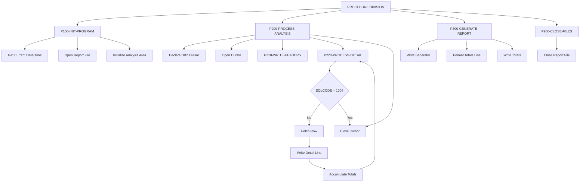

## Overview

RTNANA00 is a batch utility program that performs analysis of return codes across the system. It queries a DB2 database table containing return code history and generates a formatted report summarizing the success, warning, error, and severe failure rates for each program.

The program serves as a monitoring and diagnostic tool, enabling operations staff and developers to identify programs with high failure rates, track error trends over time, and pinpoint systemic issues. By aggregating return codes by program, it provides visibility into the overall health of the batch processing environment.

The analysis report is written to a sequential file in a fixed-format layout suitable for printing or archival. The report includes headers with the generation timestamp, a detail section with per-program statistics, and a totals line summarizing all programs.

## Program Structure



## Data Structures

### Working Storage

| Level | Name | Picture | Description |
|-------|------|---------|-------------|
| 01 | WS-FILE-STATUS | - | File status area |
| 05 | WS-REPORT-STATUS | XX | Report file status code |
| 01 | WS-DB2-AREA | - | DB2 communication area |
| - | SQLCA | (included) | SQL Communication Area for DB2 |

### Date/Time Fields

| Level | Name | Picture | Description |
|-------|------|---------|-------------|
| 01 | WS-CURRENT-DATE-DATA | - | Current date/time from system |
| 10 | WS-CURRENT-YEAR | 9(4) | 4-digit year |
| 10 | WS-CURRENT-MONTH | 9(2) | Month (01-12) |
| 10 | WS-CURRENT-DAY | 9(2) | Day of month (01-31) |
| 10 | WS-CURRENT-HOUR | 9(2) | Hour (00-23) |
| 10 | WS-CURRENT-MINUTE | 9(2) | Minute (00-59) |
| 10 | WS-CURRENT-SECOND | 9(2) | Second (00-59) |
| 10 | WS-CURRENT-MS | 9(2) | Milliseconds |

### Analysis Counters

| Level | Name | Picture | Description |
|-------|------|---------|-------------|
| 01 | WS-ANALYSIS-AREA | - | Analysis working area |
| 05 | WS-START-TIME | X(26) | Analysis start timestamp |
| 05 | WS-END-TIME | X(26) | Analysis end timestamp |
| 05 | WS-PROGRAM-COUNT | S9(8) COMP | Total execution count |
| 05 | WS-ERROR-COUNT | S9(8) COMP | Total error count |
| 05 | WS-WARNING-COUNT | S9(8) COMP | Total warning count |
| 05 | WS-SUCCESS-COUNT | S9(8) COMP | Total success count |
| 05 | WS-SEVERE-COUNT | S9(8) COMP | Total severe failure count |

### Report Detail Line

| Level | Name | Picture | Description |
|-------|------|---------|-------------|
| 05 | WS-DETAIL-LINE | - | Detail output line |
| 10 | WS-DTL-PROGRAM | X(8) | Program identifier |
| 10 | WS-DTL-TOTAL | ZZZ,ZZ9 | Total executions (edited) |
| 10 | WS-DTL-SUCCESS | ZZZ,ZZ9 | Success count (edited) |
| 10 | WS-DTL-WARNING | ZZZ,ZZ9 | Warning count (edited) |
| 10 | WS-DTL-ERROR | ZZZ,ZZ9 | Error count (edited) |
| 10 | WS-DTL-SEVERE | ZZZ,ZZ9 | Severe count (edited) |

## File I/O

### File Definitions

| File Name | DD Name | Organization | Access | Record Length | Description |
|-----------|---------|--------------|--------|---------------|-------------|
| REPORT-FILE | RPTFILE | Sequential | Sequential | 133 bytes | Analysis report output |

### File Section

| Level | Name | Picture | Description |
|-------|------|---------|-------------|
| 01 | REPORT-RECORD | X(133) | Output record for report file |

### I/O Operations

| File | Operation | Paragraph | Purpose |
|------|-----------|-----------|---------|
| REPORT-FILE | OPEN OUTPUT | P100-INIT-PROGRAM | Open for writing |
| REPORT-FILE | WRITE | P210-WRITE-HEADERS | Write header lines |
| REPORT-FILE | WRITE | P220-PROCESS-DETAIL | Write detail lines |
| REPORT-FILE | WRITE | P300-GENERATE-REPORT | Write totals |
| REPORT-FILE | CLOSE | P900-CLOSE-FILES | Close file |

## Database Access

### DB2 Table

| Table Name | Purpose |
|------------|---------|
| RTNCODES | Stores return code history for all programs |

### Cursor Definition

The program declares a cursor `PRGCUR` that aggregates return code data by program:

```sql
SELECT PROGRAM_ID,
       COUNT(*) AS TOTAL,
       COUNT(CASE WHEN STATUS_CODE = 'S' THEN 1 END),
       COUNT(CASE WHEN STATUS_CODE = 'W' THEN 1 END),
       COUNT(CASE WHEN STATUS_CODE = 'E' THEN 1 END),
       COUNT(CASE WHEN STATUS_CODE = 'F' THEN 1 END)
FROM RTNCODES
GROUP BY PROGRAM_ID
ORDER BY PROGRAM_ID
```

### Status Code Values

| Code | Meaning |
|------|---------|
| S | Success (RC=0) |
| W | Warning (RC=4) |
| E | Error (RC=8) |
| F | Severe/Fatal (RC>=12) |

### DB2 Operations

| Operation | Paragraph | Purpose |
|-----------|-----------|---------|
| DECLARE CURSOR | P200-PROCESS-ANALYSIS | Define result set cursor |
| OPEN CURSOR | P200-PROCESS-ANALYSIS | Begin cursor processing |
| FETCH | P220-PROCESS-DETAIL | Retrieve next program's statistics |
| CLOSE CURSOR | P200-PROCESS-ANALYSIS | End cursor processing |

## Control Flow

### P100-INIT-PROGRAM (Initialization)

1. Retrieves the current system date and time using the `FUNCTION CURRENT-DATE` intrinsic function
2. Opens the report file for output
3. If the file open fails (status not `'00'`), displays an error message, sets return code to 12, and terminates
4. Initializes all counters in the analysis area to zero

### P200-PROCESS-ANALYSIS (Main Processing)

1. Declares a DB2 cursor that groups return codes by program ID and counts occurrences by status
2. Opens the cursor to begin fetching results
3. Calls P210-WRITE-HEADERS to output the report header section
4. Loops through P220-PROCESS-DETAIL until SQLCODE = 100 (end of data)
5. Closes the cursor when all rows have been processed

### P210-WRITE-HEADERS (Header Output)

1. Writes a separator line (dashes)
2. Writes the report title "Return Code Analysis Report"
3. Formats and writes the report date and time using STRING to format the time as `HH:MM:SS`
4. Writes another separator line
5. Writes the column headers (Program, Total, Success, Warning, Error, Severe)
6. Writes a final separator line before detail data

### P220-PROCESS-DETAIL (Detail Processing)

1. Fetches the next row from the cursor into the detail line fields
2. If SQLCODE = 0 (successful fetch):
   - Writes the detail line to the report
   - Accumulates the counts into the running totals for the summary

### P300-GENERATE-REPORT (Summary Output)

1. Writes a separator line
2. Moves 'TOTALS' to the program name field
3. Moves accumulated counts to the detail line fields
4. Writes the totals line
5. Writes a final separator line

### P900-CLOSE-FILES (Cleanup)

1. Closes the report file

## Report Format

The generated report follows this structure:

```
-------------------------------------------------------------------------
                    Return Code Analysis Report
Report Date: YYYY-MM-DD     Report Time: HH:MM:SS
-------------------------------------------------------------------------
Program   Total      Success    Warning    Error      Severe
-------------------------------------------------------------------------
PROG0001     1,234      1,200         30          4          0
PROG0002       567        500         50         15          2
...
-------------------------------------------------------------------------
TOTALS       1,801      1,700         80         19          2
-------------------------------------------------------------------------
```

## Dependencies

### Copybooks

This program does not use any external copybooks. It includes the SQLCA directly via:

```cobol
EXEC SQL INCLUDE SQLCA END-EXEC
```

### Called Programs

This program does not call any external programs.

### Related Programs

- **RTNCDE00** - Return code management program (likely populates the RTNCODES table that this program reads)

## Technical Notes

### Return Codes

| Code | Meaning |
|------|---------|
| 0 | Successful completion |
| 12 | Error opening report file |

### COBOL Features Used

- **FUNCTION CURRENT-DATE**: Intrinsic function that returns the current system date and time in a standardized format (YYYYMMDDHHMMSSFF)
- **STRING statement**: Used to concatenate hour, minute, and second with colons for the formatted time display
- **Edited PIC clauses**: `ZZZ,ZZ9` suppresses leading zeros and inserts comma separators for readability
- **PERFORM THRU**: Executes from a starting paragraph through an exit paragraph

### DB2 Considerations

- The program uses a cursor-based approach for memory efficiency when processing large result sets
- SQLCODE 100 indicates end-of-data and controls the processing loop
- The CASE expressions in the SELECT provide efficient conditional counting within the database engine
- Results are ordered by PROGRAM_ID for consistent report output

### Record Layout

The report file uses a 133-byte fixed-length record, which is a standard print line format:
- 1 byte for carriage control (implicit)
- 132 bytes for data

This format is compatible with standard mainframe print utilities and SYSOUT processing.
