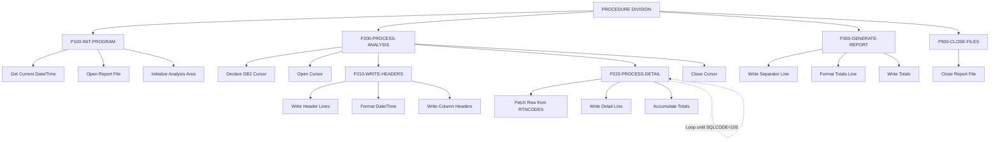

## Overview

RTNANA00 is a batch utility program that performs analysis of return codes collected from various programs across the system. It queries a DB2 database table containing historical return code data and produces a formatted report summarizing success, warning, error, and severe failure counts by program.

The program serves as a diagnostic and monitoring tool for operations teams, helping to:
- Identify programs with high error rates
- Track trends in system health over time
- Pinpoint recurring issues that may need attention
- Provide summary statistics for operational dashboards

This is a DB2/COBOL batch program that reads from the RTNCODES table and writes a fixed-format report file.

## Program Structure



## Data Structures

### Working Storage

#### File Status

| Level | Name | Picture | Description |
|-------|------|---------|-------------|
| 01 | WS-FILE-STATUS | - | File status group |
| 05 | WS-REPORT-STATUS | XX | Report file status code |

#### DB2 Area

| Level | Name | Description |
|-------|------|-------------|
| 01 | WS-DB2-AREA | Contains SQLCA via EXEC SQL INCLUDE |

The program includes the standard SQL Communication Area (SQLCA) which provides:
- `SQLCODE` - Return code from DB2 operations (0=success, 100=not found, negative=error)
- `SQLERRM` - Error message text
- `SQLSTATE` - SQL state code

#### Date/Time Fields

| Level | Name | Picture | Description |
|-------|------|---------|-------------|
| 01 | WS-CURRENT-DATE-DATA | - | Date/time group from CURRENT-DATE function |
| 05 | WS-CURRENT-DATE | - | Date portion |
| 10 | WS-CURRENT-YEAR | 9(4) | 4-digit year |
| 10 | WS-CURRENT-MONTH | 9(2) | Month (01-12) |
| 10 | WS-CURRENT-DAY | 9(2) | Day (01-31) |
| 05 | WS-CURRENT-TIME | - | Time portion |
| 10 | WS-CURRENT-HOUR | 9(2) | Hour (00-23) |
| 10 | WS-CURRENT-MINUTE | 9(2) | Minute (00-59) |
| 10 | WS-CURRENT-SECOND | 9(2) | Second (00-59) |
| 10 | WS-CURRENT-MS | 9(2) | Milliseconds |

#### Analysis Accumulators

| Level | Name | Picture | Description |
|-------|------|---------|-------------|
| 01 | WS-ANALYSIS-AREA | - | Analysis counters group |
| 05 | WS-START-TIME | X(26) | Analysis start timestamp |
| 05 | WS-END-TIME | X(26) | Analysis end timestamp |
| 05 | WS-PROGRAM-COUNT | S9(8) COMP | Total execution count |
| 05 | WS-ERROR-COUNT | S9(8) COMP | Total error count |
| 05 | WS-WARNING-COUNT | S9(8) COMP | Total warning count |
| 05 | WS-SUCCESS-COUNT | S9(8) COMP | Total success count |
| 05 | WS-SEVERE-COUNT | S9(8) COMP | Total severe failure count |

#### Report Lines

| Level | Name | Picture | Description |
|-------|------|---------|-------------|
| 05 | WS-HEADER1 | X(133) | Separator line (all dashes) |
| 05 | WS-HEADER2 | X(133) | Report title line |
| 05 | WS-HEADER3 | X(133) | Date/time line |
| 05 | WS-DETAIL-HDR | X(133) | Column headers |
| 05 | WS-DETAIL-LINE | X(133) | Detail data line |

**Detail Line Fields:**

| Field | Picture | Description |
|-------|---------|-------------|
| WS-DTL-PROGRAM | X(8) | Program identifier |
| WS-DTL-TOTAL | ZZZ,ZZ9 | Total executions (edited) |
| WS-DTL-SUCCESS | ZZZ,ZZ9 | Success count (edited) |
| WS-DTL-WARNING | ZZZ,ZZ9 | Warning count (edited) |
| WS-DTL-ERROR | ZZZ,ZZ9 | Error count (edited) |
| WS-DTL-SEVERE | ZZZ,ZZ9 | Severe count (edited) |

## File I/O

### Report File (RPTFILE)

A sequential fixed-format output file for the analysis report.

| Attribute | Value |
|-----------|-------|
| DD Name | RPTFILE |
| Organization | Sequential |
| Access Mode | Sequential |
| Recording Mode | F (Fixed) |
| Record Length | 133 bytes |
| File Status | WS-REPORT-STATUS |

| Operation | Paragraph | Description |
|-----------|-----------|-------------|
| OPEN OUTPUT | P100-INIT-PROGRAM | Opens file for writing |
| WRITE | P210-WRITE-HEADERS | Writes header lines |
| WRITE | P220-PROCESS-DETAIL | Writes detail lines |
| WRITE | P300-GENERATE-REPORT | Writes totals |
| CLOSE | P900-CLOSE-FILES | Closes file |

## Database Operations

### RTNCODES Table

The program queries the RTNCODES table which stores historical return code data.

**SQL Cursor Declaration:**
```sql
DECLARE PRGCUR CURSOR FOR
SELECT PROGRAM_ID,
       COUNT(*) AS TOTAL,
       COUNT(CASE WHEN STATUS_CODE = 'S' THEN 1 END),
       COUNT(CASE WHEN STATUS_CODE = 'W' THEN 1 END),
       COUNT(CASE WHEN STATUS_CODE = 'E' THEN 1 END),
       COUNT(CASE WHEN STATUS_CODE = 'F' THEN 1 END)
FROM RTNCODES
GROUP BY PROGRAM_ID
ORDER BY PROGRAM_ID
```

**Status Code Values:**

| Code | Meaning |
|------|---------|
| S | Success |
| W | Warning |
| E | Error |
| F | Severe Failure |

**DB2 Operations:**

| Operation | Paragraph | Description |
|-----------|-----------|-------------|
| DECLARE CURSOR | P200-PROCESS-ANALYSIS | Defines the aggregation query |
| OPEN | P200-PROCESS-ANALYSIS | Opens cursor for fetching |
| FETCH | P220-PROCESS-DETAIL | Retrieves next program's statistics |
| CLOSE | P200-PROCESS-ANALYSIS | Closes cursor |

## Control Flow

### P100-INIT-PROGRAM - Initialization

1. Retrieves current date and time using COBOL intrinsic function `FUNCTION CURRENT-DATE`
2. Opens the report file for output
3. Validates file status - if not `'00'`, displays error and exits with return code 12
4. Initializes all analysis accumulators to zero

### P200-PROCESS-ANALYSIS - Main Processing

1. Declares DB2 cursor with aggregation query against RTNCODES table
2. Opens the cursor
3. Calls P210-WRITE-HEADERS to write report headers
4. Loops through P220-PROCESS-DETAIL until SQLCODE = 100 (end of data)
5. Closes the cursor

### P210-WRITE-HEADERS - Header Generation

1. Writes separator line (all dashes)
2. Writes centered report title
3. Formats and writes report date and time
4. Writes another separator line
5. Writes column headers (Program, Total, Success, Warning, Error, Severe)
6. Writes final separator line

### P220-PROCESS-DETAIL - Detail Processing

1. Fetches next row from cursor into detail line fields
2. If SQLCODE = 0 (successful fetch):
   - Writes the detail line to report
   - Accumulates counts into running totals

### P300-GENERATE-REPORT - Summary Generation

1. Writes separator line
2. Moves 'TOTALS' to program name field
3. Moves accumulated counts to detail line fields
4. Writes totals line
5. Writes final separator line

### P900-CLOSE-FILES - Cleanup

1. Closes the report file

## Report Format

The program produces a 133-column fixed-format report:

```
-------------------------------------------------------------------------...
                              Return Code Analysis Report
Report Date: YYYY-MM-DD     Report Time: HH:MM:SS
-------------------------------------------------------------------------...
Program   Total      Success    Warning    Error      Severe
-------------------------------------------------------------------------...
PROG0001     1,234      1,100         50         80          4
PROG0002       567        500         30         35          2
...
-------------------------------------------------------------------------...
TOTALS       1,801      1,600         80        115          6
-------------------------------------------------------------------------...
```

## Dependencies

### Copybooks

This program does not use external copybooks. It includes the SQLCA directly via:
```cobol
EXEC SQL INCLUDE SQLCA END-EXEC
```

### Called Programs

None - this is a standalone batch report program.

### Database Objects

- **RTNCODES** - DB2 table containing return code history with columns:
  - PROGRAM_ID - Program identifier
  - STATUS_CODE - Return status (S/W/E/F)

### Related Programs

Programs that may populate the RTNCODES table or use this report should be documented here.

## Return Codes

| Code | Description |
|------|-------------|
| 0 | Successful completion |
| 12 | Error opening report file |

## Technical Notes

1. **FUNCTION CURRENT-DATE**: Uses the COBOL intrinsic function to get the current date and time, which returns a 21-character string in the format YYYYMMDDHHMMSSHHNNNNNN (year, month, day, hour, minute, second, hundredths, and time zone offset).

2. **DB2 Cursor Processing**: The program uses a cursor-based approach to process aggregated data. The cursor query performs GROUP BY aggregation in DB2, which is more efficient than fetching individual rows and aggregating in COBOL.

3. **CASE Expression in SQL**: The query uses CASE expressions within COUNT functions to conditionally count rows by status code. This is a common DB2 pattern for pivot-style aggregation.

4. **Edited Pictures**: The detail line uses `ZZZ,ZZ9` picture clauses for numeric display, which suppresses leading zeros and inserts comma separators for readability.

5. **133-Byte Record**: The standard mainframe print record length of 133 bytes includes 1 byte for carriage control (though not explicitly used here) and 132 bytes for data.

6. **COMP Fields**: Analysis counters use `S9(8) COMP` (binary) format for efficient arithmetic operations, supporting values up to approximately 99 million.

7. **STRING Statement**: The program uses STRING to concatenate time components with colons for display formatting.
