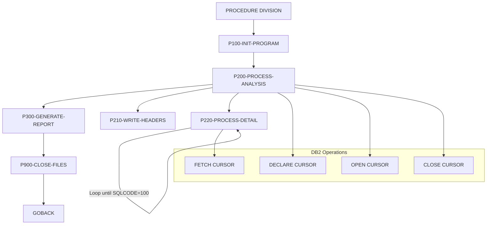

## Overview

RTNANA00 is a batch utility program that analyzes return codes captured from program executions across the system. It queries a DB2 database table containing historical return code information and generates a formatted analysis report summarizing success, warning, error, and severe conditions by program.

The program serves as a key component in system monitoring and operational intelligence, helping operations teams identify problematic programs, track error patterns, and monitor overall system health. By aggregating return code data, it enables trend analysis and proactive issue identification.

The report is written to a sequential file suitable for printing or viewing through SDSF, with a standard 133-character print line format including carriage control.

## Program Structure



## Data Structures

### Working Storage

| Level | Name | Picture | Description |
|-------|------|---------|-------------|
| 05 | WS-REPORT-STATUS | XX | File status for report file |

### Date/Time Area

| Level | Name | Picture | Description |
|-------|------|---------|-------------|
| 01 | WS-CURRENT-DATE-DATA | - | Current date/time from FUNCTION CURRENT-DATE |
| 10 | WS-CURRENT-YEAR | 9(4) | Current year (YYYY) |
| 10 | WS-CURRENT-MONTH | 9(2) | Current month (MM) |
| 10 | WS-CURRENT-DAY | 9(2) | Current day (DD) |
| 10 | WS-CURRENT-HOUR | 9(2) | Current hour (HH) |
| 10 | WS-CURRENT-MINUTE | 9(2) | Current minute (MM) |
| 10 | WS-CURRENT-SECOND | 9(2) | Current second (SS) |

### Analysis Counters

| Level | Name | Picture | Description |
|-------|------|---------|-------------|
| 05 | WS-START-TIME | X(26) | Analysis start timestamp |
| 05 | WS-END-TIME | X(26) | Analysis end timestamp |
| 05 | WS-PROGRAM-COUNT | S9(8) COMP | Total execution count |
| 05 | WS-ERROR-COUNT | S9(8) COMP | Total error count |
| 05 | WS-WARNING-COUNT | S9(8) COMP | Total warning count |
| 05 | WS-SUCCESS-COUNT | S9(8) COMP | Total success count |
| 05 | WS-SEVERE-COUNT | S9(8) COMP | Total severe error count |

### Report Detail Line

| Level | Name | Picture | Description |
|-------|------|---------|-------------|
| 10 | WS-DTL-PROGRAM | X(8) | Program identifier |
| 10 | WS-DTL-TOTAL | ZZZ,ZZ9 | Total executions |
| 10 | WS-DTL-SUCCESS | ZZZ,ZZ9 | Success count |
| 10 | WS-DTL-WARNING | ZZZ,ZZ9 | Warning count |
| 10 | WS-DTL-ERROR | ZZZ,ZZ9 | Error count |
| 10 | WS-DTL-SEVERE | ZZZ,ZZ9 | Severe error count |

## File I/O

### Report File (RPTFILE)

| Attribute | Value |
|-----------|-------|
| DDname | RPTFILE |
| Organization | Sequential |
| Access Mode | Sequential |
| Recording Mode | Fixed (F) |
| Record Length | 133 bytes |
| File Status | WS-REPORT-STATUS |

**Operations:**
- OPEN OUTPUT - Opens file for writing at program initialization
- WRITE - Writes header and detail lines to the report
- CLOSE - Closes file at program termination

## Database Access

### RTNCODES Table

The program queries the RTNCODES DB2 table which stores historical return code information.

**Table Structure:**

| Column | Type | Description |
|--------|------|-------------|
| TIMESTAMP | TIMESTAMP | When the return code was logged |
| PROGRAM_ID | CHAR(8) | Program that produced the return code |
| RETURN_CODE | INTEGER | Numeric return code value |
| HIGHEST_CODE | INTEGER | Highest return code in the job |
| STATUS_CODE | CHAR(1) | Status category: S=Success, W=Warning, E=Error, F=Severe/Fatal |
| MESSAGE_TEXT | VARCHAR(80) | Associated message text |

**Indexes:**
- Primary Key: (TIMESTAMP, PROGRAM_ID)
- RTNCODES_PRG_IDX: (PROGRAM_ID, TIMESTAMP) - for program analysis
- RTNCODES_STS_IDX: (STATUS_CODE, TIMESTAMP) - for status analysis

### SQL Cursor (PRGCUR)

```sql
SELECT PROGRAM_ID,
       COUNT(*) AS TOTAL,
       COUNT(CASE WHEN STATUS_CODE = 'S' THEN 1 END),
       COUNT(CASE WHEN STATUS_CODE = 'W' THEN 1 END),
       COUNT(CASE WHEN STATUS_CODE = 'E' THEN 1 END),
       COUNT(CASE WHEN STATUS_CODE = 'F' THEN 1 END)
FROM RTNCODES
GROUP BY PROGRAM_ID
ORDER BY PROGRAM_ID
```

This query aggregates return codes by program, counting occurrences of each status type using conditional COUNT expressions.

## Control Flow

### P100-INIT-PROGRAM
1. Retrieves current date and time using FUNCTION CURRENT-DATE
2. Opens the report file for output
3. Validates file open status; terminates with RC=12 if open fails
4. Initializes all analysis counters to zero

### P200-PROCESS-ANALYSIS
1. Declares the PRGCUR cursor with the aggregation query
2. Opens the cursor
3. Calls P210-WRITE-HEADERS to output report headers
4. Loops through P220-PROCESS-DETAIL until SQLCODE=100 (end of data)
5. Closes the cursor

### P210-WRITE-HEADERS
1. Writes separator line (dashes)
2. Writes centered report title
3. Formats and writes report date/time using STRING statement
4. Writes column headers for the detail section

### P220-PROCESS-DETAIL
1. Fetches next row from cursor into detail line fields
2. If SQLCODE=0 (successful fetch):
   - Writes detail line to report
   - Accumulates totals for summary

### P300-GENERATE-REPORT
1. Writes separator line
2. Formats totals line with accumulated counts
3. Writes totals to report
4. Writes final separator line

### P900-CLOSE-FILES
1. Closes the report file

## Report Output Format

```
-------------------------------------------------------------------------
                         Return Code Analysis Report
Report Date: YYYY-MM-DD     Report Time: HH:MM:SS
-------------------------------------------------------------------------
Program   Total      Success    Warning    Error      Severe
-------------------------------------------------------------------------
PROG0001   1,234      1,100         50         80          4
PROG0002     567        500         25         40          2
...
-------------------------------------------------------------------------
TOTALS     1,801      1,600         75        120          6
-------------------------------------------------------------------------
```

## Return Codes

| Code | Meaning |
|------|---------|
| 0 | Successful completion |
| 12 | Error opening report file |

## Dependencies

### Copybooks

- **SQLCA** - DB2 SQL Communication Area (included via EXEC SQL INCLUDE)

### Called Programs

None - this is a standalone batch utility.

### Database Objects

- **RTNCODES** - DB2 table containing return code history

### Related Programs

Programs that may log to the RTNCODES table for analysis by this program include any batch or online programs using the return code logging infrastructure.

## JCL Example

```jcl
//RTNANA00 JOB (ACCT),'RETURN CODE ANALYSIS',
//             CLASS=A,MSGCLASS=X,MSGLEVEL=(1,1)
//*
//RTNANA   EXEC PGM=RTNANA00
//STEPLIB  DD DSN=PROD.LOAD.LIBRARY,DISP=SHR
//RPTFILE  DD SYSOUT=*,
//            DCB=(RECFM=FBA,LRECL=133,BLKSIZE=0)
//SYSOUT   DD SYSOUT=*
//SYSUDUMP DD SYSOUT=*
//SYSPRINT DD SYSOUT=*
```

## Technical Notes

1. **FUNCTION CURRENT-DATE**: Uses COBOL intrinsic function to retrieve system date and time in a portable format (YYYYMMDDHHMMSSFF)

2. **STRING Statement**: Concatenates time components with colons for formatted display

3. **Embedded SQL**: Uses DB2 embedded SQL with:
   - EXEC SQL INCLUDE SQLCA - includes the SQL Communication Area for status checking
   - DECLARE CURSOR - defines a scrollable result set
   - OPEN/FETCH/CLOSE - standard cursor operations
   - SQLCODE checking - 0 for success, 100 for end-of-data

4. **Conditional COUNT**: Uses CASE expressions within COUNT to categorize and count records by status code in a single pass

5. **COMP Fields**: Uses computational (binary) fields for efficient counter arithmetic

6. **Report Formatting**: Uses edited PIC clauses (ZZZ,ZZ9) for automatic comma insertion and zero suppression in numeric output
