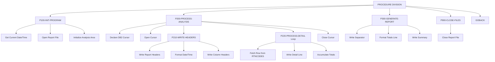

## Overview

RTNANA00 is a Return Code Analysis Utility that examines return codes generated by programs across the system. It queries a DB2 database table containing return code history and produces a formatted analysis report showing success, warning, error, and severe failure counts per program.

The program serves as a diagnostic and monitoring tool, helping operations teams identify programs with high error rates, track system health trends, and detect recurring issues. By aggregating return codes by program, it provides visibility into which components of the batch processing environment may require attention or investigation.

The utility generates a fixed-format sequential report file suitable for printing or archival. The report includes a header with date/time stamps, per-program statistics, and summary totals across all analyzed programs.

## Program Structure



## Data Structures

### Working Storage - File Status

| Level | Name | Picture | Description |
|-------|------|---------|-------------|
| 01 | WS-FILE-STATUS | - | File status area |
| 05 | WS-REPORT-STATUS | XX | Report file status code |

### Working Storage - DB2 Communication

| Level | Name | Description |
|-------|------|-------------|
| 01 | WS-DB2-AREA | DB2 communication area |
| - | SQLCA | SQL Communication Area (included via EXEC SQL INCLUDE) |

### Working Storage - Date/Time

| Level | Name | Picture | Description |
|-------|------|---------|-------------|
| 01 | WS-CURRENT-DATE-DATA | - | Current date/time from system |
| 05 | WS-CURRENT-DATE | - | Date portion |
| 10 | WS-CURRENT-YEAR | 9(4) | Year (YYYY) |
| 10 | WS-CURRENT-MONTH | 9(2) | Month (MM) |
| 10 | WS-CURRENT-DAY | 9(2) | Day (DD) |
| 05 | WS-CURRENT-TIME | - | Time portion |
| 10 | WS-CURRENT-HOUR | 9(2) | Hour (HH) |
| 10 | WS-CURRENT-MINUTE | 9(2) | Minute (MM) |
| 10 | WS-CURRENT-SECOND | 9(2) | Second (SS) |
| 10 | WS-CURRENT-MS | 9(2) | Milliseconds |

### Working Storage - Analysis Accumulators

| Level | Name | Picture | Description |
|-------|------|---------|-------------|
| 01 | WS-ANALYSIS-AREA | - | Analysis work area |
| 05 | WS-START-TIME | X(26) | Analysis start timestamp |
| 05 | WS-END-TIME | X(26) | Analysis end timestamp |
| 05 | WS-PROGRAM-COUNT | S9(8) COMP | Total execution count |
| 05 | WS-ERROR-COUNT | S9(8) COMP | Total error count |
| 05 | WS-WARNING-COUNT | S9(8) COMP | Total warning count |
| 05 | WS-SUCCESS-COUNT | S9(8) COMP | Total success count |
| 05 | WS-SEVERE-COUNT | S9(8) COMP | Total severe failure count |

### Working Storage - Report Lines

| Level | Name | Picture | Description |
|-------|------|---------|-------------|
| 05 | WS-HEADER1 | X(133) | Separator line (all dashes) |
| 05 | WS-HEADER2 | X(133) | Report title line |
| 05 | WS-HEADER3 | X(133) | Date/time header |
| 10 | WS-RPT-DATE | X(10) | Formatted report date |
| 10 | WS-RPT-TIME | X(8) | Formatted report time |
| 05 | WS-DETAIL-HDR | X(133) | Column header line |
| 05 | WS-DETAIL-LINE | X(133) | Detail line for program stats |
| 10 | WS-DTL-PROGRAM | X(8) | Program name |
| 10 | WS-DTL-TOTAL | ZZZ,ZZ9 | Total executions |
| 10 | WS-DTL-SUCCESS | ZZZ,ZZ9 | Success count |
| 10 | WS-DTL-WARNING | ZZZ,ZZ9 | Warning count |
| 10 | WS-DTL-ERROR | ZZZ,ZZ9 | Error count |
| 10 | WS-DTL-SEVERE | ZZZ,ZZ9 | Severe failure count |

### File Section

| Level | Name | Picture | Description |
|-------|------|---------|-------------|
| 01 | REPORT-RECORD | X(133) | Output report record (133-byte fixed) |

## File I/O

### REPORT-FILE

- **Assignment**: RPTFILE (DD name in JCL)
- **Organization**: Sequential
- **Access Mode**: Sequential
- **Recording Mode**: Fixed (F)
- **Block Contains**: 0 (system determined)
- **Record Length**: 133 bytes
- **File Status**: WS-REPORT-STATUS

| Operation | Paragraph | Description |
|-----------|-----------|-------------|
| OPEN OUTPUT | P100-INIT-PROGRAM | Opens report file for writing |
| WRITE | P210-WRITE-HEADERS | Writes header lines |
| WRITE | P220-PROCESS-DETAIL | Writes per-program detail lines |
| WRITE | P300-GENERATE-REPORT | Writes summary totals |
| CLOSE | P900-CLOSE-FILES | Closes report file |

## Database Access

### DB2 Table: RTNCODES

The program queries the RTNCODES table to aggregate return code statistics by program.

#### Cursor: PRGCUR

```sql
SELECT PROGRAM_ID,
       COUNT(*) AS TOTAL,
       COUNT(CASE WHEN STATUS_CODE = 'S' THEN 1 END),
       COUNT(CASE WHEN STATUS_CODE = 'W' THEN 1 END),
       COUNT(CASE WHEN STATUS_CODE = 'E' THEN 1 END),
       COUNT(CASE WHEN STATUS_CODE = 'F' THEN 1 END)
FROM RTNCODES
GROUP BY PROGRAM_ID
ORDER BY PROGRAM_ID
```

#### Status Code Values

| Code | Meaning | Report Column |
|------|---------|---------------|
| S | Success (RC=0) | Success |
| W | Warning (RC=4) | Warning |
| E | Error (RC=8) | Error |
| F | Fatal/Severe (RC=12+) | Severe |

#### DB2 Operations

| Operation | Paragraph | Description |
|-----------|-----------|-------------|
| DECLARE CURSOR | P200-PROCESS-ANALYSIS | Defines cursor with aggregation query |
| OPEN | P200-PROCESS-ANALYSIS | Opens cursor for fetching |
| FETCH | P220-PROCESS-DETAIL | Retrieves next program's statistics |
| CLOSE | P200-PROCESS-ANALYSIS | Closes cursor after processing |

## Control Flow

### P100-INIT-PROGRAM - Initialization

1. Retrieves current system date and time using the `FUNCTION CURRENT-DATE` intrinsic function
2. Opens the REPORT-FILE for output
3. Validates the file open status - if not '00', displays error message, sets RETURN-CODE to 12, and exits immediately
4. Initializes WS-ANALYSIS-AREA accumulators to zeros

### P200-PROCESS-ANALYSIS - Main Processing

1. **Declare Cursor**: Defines the PRGCUR cursor with an aggregation query that:
   - Groups return codes by PROGRAM_ID
   - Counts total executions
   - Counts occurrences of each status code using CASE expressions
   - Orders results alphabetically by program

2. **Open Cursor**: Opens PRGCUR for sequential fetching

3. **Write Headers**: Calls P210-WRITE-HEADERS to output report header section

4. **Process Loop**: Iteratively calls P220-PROCESS-DETAIL until SQLCODE = 100 (end of data)

5. **Close Cursor**: Closes PRGCUR after all rows processed

### P210-WRITE-HEADERS - Report Header Generation

1. Writes separator line (all dashes)
2. Writes centered report title "Return Code Analysis Report"
3. Formats and writes date/time line:
   - Moves current date to WS-RPT-DATE
   - Uses STRING statement to format time as HH:MM:SS
4. Writes another separator line
5. Writes column headers (Program, Total, Success, Warning, Error, Severe)
6. Writes final separator line before detail section

### P220-PROCESS-DETAIL - Detail Line Processing

1. **Fetch**: Retrieves next row from PRGCUR into detail line fields
2. **Process if successful** (SQLCODE = 0):
   - Writes the detail line to the report
   - Accumulates statistics into summary totals:
     - Adds WS-DTL-TOTAL to WS-PROGRAM-COUNT
     - Adds WS-DTL-SUCCESS to WS-SUCCESS-COUNT
     - Adds WS-DTL-WARNING to WS-WARNING-COUNT
     - Adds WS-DTL-ERROR to WS-ERROR-COUNT
     - Adds WS-DTL-SEVERE to WS-SEVERE-COUNT

### P300-GENERATE-REPORT - Summary Generation

1. Writes separator line
2. Moves 'TOTALS' to program name field
3. Moves accumulated counts to detail line fields
4. Writes the totals line
5. Writes final separator line

### P900-CLOSE-FILES - Cleanup

1. Closes REPORT-FILE

## Report Layout

The program generates a 133-character fixed-width report with the following structure:

```
-------------------------------------------------------------------------...
                              Return Code Analysis Report
Report Date: YYYYMMDD     Report Time: HH:MM:SS
-------------------------------------------------------------------------...
Program   Total      Success    Warning    Error      Severe
-------------------------------------------------------------------------...
PROG0001   1,234       1,100         50         80          4
PROG0002     567         500         30         35          2
...
-------------------------------------------------------------------------...
TOTALS     1,801       1,600         80        115          6
-------------------------------------------------------------------------...
```

## Dependencies

### Copybooks

This program does not use external copybooks. All data structures are defined inline.

### DB2 Objects

| Object | Type | Description |
|--------|------|-------------|
| RTNCODES | Table | Return code history table |
| SQLCA | Include | SQL Communication Area |

### Called Programs

This program does not call any external programs.

### Related Programs

Programs that may populate the RTNCODES table or use this report:
- Batch programs that log return codes to RTNCODES
- Operations monitoring tools that consume the report output

## Return Codes

| Code | Meaning |
|------|---------|
| 0 | Successful completion |
| 12 | Error opening report file |

## Technical Notes

- **FUNCTION CURRENT-DATE**: Uses the COBOL intrinsic function to retrieve system date and time in a single call, populating an 8-byte date and 8-byte time structure
- **STRING Statement**: Concatenates hour, minute, and second with colons to format the time display
- **COMP (BINARY)**: Accumulator fields use COMP for efficient arithmetic operations
- **Edited Pictures**: Detail line numeric fields use ZZZ,ZZ9 edit patterns for zero-suppression with comma insertion
- **RECORDING MODE F**: Fixed-length records of 133 bytes (standard print line width with carriage control)
- **BLOCK CONTAINS 0**: Allows the system to determine optimal blocking factor
- **PERFORM THRU**: Uses paragraph exit points (P100-EXIT, etc.) for structured flow control
- **Cursor Processing**: Uses standard DB2 cursor pattern - DECLARE, OPEN, FETCH loop, CLOSE
- **CASE Expressions**: SQL uses CASE WHEN for conditional counting within the aggregation query
