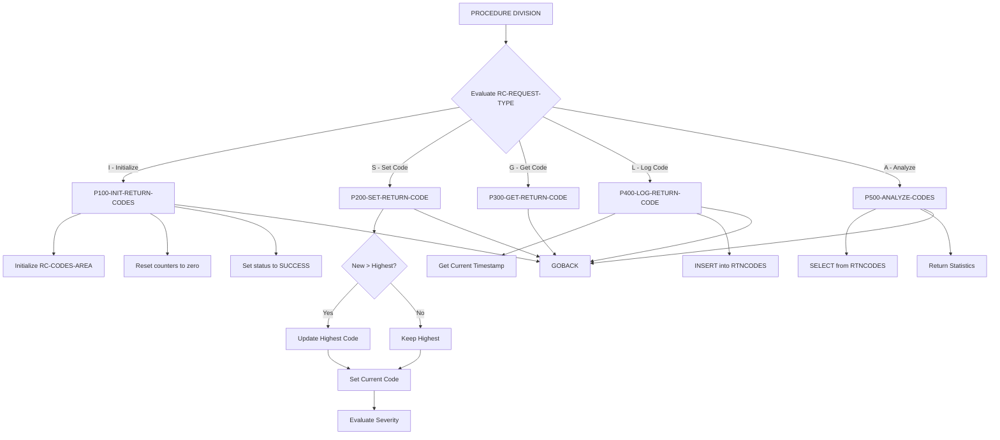
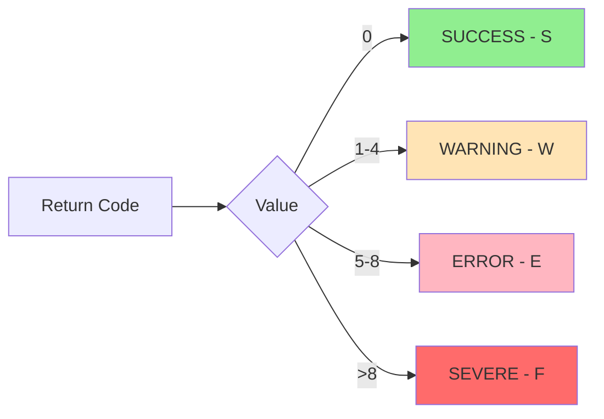

## Overview

RTNCDE00 is a standard return code handler that provides centralized management of return codes across the batch processing system. It offers a consistent interface for initializing, setting, retrieving, logging, and analyzing return codes from any calling program.

The program serves as a critical component in the error handling framework by maintaining both current and highest return codes for each program invocation, automatically categorizing return codes into severity levels (success, warning, error, severe), and persisting return code history to a DB2 database for audit and analysis purposes.

By centralizing return code management, RTNCDE00 ensures consistent behavior across all programs in the system and provides valuable operational data for monitoring batch job health and troubleshooting failures.

## Program Structure



## Data Structures

### Working Storage

| Level | Name | Picture | Description |
|-------|------|---------|-------------|
| 01 | WS-CURRENT-TIME | - | Timestamp structure for DB2 logging |
| 05 | WS-CURRENT-DATE | - | Date portion |
| 10 | WS-CURRENT-YEAR | 9(4) | Four-digit year |
| 10 | WS-CURRENT-MONTH | 9(2) | Month (01-12) |
| 10 | WS-CURRENT-DAY | 9(2) | Day (01-31) |
| 05 | WS-CURRENT-HOURS | 9(2) | Hours (00-23) |
| 05 | WS-CURRENT-MINUTES | 9(2) | Minutes (00-59) |
| 05 | WS-CURRENT-SECONDS | 9(2) | Seconds (00-59) |
| 05 | WS-CURRENT-MILLISEC | 9(2) | Milliseconds |
| 01 | WS-DB2-AREA | - | Contains SQLCA via EXEC SQL INCLUDE |

### Linkage Section (from RTNCODE copybook)

| Level | Name | Picture | Description |
|-------|------|---------|-------------|
| 01 | RC-REQUEST-AREA | - | Main request area |
| 05 | RC-REQUEST-TYPE | X | Request function code |
| 05 | RC-PROGRAM-ID | X(8) | Calling program identifier |
| 05 | RC-CODES-AREA | - | Return code data group |
| 10 | RC-CURRENT-CODE | S9(4) COMP | Current return code |
| 10 | RC-HIGHEST-CODE | S9(4) COMP | Highest code encountered |
| 10 | RC-NEW-CODE | S9(4) COMP | New code to set (input) |
| 10 | RC-STATUS | X | Status indicator |
| 05 | RC-MESSAGE | X(80) | Associated message text |
| 05 | RC-RESPONSE-CODE | S9(8) COMP | Response from RTNCDE00 |
| 05 | RC-ANALYSIS-DATA | - | Analysis request/response |
| 10 | RC-START-TIME | X(26) | Analysis start timestamp |
| 10 | RC-END-TIME | X(26) | Analysis end timestamp |
| 10 | RC-TOTAL-CODES | S9(8) COMP | Count of codes in range |
| 10 | RC-MAX-CODE | S9(4) COMP | Maximum code in range |
| 10 | RC-MIN-CODE | S9(4) COMP | Minimum code in range |
| 05 | RC-RETURN-DATA | - | Get code response |
| 10 | RC-RETURN-VALUE | S9(4) COMP | Retrieved current code |
| 10 | RC-HIGHEST-RETURN | S9(4) COMP | Retrieved highest code |
| 10 | RC-RETURN-STATUS | X | Retrieved status |

#### RC-REQUEST-TYPE Condition Names

| Condition | Value | Description |
|-----------|-------|-------------|
| RC-INITIALIZE | 'I' | Initialize return code tracking |
| RC-SET-CODE | 'S' | Set a new return code |
| RC-GET-CODE | 'G' | Get current return code info |
| RC-LOG-CODE | 'L' | Log return code to database |
| RC-ANALYZE | 'A' | Analyze historical return codes |

#### RC-STATUS Condition Names

| Condition | Value | Description |
|-----------|-------|-------------|
| RC-STATUS-SUCCESS | 'S' | Success (code = 0) |
| RC-STATUS-WARNING | 'W' | Warning (code 1-4) |
| RC-STATUS-ERROR | 'E' | Error (code 5-8) |
| RC-STATUS-SEVERE | 'F' | Severe/Fatal (code > 8) |

## Database Operations

### RTNCODES Table

The program interacts with a DB2 table named `RTNCODES` for logging and analysis.

#### Table Structure (inferred from SQL)

| Column | Type | Description |
|--------|------|-------------|
| TIMESTAMP | CHAR(26) | When the return code was logged |
| PROGRAM_ID | CHAR(8) | Program that generated the code |
| RETURN_CODE | SMALLINT | The return code value |
| HIGHEST_CODE | SMALLINT | Highest code at time of log |
| STATUS_CODE | CHAR(1) | Status indicator (S/W/E/F) |
| MESSAGE_TEXT | CHAR(80) | Associated message |

#### SQL Operations

| Operation | Paragraph | Description |
|-----------|-----------|-------------|
| INSERT | P400-LOG-RETURN-CODE | Logs return code with timestamp |
| SELECT | P500-ANALYZE-CODES | Retrieves statistics for a date range |

## Control Flow

### Main Processing Logic

The program uses an EVALUATE statement to dispatch to the appropriate paragraph based on the request type. Each function uses the PERFORM...THRU pattern with explicit EXIT paragraphs.

### P100-INIT-RETURN-CODES (Initialize)

Resets all return code tracking fields:
1. Initializes RC-CODES-AREA to default values
2. Clears RC-PROGRAM-ID
3. Sets RC-CURRENT-CODE and RC-HIGHEST-CODE to zero
4. Sets status to SUCCESS
5. Sets response code to zero

### P200-SET-RETURN-CODE (Set Code)

Sets a new return code and updates tracking:
1. Compares RC-NEW-CODE to RC-HIGHEST-CODE
2. Updates RC-HIGHEST-CODE if new code is higher (high-water mark)
3. Moves RC-NEW-CODE to RC-CURRENT-CODE
4. Evaluates severity and sets RC-STATUS:
   - Code 0 → SUCCESS
   - Code 1-4 → WARNING
   - Code 5-8 → ERROR
   - Code > 8 → SEVERE

### P300-GET-RETURN-CODE (Get Code)

Retrieves current return code information:
1. Copies RC-CURRENT-CODE to RC-RETURN-VALUE
2. Copies RC-HIGHEST-CODE to RC-HIGHEST-RETURN
3. Copies RC-STATUS to RC-RETURN-STATUS

### P400-LOG-RETURN-CODE (Log Code)

Persists return code to the database:
1. Gets current timestamp using `FUNCTION CURRENT-DATE`
2. Inserts record into RTNCODES table
3. Sets RC-RESPONSE-CODE based on SQLCODE:
   - 0 = Success
   - 8 = Database error

### P500-ANALYZE-CODES (Analyze)

Retrieves return code statistics:
1. Executes SELECT with aggregate functions (COUNT, MAX, MIN)
2. Filters by program ID and timestamp range
3. Returns:
   - RC-TOTAL-CODES: Count of records
   - RC-MAX-CODE: Highest return code in range
   - RC-MIN-CODE: Lowest return code in range
4. Sets RC-RESPONSE-CODE based on SQLCODE

## Return Code Severity Mapping



## Dependencies

### Copybooks

- **RTNCODE** - Return code management data structures and condition names

### DB2 Includes

- **SQLCA** - SQL Communication Area (included via EXEC SQL INCLUDE)

### Called Programs

None - this program is designed to be called by other programs.

### Related Programs

Programs throughout the system that need standardized return code management can call RTNCDE00.

## Usage Example

A typical calling program would interact with RTNCDE00 as follows:

```cobol
WORKING-STORAGE SECTION.
01  WS-RC-AREA.
    COPY RTNCODE.

PROCEDURE DIVISION.
*  Initialize return code tracking
   SET RC-INITIALIZE TO TRUE
   MOVE 'MYPROG01' TO RC-PROGRAM-ID
   CALL 'RTNCDE00' USING WS-RC-AREA

*  ... perform processing ...

*  Set a return code after an operation
   SET RC-SET-CODE TO TRUE
   MOVE 4 TO RC-NEW-CODE
   MOVE 'Minor validation warning' TO RC-MESSAGE
   CALL 'RTNCDE00' USING WS-RC-AREA

*  Log the return code to the database
   SET RC-LOG-CODE TO TRUE
   CALL 'RTNCDE00' USING WS-RC-AREA

*  Get the highest return code at end of program
   SET RC-GET-CODE TO TRUE
   CALL 'RTNCDE00' USING WS-RC-AREA
   MOVE RC-HIGHEST-RETURN TO RETURN-CODE
   GOBACK.
```

### Analyzing Historical Return Codes

```cobol
*  Analyze return codes for a program over a date range
   SET RC-ANALYZE TO TRUE
   MOVE 'BATCHJOB' TO RC-PROGRAM-ID
   MOVE '2024-01-01-00.00.00.000000' TO RC-START-TIME
   MOVE '2024-01-31-23.59.59.999999' TO RC-END-TIME
   CALL 'RTNCDE00' USING WS-RC-AREA
   
   IF RC-RESPONSE-CODE = 0
       DISPLAY 'Total executions: ' RC-TOTAL-CODES
       DISPLAY 'Worst return code: ' RC-MAX-CODE
       DISPLAY 'Best return code: ' RC-MIN-CODE
   END-IF
```

## Technical Notes

- The program uses `FUNCTION CURRENT-DATE` intrinsic function to capture timestamps
- COMP (COMPUTATIONAL) fields are used for efficient binary storage of numeric values
- The PERFORM...THRU pattern with EXIT paragraphs provides clear paragraph boundaries
- SQLCODE is checked after each database operation to determine success/failure
- The high-water mark pattern (tracking highest code) is useful for batch jobs that should return the worst result encountered
- No explicit COMMIT is performed; the calling program controls transaction boundaries
- The timestamp format X(26) accommodates DB2 TIMESTAMP with microseconds

## Error Handling

| Condition | Response Code | Description |
|-----------|---------------|-------------|
| Successful operation | 0 | Operation completed normally |
| DB2 INSERT failure | 8 | Failed to log return code |
| DB2 SELECT failure | 8 | Failed to retrieve analysis data |

The program does not perform error recovery; it reports errors via RC-RESPONSE-CODE and returns to the caller for appropriate handling.
