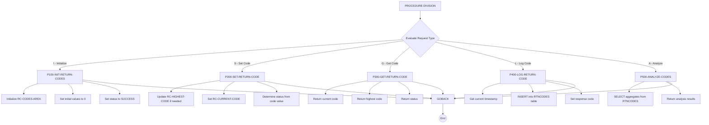

## Overview

RTNCDE00 is a standard return code handler that provides centralized management of return codes across the batch processing system. It operates as a callable subprogram that tracks, logs, and analyzes return codes from various programs in the system.

The program supports five primary operations: initializing return code tracking, setting new return codes (while tracking the highest value), retrieving current return code state, logging return codes to a DB2 audit table, and analyzing historical return code data for a specified time range.

This utility is essential for maintaining consistent return code handling across the system, providing visibility into program execution results, and enabling historical analysis of processing outcomes for troubleshooting and reporting purposes.

## Program Structure



## Data Structures

### Linkage Section (Input/Output Parameters)

The program receives a request structure through the linkage section, defined in the RTNCODE copybook:

| Level | Name | Picture | Description |
|-------|------|---------|-------------|
| 01 | RC-REQUEST-AREA | - | Main request structure |
| 05 | RC-REQUEST-TYPE | X | Request type: `I`, `S`, `G`, `L`, `A` |
| 05 | RC-PROGRAM-ID | X(8) | Program identifier for tracking |
| 05 | RC-CODES-AREA | - | Return code tracking area |
| 10 | RC-CURRENT-CODE | S9(4) COMP | Current return code value |
| 10 | RC-HIGHEST-CODE | S9(4) COMP | Highest return code seen |
| 10 | RC-NEW-CODE | S9(4) COMP | New code to set (input for SET) |
| 10 | RC-STATUS | X | Status indicator: `S`, `W`, `E`, `F` |
| 05 | RC-MESSAGE | X(80) | Message text for logging |
| 05 | RC-RESPONSE-CODE | S9(8) COMP | Response from operation (0=success) |

### Request Type Values

| Value | 88-Level Condition | Description |
|-------|-------------------|-------------|
| `I` | RC-INITIALIZE | Initialize return code tracking |
| `S` | RC-SET-CODE | Set a new return code |
| `G` | RC-GET-CODE | Get current return code state |
| `L` | RC-LOG-CODE | Log return code to DB2 |
| `A` | RC-ANALYZE | Analyze historical return codes |

### Status Values

| Value | 88-Level Condition | Code Range | Description |
|-------|-------------------|------------|-------------|
| `S` | RC-STATUS-SUCCESS | 0 | Successful completion |
| `W` | RC-STATUS-WARNING | 1-4 | Warning condition |
| `E` | RC-STATUS-ERROR | 5-8 | Error condition |
| `F` | RC-STATUS-SEVERE | >8 | Severe/fatal error |

### Analysis Data (for RC-ANALYZE request)

| Level | Name | Picture | Description |
|-------|------|---------|-------------|
| 10 | RC-START-TIME | X(26) | Start of analysis period |
| 10 | RC-END-TIME | X(26) | End of analysis period |
| 10 | RC-TOTAL-CODES | S9(8) COMP | Count of return codes found |
| 10 | RC-MAX-CODE | S9(4) COMP | Maximum return code in period |
| 10 | RC-MIN-CODE | S9(4) COMP | Minimum return code in period |

### Return Data (for RC-GET-CODE request)

| Level | Name | Picture | Description |
|-------|------|---------|-------------|
| 10 | RC-RETURN-VALUE | S9(4) COMP | Current return code value |
| 10 | RC-HIGHEST-RETURN | S9(4) COMP | Highest return code tracked |
| 10 | RC-RETURN-STATUS | X | Current status value |

### Working Storage

| Level | Name | Picture | Description |
|-------|------|---------|-------------|
| 01 | WS-CURRENT-TIME | - | Timestamp structure for logging |
| 10 | WS-CURRENT-YEAR | 9(4) | Year component |
| 10 | WS-CURRENT-MONTH | 9(2) | Month component |
| 10 | WS-CURRENT-DAY | 9(2) | Day component |
| 05 | WS-CURRENT-HOURS | 9(2) | Hours component |
| 05 | WS-CURRENT-MINUTES | 9(2) | Minutes component |
| 05 | WS-CURRENT-SECONDS | 9(2) | Seconds component |
| 05 | WS-CURRENT-MILLISEC | 9(2) | Milliseconds component |

## Control Flow

### Main Dispatch Logic

The program uses an `EVALUATE TRUE` statement to route requests based on the 88-level conditions defined on RC-REQUEST-TYPE. Each paragraph is executed with `PERFORM ... THRU` to include its corresponding exit paragraph.

### Initialize (P100-INIT-RETURN-CODES)

Resets all return code tracking:
1. Initializes RC-CODES-AREA to default values
2. Clears RC-PROGRAM-ID
3. Sets RC-CURRENT-CODE and RC-HIGHEST-CODE to 0
4. Sets status to SUCCESS
5. Sets response code to 0

### Set Return Code (P200-SET-RETURN-CODE)

Updates the return code state:
1. Compares RC-NEW-CODE with RC-HIGHEST-CODE and updates if higher
2. Moves RC-NEW-CODE to RC-CURRENT-CODE
3. Determines status based on code value:
   - 0 → SUCCESS
   - 1-4 → WARNING
   - 5-8 → ERROR
   - Other → SEVERE
4. Sets response code to 0

### Get Return Code (P300-GET-RETURN-CODE)

Retrieves current state:
1. Copies RC-CURRENT-CODE to RC-RETURN-VALUE
2. Copies RC-HIGHEST-CODE to RC-HIGHEST-RETURN
3. Copies RC-STATUS to RC-RETURN-STATUS
4. Sets response code to 0

### Log Return Code (P400-LOG-RETURN-CODE)

Persists return code to DB2:
1. Gets current timestamp using `FUNCTION CURRENT-DATE`
2. Inserts record into RTNCODES table with:
   - Timestamp
   - Program ID
   - Current return code
   - Highest return code
   - Status code
   - Message text
3. Sets response code based on SQLCODE (0=success, 8=error)

### Analyze Codes (P500-ANALYZE-CODES)

Retrieves historical analysis:
1. Executes SELECT with COUNT, MAX, MIN aggregations
2. Filters by program ID and time range (RC-START-TIME to RC-END-TIME)
3. Returns results in:
   - RC-TOTAL-CODES (count)
   - RC-MAX-CODE (maximum)
   - RC-MIN-CODE (minimum)
4. Sets response code based on SQLCODE (0=success, 8=error)

## Database Integration

### RTNCODES Table

The program interacts with the RTNCODES DB2 table for audit logging and analysis.

**Table Structure (inferred from SQL):**

| Column | Description |
|--------|-------------|
| TIMESTAMP | When the return code was logged |
| PROGRAM_ID | Identifier of the program |
| RETURN_CODE | The return code value |
| HIGHEST_CODE | Highest code seen for the program |
| STATUS_CODE | Status indicator (S/W/E/F) |
| MESSAGE_TEXT | Associated message text |

**Operations:**
- **INSERT**: Used by P400-LOG-RETURN-CODE to create audit records
- **SELECT**: Used by P500-ANALYZE-CODES for aggregation queries

### SQLCA

The program includes the SQL Communication Area (SQLCA) via `EXEC SQL INCLUDE SQLCA END-EXEC` for DB2 error handling. SQLCODE is checked after each SQL operation to determine success (0) or failure (non-zero).

## Return Code Mapping

The program maps numeric return codes to status categories:

```
┌─────────────────┬─────────────┬──────────────────┐
│  Return Code    │   Status    │   Description    │
├─────────────────┼─────────────┼──────────────────┤
│       0         │   SUCCESS   │  Normal completion│
│     1 - 4       │   WARNING   │  Minor issues     │
│     5 - 8       │   ERROR     │  Processing errors│
│      > 8        │   SEVERE    │  Critical failure │
└─────────────────┴─────────────┴──────────────────┘
```

## Response Codes

| Code | Description |
|------|-------------|
| 0 | Operation completed successfully |
| 8 | Database error occurred (SQLCODE ≠ 0) |

## Dependencies

### Copybooks

- **RTNCODE** - Return code management structure and 88-level conditions

### DB2 Objects

- **SQLCA** - SQL Communication Area (included via EXEC SQL INCLUDE)
- **RTNCODES** - Audit table for return code logging and analysis

### Related Programs

Programs that share the RTNCODE copybook:
- RPTAUD00 - Audit reporting
- RPTPOS00 - Position reporting
- RPTSTA00 - Status reporting
- TSTGEN00 - Test generation
- TSTVAL00 - Test validation
- UTLMNT00 - Utility maintenance
- UTLMON00 - Utility monitoring
- UTLVAL00 - Utility validation

## Usage Example

To track return codes during batch processing:

```cobol
* Initialize tracking for a program
MOVE 'I'        TO RC-REQUEST-TYPE
MOVE 'MYPGM001' TO RC-PROGRAM-ID
CALL 'RTNCDE00' USING RC-REQUEST-AREA

* Set a return code after an operation
MOVE 'S'        TO RC-REQUEST-TYPE
MOVE 4          TO RC-NEW-CODE
MOVE 'Validation warning detected' TO RC-MESSAGE
CALL 'RTNCDE00' USING RC-REQUEST-AREA

* Log the return code to DB2
MOVE 'L'        TO RC-REQUEST-TYPE
CALL 'RTNCDE00' USING RC-REQUEST-AREA

* Get final return code state
MOVE 'G'        TO RC-REQUEST-TYPE
CALL 'RTNCDE00' USING RC-REQUEST-AREA
* RC-RETURN-VALUE now contains current code
* RC-HIGHEST-RETURN contains highest code seen
```

To analyze historical return codes:

```cobol
MOVE 'A'                    TO RC-REQUEST-TYPE
MOVE 'MYPGM001'             TO RC-PROGRAM-ID
MOVE '2024-01-01-00.00.00'  TO RC-START-TIME
MOVE '2024-01-31-23.59.59'  TO RC-END-TIME
CALL 'RTNCDE00' USING RC-REQUEST-AREA
* RC-TOTAL-CODES contains count of entries
* RC-MAX-CODE contains highest code in period
* RC-MIN-CODE contains lowest code in period
```

## Technical Notes

- The program uses **PERFORM ... THRU** to execute paragraphs with their corresponding EXIT paragraphs, a common COBOL pattern for structured programming
- **FUNCTION CURRENT-DATE** is an intrinsic function that returns a 21-character timestamp (YYYYMMDDHHMMSSFF±HHMM format)
- The program uses **COMP** (binary) fields for numeric values, which is efficient for arithmetic and DB2 compatibility
- The **GOBACK** statement returns control to the calling program, allowing this to function as a reusable subroutine
- The "highest code" tracking ensures that the worst outcome is always preserved, even if subsequent operations succeed
- No explicit COMMIT is issued; the calling program is responsible for transaction management
