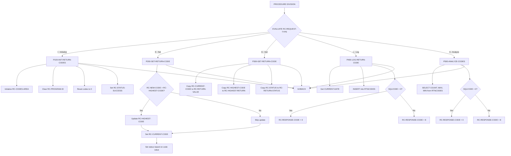
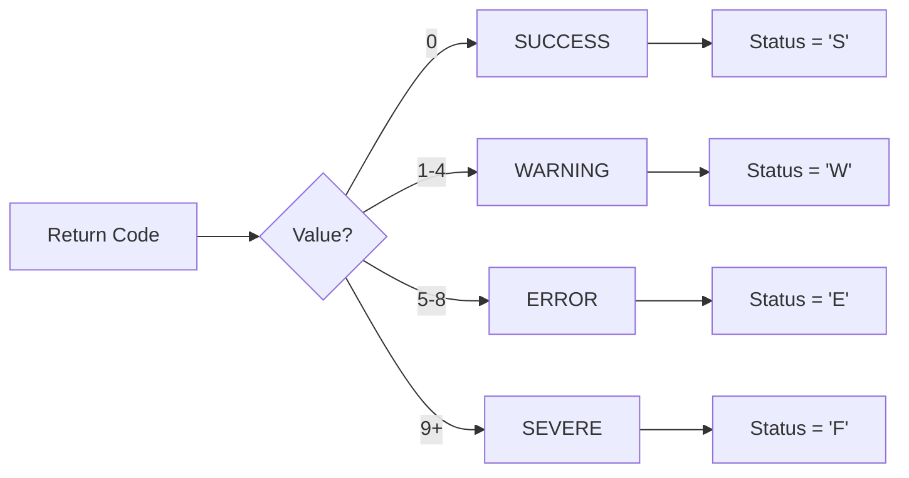

## Overview

RTNCDE00 is a standard return code handler that provides centralized management of return codes across the batch processing system. The program offers five core functions: initializing return code tracking, setting return codes, retrieving current codes, logging codes to a DB2 audit table, and analyzing historical return code data.

This utility program acts as a shared service called by other programs to maintain consistent return code handling throughout the application. It tracks both the current return code and the highest return code encountered during processing, automatically categorizing codes into severity levels (Success, Warning, Error, Severe).

The program integrates with DB2 to maintain a persistent audit trail of return codes in the RTNCODES table, enabling post-processing analysis and reporting. Programs like RPTAUD00, RPTPOS00, RPTSTA00, and various utility programs use this handler for standardized return code management.

## Program Structure



## Data Structures

### Linkage Section (RTNCODE Copybook)

The program receives all parameters through the RC-REQUEST-AREA structure:

| Level | Name | Picture | Description |
|-------|------|---------|-------------|
| 01 | RC-REQUEST-AREA | - | Main request area (from RTNCODE copybook) |
| 05 | RC-REQUEST-TYPE | X | Function code: I=Init, S=Set, G=Get, L=Log, A=Analyze |
| 05 | RC-PROGRAM-ID | X(8) | Calling program identifier |
| 10 | RC-CURRENT-CODE | S9(4) COMP | Current return code value |
| 10 | RC-HIGHEST-CODE | S9(4) COMP | Highest return code encountered |
| 10 | RC-NEW-CODE | S9(4) COMP | New code to set (input for SET function) |
| 10 | RC-STATUS | X | Status indicator: S=Success, W=Warning, E=Error, F=Severe |
| 05 | RC-MESSAGE | X(80) | Message text for logging |
| 05 | RC-RESPONSE-CODE | S9(8) COMP | Response code from this program (0=OK, 8=Error) |

### Analysis Data (for ANALYZE function)

| Level | Name | Picture | Description |
|-------|------|---------|-------------|
| 10 | RC-START-TIME | X(26) | Start of analysis time range |
| 10 | RC-END-TIME | X(26) | End of analysis time range |
| 10 | RC-TOTAL-CODES | S9(8) COMP | Count of return codes in range |
| 10 | RC-MAX-CODE | S9(4) COMP | Maximum return code found |
| 10 | RC-MIN-CODE | S9(4) COMP | Minimum return code found |

### Return Data (for GET function)

| Level | Name | Picture | Description |
|-------|------|---------|-------------|
| 10 | RC-RETURN-VALUE | S9(4) COMP | Retrieved current code |
| 10 | RC-HIGHEST-RETURN | S9(4) COMP | Retrieved highest code |
| 10 | RC-RETURN-STATUS | X | Retrieved status |

### Working Storage

| Level | Name | Picture | Description |
|-------|------|---------|-------------|
| 01 | WS-CURRENT-TIME | - | Timestamp structure for DB2 logging |
| 10 | WS-CURRENT-YEAR | 9(4) | Year component |
| 10 | WS-CURRENT-MONTH | 9(2) | Month component |
| 10 | WS-CURRENT-DAY | 9(2) | Day component |
| 05 | WS-CURRENT-HOURS | 9(2) | Hours component |
| 05 | WS-CURRENT-MINUTES | 9(2) | Minutes component |
| 05 | WS-CURRENT-SECONDS | 9(2) | Seconds component |
| 05 | WS-CURRENT-MILLISEC | 9(2) | Milliseconds component |
| 01 | WS-DB2-AREA | - | Contains SQLCA for DB2 operations |

## Database Operations

### RTNCODES Table

The program interacts with the RTNCODES DB2 table for logging and analysis:

| Column | Source Field | Description |
|--------|--------------|-------------|
| TIMESTAMP | WS-CURRENT-TIME | When the return code was logged |
| PROGRAM_ID | RC-PROGRAM-ID | Program that generated the code |
| RETURN_CODE | RC-CURRENT-CODE | The return code value |
| HIGHEST_CODE | RC-HIGHEST-CODE | Highest code for the session |
| STATUS_CODE | RC-STATUS | Status category (S/W/E/F) |
| MESSAGE_TEXT | RC-MESSAGE | Descriptive message |

### SQL Operations

**INSERT (P400-LOG-RETURN-CODE)**:
```sql
INSERT INTO RTNCODES
  (TIMESTAMP, PROGRAM_ID, RETURN_CODE, HIGHEST_CODE, STATUS_CODE, MESSAGE_TEXT)
VALUES
  (:WS-CURRENT-TIME, :RC-PROGRAM-ID, :RC-CURRENT-CODE, 
   :RC-HIGHEST-CODE, :RC-STATUS, :RC-MESSAGE)
```

**SELECT (P500-ANALYZE-CODES)**:
```sql
SELECT COUNT(*), MAX(RETURN_CODE), MIN(RETURN_CODE)
INTO :RC-TOTAL-CODES, :RC-MAX-CODE, :RC-MIN-CODE
FROM RTNCODES
WHERE PROGRAM_ID = :RC-PROGRAM-ID
  AND TIMESTAMP >= :RC-START-TIME
  AND TIMESTAMP <= :RC-END-TIME
```

## Control Flow

### Initialize (RC-REQUEST-TYPE = 'I')

**P100-INIT-RETURN-CODES** resets all return code tracking:
1. Initializes RC-CODES-AREA to binary zeros
2. Clears RC-PROGRAM-ID to spaces
3. Sets RC-CURRENT-CODE and RC-HIGHEST-CODE to 0
4. Sets RC-STATUS to 'S' (Success)
5. Sets RC-RESPONSE-CODE to 0

### Set Return Code (RC-REQUEST-TYPE = 'S')

**P200-SET-RETURN-CODE** sets a new return code and tracks the highest:
1. Compares RC-NEW-CODE to RC-HIGHEST-CODE
2. Updates RC-HIGHEST-CODE if new code is higher
3. Moves RC-NEW-CODE to RC-CURRENT-CODE
4. Sets RC-STATUS based on code value:

| Code Range | Status | Meaning |
|------------|--------|---------|
| 0 | RC-STATUS-SUCCESS ('S') | Successful completion |
| 1-4 | RC-STATUS-WARNING ('W') | Warning condition |
| 5-8 | RC-STATUS-ERROR ('E') | Error condition |
| 9+ | RC-STATUS-SEVERE ('F') | Severe/Fatal error |

### Get Return Code (RC-REQUEST-TYPE = 'G')

**P300-GET-RETURN-CODE** retrieves current tracking values:
1. Copies RC-CURRENT-CODE to RC-RETURN-VALUE
2. Copies RC-HIGHEST-CODE to RC-HIGHEST-RETURN
3. Copies RC-STATUS to RC-RETURN-STATUS
4. Sets RC-RESPONSE-CODE to 0

### Log Return Code (RC-REQUEST-TYPE = 'L')

**P400-LOG-RETURN-CODE** persists the return code to DB2:
1. Gets current timestamp using FUNCTION CURRENT-DATE
2. Executes INSERT into RTNCODES table
3. Sets RC-RESPONSE-CODE to 0 if successful, 8 if SQL error

### Analyze Return Codes (RC-REQUEST-TYPE = 'A')

**P500-ANALYZE-CODES** queries historical return code data:
1. Executes SELECT with aggregate functions (COUNT, MAX, MIN)
2. Filters by RC-PROGRAM-ID and time range (RC-START-TIME to RC-END-TIME)
3. Returns results in RC-TOTAL-CODES, RC-MAX-CODE, RC-MIN-CODE
4. Sets RC-RESPONSE-CODE to 0 if successful, 8 if SQL error

## Return Code Classification



## Response Codes

| Code | Meaning |
|------|---------|
| 0 | Operation completed successfully |
| 8 | DB2 error occurred (SQLCODE ≠ 0) |

## Dependencies

### Copybooks

- **RTNCODE** - Return code management data structures and 88-level conditions

### DB2 Resources

- **SQLCA** - SQL Communication Area (included via EXEC SQL INCLUDE)
- **RTNCODES** - Return code audit table

### Related Programs

Programs that use the RTNCODE copybook and may call this handler:

- **RPTAUD00** - Audit reporting
- **RPTPOS00** - Position reporting  
- **RPTSTA00** - Status reporting
- **TSTGEN00** - Test generation
- **TSTVAL00** - Test validation
- **UTLMNT00** - Maintenance utility
- **UTLMON00** - Monitoring utility
- **UTLVAL00** - Validation utility

## Technical Notes

1. **FUNCTION CURRENT-DATE**: This COBOL intrinsic function returns a 21-character string containing the current date and time in the format YYYYMMDDHHMMSSHHNNNN (where HH is hundredths of seconds). The program maps this to the WS-CURRENT-TIME structure.

2. **COMP Fields**: Binary fields (`S9(4) COMP` and `S9(8) COMP`) are used for return codes and counts for efficient arithmetic and DB2 compatibility.

3. **Level-88 Conditions**: The copybook uses 88-level condition names extensively for readable code:
   - `RC-INITIALIZE`, `RC-SET-CODE`, etc. for request types
   - `RC-STATUS-SUCCESS`, `RC-STATUS-WARNING`, etc. for status values

4. **Highest Code Tracking**: The program maintains both current and highest return codes, allowing callers to set multiple codes during processing while preserving the most severe code encountered.

5. **PERFORM THRU**: The program uses `PERFORM paragraph-name THRU paragraph-EXIT` pattern, ensuring each function has a clean exit point.

6. **No File I/O**: This program has no VSAM or sequential file operations; all persistence is through embedded DB2 SQL.

7. **Stateless Design**: The program maintains no internal state between calls. All state is passed through the linkage section, making it suitable for concurrent use by multiple programs.

## Usage Example

A calling program would typically:

```cobol
* Initialize return code tracking
MOVE 'I' TO RC-REQUEST-TYPE
MOVE 'MYPROG00' TO RC-PROGRAM-ID
CALL 'RTNCDE00' USING RC-REQUEST-AREA

* Set a return code during processing
MOVE 'S' TO RC-REQUEST-TYPE
MOVE 4 TO RC-NEW-CODE
MOVE 'Warning: Record count mismatch' TO RC-MESSAGE
CALL 'RTNCDE00' USING RC-REQUEST-AREA

* Log the return code to DB2
MOVE 'L' TO RC-REQUEST-TYPE
CALL 'RTNCDE00' USING RC-REQUEST-AREA

* Get the highest return code at end
MOVE 'G' TO RC-REQUEST-TYPE
CALL 'RTNCDE00' USING RC-REQUEST-AREA
MOVE RC-HIGHEST-RETURN TO RETURN-CODE
```
