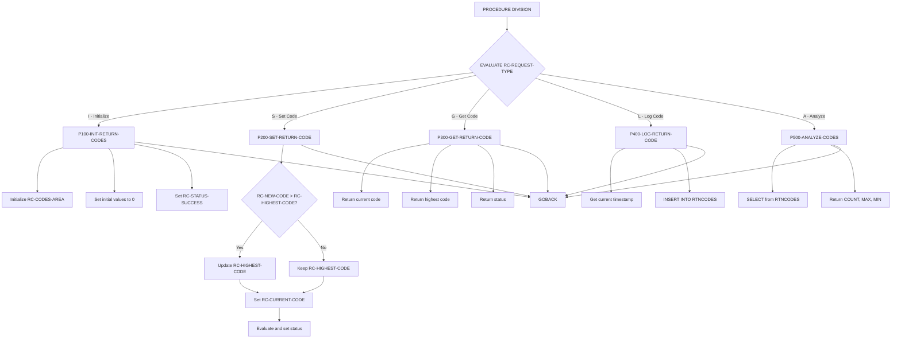
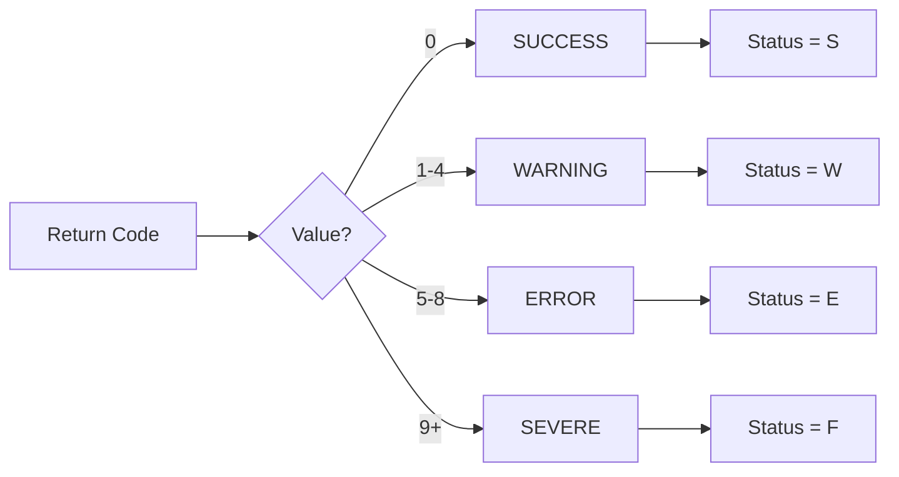

## Overview

RTNCDE00 is a Standard Return Code Handler that provides centralized management of return codes across the batch processing system. It offers a consistent interface for setting, retrieving, logging, and analyzing return codes used by multiple programs.

The program implements five distinct functions: initialization, setting return codes, getting return codes, logging to DB2, and analyzing historical return code data. By centralizing return code management, it ensures consistent behavior across the system and maintains an audit trail of all return codes in a DB2 table.

RTNCDE00 is designed to be called by other programs as a subprogram, receiving requests through a standardized linkage area defined in the RTNCODE copybook. The program automatically tracks both the current return code and the highest return code encountered during processing, which is essential for batch job step condition code management.

## Program Structure



## Data Structures

### Linkage Section (RC-REQUEST-AREA from RTNCODE copybook)

| Level | Name | Picture | Description |
|-------|------|---------|-------------|
| 05 | RC-REQUEST-TYPE | X | Function request type |
| 05 | RC-PROGRAM-ID | X(8) | Calling program identifier |
| 10 | RC-CURRENT-CODE | S9(4) COMP | Current return code value |
| 10 | RC-HIGHEST-CODE | S9(4) COMP | Highest return code encountered |
| 10 | RC-NEW-CODE | S9(4) COMP | New return code to set |
| 10 | RC-STATUS | X | Status indicator (S/W/E/F) |
| 05 | RC-MESSAGE | X(80) | Message text for logging |
| 05 | RC-RESPONSE-CODE | S9(8) COMP | Response code from operation (0=success) |

### Request Type Values

| Value | Condition Name | Description |
|-------|----------------|-------------|
| `I` | RC-INITIALIZE | Initialize return code area |
| `S` | RC-SET-CODE | Set a new return code |
| `G` | RC-GET-CODE | Get current return code information |
| `L` | RC-LOG-CODE | Log return code to DB2 |
| `A` | RC-ANALYZE | Analyze historical return codes |

### Status Values

| Value | Condition Name | Return Code Range | Description |
|-------|----------------|-------------------|-------------|
| `S` | RC-STATUS-SUCCESS | 0 | Successful completion |
| `W` | RC-STATUS-WARNING | 1-4 | Warning condition |
| `E` | RC-STATUS-ERROR | 5-8 | Error condition |
| `F` | RC-STATUS-SEVERE | 9+ | Severe/fatal error |

### Analysis Data Area

| Level | Name | Picture | Description |
|-------|------|---------|-------------|
| 10 | RC-START-TIME | X(26) | Start of analysis time range |
| 10 | RC-END-TIME | X(26) | End of analysis time range |
| 10 | RC-TOTAL-CODES | S9(8) COMP | Count of return codes in range |
| 10 | RC-MAX-CODE | S9(4) COMP | Maximum return code in range |
| 10 | RC-MIN-CODE | S9(4) COMP | Minimum return code in range |

### Return Data Area

| Level | Name | Picture | Description |
|-------|------|---------|-------------|
| 10 | RC-RETURN-VALUE | S9(4) COMP | Retrieved current return code |
| 10 | RC-HIGHEST-RETURN | S9(4) COMP | Retrieved highest return code |
| 10 | RC-RETURN-STATUS | X | Retrieved status |

### Working Storage

| Level | Name | Picture | Description |
|-------|------|---------|-------------|
| 01 | WS-CURRENT-TIME | | Timestamp structure for DB2 logging |
| 10 | WS-CURRENT-YEAR | 9(4) | Year component |
| 10 | WS-CURRENT-MONTH | 9(2) | Month component |
| 10 | WS-CURRENT-DAY | 9(2) | Day component |
| 05 | WS-CURRENT-HOURS | 9(2) | Hours component |
| 05 | WS-CURRENT-MINUTES | 9(2) | Minutes component |
| 05 | WS-CURRENT-SECONDS | 9(2) | Seconds component |
| 05 | WS-CURRENT-MILLISEC | 9(2) | Milliseconds component |
| 01 | WS-DB2-AREA | | SQL Communication Area (SQLCA) |

## Database Operations

### RTNCODES Table

The program interacts with a DB2 table named RTNCODES for logging and analysis:

| Column | Source Field | Description |
|--------|--------------|-------------|
| TIMESTAMP | WS-CURRENT-TIME | When the return code was logged |
| PROGRAM_ID | RC-PROGRAM-ID | Program that generated the code |
| RETURN_CODE | RC-CURRENT-CODE | The return code value |
| HIGHEST_CODE | RC-HIGHEST-CODE | Highest code at time of logging |
| STATUS_CODE | RC-STATUS | Status indicator |
| MESSAGE_TEXT | RC-MESSAGE | Associated message |

### SQL Operations

**P400-LOG-RETURN-CODE (INSERT):**
```sql
INSERT INTO RTNCODES
  (TIMESTAMP, PROGRAM_ID, RETURN_CODE, HIGHEST_CODE, STATUS_CODE, MESSAGE_TEXT)
VALUES
  (:WS-CURRENT-TIME, :RC-PROGRAM-ID, :RC-CURRENT-CODE, 
   :RC-HIGHEST-CODE, :RC-STATUS, :RC-MESSAGE)
```

**P500-ANALYZE-CODES (SELECT):**
```sql
SELECT COUNT(*), MAX(RETURN_CODE), MIN(RETURN_CODE)
INTO :RC-TOTAL-CODES, :RC-MAX-CODE, :RC-MIN-CODE
FROM RTNCODES
WHERE PROGRAM_ID = :RC-PROGRAM-ID
  AND TIMESTAMP >= :RC-START-TIME
  AND TIMESTAMP <= :RC-END-TIME
```

## Control Flow

### Function: Initialize (RC-INITIALIZE)

**P100-INIT-RETURN-CODES:**
1. Initializes the RC-CODES-AREA to default values
2. Clears RC-PROGRAM-ID to spaces
3. Sets RC-CURRENT-CODE and RC-HIGHEST-CODE to 0
4. Sets status to RC-STATUS-SUCCESS
5. Sets RC-RESPONSE-CODE to 0

### Function: Set Code (RC-SET-CODE)

**P200-SET-RETURN-CODE:**
1. Compares RC-NEW-CODE with RC-HIGHEST-CODE
2. If new code is higher, updates RC-HIGHEST-CODE (high-water mark)
3. Sets RC-CURRENT-CODE to the new value
4. Evaluates the code and sets appropriate status:

| Code Range | Status Set |
|------------|------------|
| 0 | RC-STATUS-SUCCESS |
| 1-4 | RC-STATUS-WARNING |
| 5-8 | RC-STATUS-ERROR |
| 9+ | RC-STATUS-SEVERE |

5. Sets RC-RESPONSE-CODE to 0

### Function: Get Code (RC-GET-CODE)

**P300-GET-RETURN-CODE:**
1. Copies RC-CURRENT-CODE to RC-RETURN-VALUE
2. Copies RC-HIGHEST-CODE to RC-HIGHEST-RETURN
3. Copies RC-STATUS to RC-RETURN-STATUS
4. Sets RC-RESPONSE-CODE to 0

### Function: Log Code (RC-LOG-CODE)

**P400-LOG-RETURN-CODE:**
1. Obtains current timestamp using FUNCTION CURRENT-DATE
2. Executes SQL INSERT to RTNCODES table
3. Sets RC-RESPONSE-CODE to 0 if SQLCODE = 0, otherwise 8

### Function: Analyze (RC-ANALYZE)

**P500-ANALYZE-CODES:**
1. Executes SQL SELECT to aggregate return code data for the specified program and time range
2. Returns count, maximum, and minimum values
3. Sets RC-RESPONSE-CODE to 0 if SQLCODE = 0, otherwise 8

## Return Code Classification



## Dependencies

### Copybooks

- **RTNCODE** - Return code management definitions including request types, status values, and data areas

### DB2 Objects

- **SQLCA** - SQL Communication Area (included via EXEC SQL INCLUDE)
- **RTNCODES** - DB2 table for return code audit trail

### Related Programs

Programs that use the RTNCODE copybook:

| Program | Description |
|---------|-------------|
| RPTAUD00 | Audit reporting |
| RPTPOS00 | Position reporting |
| RPTSTA00 | Status reporting |
| TSTGEN00 | Test data generation |
| TSTVAL00 | Test validation |
| UTLMNT00 | Utility maintenance |
| UTLMON00 | Utility monitoring |
| UTLVAL00 | Utility validation |

## Usage Examples

### Initialize Return Codes
```cobol
MOVE 'I' TO RC-REQUEST-TYPE
MOVE 'MYPROG01' TO RC-PROGRAM-ID
CALL 'RTNCDE00' USING RC-REQUEST-AREA
```

### Set a Return Code
```cobol
MOVE 'S' TO RC-REQUEST-TYPE
MOVE 4 TO RC-NEW-CODE
CALL 'RTNCDE00' USING RC-REQUEST-AREA
* RC-STATUS will be set to 'W' (warning)
* RC-HIGHEST-CODE will be updated if 4 > previous highest
```

### Get Current Return Code
```cobol
MOVE 'G' TO RC-REQUEST-TYPE
CALL 'RTNCDE00' USING RC-REQUEST-AREA
* Check RC-RETURN-VALUE for current code
* Check RC-HIGHEST-RETURN for highest code
* Check RC-RETURN-STATUS for status
```

### Log Return Code to DB2
```cobol
MOVE 'L' TO RC-REQUEST-TYPE
MOVE 'Processing complete' TO RC-MESSAGE
CALL 'RTNCDE00' USING RC-REQUEST-AREA
IF RC-RESPONSE-CODE NOT = 0
    DISPLAY 'Error logging return code'
END-IF
```

### Analyze Historical Return Codes
```cobol
MOVE 'A' TO RC-REQUEST-TYPE
MOVE '2024-01-01-00.00.00.000000' TO RC-START-TIME
MOVE '2024-01-31-23.59.59.999999' TO RC-END-TIME
CALL 'RTNCDE00' USING RC-REQUEST-AREA
IF RC-RESPONSE-CODE = 0
    DISPLAY 'Total codes: ' RC-TOTAL-CODES
    DISPLAY 'Max code: ' RC-MAX-CODE
    DISPLAY 'Min code: ' RC-MIN-CODE
END-IF
```

## Technical Notes

1. **High-Water Mark Tracking**: The program maintains RC-HIGHEST-CODE which only increases, never decreases. This is critical for batch job step condition code evaluation where the highest return code determines overall job status.

2. **COMP Fields**: The return code fields use `S9(4) COMP` (binary halfword) format, which is standard for z/OS return codes and efficient for DB2 operations.

3. **Timestamp Format**: The WS-CURRENT-TIME structure is populated using `FUNCTION CURRENT-DATE`, which returns a 21-character string in the format YYYYMMDDHHMMSSFF (plus additional precision).

4. **DB2 Error Handling**: SQL operations return RC-RESPONSE-CODE of 8 on failure, allowing the calling program to detect and handle database errors.
