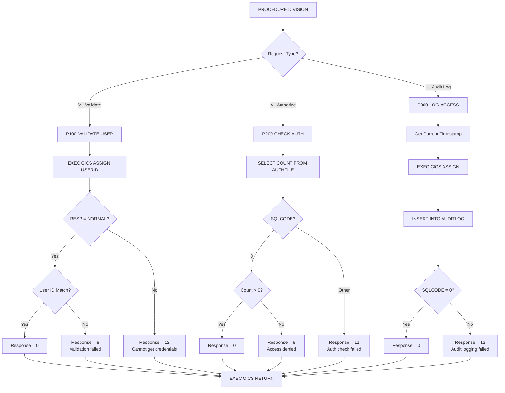
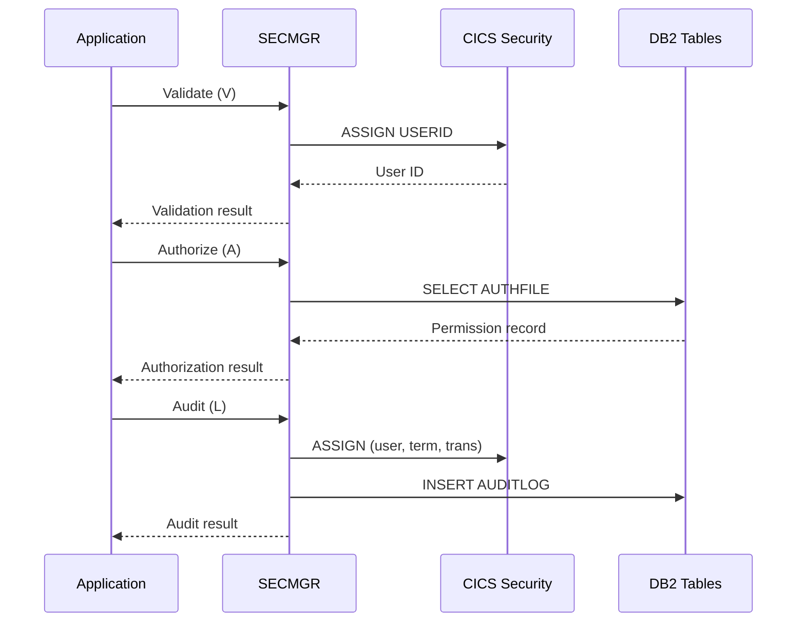

## Overview

SECMGR is a CICS-based security management program that provides centralized authentication, authorization, and auditing services for online applications. It serves as a security gateway that other CICS programs call to verify user identity, check access permissions, and log security-relevant events.

The program implements three core security functions: user validation against CICS credentials, authorization checking against a DB2 permission table, and audit logging of access attempts. This separation of security logic into a dedicated program promotes consistent security enforcement across all online applications and simplifies compliance with security policies.

SECMGR integrates with both CICS security (for user authentication) and DB2 (for authorization data and audit storage), providing a comprehensive security solution for the online transaction processing environment.

## Program Structure



## Data Structures

### Linkage Section - Security Request Area

| Level | Name | Picture | Description |
|-------|------|---------|-------------|
| 01 | SECURITY-REQUEST-AREA | - | Main communication area |
| 05 | SEC-REQUEST-TYPE | X | Request type: 'V', 'A', or 'L' |
| 05 | SEC-USER-ID | X(8) | User identifier to validate/authorize |
| 05 | SEC-RESOURCE-NAME | X(8) | Resource (program/transaction) name |
| 05 | SEC-ACCESS-TYPE | X(8) | Type of access requested |
| 05 | SEC-RESPONSE-CODE | S9(8) COMP | Response code (0=success) |
| 05 | SEC-ERROR-INFO | X(80) | Error message when request fails |

### Request Type Values

| Value | Condition Name | Description |
|-------|---------------|-------------|
| 'V' | SEC-VALIDATE | Validate user credentials |
| 'A' | SEC-AUTHORIZE | Check user authorization |
| 'L' | SEC-AUDIT | Log access to audit trail |

### Working Storage - Security Area

| Level | Name | Picture | Description |
|-------|------|---------|-------------|
| 01 | WS-SECURITY-AREA | - | Security working fields |
| 05 | WS-USER-ID | X(8) | User ID from CICS |
| 05 | WS-TERMINAL-ID | X(4) | Terminal identifier |
| 05 | WS-TRANSACTION-ID | X(4) | Transaction code |
| 05 | WS-PROGRAM-NAME | X(8) | Program being accessed |
| 05 | WS-ACCESS-TYPE | X(8) | Access type being logged |
| 05 | WS-TIMESTAMP | X(26) | Current timestamp for audit |

### Working Storage - DB2 Area

| Level | Name | Description |
|-------|------|-------------|
| 01 | WS-DB2-AREA | DB2 communication area |
| - | SQLCA | SQL Communication Area (included) |

### Error Handling Area (from ERRHND copybook)

| Level | Name | Picture | Description |
|-------|------|---------|-------------|
| 01 | ERROR-HANDLING | - | Error handling structure |
| 05 | ERR-PROGRAM | X(8) | Program name |
| 05 | ERR-PARAGRAPH | X(30) | Paragraph name |
| 05 | ERR-SQLCODE | S9(9) COMP | SQL return code |
| 05 | ERR-CICS-RESP | S9(8) COMP | CICS EIBRESP |
| 05 | ERR-CICS-RESP2 | S9(8) COMP | CICS EIBRESP2 |
| 05 | ERR-SEVERITY | X | 'F'=Fatal, 'W'=Warning, 'I'=Info |
| 05 | ERR-MESSAGE | X(80) | Error message |
| 05 | ERR-ACTION | X | 'R'=Return, 'C'=Continue, 'A'=Abend |

## Database Access

### Tables Used

| Table Name | Operation | Purpose |
|------------|-----------|---------|
| AUTHFILE | SELECT | Check user authorization permissions |
| AUDITLOG | INSERT | Record security audit events |

### Authorization Check Query (P200-CHECK-AUTH)

```sql
SELECT COUNT(*)
INTO :WS-DB2-AREA
FROM AUTHFILE
WHERE USER_ID = :SEC-USER-ID
  AND RESOURCE = :SEC-RESOURCE-NAME
  AND ACCESS_TYPE = :SEC-ACCESS-TYPE
```

Checks if the specified user has the requested access type to the named resource. A count greater than zero indicates authorization is granted.

### Audit Log Insert (P300-LOG-ACCESS)

```sql
INSERT INTO AUDITLOG
(TIMESTAMP, USER_ID, TERMINAL_ID, 
 TRANS_ID, PROGRAM, ACCESS_TYPE)
VALUES
(:WS-TIMESTAMP, :WS-USER-ID, :WS-TERMINAL-ID,
 :WS-TRANSACTION-ID, :WS-PROGRAM-NAME, 
 :WS-ACCESS-TYPE)
```

Records a complete audit trail entry including when, who, where, and what was accessed.

### AUTHFILE Table Structure (implied)

| Column | Type | Description |
|--------|------|-------------|
| USER_ID | CHAR(8) | User identifier |
| RESOURCE | CHAR(8) | Resource name (program/transaction) |
| ACCESS_TYPE | CHAR(8) | Type of access permitted |

### AUDITLOG Table Structure (implied)

| Column | Type | Description |
|--------|------|-------------|
| TIMESTAMP | CHAR(26) | When access occurred |
| USER_ID | CHAR(8) | Who accessed |
| TERMINAL_ID | CHAR(4) | From which terminal |
| TRANS_ID | CHAR(4) | Transaction code |
| PROGRAM | CHAR(8) | Program accessed |
| ACCESS_TYPE | CHAR(8) | Type of access |

## Control Flow

### User Validation (SEC-REQUEST-TYPE = 'V')

The validation function verifies the user's identity against CICS credentials:

1. **P100-VALIDATE-USER**: User credential validation
   - Executes `EXEC CICS ASSIGN USERID` to get the current CICS user ID
   - Checks the CICS response code:
     - If DFHRESP(NORMAL):
       - Compares SEC-USER-ID (from request) with WS-USER-ID (from CICS)
       - If match: Sets response code to 0 (success)
       - If no match: Sets error info to "User validation failed", response code to 8
     - If not NORMAL:
       - Sets error info to "Unable to obtain user credentials"
       - Sets response code to 12

### Authorization Check (SEC-REQUEST-TYPE = 'A')

The authorization function checks if the user has permission to access a resource:

1. **P200-CHECK-AUTH**: Permission verification
   - Executes SELECT COUNT(*) against AUTHFILE table
   - Searches for a matching record with user ID, resource name, and access type
   - Evaluates SQLCODE:
     - SQLCODE = 0:
       - If count > 0: Authorization granted, response code = 0
       - If count = 0: Sets error info to "Access denied", response code = 8
     - SQLCODE = other:
       - Sets error info to "Authorization check failed"
       - Sets response code to 12

### Audit Logging (SEC-REQUEST-TYPE = 'L')

The audit function records access events for security compliance:

1. **P300-LOG-ACCESS**: Audit trail creation
   - Gets current timestamp using `FUNCTION CURRENT-DATE`
   - Executes `EXEC CICS ASSIGN` to capture:
     - WS-USER-ID (current user)
     - WS-TERMINAL-ID (terminal identifier)
     - WS-TRANSACTION-ID (transaction code)
   - Copies SEC-RESOURCE-NAME to WS-PROGRAM-NAME
   - Copies SEC-ACCESS-TYPE to WS-ACCESS-TYPE
   - Executes INSERT into AUDITLOG table
   - If SQLCODE = 0: Sets response code to 0
   - Otherwise: Sets error info to "Audit logging failed", response code = 12

## CICS Commands Used

| Command | Paragraph | Purpose |
|---------|-----------|---------|
| EXEC CICS ASSIGN USERID | P100-VALIDATE-USER | Get current CICS user ID |
| EXEC CICS ASSIGN | P300-LOG-ACCESS | Get user, terminal, and transaction IDs |
| EXEC CICS RETURN | Main procedure | Return to calling program |

## Dependencies

### Copybooks

- **ERRHND** - Online error handling structure with severity levels and action codes

### Called Programs

This program does not call other programs. It is designed to be called by other online programs.

### Related Programs

Programs that share copybooks and may call SECMGR:

- **DB2ONLN** - DB2 online connection manager (uses ERRHND)
- **DB2RECV** - DB2 recovery manager (uses ERRHND)
- **ERRHNDL** - Error handler (uses ERRHND)
- **INQONLN** - Online inquiry program (uses ERRHND)

## Technical Notes

### Response Codes

| Code | Meaning | When Set |
|------|---------|----------|
| 0 | Success | Operation completed successfully |
| 8 | Authorization failure | User validation failed or access denied |
| 12 | System error | Unable to get credentials or DB2 error |

### Security Flow Pattern

A typical calling program should invoke SECMGR in this sequence:



### Usage Example

```cobol
* Step 1: Validate user identity
MOVE 'V' TO SEC-REQUEST-TYPE
MOVE EIBUSERID TO SEC-USER-ID

EXEC CICS LINK PROGRAM('SECMGR')
              COMMAREA(SECURITY-REQUEST-AREA)
              LENGTH(LENGTH OF SECURITY-REQUEST-AREA)
END-EXEC

IF SEC-RESPONSE-CODE NOT = 0
    PERFORM SECURITY-ERROR
END-IF

* Step 2: Check authorization
MOVE 'A' TO SEC-REQUEST-TYPE
MOVE 'INQPORT' TO SEC-RESOURCE-NAME
MOVE 'READ' TO SEC-ACCESS-TYPE

EXEC CICS LINK PROGRAM('SECMGR')
              COMMAREA(SECURITY-REQUEST-AREA)
              LENGTH(LENGTH OF SECURITY-REQUEST-AREA)
END-EXEC

IF SEC-RESPONSE-CODE NOT = 0
    PERFORM ACCESS-DENIED
END-IF

* Step 3: Log the access
MOVE 'L' TO SEC-REQUEST-TYPE

EXEC CICS LINK PROGRAM('SECMGR')
              COMMAREA(SECURITY-REQUEST-AREA)
              LENGTH(LENGTH OF SECURITY-REQUEST-AREA)
END-EXEC
```

### Access Type Values

Common access types that might be stored in AUTHFILE:

| Access Type | Description |
|-------------|-------------|
| READ | View/inquiry access |
| UPDATE | Modify existing data |
| CREATE | Add new records |
| DELETE | Remove records |
| EXECUTE | Run program/transaction |
| ADMIN | Administrative functions |

### DFHRESP Macro

The program uses `DFHRESP(NORMAL)` to check for successful CICS command completion. This is a CICS-provided macro that translates to the numeric response code for normal completion, making the code more readable and maintainable.

### Audit Trail Considerations

The audit log captures:
- **When**: Timestamp from FUNCTION CURRENT-DATE
- **Who**: User ID from CICS ASSIGN
- **Where**: Terminal ID and Transaction ID from CICS ASSIGN  
- **What**: Resource name and access type from the request

This provides a complete audit trail for security compliance and forensic analysis.

### COBOL Features Used

- **EXEC SQL INCLUDE SQLCA**: Includes the SQL Communication Area for DB2 access
- **FUNCTION CURRENT-DATE**: Intrinsic function returning system date/time in YYYYMMDDHHMMSSFF format
- **88-level condition names**: Used for request type values (SEC-VALIDATE, SEC-AUTHORIZE, SEC-AUDIT)
- **EXEC CICS ASSIGN**: Retrieves CICS system values like user ID, terminal ID, transaction ID
- **EXEC CICS RETURN**: Returns control to calling program
- **DFHRESP**: CICS macro for readable response code checking
- **EVALUATE TRUE**: Multi-way branch based on condition names
