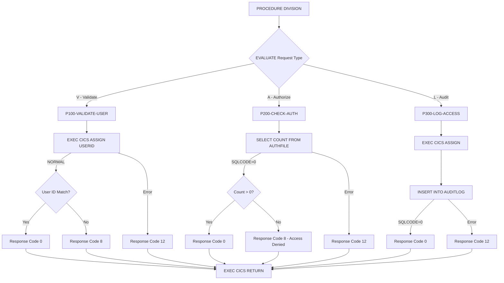

## Overview

SECMGR is a CICS online program that provides centralized security services for the application suite. It implements three core security functions: user validation, authorization checking, and audit logging. The program serves as a security gateway that other online programs call to verify credentials and permissions before granting access to protected resources.

The program integrates with both CICS security services (for user identification) and DB2 (for authorization rules and audit trail storage). By centralizing security logic, SECMGR ensures consistent enforcement of access controls across all online transactions.

Key capabilities include:
- **User Validation**: Verifies CICS user credentials match the requested user
- **Authorization**: Checks DB2-based access control lists for resource permissions
- **Audit Logging**: Records all access attempts to the AUDITLOG table for compliance and forensics

## Program Structure



## Data Structures

### Linkage Section - Security Request Area

| Level | Name | Picture | Description |
|-------|------|---------|-------------|
| 05 | SEC-REQUEST-TYPE | X | Request type: `V`=Validate, `A`=Authorize, `L`=Audit |
| 05 | SEC-USER-ID | X(8) | User ID to validate or check |
| 05 | SEC-RESOURCE-NAME | X(8) | Resource (program/transaction) to access |
| 05 | SEC-ACCESS-TYPE | X(8) | Access type (READ, UPDATE, DELETE, etc.) |
| 05 | SEC-RESPONSE-CODE | S9(8) COMP | Return code from operation |
| 05 | SEC-ERROR-INFO | X(80) | Error message if operation failed |

### Working Storage - Security Area

| Level | Name | Picture | Description |
|-------|------|---------|-------------|
| 05 | WS-USER-ID | X(8) | User ID from CICS |
| 05 | WS-TERMINAL-ID | X(4) | Terminal ID from CICS |
| 05 | WS-TRANSACTION-ID | X(4) | Transaction ID from CICS |
| 05 | WS-PROGRAM-NAME | X(8) | Program/resource being accessed |
| 05 | WS-ACCESS-TYPE | X(8) | Type of access being performed |
| 05 | WS-TIMESTAMP | X(26) | Current timestamp for audit records |

### Error Handling Area (from ERRHND copybook)

| Level | Name | Picture | Description |
|-------|------|---------|-------------|
| 05 | ERR-PROGRAM | X(8) | Program name |
| 05 | ERR-PARAGRAPH | X(30) | Paragraph name |
| 05 | ERR-SQLCODE | S9(9) COMP | SQL return code |
| 05 | ERR-CICS-RESP | S9(8) COMP | CICS RESP value |
| 05 | ERR-CICS-RESP2 | S9(8) COMP | CICS RESP2 value |
| 05 | ERR-SEVERITY | X | F=Fatal, W=Warning, I=Info |
| 05 | ERR-MESSAGE | X(80) | Error message |
| 05 | ERR-ACTION | X | R=Return, C=Continue, A=Abend |

## Database Access

### AUTHFILE Table

The authorization table stores access control entries defining which users can access which resources.

**Inferred Table Structure:**

| Column | Type | Description |
|--------|------|-------------|
| USER_ID | CHAR(8) | User identifier |
| RESOURCE | CHAR(8) | Resource name (program, transaction, etc.) |
| ACCESS_TYPE | CHAR(8) | Type of access permitted |

**SQL Query (P200-CHECK-AUTH):**
```sql
SELECT COUNT(*)
INTO :WS-DB2-AREA
FROM AUTHFILE
WHERE USER_ID = :SEC-USER-ID
  AND RESOURCE = :SEC-RESOURCE-NAME
  AND ACCESS_TYPE = :SEC-ACCESS-TYPE
```

### AUDITLOG Table

The audit log table records all access attempts for security compliance and forensic analysis.

**Inferred Table Structure:**

| Column | Type | Description |
|--------|------|-------------|
| TIMESTAMP | CHAR(26) | When the access occurred |
| USER_ID | CHAR(8) | User who performed the action |
| TERMINAL_ID | CHAR(4) | CICS terminal identifier |
| TRANS_ID | CHAR(4) | CICS transaction identifier |
| PROGRAM | CHAR(8) | Program/resource accessed |
| ACCESS_TYPE | CHAR(8) | Type of access performed |

**SQL Insert (P300-LOG-ACCESS):**
```sql
INSERT INTO AUDITLOG
(TIMESTAMP, USER_ID, TERMINAL_ID, 
 TRANS_ID, PROGRAM, ACCESS_TYPE)
VALUES
(:WS-TIMESTAMP, :WS-USER-ID, :WS-TERMINAL-ID,
 :WS-TRANSACTION-ID, :WS-PROGRAM-NAME, 
 :WS-ACCESS-TYPE)
```

## Control Flow

### P100-VALIDATE-USER (Request Type: V)

Validates that the CICS user matches the requested user ID:

1. **Get CICS User**: Issues `EXEC CICS ASSIGN USERID` to retrieve the current CICS user
2. **Check Response**: If CICS returns DFHRESP(NORMAL):
   - Compares SEC-USER-ID with WS-USER-ID
   - If match: Sets response code to 0 (success)
   - If no match: Sets error info to "User validation failed", response code 8
3. **Handle CICS Error**: If ASSIGN fails:
   - Sets error info to "Unable to obtain user credentials"
   - Sets response code to 12

**Use Case**: Prevents impersonation by ensuring the user ID passed matches the actual signed-on CICS user.

### P200-CHECK-AUTH (Request Type: A)

Checks if the user is authorized to access the specified resource:

1. **Query Authorization**: Executes SELECT COUNT(*) against AUTHFILE
2. **Evaluate SQLCODE**:
   - If SQLCODE = 0 and count > 0: Access granted, response code 0
   - If SQLCODE = 0 and count = 0: "Access denied", response code 8
   - If SQLCODE ≠ 0: "Authorization check failed", response code 12

**Use Case**: Role-based access control where permissions are stored in DB2.

### P300-LOG-ACCESS (Request Type: L)

Records an audit trail entry for compliance:

1. **Get Timestamp**: Uses FUNCTION CURRENT-DATE to capture current time
2. **Get CICS Context**: Issues `EXEC CICS ASSIGN` to retrieve:
   - USERID - Current user
   - TERMID - Terminal identifier
   - TRANSID - Transaction identifier
3. **Prepare Audit Data**: Moves resource name and access type to working storage
4. **Insert Audit Record**: Executes INSERT INTO AUDITLOG
5. **Check Result**:
   - If SQLCODE = 0: Response code 0
   - Otherwise: "Audit logging failed", response code 12

**Use Case**: Regulatory compliance requiring detailed access logs (SOX, PCI-DSS, etc.).

## CICS Commands Used

| Command | Purpose |
|---------|---------|
| `EXEC CICS ASSIGN USERID` | Retrieves current signed-on user ID |
| `EXEC CICS ASSIGN TERMID` | Retrieves terminal identifier |
| `EXEC CICS ASSIGN TRANSID` | Retrieves transaction identifier |
| `EXEC CICS RETURN` | Returns control to calling program |

## Return Codes

| SEC-RESPONSE-CODE | Meaning |
|-------------------|---------|
| 0 | Operation successful |
| 8 | Validation/authorization failed (user mismatch or access denied) |
| 12 | System error (CICS error, DB2 error, audit log failure) |

## Error Messages

| Message | Condition |
|---------|-----------|
| "User validation failed" | SEC-USER-ID does not match CICS user |
| "Unable to obtain user credentials" | CICS ASSIGN failed |
| "Access denied" | No matching entry in AUTHFILE |
| "Authorization check failed" | DB2 error during authorization check |
| "Audit logging failed" | DB2 error during audit INSERT |

## Dependencies

### Copybooks

- **SQLCA** - SQL Communication Area (included via EXEC SQL INCLUDE)
- **ERRHND** - Online error handling structure

### Called Programs

None - SECMGR is called by other programs, not a caller itself.

### Database Objects

- **AUTHFILE** - Authorization control table (DB2)
- **AUDITLOG** - Security audit trail table (DB2)

### Related Programs

Programs that may call SECMGR for security services:
- DB2ONLN - DB2 online connection manager (uses ERRHND)
- DB2RECV - DB2 recovery manager (uses ERRHND)
- ERRHNDL - Error handler (uses ERRHND)
- INQONLN - Online inquiry program (uses ERRHND)

## Usage Example

```cobol
*---------------------------------------------------------*
* Validate user before processing
*---------------------------------------------------------*
    MOVE 'V' TO SEC-REQUEST-TYPE
    MOVE WS-INPUT-USER TO SEC-USER-ID
    
    EXEC CICS LINK PROGRAM('SECMGR')
              COMMAREA(SECURITY-REQUEST-AREA)
              LENGTH(LENGTH OF SECURITY-REQUEST-AREA)
    END-EXEC
    
    IF SEC-RESPONSE-CODE NOT = 0
        MOVE SEC-ERROR-INFO TO WS-ERROR-MESSAGE
        PERFORM HANDLE-SECURITY-ERROR
    END-IF

*---------------------------------------------------------*
* Check authorization for account update
*---------------------------------------------------------*
    MOVE 'A' TO SEC-REQUEST-TYPE
    MOVE WS-CURRENT-USER TO SEC-USER-ID
    MOVE 'ACCTUPD' TO SEC-RESOURCE-NAME
    MOVE 'UPDATE' TO SEC-ACCESS-TYPE
    
    EXEC CICS LINK PROGRAM('SECMGR')
              COMMAREA(SECURITY-REQUEST-AREA)
              LENGTH(LENGTH OF SECURITY-REQUEST-AREA)
    END-EXEC
    
    IF SEC-RESPONSE-CODE = 8
        MOVE 'You are not authorized for this function'
          TO WS-USER-MESSAGE
        PERFORM DISPLAY-ERROR-SCREEN
    END-IF

*---------------------------------------------------------*
* Log successful access for audit trail
*---------------------------------------------------------*
    MOVE 'L' TO SEC-REQUEST-TYPE
    MOVE WS-CURRENT-USER TO SEC-USER-ID
    MOVE 'ACCTUPD' TO SEC-RESOURCE-NAME
    MOVE 'UPDATE' TO SEC-ACCESS-TYPE
    
    EXEC CICS LINK PROGRAM('SECMGR')
              COMMAREA(SECURITY-REQUEST-AREA)
              LENGTH(LENGTH OF SECURITY-REQUEST-AREA)
    END-EXEC
```

## Security Best Practices

1. **Always validate before authorize**: Call with `V` first, then `A`, then `L` for a complete security check
2. **Log all access attempts**: Call with `L` for both successful and failed attempts
3. **Fail securely**: If SECMGR returns an error, deny access by default
4. **Don't expose error details**: Map SEC-ERROR-INFO to generic user messages

## Technical Notes

1. **DFHRESP(NORMAL)**: CICS symbolic response code for successful completion; requires CICS translator to resolve

2. **FUNCTION CURRENT-DATE**: COBOL intrinsic function returning 21-character timestamp (YYYYMMDDHHMMSSFF±HHMM), stored in 26-character field for DB2 TIMESTAMP compatibility

3. **88-Level Conditions**: Uses condition names for request types (`SEC-VALIDATE`, `SEC-AUTHORIZE`, `SEC-AUDIT`) enabling readable EVALUATE statements

4. **Host Variables**: SQL statements use COBOL variables prefixed with colon (`:`) as host variables for data exchange

5. **COUNT(*) Pattern**: Authorization uses COUNT(*) to check existence rather than SELECT with NOT FOUND handling, simplifying the logic

6. **COMMAREA Communication**: Follows standard CICS pattern of passing data via Communication Area (COMMAREA) for inter-program communication

7. **Separation of Concerns**: Each security function (validate, authorize, audit) is independent, allowing callers to use only the functions they need
