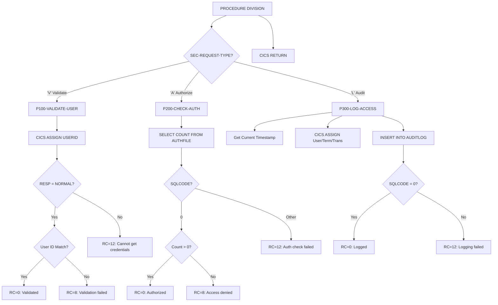

## Overview

SECMGR is a CICS online utility program that provides centralized security services for the application. It implements a three-tier security model:

- **Validation** - Verifies that the CICS user ID matches the requested user credentials
- **Authorization** - Checks DB2 authorization tables to determine if a user has access to specific resources
- **Audit Logging** - Records all access attempts to a security audit trail for compliance and forensics

This program serves as a security gateway that other online programs call before allowing access to sensitive operations or data. It integrates CICS security features with DB2-based access control lists and provides comprehensive audit logging.

## Program Structure



## Data Structures

### Linkage Section - Security Request Interface

The program receives requests through the `SECURITY-REQUEST-AREA` structure:

| Field | Picture | Description |
|-------|---------|-------------|
| SEC-REQUEST-TYPE | X | Request type: `'V'`, `'A'`, or `'L'` |
| SEC-USER-ID | X(8) | User ID to validate/authorize |
| SEC-RESOURCE-NAME | X(8) | Resource being accessed (program, table, etc.) |
| SEC-ACCESS-TYPE | X(8) | Type of access (READ, WRITE, EXECUTE, etc.) |
| SEC-RESPONSE-CODE | S9(8) COMP | Response code (0=success, 8=denied, 12=error) |
| SEC-ERROR-INFO | X(80) | Error message text |

**Request Type Condition Names:**

| Level-88 | Value | Description |
|----------|-------|-------------|
| SEC-VALIDATE | 'V' | Validate user credentials |
| SEC-AUTHORIZE | 'A' | Check authorization for resource |
| SEC-AUDIT | 'L' | Log access to audit trail |

### Working Storage

#### DB2 Area

| Field | Description |
|-------|-------------|
| WS-DB2-AREA | Contains SQLCA and used as host variable for COUNT(*) result |

The SQLCA is included via `EXEC SQL INCLUDE SQLCA` for DB2 status checking.

#### Security Context Area

| Field | Picture | Description |
|-------|---------|-------------|
| WS-USER-ID | X(8) | Current CICS user ID |
| WS-TERMINAL-ID | X(4) | Current terminal ID |
| WS-TRANSACTION-ID | X(4) | Current transaction ID |
| WS-PROGRAM-NAME | X(8) | Program/resource being accessed |
| WS-ACCESS-TYPE | X(8) | Type of access being performed |
| WS-TIMESTAMP | X(26) | Current timestamp for audit |

#### Error Handling Area (ERRHND copybook)

| Field | Picture | Description |
|-------|---------|-------------|
| ERR-PROGRAM | X(8) | Program that encountered error |
| ERR-PARAGRAPH | X(30) | Paragraph name |
| ERR-SQLCODE | S9(9) COMP | SQL code |
| ERR-CICS-RESP | S9(8) COMP | CICS response code |
| ERR-CICS-RESP2 | S9(8) COMP | CICS response code 2 |
| ERR-SEVERITY | X | F=Fatal, W=Warning, I=Info |
| ERR-MESSAGE | X(80) | Error message |
| ERR-ACTION | X | R=Return, C=Continue, A=Abend |
| ERR-TRACE-ID | X(16) | Trace identifier |
| ERR-TIMESTAMP | X(26) | Error timestamp |

## Database Operations

### AUTHFILE Table - Authorization Lookup

**SELECT Operation (P200-CHECK-AUTH):**
```sql
SELECT COUNT(*)
INTO :WS-DB2-AREA
FROM AUTHFILE
WHERE USER_ID = :SEC-USER-ID
  AND RESOURCE = :SEC-RESOURCE-NAME
  AND ACCESS_TYPE = :SEC-ACCESS-TYPE
```

This query checks if there is an authorization record for the specified user, resource, and access type combination. A count greater than zero indicates the user is authorized.

**AUTHFILE Table Structure (inferred):**

| Column | Description |
|--------|-------------|
| USER_ID | User identifier (8 characters) |
| RESOURCE | Resource name (program, table, etc.) |
| ACCESS_TYPE | Type of access (READ, WRITE, EXECUTE, etc.) |

### AUDITLOG Table - Security Audit Trail

**INSERT Operation (P300-LOG-ACCESS):**
```sql
INSERT INTO AUDITLOG
(TIMESTAMP, USER_ID, TERMINAL_ID, 
 TRANS_ID, PROGRAM, ACCESS_TYPE)
VALUES
(:WS-TIMESTAMP, :WS-USER-ID, :WS-TERMINAL-ID,
 :WS-TRANSACTION-ID, :WS-PROGRAM-NAME, 
 :WS-ACCESS-TYPE)
```

**AUDITLOG Table Structure (inferred):**

| Column | Source | Description |
|--------|--------|-------------|
| TIMESTAMP | WS-TIMESTAMP | When access occurred |
| USER_ID | WS-USER-ID | Who accessed |
| TERMINAL_ID | WS-TERMINAL-ID | From which terminal |
| TRANS_ID | WS-TRANSACTION-ID | Which transaction |
| PROGRAM | WS-PROGRAM-NAME | Resource accessed |
| ACCESS_TYPE | WS-ACCESS-TYPE | Type of access |

## Control Flow

### P100-VALIDATE-USER - User Credential Validation

Validates that the provided user ID matches the current CICS session user.

**Algorithm:**
1. Uses `EXEC CICS ASSIGN USERID` to get the current CICS user ID
2. Checks CICS response code:
   - If DFHRESP(NORMAL): Compares SEC-USER-ID with WS-USER-ID
     - Match: Returns RC=0 (validated)
     - No match: Returns RC=8 with "User validation failed"
   - Otherwise: Returns RC=12 with "Unable to obtain user credentials"

**Security Purpose:** Prevents user impersonation by ensuring the caller's claimed user ID matches their actual CICS session credentials.

### P200-CHECK-AUTH - Authorization Verification

Checks if the user has been granted access to the specified resource.

**Algorithm:**
1. Queries AUTHFILE table for matching authorization record
2. Evaluates SQLCODE:
   - SQLCODE = 0: Checks if count > 0
     - Count > 0: Returns RC=0 (authorized)
     - Count = 0: Returns RC=8 with "Access denied"
   - Other SQLCODE: Returns RC=12 with "Authorization check failed"

**Security Purpose:** Implements role-based access control (RBAC) by checking a database-driven access control list.

### P300-LOG-ACCESS - Security Audit Logging

Records all access attempts to the security audit trail.

**Algorithm:**
1. Captures current timestamp using `FUNCTION CURRENT-DATE`
2. Uses `EXEC CICS ASSIGN` to get:
   - USERID - Current user
   - TERMID - Terminal identifier
   - TRANSID - Transaction identifier
3. Copies resource name and access type from request
4. Inserts audit record into AUDITLOG table
5. Returns RC=0 if successful, RC=12 if insert fails

**Security Purpose:** Provides non-repudiation and compliance support through comprehensive access logging.

## CICS Commands Used

| Command | Paragraph | Purpose |
|---------|-----------|---------|
| `EXEC CICS ASSIGN USERID` | P100-VALIDATE-USER | Gets current session user ID |
| `EXEC CICS ASSIGN USERID TERMID TRANSID` | P300-LOG-ACCESS | Gets session context for audit |
| `EXEC CICS RETURN` | Main | Returns to calling program |

### DFHRESP Values

| Constant | Description |
|----------|-------------|
| DFHRESP(NORMAL) | Command completed successfully |

## Dependencies

### Copybooks

- **ERRHND** - Online error handling structure (available for error scenarios)

### Called Programs

None - SECMGR is a leaf-level service program.

### Database Objects

| Object | Type | Purpose |
|--------|------|---------|
| AUTHFILE | Table | Authorization access control list |
| AUDITLOG | Table | Security audit trail |

### Related Programs

Programs sharing the ERRHND copybook:

| Program | Description |
|---------|-------------|
| DB2ONLN | DB2 online connection manager |
| DB2RECV | DB2 recovery manager |
| ERRHNDL | Error handler |
| INQONLN | Online inquiry program |

## Return Codes

| Code | Description | Returned By |
|------|-------------|-------------|
| 0 | Success - validated, authorized, or logged | All functions |
| 8 | Denied - validation failed or access denied | P100, P200 |
| 12 | Error - system error or DB2 failure | All functions |

### Error Messages

| Message | Code | Meaning |
|---------|------|---------|
| "User validation failed" | 8 | Provided user ID doesn't match CICS session |
| "Unable to obtain user credentials" | 12 | CICS ASSIGN failed |
| "Access denied" | 8 | No authorization record found |
| "Authorization check failed" | 12 | DB2 error during authorization query |
| "Audit logging failed" | 12 | DB2 error during audit insert |

## Usage Example

```cobol
* Validate user before sensitive operation
MOVE 'V' TO SEC-REQUEST-TYPE
MOVE WS-USER-ID TO SEC-USER-ID

EXEC CICS LINK PROGRAM('SECMGR')
          COMMAREA(SECURITY-REQUEST-AREA)
          LENGTH(LENGTH OF SECURITY-REQUEST-AREA)
END-EXEC

IF SEC-RESPONSE-CODE NOT = 0
    MOVE SEC-ERROR-INFO TO WS-ERROR-MESSAGE
    PERFORM DISPLAY-ERROR
    EXEC CICS RETURN END-EXEC
END-IF

* Check authorization for account update
MOVE 'A' TO SEC-REQUEST-TYPE
MOVE WS-USER-ID TO SEC-USER-ID
MOVE 'ACCTUPD' TO SEC-RESOURCE-NAME
MOVE 'WRITE' TO SEC-ACCESS-TYPE

EXEC CICS LINK PROGRAM('SECMGR')
          COMMAREA(SECURITY-REQUEST-AREA)
          LENGTH(LENGTH OF SECURITY-REQUEST-AREA)
END-EXEC

IF SEC-RESPONSE-CODE = 0
    PERFORM UPDATE-ACCOUNT
    
    * Log the access
    MOVE 'L' TO SEC-REQUEST-TYPE
    EXEC CICS LINK PROGRAM('SECMGR')
              COMMAREA(SECURITY-REQUEST-AREA)
              LENGTH(LENGTH OF SECURITY-REQUEST-AREA)
    END-EXEC
ELSE
    MOVE 'Access denied for account update' 
      TO WS-ERROR-MESSAGE
    PERFORM DISPLAY-ERROR
END-IF
```

## Security Considerations

### Defense in Depth

SECMGR implements multiple security layers:

1. **Authentication** (P100) - Validates user identity via CICS
2. **Authorization** (P200) - Checks access permissions via DB2
3. **Auditing** (P300) - Records all access for accountability

### Access Control Model

The AUTHFILE table implements a positive authorization model:
- Access is denied by default
- Each user/resource/access-type combination requires an explicit grant
- Fine-grained control at the resource and operation level

### Audit Trail Requirements

The AUDITLOG captures the "5 Ws" of security auditing:
- **Who** - USER_ID
- **What** - PROGRAM (resource) and ACCESS_TYPE
- **When** - TIMESTAMP
- **Where** - TERMINAL_ID
- **Which** - TRANS_ID (transaction context)

## Technical Notes

1. **CICS ASSIGN Command**: Retrieves information about the current CICS task context. The USERID option returns the signed-on user ID, which is the authenticated identity from CICS signon.

2. **DFHRESP Symbolic Constants**: CICS provides symbolic constants like DFHRESP(NORMAL) for response code checking. This makes code more readable and maintainable than numeric literals.

3. **COUNT(*) for Authorization**: Using COUNT(*) rather than SELECT with FETCH is efficient for existence checks - we only need to know if at least one matching record exists.

4. **FUNCTION CURRENT-DATE**: The COBOL intrinsic function returns a 21-character timestamp (YYYYMMDDHHMMSSHHNNNNNN) which is stored in the 26-character WS-TIMESTAMP field.

5. **Stateless Design**: Each call to SECMGR is independent - the program doesn't cache authorization results. This ensures security checks always reflect current permissions but may impact performance for repeated checks.

6. **No Explicit Error Handling Call**: While the ERRHND copybook is included, this program handles errors by setting response codes and messages directly rather than calling an error handler. This keeps the security response simple and predictable.

7. **Transaction Integrity**: The audit INSERT is not wrapped in explicit commit/rollback - it relies on the calling program's unit of work. Consider whether audit records should be committed independently for guaranteed logging.
