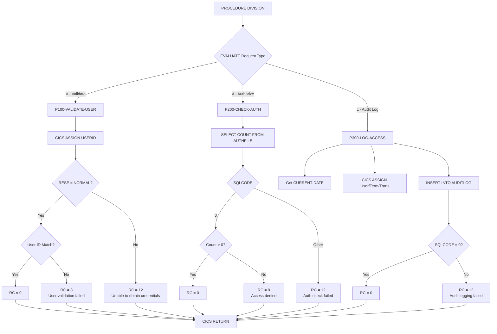

## Overview

SECMGR is a CICS-based Security Manager that provides centralized security services for online programs. It handles three core security functions: user validation against CICS credentials, authorization checking against a DB2 authorization table, and audit logging of access attempts.

The program acts as a security gateway that other online programs call before performing sensitive operations. By centralizing security logic, SECMGR ensures consistent security enforcement across the CICS region and provides a single point for security policy implementation and audit trail generation.

SECMGR integrates with both CICS security (via EXEC CICS ASSIGN) and DB2 security (via authorization table lookups), providing a unified security interface regardless of the underlying security mechanism. All access attempts can be logged to a DB2 audit table for compliance and forensic purposes.

## Program Structure



## Data Structures

### Linkage Section (Input/Output Parameters)

| Level | Name | Picture | Description |
|-------|------|---------|-------------|
| 01 | SECURITY-REQUEST-AREA | - | Main parameter block passed by caller |
| 05 | SEC-REQUEST-TYPE | X | Request type: 'V'=Validate, 'A'=Authorize, 'L'=Audit Log |
| 05 | SEC-USER-ID | X(8) | User ID to validate/authorize/log |
| 05 | SEC-RESOURCE-NAME | X(8) | Resource being accessed (program, file, etc.) |
| 05 | SEC-ACCESS-TYPE | X(8) | Type of access (READ, UPDATE, DELETE, etc.) |
| 05 | SEC-RESPONSE-CODE | S9(8) COMP | Response code returned to caller |
| 05 | SEC-ERROR-INFO | X(80) | Error message if request fails |

### Working Storage - Security Area

| Level | Name | Picture | Description |
|-------|------|---------|-------------|
| 01 | WS-SECURITY-AREA | - | Security context information |
| 05 | WS-USER-ID | X(8) | User ID from CICS ASSIGN |
| 05 | WS-TERMINAL-ID | X(4) | Terminal ID from CICS ASSIGN |
| 05 | WS-TRANSACTION-ID | X(4) | Transaction ID from CICS ASSIGN |
| 05 | WS-PROGRAM-NAME | X(8) | Program/resource being accessed |
| 05 | WS-ACCESS-TYPE | X(8) | Type of access being performed |
| 05 | WS-TIMESTAMP | X(26) | Current timestamp for audit logging |

### Working Storage - DB2 Area

| Level | Name | Description |
|-------|------|-------------|
| 01 | WS-DB2-AREA | DB2 communication area |
| - | SQLCA | SQL Communication Area (included via EXEC SQL INCLUDE) |

### Working Storage - Error Area (from ERRHND copybook)

| Level | Name | Picture | Description |
|-------|------|---------|-------------|
| 01 | ERROR-HANDLING | - | Error handling communication area |
| 05 | ERR-PROGRAM | X(8) | Program name |
| 05 | ERR-PARAGRAPH | X(30) | Paragraph name |
| 05 | ERR-SQLCODE | S9(9) COMP | SQL code |
| 05 | ERR-CICS-RESP | S9(8) COMP | CICS RESP value |
| 05 | ERR-CICS-RESP2 | S9(8) COMP | CICS RESP2 value |
| 05 | ERR-SEVERITY | X | Severity: 'F'=Fatal, 'W'=Warning, 'I'=Info |
| 05 | ERR-MESSAGE | X(80) | Error message |
| 05 | ERR-ACTION | X | Action: 'R'=Return, 'C'=Continue, 'A'=Abend |

## Control Flow

### Entry Point - Request Routing

The PROCEDURE DIVISION evaluates SEC-REQUEST-TYPE to determine which security function to perform:
- **'V' (Validate)**: Routes to P100-VALIDATE-USER for credential validation
- **'A' (Authorize)**: Routes to P200-CHECK-AUTH for authorization checking
- **'L' (Audit Log)**: Routes to P300-LOG-ACCESS for audit trail logging

After processing, executes `EXEC CICS RETURN` to return control to the caller.

### P100-VALIDATE-USER - User Credential Validation

Validates that the provided user ID matches the currently signed-on CICS user:

1. **Get CICS User ID**: Executes `EXEC CICS ASSIGN USERID(WS-USER-ID)` to retrieve the signed-on user
2. **Check CICS Response**:
   - If RESP = DFHRESP(NORMAL): Proceeds to user ID comparison
   - Otherwise: Sets SEC-RESPONSE-CODE = 12, error message "Unable to obtain user credentials"
3. **Compare User IDs**:
   - If SEC-USER-ID = WS-USER-ID: Sets SEC-RESPONSE-CODE = 0 (success)
   - Otherwise: Sets SEC-RESPONSE-CODE = 8, error message "User validation failed"

### P200-CHECK-AUTH - Authorization Check

Verifies the user is authorized to access the specified resource with the requested access type:

1. **Query Authorization Table**:
   ```sql
   SELECT COUNT(*)
   INTO :WS-DB2-AREA
   FROM AUTHFILE
   WHERE USER_ID = :SEC-USER-ID
     AND RESOURCE = :SEC-RESOURCE-NAME
     AND ACCESS_TYPE = :SEC-ACCESS-TYPE
   ```

2. **Evaluate Result**:
   - If SQLCODE = 0 and count > 0: Sets SEC-RESPONSE-CODE = 0 (authorized)
   - If SQLCODE = 0 and count = 0: Sets SEC-RESPONSE-CODE = 8, error message "Access denied"
   - If SQLCODE ≠ 0: Sets SEC-RESPONSE-CODE = 12, error message "Authorization check failed"

### P300-LOG-ACCESS - Audit Trail Logging

Records the access attempt to the audit log table:

1. **Get Timestamp**: Uses `FUNCTION CURRENT-DATE` to get current date/time
2. **Get CICS Context**: Executes `EXEC CICS ASSIGN` to retrieve:
   - USERID → WS-USER-ID
   - TERMID → WS-TERMINAL-ID
   - TRANSID → WS-TRANSACTION-ID
3. **Prepare Data**: Moves SEC-RESOURCE-NAME to WS-PROGRAM-NAME, SEC-ACCESS-TYPE to WS-ACCESS-TYPE
4. **Insert Audit Record**:
   ```sql
   INSERT INTO AUDITLOG
   (TIMESTAMP, USER_ID, TERMINAL_ID, 
    TRANS_ID, PROGRAM, ACCESS_TYPE)
   VALUES
   (:WS-TIMESTAMP, :WS-USER-ID, :WS-TERMINAL-ID,
    :WS-TRANSACTION-ID, :WS-PROGRAM-NAME, 
    :WS-ACCESS-TYPE)
   ```
5. **Check Result**:
   - If SQLCODE = 0: Sets SEC-RESPONSE-CODE = 0 (logged successfully)
   - Otherwise: Sets SEC-RESPONSE-CODE = 12, error message "Audit logging failed"

## CICS Commands

| Command | Paragraph | Description |
|---------|-----------|-------------|
| ASSIGN USERID | P100-VALIDATE-USER | Retrieves signed-on user ID |
| ASSIGN USERID, TERMID, TRANSID | P300-LOG-ACCESS | Retrieves user context for audit |
| RETURN | Main | Returns control to calling program |

## Database Access

### DB2 Table: AUTHFILE

Authorization table that stores user access permissions.

#### SELECT Query (P200-CHECK-AUTH)

```sql
SELECT COUNT(*)
INTO :WS-DB2-AREA
FROM AUTHFILE
WHERE USER_ID = :SEC-USER-ID
  AND RESOURCE = :SEC-RESOURCE-NAME
  AND ACCESS_TYPE = :SEC-ACCESS-TYPE
```

**Columns Used**:
| Column | Description |
|--------|-------------|
| USER_ID | User identifier (8 characters) |
| RESOURCE | Resource name (program, file, transaction) |
| ACCESS_TYPE | Type of access (READ, UPDATE, DELETE, etc.) |

### DB2 Table: AUDITLOG

Audit trail table that records all access attempts.

#### INSERT Statement (P300-LOG-ACCESS)

```sql
INSERT INTO AUDITLOG
(TIMESTAMP, USER_ID, TERMINAL_ID, 
 TRANS_ID, PROGRAM, ACCESS_TYPE)
VALUES
(:WS-TIMESTAMP, :WS-USER-ID, :WS-TERMINAL-ID,
 :WS-TRANSACTION-ID, :WS-PROGRAM-NAME, 
 :WS-ACCESS-TYPE)
```

**Columns**:
| Column | Source | Description |
|--------|--------|-------------|
| TIMESTAMP | WS-TIMESTAMP | When access occurred |
| USER_ID | WS-USER-ID | Who accessed |
| TERMINAL_ID | WS-TERMINAL-ID | From which terminal |
| TRANS_ID | WS-TRANSACTION-ID | Which transaction |
| PROGRAM | WS-PROGRAM-NAME | Resource accessed |
| ACCESS_TYPE | WS-ACCESS-TYPE | Type of access |

## Dependencies

### Copybooks

| Copybook | Section | Description |
|----------|---------|-------------|
| SQLCA | WORKING-STORAGE | SQL Communication Area (included via EXEC SQL INCLUDE) |
| ERRHND | WORKING-STORAGE | Online Error Handling structure |

### Called Programs

This program does not call any external programs via LINK or CALL.

### Related Programs

Programs that share the ERRHND copybook and may call SECMGR:

- **DB2ONLN** - DB2 Online connection manager (uses ERRHND)
- **DB2RECV** - DB2 Recovery manager (uses ERRHND)
- **ERRHNDL** - Error handler (uses ERRHND)
- **INQONLN** - Online inquiry program (uses ERRHND)

## Return Codes

| Code | Meaning | Returned By |
|------|---------|-------------|
| 0 | Success - validation passed, authorized, or logged | All functions |
| 8 | Authorization/validation failure | P100, P200 |
| 12 | System error (CICS or DB2 failure) | All functions |

### Error Messages

| Message | Condition |
|---------|-----------|
| "User validation failed" | SEC-USER-ID doesn't match CICS signed-on user |
| "Unable to obtain user credentials" | CICS ASSIGN failed |
| "Access denied" | No matching authorization record in AUTHFILE |
| "Authorization check failed" | DB2 error during authorization query |
| "Audit logging failed" | DB2 error during audit INSERT |

## Usage Examples

### Validate User

```cobol
MOVE 'V' TO SEC-REQUEST-TYPE
MOVE WS-CURRENT-USER TO SEC-USER-ID

EXEC CICS LINK PROGRAM('SECMGR')
              COMMAREA(SECURITY-REQUEST-AREA)
              LENGTH(LENGTH OF SECURITY-REQUEST-AREA)
END-EXEC

IF SEC-RESPONSE-CODE = 0
    CONTINUE
ELSE
    DISPLAY 'Validation failed: ' SEC-ERROR-INFO
    EXEC CICS RETURN END-EXEC
END-IF
```

### Check Authorization

```cobol
MOVE 'A' TO SEC-REQUEST-TYPE
MOVE WS-USER-ID TO SEC-USER-ID
MOVE 'ACCTINQ' TO SEC-RESOURCE-NAME
MOVE 'READ' TO SEC-ACCESS-TYPE

EXEC CICS LINK PROGRAM('SECMGR')
              COMMAREA(SECURITY-REQUEST-AREA)
              LENGTH(LENGTH OF SECURITY-REQUEST-AREA)
END-EXEC

IF SEC-RESPONSE-CODE = 0
    PERFORM PROCESS-INQUIRY
ELSE
    MOVE 'Not authorized for this function' TO WS-MESSAGE
    PERFORM DISPLAY-ERROR
END-IF
```

### Log Access for Audit

```cobol
MOVE 'L' TO SEC-REQUEST-TYPE
MOVE WS-USER-ID TO SEC-USER-ID
MOVE 'CUSTFILE' TO SEC-RESOURCE-NAME
MOVE 'UPDATE' TO SEC-ACCESS-TYPE

EXEC CICS LINK PROGRAM('SECMGR')
              COMMAREA(SECURITY-REQUEST-AREA)
              LENGTH(LENGTH OF SECURITY-REQUEST-AREA)
END-EXEC
```

## Security Considerations

### Authentication vs Authorization

- **Validate ('V')**: Confirms identity - "Are you who you claim to be?"
- **Authorize ('A')**: Confirms permission - "Are you allowed to do this?"

### Audit Trail

The audit function ('L') should be called:
- After successful authorization for sensitive operations
- For compliance and regulatory requirements
- To support forensic investigation of security incidents

### Best Practices

1. **Always validate** before authorizing in high-security scenarios
2. **Log all access** to sensitive resources regardless of success/failure
3. **Check response codes** - never assume security calls succeed
4. **Handle errors gracefully** - don't expose security details in error messages to end users

## Technical Notes

- **DFHRESP(NORMAL)**: CICS-provided constant for successful response code
- **FUNCTION CURRENT-DATE**: COBOL intrinsic function returning 21-character timestamp (YYYYMMDDHHMMSSFFFFFFF)
- **EXEC SQL INCLUDE SQLCA**: Includes SQL Communication Area for SQLCODE access
- **COMP Fields**: Uses binary (COMP) for numeric fields for efficient CICS/DB2 processing
- **88-Level Conditions**: Uses condition names for readable request type checking
- **PERFORM THRU**: Uses paragraph exit points for structured flow control
- **COUNT(*)**: Used for existence check rather than returning actual records
