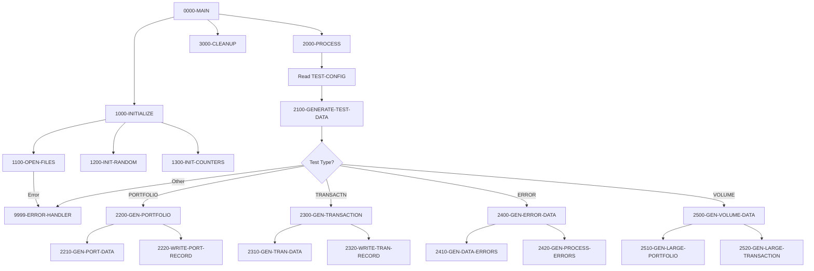

## Overview

TSTGEN00 is a batch utility program that generates test data for the Portfolio Management System. It reads configuration records that specify what types of test data to create and the desired volumes, then produces output files containing realistic test records.

The program supports four categories of test data generation:
- **Portfolio Data**: Creates portfolio master records with varying client types and statuses
- **Transaction Data**: Generates transaction records covering buys, sells, transfers, and fees
- **Error Condition Data**: Produces intentionally malformed data to test error handling
- **Volume/Performance Data**: Creates large datasets for stress and performance testing

This utility is essential for:
- Setting up test environments
- Regression testing after code changes
- Performance benchmarking
- Training and demonstration environments

## Program Structure



## Data Structures

### File Section

#### Configuration Record (CONFIG-RECORD)

| Level | Name | Picture | Description |
|-------|------|---------|-------------|
| 01 | CONFIG-RECORD | Group | Test configuration input |
| 05 | CFG-TEST-TYPE | X(10) | Type of test data to generate |
| 05 | CFG-VOLUME | 9(6) | Number of records to generate |
| 05 | CFG-PARAMETERS | X(64) | Additional parameters for data generation |

#### Portfolio Record (from PORTFLIO copybook)

| Level | Name | Picture | Description |
|-------|------|---------|-------------|
| 01 | PORT-RECORD | Group | Portfolio master record |
| 05 | PORT-KEY | Group | Composite primary key |
| 10 | PORT-ID | X(8) | Portfolio identifier |
| 10 | PORT-ACCOUNT-NO | X(10) | Account number |
| 05 | PORT-CLIENT-INFO | Group | Client information |
| 10 | PORT-CLIENT-NAME | X(30) | Client name |
| 10 | PORT-CLIENT-TYPE | X(1) | Type: I=Individual, C=Corporate, T=Trust |
| 05 | PORT-PORTFOLIO-INFO | Group | Portfolio metadata |
| 10 | PORT-CREATE-DATE | 9(8) | Creation date (YYYYMMDD) |
| 10 | PORT-LAST-MAINT | 9(8) | Last maintenance date |
| 10 | PORT-STATUS | X(1) | Status: A=Active, C=Closed, S=Suspended |
| 05 | PORT-FINANCIAL-INFO | Group | Financial data |
| 10 | PORT-TOTAL-VALUE | S9(13)V99 COMP-3 | Total portfolio value |
| 10 | PORT-CASH-BALANCE | S9(13)V99 COMP-3 | Available cash |
| 05 | PORT-AUDIT-INFO | Group | Audit trail |
| 10 | PORT-LAST-USER | X(8) | Last update user |
| 10 | PORT-LAST-TRANS | 9(8) | Last transaction date |

#### Transaction Record (from TRNREC copybook)

| Level | Name | Picture | Description |
|-------|------|---------|-------------|
| 01 | TRANSACTION-RECORD | Group | Transaction record |
| 05 | TRN-KEY | Group | Composite key |
| 10 | TRN-DATE | X(8) | Transaction date (YYYYMMDD) |
| 10 | TRN-TIME | X(6) | Transaction time (HHMMSS) |
| 10 | TRN-PORTFOLIO-ID | X(8) | Portfolio identifier |
| 10 | TRN-SEQUENCE-NO | X(6) | Sequence for multiple transactions |
| 05 | TRN-DATA | Group | Transaction details |
| 10 | TRN-INVESTMENT-ID | X(10) | Investment/security ID |
| 10 | TRN-TYPE | X(2) | Transaction type |
| 88 | TRN-TYPE-BUY | 'BU' | Buy transaction |
| 88 | TRN-TYPE-SELL | 'SL' | Sell transaction |
| 88 | TRN-TYPE-TRANS | 'TR' | Transfer transaction |
| 88 | TRN-TYPE-FEE | 'FE' | Fee transaction |
| 10 | TRN-QUANTITY | S9(11)V9(4) COMP-3 | Units/shares |
| 10 | TRN-PRICE | S9(11)V9(4) COMP-3 | Price per unit |
| 10 | TRN-AMOUNT | S9(13)V9(2) COMP-3 | Total amount |
| 10 | TRN-CURRENCY | X(3) | Currency code |
| 10 | TRN-STATUS | X(1) | Transaction status |
| 88 | TRN-STATUS-PEND | 'P' | Pending |
| 88 | TRN-STATUS-DONE | 'D' | Completed |
| 88 | TRN-STATUS-FAIL | 'F' | Failed |
| 88 | TRN-STATUS-REV | 'R' | Reversed |
| 05 | TRN-AUDIT | Group | Audit information |
| 10 | TRN-PROCESS-DATE | X(26) | Processing timestamp |
| 10 | TRN-PROCESS-USER | X(8) | Processing user ID |

#### Random Seed Record

| Level | Name | Picture | Description |
|-------|------|---------|-------------|
| 01 | SEED-RECORD | 9(9) | Random number seed value |

### Working Storage

#### File Status Variables

| Level | Name | Picture | Description |
|-------|------|---------|-------------|
| 01 | WS-FILE-STATUS | Group | File status codes |
| 05 | WS-CFG-STATUS | XX | Configuration file status |
| 05 | WS-PORT-STATUS | XX | Portfolio output status |
| 05 | WS-TRAN-STATUS | XX | Transaction output status |
| 05 | WS-RAND-STATUS | XX | Random seed file status |

#### Test Type Constants

| Level | Name | Picture | Value | Description |
|-------|------|---------|-------|-------------|
| 01 | WS-TEST-TYPES | Group | | Valid test type codes |
| 05 | WS-PORTFOLIO | X(10) | 'PORTFOLIO' | Portfolio data generation |
| 05 | WS-TRANSACTION | X(10) | 'TRANSACTN' | Transaction data generation |
| 05 | WS-ERROR-TEST | X(10) | 'ERROR' | Error condition data |
| 05 | WS-VOLUME-TEST | X(10) | 'VOLUME' | Volume/stress test data |

#### Processing Flags

| Level | Name | Picture | Value | Description |
|-------|------|---------|-------|-------------|
| 01 | WS-PROCESSING-FLAGS | Group | | Processing control |
| 05 | WS-END-OF-CONFIG | X | 'N' | EOF indicator |
| 88 | END-OF-CONFIG | | 'Y' | Config file exhausted |

#### Counters

| Level | Name | Picture | Value | Description |
|-------|------|---------|-------|-------------|
| 01 | WS-COUNTERS | Group | | Processing counters |
| 05 | WS-RECORDS-WRITTEN | 9(9) | ZERO | Records generated |
| 05 | WS-ERROR-COUNT | 9(9) | ZERO | Errors encountered |

#### Random Number Generation

| Level | Name | Picture | Description |
|-------|------|---------|-------------|
| 01 | WS-RANDOM-VALUES | Group | Random number work area |
| 05 | WS-RANDOM-SEED | 9(9) | Current seed value |
| 05 | WS-RANDOM-NUM | 9(9) | Generated random number |
| 05 | WS-RANDOM-DECIMAL | 9(9)V99 | Random decimal value |

#### Portfolio Work Area

| Level | Name | Picture | Description |
|-------|------|---------|-------------|
| 01 | WS-PORTFOLIO-DATA | Group | Portfolio generation work area |
| 05 | WS-PORT-ID | X(10) | Generated portfolio ID |
| 05 | WS-PORT-NAME | X(30) | Generated client name |
| 05 | WS-PORT-TYPE | X(2) | Generated portfolio type |
| 05 | WS-PORT-STATUS | X(1) | Generated status |
| 05 | WS-PORT-BALANCE | 9(15)V99 | Generated balance |

#### Transaction Work Area

| Level | Name | Picture | Description |
|-------|------|---------|-------------|
| 01 | WS-TRANSACTION-DATA | Group | Transaction generation work area |
| 05 | WS-TRAN-ID | X(12) | Generated transaction ID |
| 05 | WS-TRAN-TYPE | X(2) | Generated transaction type |
| 05 | WS-TRAN-AMOUNT | 9(15)V99 | Generated amount |
| 05 | WS-TRAN-DATE | X(8) | Generated date |
| 05 | WS-TRAN-STATUS | X(1) | Generated status |

## File I/O

### File Definitions

| File | DD Name | Organization | Mode | Description |
|------|---------|--------------|------|-------------|
| TEST-CONFIG | TSTCFG | Sequential | Input | Configuration specifying test types and volumes |
| PORTFOLIO-OUT | PORTOUT | Sequential | Output | Generated portfolio records |
| TRANSACTION-OUT | TRANOUT | Sequential | Output | Generated transaction records |
| RANDOM-SEED | RANDSEED | Sequential | Input | Seed value for random number generation |

### I/O Operations

| Paragraph | File | Operation | Purpose |
|-----------|------|-----------|---------|
| 1100-OPEN-FILES | TEST-CONFIG | OPEN INPUT | Open configuration file |
| 1100-OPEN-FILES | PORTFOLIO-OUT | OPEN OUTPUT | Open portfolio output |
| 1100-OPEN-FILES | TRANSACTION-OUT | OPEN OUTPUT | Open transaction output |
| 1100-OPEN-FILES | RANDOM-SEED | OPEN INPUT | Open random seed file |
| 1200-INIT-RANDOM | RANDOM-SEED | READ | Load random seed |
| 2000-PROCESS | TEST-CONFIG | READ | Read next configuration record |
| 3000-CLEANUP | All files | CLOSE | Close all files |

## Control Flow

### Main Processing (0000-MAIN)

1. Initialize files, random seed, and counters
2. Process all configuration records
3. Clean up and terminate

### Initialization (1000-INITIALIZE)

1. **Open Files (1100-OPEN-FILES)**: Opens all four files with error checking for each
2. **Initialize Random (1200-INIT-RANDOM)**: Reads seed value from RANDSEED file
3. **Initialize Counters (1300-INIT-COUNTERS)**: Resets all counters to zero

### Processing Loop (2000-PROCESS)

Reads configuration records until end-of-file, dispatching each to the appropriate generator:

```cobol
PERFORM UNTIL END-OF-CONFIG
    READ TEST-CONFIG
        AT END
            SET END-OF-CONFIG TO TRUE
        NOT AT END
            PERFORM 2100-GENERATE-TEST-DATA
    END-READ
END-PERFORM
```

### Test Data Dispatch (2100-GENERATE-TEST-DATA)

Uses `EVALUATE` to route to the appropriate generator based on `CFG-TEST-TYPE`:

| Test Type | Paragraph | Description |
|-----------|-----------|-------------|
| PORTFOLIO | 2200-GEN-PORTFOLIO | Generate portfolio records |
| TRANSACTN | 2300-GEN-TRANSACTION | Generate transaction records |
| ERROR | 2400-GEN-ERROR-DATA | Generate error test data |
| VOLUME | 2500-GEN-VOLUME-DATA | Generate volume test data |

### Portfolio Generation (2200-GEN-PORTFOLIO)

Uses `PERFORM VARYING` to generate the requested number of portfolio records:

```cobol
PERFORM VARYING WS-RECORDS-WRITTEN FROM 1 BY 1
        UNTIL WS-RECORDS-WRITTEN > CFG-VOLUME
    PERFORM 2210-GEN-PORT-DATA
    PERFORM 2220-WRITE-PORT-RECORD
END-PERFORM
```

### Transaction Generation (2300-GEN-TRANSACTION)

Similar loop structure for generating transaction records with varying types (BUY, SELL, TRANSFER, FEE).

### Error Data Generation (2400-GEN-ERROR-DATA)

Generates two categories of error test data:
- **2410-GEN-DATA-ERRORS**: Invalid field values, missing required data
- **2420-GEN-PROCESS-ERRORS**: Records that trigger processing errors

### Volume Data Generation (2500-GEN-VOLUME-DATA)

Creates large datasets for performance testing:
- **2510-GEN-LARGE-PORTFOLIO**: High-volume portfolio records
- **2520-GEN-LARGE-TRANSACTION**: High-volume transaction records

### Error Handling (9999-ERROR-HANDLER)

Provides fault-tolerant error handling:
1. Increment error counter
2. Display error message to console
3. If error count exceeds 100, terminate with return code 12

## Dependencies

### Copybooks

| Copybook | Location | Description |
|----------|----------|-------------|
| PORTFLIO | common/ | Portfolio master record layout |
| TRNREC | common/ | Transaction record layout with type and status codes |
| RTNCODE | common/ | Return code management |
| ERRHAND | common/ | Error handling structures (provides WS-ERROR-MESSAGE) |

### Called Programs

*None* - This is a standalone batch utility.

### Related Programs

#### Programs using PORTFLIO copybook:
| Program | Function |
|---------|----------|
| PORTADD | Add portfolio records |
| PORTDEL | Delete portfolio records |
| PORTREAD | Read portfolio records |
| PORTTEST | Portfolio testing |
| PORTUPDT | Update portfolio records |

#### Programs using TRNREC copybook:
| Program | Function |
|---------|----------|
| RPTPOS00 | Position reporting |
| PORTTRAN | Portfolio transactions |
| UTLVAL00 | Validation utility |

#### Companion test program:
| Program | Function |
|---------|----------|
| TSTVAL00 | Validates generated test data |

## Return Codes

| Code | Meaning |
|------|---------|
| 0 | Successful completion |
| 12 | Excessive errors (> 100 errors encountered) |

## JCL Requirements

```jcl
//TSTGEN   EXEC PGM=TSTGEN00
//STEPLIB  DD DSN=your.loadlib,DISP=SHR
//TSTCFG   DD DSN=your.test.config,DISP=SHR
//PORTOUT  DD DSN=your.portfolio.testdata,
//            DISP=(NEW,CATLG,DELETE),
//            DCB=(RECFM=FB,LRECL=150,BLKSIZE=0),
//            SPACE=(CYL,(10,5))
//TRANOUT  DD DSN=your.transaction.testdata,
//            DISP=(NEW,CATLG,DELETE),
//            DCB=(RECFM=FB,LRECL=150,BLKSIZE=0),
//            SPACE=(CYL,(10,5))
//RANDSEED DD DSN=your.random.seed,DISP=SHR
//SYSOUT   DD SYSOUT=*
```

### DD Statements

| DD Name | Description |
|---------|-------------|
| TSTCFG | Configuration file specifying test types and volumes |
| PORTOUT | Output file for generated portfolio records |
| TRANOUT | Output file for generated transaction records |
| RANDSEED | Input file containing random seed value |
| SYSOUT | Console output for error messages |

## Configuration File Format

The TEST-CONFIG file contains 80-byte records specifying test data generation parameters:

| Position | Length | Field | Description |
|----------|--------|-------|-------------|
| 1-10 | 10 | Test Type | PORTFOLIO, TRANSACTN, ERROR, or VOLUME |
| 11-16 | 6 | Volume | Number of records to generate (000001-999999) |
| 17-80 | 64 | Parameters | Additional parameters (test-type specific) |

### Example Configuration Records

```
PORTFOLIO 001000                                                                
TRANSACTN 005000                                                                
ERROR     000100                                                                
VOLUME    100000                                                                
```

This configuration would generate:
- 1,000 portfolio records
- 5,000 transaction records
- 100 error condition records
- 100,000 volume test records

## Technical Notes

### COPY...REPLACING

The program uses COBOL's COPY...REPLACING feature to customize copybook prefixes:

```cobol
COPY PORTFLIO REPLACING ==:PREFIX:== BY ==PORT==.
COPY TRNREC REPLACING ==:PREFIX:== BY ==TRAN==.
```

This allows the copybooks to be reused with different field name prefixes.

### SPECIAL-NAMES

The program defines `CONSOLE IS CONS` to use CONS as an alias for the system console in DISPLAY statements:

```cobol
DISPLAY WS-ERROR-MESSAGE UPON CONS
```

### Random Number Generation

The program uses an external seed file (RANDSEED) to initialize its random number generator. This approach:
- Allows reproducible test runs by using the same seed
- Enables different test scenarios by changing the seed
- Separates seed management from the generation logic

### Error Tolerance

The error handler allows up to 100 errors before terminating, making the program robust for scenarios where some generated data might fail validation while still producing useful output.
