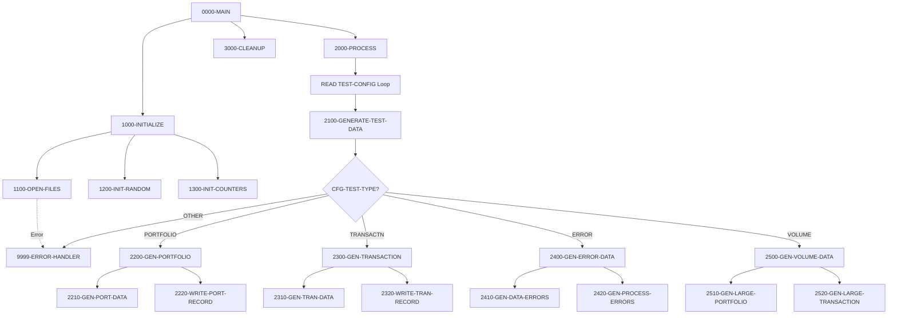

## Overview

TSTGEN00 is a batch COBOL program that generates test data for system testing purposes. It reads configuration records that specify what type of test data to create and in what volume, then produces output files containing the generated data.

The program supports four types of test data generation:

| Test Type | Purpose |
|-----------|---------|
| **PORTFOLIO** | Generate portfolio master records for functional testing |
| **TRANSACTN** | Generate transaction records for processing tests |
| **ERROR** | Generate data with intentional errors to test error handling |
| **VOLUME** | Generate large data sets for performance and stress testing |

This utility is essential for:
- **Development Testing** - Creating realistic test data sets
- **Regression Testing** - Producing consistent, repeatable test inputs
- **Performance Testing** - Generating high-volume data for stress tests
- **Error Path Testing** - Creating malformed data to verify error handling

The program uses a configurable random seed to allow reproducible test data generation.

## Program Structure



## Data Structures

### File Section

#### Configuration Record (CONFIG-RECORD)

| Level | Name | Picture | Description |
|-------|------|---------|-------------|
| 01 | CONFIG-RECORD | - | Test configuration input |
| 05 | CFG-TEST-TYPE | X(10) | Type of test data to generate |
| 05 | CFG-VOLUME | 9(6) | Number of records to generate |
| 05 | CFG-PARAMETERS | X(64) | Additional parameters for generation |

#### Portfolio Record (PORTFOLIO-RECORD)

Uses PORTFLIO copybook with REPLACING clause:

| Level | Name | Picture | Description |
|-------|------|---------|-------------|
| 01 | PORT-RECORD | - | Portfolio master record |
| 05 | PORT-KEY | - | Composite primary key |
| 10 | PORT-ID | X(8) | Portfolio identifier |
| 10 | PORT-ACCOUNT-NO | X(10) | Account number |
| 05 | PORT-CLIENT-INFO | - | Client information |
| 10 | PORT-CLIENT-NAME | X(30) | Client name |
| 10 | PORT-CLIENT-TYPE | X(1) | I=Individual, C=Corporate, T=Trust |
| 05 | PORT-PORTFOLIO-INFO | - | Portfolio details |
| 10 | PORT-CREATE-DATE | 9(8) | Creation date (YYYYMMDD) |
| 10 | PORT-LAST-MAINT | 9(8) | Last maintenance date |
| 10 | PORT-STATUS | X(1) | A=Active, C=Closed, S=Suspended |
| 05 | PORT-FINANCIAL-INFO | - | Financial data |
| 10 | PORT-TOTAL-VALUE | S9(13)V99 COMP-3 | Total portfolio value |
| 10 | PORT-CASH-BALANCE | S9(13)V99 COMP-3 | Cash balance |
| 05 | PORT-AUDIT-INFO | - | Audit information |

#### Transaction Record (TRANSACTION-RECORD)

Uses TRNREC copybook with REPLACING clause:

| Level | Name | Picture | Description |
|-------|------|---------|-------------|
| 01 | TRANSACTION-RECORD | - | Transaction record |
| 05 | TRN-KEY | - | Composite key |
| 10 | TRN-DATE | X(8) | Transaction date (YYYYMMDD) |
| 10 | TRN-TIME | X(6) | Transaction time (HHMMSS) |
| 10 | TRN-PORTFOLIO-ID | X(8) | Portfolio identifier |
| 10 | TRN-SEQUENCE-NO | X(6) | Sequence number |
| 05 | TRN-DATA | - | Transaction details |
| 10 | TRN-INVESTMENT-ID | X(10) | Investment identifier |
| 10 | TRN-TYPE | X(2) | BU=Buy, SL=Sell, TR=Transfer, FE=Fee |
| 10 | TRN-QUANTITY | S9(11)V9(4) COMP-3 | Transaction quantity |
| 10 | TRN-PRICE | S9(11)V9(4) COMP-3 | Unit price |
| 10 | TRN-AMOUNT | S9(13)V9(2) COMP-3 | Total amount |
| 10 | TRN-CURRENCY | X(3) | Currency code |
| 10 | TRN-STATUS | X(1) | P=Pending, D=Done, F=Failed, R=Reversed |

#### Random Seed Record

| Level | Name | Picture | Description |
|-------|------|---------|-------------|
| 01 | SEED-RECORD | 9(9) | Random number seed value |

### Working-Storage Section

#### File Status Indicators (WS-FILE-STATUS)

| Level | Name | Picture | Description |
|-------|------|---------|-------------|
| 01 | WS-FILE-STATUS | - | File status group |
| 05 | WS-CFG-STATUS | XX | Config file status |
| 05 | WS-PORT-STATUS | XX | Portfolio output status |
| 05 | WS-TRAN-STATUS | XX | Transaction output status |
| 05 | WS-RAND-STATUS | XX | Random seed file status |

#### Test Type Constants (WS-TEST-TYPES)

| Level | Name | Picture | Value | Description |
|-------|------|---------|-------|-------------|
| 01 | WS-TEST-TYPES | - | - | Test type constants |
| 05 | WS-PORTFOLIO | X(10) | 'PORTFOLIO' | Portfolio test type |
| 05 | WS-TRANSACTION | X(10) | 'TRANSACTN' | Transaction test type |
| 05 | WS-ERROR-TEST | X(10) | 'ERROR' | Error test type |
| 05 | WS-VOLUME-TEST | X(10) | 'VOLUME' | Volume test type |

#### Processing Flags (WS-PROCESSING-FLAGS)

| Level | Name | Picture | Value | Description |
|-------|------|---------|-------|-------------|
| 01 | WS-PROCESSING-FLAGS | - | - | Control flags |
| 05 | WS-END-OF-CONFIG | X | 'N' | End-of-file indicator |
| 88 | END-OF-CONFIG | VALUE 'Y' | - | Config file exhausted |

#### Counters (WS-COUNTERS)

| Level | Name | Picture | Value | Description |
|-------|------|---------|-------|-------------|
| 01 | WS-COUNTERS | - | - | Processing counters |
| 05 | WS-RECORDS-WRITTEN | 9(9) | ZERO | Records generated count |
| 05 | WS-ERROR-COUNT | 9(9) | ZERO | Error counter |

#### Random Values (WS-RANDOM-VALUES)

| Level | Name | Picture | Description |
|-------|------|---------|-------------|
| 01 | WS-RANDOM-VALUES | - | Random number generation |
| 05 | WS-RANDOM-SEED | 9(9) | Seed for reproducibility |
| 05 | WS-RANDOM-NUM | 9(9) | Generated random integer |
| 05 | WS-RANDOM-DECIMAL | 9(9)V99 | Generated random decimal |

#### Work Areas

**WS-PORTFOLIO-DATA** - Working area for building portfolio records:

| Level | Name | Picture | Description |
|-------|------|---------|-------------|
| 05 | WS-PORT-ID | X(10) | Generated portfolio ID |
| 05 | WS-PORT-NAME | X(30) | Generated portfolio name |
| 05 | WS-PORT-TYPE | X(2) | Portfolio type code |
| 05 | WS-PORT-STATUS | X(1) | Portfolio status |
| 05 | WS-PORT-BALANCE | 9(15)V99 | Portfolio balance |

**WS-TRANSACTION-DATA** - Working area for building transaction records:

| Level | Name | Picture | Description |
|-------|------|---------|-------------|
| 05 | WS-TRAN-ID | X(12) | Generated transaction ID |
| 05 | WS-TRAN-TYPE | X(2) | Transaction type |
| 05 | WS-TRAN-AMOUNT | 9(15)V99 | Transaction amount |
| 05 | WS-TRAN-DATE | X(8) | Transaction date |
| 05 | WS-TRAN-STATUS | X(1) | Transaction status |

## File I/O

### File Definitions

| File Name | DD Name | Mode | Organization | Description |
|-----------|---------|------|--------------|-------------|
| TEST-CONFIG | TSTCFG | Input | Sequential | Configuration specifying test data to generate |
| PORTFOLIO-OUT | PORTOUT | Output | Sequential | Generated portfolio records |
| TRANSACTION-OUT | TRANOUT | Output | Sequential | Generated transaction records |
| RANDOM-SEED | RANDSEED | Input | Sequential | Random seed for reproducible generation |

### I/O Operations

| Paragraph | File | Operation | Purpose |
|-----------|------|-----------|---------|
| 1100-OPEN-FILES | TEST-CONFIG | OPEN INPUT | Read configuration |
| 1100-OPEN-FILES | PORTFOLIO-OUT | OPEN OUTPUT | Write portfolios |
| 1100-OPEN-FILES | TRANSACTION-OUT | OPEN OUTPUT | Write transactions |
| 1100-OPEN-FILES | RANDOM-SEED | OPEN INPUT | Read seed value |
| 1200-INIT-RANDOM | RANDOM-SEED | READ | Load seed value |
| 2000-PROCESS | TEST-CONFIG | READ | Read each config record |
| 3000-CLEANUP | All files | CLOSE | Close all files |

## Control Flow

### Main Processing (0000-MAIN)

```cobol
PERFORM 1000-INITIALIZE
PERFORM 2000-PROCESS
PERFORM 3000-CLEANUP
GOBACK
```

### Initialization (1000-INITIALIZE)

1. **Open Files (1100-OPEN-FILES)**
   - Opens all four files with file status checking
   - Triggers error handler if any open fails

2. **Initialize Random (1200-INIT-RANDOM)**
   - Reads seed value from RANDOM-SEED file
   - Stores in WS-RANDOM-SEED for generation use

3. **Initialize Counters (1300-INIT-COUNTERS)**
   - Clears WS-COUNTERS using INITIALIZE

### Processing Loop (2000-PROCESS)

Reads configuration records until end-of-file:

```cobol
PERFORM UNTIL END-OF-CONFIG
    READ TEST-CONFIG
        AT END SET END-OF-CONFIG TO TRUE
        NOT AT END PERFORM 2100-GENERATE-TEST-DATA
    END-READ
END-PERFORM
```

### Data Generation Dispatch (2100-GENERATE-TEST-DATA)

Uses EVALUATE to dispatch based on CFG-TEST-TYPE:

| Test Type | Handler | Description |
|-----------|---------|-------------|
| PORTFOLIO | 2200-GEN-PORTFOLIO | Generate portfolio records |
| TRANSACTN | 2300-GEN-TRANSACTION | Generate transaction records |
| ERROR | 2400-GEN-ERROR-DATA | Generate error test data |
| VOLUME | 2500-GEN-VOLUME-DATA | Generate high-volume data |
| OTHER | 9999-ERROR-HANDLER | Invalid type error |

### Portfolio Generation (2200-GEN-PORTFOLIO)

Generates the number of records specified in CFG-VOLUME:

```cobol
PERFORM VARYING WS-RECORDS-WRITTEN FROM 1 BY 1
        UNTIL WS-RECORDS-WRITTEN > CFG-VOLUME
    PERFORM 2210-GEN-PORT-DATA
    PERFORM 2220-WRITE-PORT-RECORD
END-PERFORM
```

- **2210-GEN-PORT-DATA**: Populates WS-PORTFOLIO-DATA with generated values
- **2220-WRITE-PORT-RECORD**: Writes PORTFOLIO-RECORD to output file

### Transaction Generation (2300-GEN-TRANSACTION)

Similar pattern to portfolio generation:

- **2310-GEN-TRAN-DATA**: Generates transaction field values
- **2320-WRITE-TRAN-RECORD**: Writes to TRANSACTION-OUT

### Error Data Generation (2400-GEN-ERROR-DATA)

Creates intentionally malformed data:

- **2410-GEN-DATA-ERRORS**: Records with invalid field values
- **2420-GEN-PROCESS-ERRORS**: Records that will cause processing errors

### Volume Data Generation (2500-GEN-VOLUME-DATA)

Creates large data sets for performance testing:

- **2510-GEN-LARGE-PORTFOLIO**: High-volume portfolio data
- **2520-GEN-LARGE-TRANSACTION**: High-volume transaction data

### Error Handler (9999-ERROR-HANDLER)

```cobol
ADD 1 TO WS-ERROR-COUNT
DISPLAY WS-ERROR-MESSAGE UPON CONS
IF WS-ERROR-COUNT > 100
    MOVE 12 TO RETURN-CODE
    GOBACK
END-IF
```

- Increments error counter
- Displays error message to console
- Terminates with RC=12 if errors exceed 100

## Dependencies

### Copybooks

| Copybook | Location | Description |
|----------|----------|-------------|
| PORTFLIO | File Section (PORTFOLIO-OUT FD) | Portfolio master record layout |
| TRNREC | File Section (TRANSACTION-OUT FD) | Transaction record layout |
| RTNCODE | Working-Storage | Return code management structures |
| ERRHAND | Working-Storage | Error handling definitions (WS-ERROR-MESSAGE) |

### Called Programs

This program does not call any external programs.

### Related Programs

**Programs sharing PORTFLIO copybook:**
- PORTADD - Add portfolio records
- PORTDEL - Delete portfolio records
- PORTREAD - Read portfolio records
- PORTTEST - Portfolio testing
- PORTUPDT - Update portfolio records

**Programs sharing TRNREC copybook:**
- RPTPOS00 - Position report generator
- PORTTRAN - Portfolio transaction processor
- UTLVAL00 - Validation utility

**Programs sharing RTNCODE copybook:**
- RPTAUD00, RPTPOS00, RPTSTA00 - Report generators
- RTNCDE00 - Return code handler
- TSTVAL00 - Test validation program
- UTLMNT00, UTLMON00, UTLVAL00 - Utility programs

**Test suite companion:**
- TSTVAL00 - Test validation program

## Configuration File Format

The TEST-CONFIG file contains records specifying what data to generate:

```
PORTFOLIO 001000                                                    
TRANSACTN 005000                                                    
ERROR     000100                                                    
VOLUME    100000                                                    
```

| Column | Length | Description |
|--------|--------|-------------|
| 1-10 | 10 | Test type (PORTFOLIO, TRANSACTN, ERROR, VOLUME) |
| 11-16 | 6 | Volume (number of records to generate) |
| 17-80 | 64 | Additional parameters (type-specific) |

## Return Codes

| Code | Meaning |
|------|---------|
| 0 | Successful completion |
| 12 | Excessive errors (> 100 errors encountered) |

## JCL Requirements

```jcl
//TSTGEN00 EXEC PGM=TSTGEN00
//STEPLIB  DD  DSN=your.loadlib,DISP=SHR
//TSTCFG   DD  DSN=your.test.config,DISP=SHR
//PORTOUT  DD  DSN=your.portfolio.output,DISP=(NEW,CATLG),
//             DCB=(RECFM=FB,LRECL=150,BLKSIZE=0),
//             SPACE=(CYL,(10,5))
//TRANOUT  DD  DSN=your.transaction.output,DISP=(NEW,CATLG),
//             DCB=(RECFM=FB,LRECL=150,BLKSIZE=0),
//             SPACE=(CYL,(10,5))
//RANDSEED DD  DSN=your.random.seed,DISP=SHR
//SYSOUT   DD  SYSOUT=*
```

## Technical Notes

### COPY REPLACING Clause
The program uses COPY with REPLACING to prefix copybook fields:

```cobol
COPY PORTFLIO REPLACING ==:PREFIX:== BY ==PORT==.
COPY TRNREC REPLACING ==:PREFIX:== BY ==TRAN==.
```

This technique allows the same copybook to be used multiple times with different prefixes, preventing name collisions.

### Reproducible Random Generation
By reading a seed value from the RANDSEED file, the program can generate the same test data set repeatedly. This is essential for:
- Regression testing (same input produces same output)
- Debugging (reproduce issues with identical data)
- Comparison testing (before/after code changes)

### PERFORM VARYING Loop
The generation loops use PERFORM VARYING:

```cobol
PERFORM VARYING WS-RECORDS-WRITTEN FROM 1 BY 1
        UNTIL WS-RECORDS-WRITTEN > CFG-VOLUME
```

This increments WS-RECORDS-WRITTEN from 1 until it exceeds the requested volume.

### Error Threshold
The error handler allows up to 100 errors before terminating. This prevents infinite loops or runaway error conditions while allowing minor issues to be logged without stopping the entire generation process.

### SPECIAL-NAMES CONSOLE
The program uses `CONSOLE IS CONS` in SPECIAL-NAMES, allowing error messages to be displayed with `DISPLAY ... UPON CONS`.

## Sample Test Scenario

**Configuration file (TSTCFG):**
```
PORTFOLIO 000010
TRANSACTN 000050
ERROR     000005
```

**Expected output:**
- 10 portfolio records in PORTOUT
- 50 transaction records in TRANOUT
- 5 error test records (distributed across output files)

**Console output:**
```
TSTGEN00: Processing PORTFOLIO, volume 000010
TSTGEN00: Processing TRANSACTN, volume 000050
TSTGEN00: Processing ERROR, volume 000005
TSTGEN00: Generation complete. Total records: 65
```
