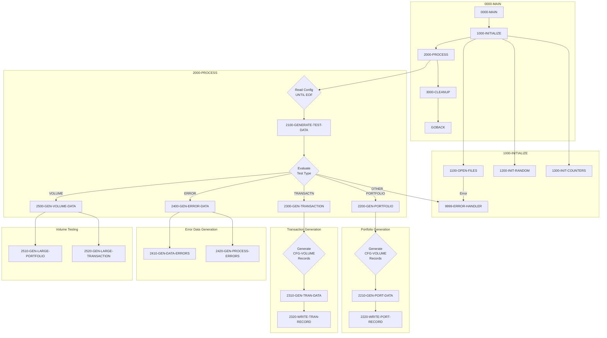

## Overview

TSTGEN00 is a batch utility program that generates test data for the Investment Portfolio Management System. It creates realistic portfolio and transaction records based on configuration parameters, supporting various testing scenarios including functional testing, error condition testing, and performance/volume testing.

The program is a critical component of the test infrastructure, providing:
- Configurable portfolio test data generation
- Transaction test scenario creation
- Intentional error data for error handling validation
- High-volume data for performance testing
- Reproducible results through seeded random number generation

TSTGEN00 reads a configuration file specifying the types and volumes of test data required, then generates output files that can be loaded into test environments for system validation.

## Program Structure



## Data Structures

### Working Storage

#### File Status Variables (WS-FILE-STATUS)

| Level | Name | Picture | Description |
|-------|------|---------|-------------|
| 01 | WS-FILE-STATUS | - | File status group |
| 05 | WS-CFG-STATUS | XX | Configuration file status |
| 05 | WS-PORT-STATUS | XX | Portfolio output file status |
| 05 | WS-TRAN-STATUS | XX | Transaction output file status |
| 05 | WS-RAND-STATUS | XX | Random seed file status |

#### Test Types (WS-TEST-TYPES)

| Level | Name | Picture | Value | Description |
|-------|------|---------|-------|-------------|
| 01 | WS-TEST-TYPES | - | - | Test type constants |
| 05 | WS-PORTFOLIO | X(10) | 'PORTFOLIO' | Portfolio data generation |
| 05 | WS-TRANSACTION | X(10) | 'TRANSACTN' | Transaction data generation |
| 05 | WS-ERROR-TEST | X(10) | 'ERROR' | Error scenario generation |
| 05 | WS-VOLUME-TEST | X(10) | 'VOLUME' | Volume/performance testing |

#### Processing Flags (WS-PROCESSING-FLAGS)

| Level | Name | Picture | Value | Description |
|-------|------|---------|-------|-------------|
| 05 | WS-END-OF-CONFIG | X | 'N' | End of config file flag |
| 88 | END-OF-CONFIG | VALUE 'Y' | - | EOF condition |

#### Counters (WS-COUNTERS)

| Level | Name | Picture | Value | Description |
|-------|------|---------|-------|-------------|
| 05 | WS-RECORDS-WRITTEN | 9(9) | ZERO | Records generated count |
| 05 | WS-ERROR-COUNT | 9(9) | ZERO | Error count threshold |

#### Random Number Generation (WS-RANDOM-VALUES)

| Level | Name | Picture | Description |
|-------|------|---------|-------------|
| 05 | WS-RANDOM-SEED | 9(9) | Seed for reproducibility |
| 05 | WS-RANDOM-NUM | 9(9) | Generated random integer |
| 05 | WS-RANDOM-DECIMAL | 9(9)V99 | Generated random decimal |

#### Portfolio Work Area (WS-PORTFOLIO-DATA)

| Level | Name | Picture | Description |
|-------|------|---------|-------------|
| 05 | WS-PORT-ID | X(10) | Generated portfolio ID |
| 05 | WS-PORT-NAME | X(30) | Generated portfolio name |
| 05 | WS-PORT-TYPE | X(2) | Portfolio type code |
| 05 | WS-PORT-STATUS | X(1) | Portfolio status |
| 05 | WS-PORT-BALANCE | 9(15)V99 | Portfolio balance |

#### Transaction Work Area (WS-TRANSACTION-DATA)

| Level | Name | Picture | Description |
|-------|------|---------|-------------|
| 05 | WS-TRAN-ID | X(12) | Generated transaction ID |
| 05 | WS-TRAN-TYPE | X(2) | Transaction type (BU/SL/TR/FE) |
| 05 | WS-TRAN-AMOUNT | 9(15)V99 | Transaction amount |
| 05 | WS-TRAN-DATE | X(8) | Transaction date |
| 05 | WS-TRAN-STATUS | X(1) | Transaction status |

### File Section

#### Configuration Record (CONFIG-RECORD)

| Level | Name | Picture | Description |
|-------|------|---------|-------------|
| 01 | CONFIG-RECORD | - | Test configuration record |
| 05 | CFG-TEST-TYPE | X(10) | Type of test data to generate |
| 05 | CFG-VOLUME | 9(6) | Number of records to generate |
| 05 | CFG-PARAMETERS | X(64) | Additional parameters |

#### Output Records

- **PORTFOLIO-RECORD**: Uses PORTFLIO copybook for portfolio master layout
- **TRANSACTION-RECORD**: Uses TRNREC copybook for transaction layout
- **SEED-RECORD**: PIC 9(9) for random seed value

## File I/O

### File Definitions

| File Name | DD Name | Organization | Mode | Description |
|-----------|---------|--------------|------|-------------|
| TEST-CONFIG | TSTCFG | Sequential | Input | Test configuration file |
| PORTFOLIO-OUT | PORTOUT | Sequential | Output | Generated portfolio data |
| TRANSACTION-OUT | TRANOUT | Sequential | Output | Generated transaction data |
| RANDOM-SEED | RANDSEED | Sequential | Input | Random seed for reproducibility |

### File Operations by Paragraph

| Paragraph | File | Operation | Description |
|-----------|------|-----------|-------------|
| 1100-OPEN-FILES | TEST-CONFIG | OPEN INPUT | Open configuration |
| 1100-OPEN-FILES | PORTFOLIO-OUT | OPEN OUTPUT | Open portfolio output |
| 1100-OPEN-FILES | TRANSACTION-OUT | OPEN OUTPUT | Open transaction output |
| 1100-OPEN-FILES | RANDOM-SEED | OPEN INPUT | Open seed file |
| 1200-INIT-RANDOM | RANDOM-SEED | READ | Read seed value |
| 2000-PROCESS | TEST-CONFIG | READ | Read config records |
| 3000-CLEANUP | All files | CLOSE | Close all files |

## Control Flow

### Main Processing (0000-MAIN)

```cobol
PERFORM 1000-INITIALIZE
PERFORM 2000-PROCESS
PERFORM 3000-CLEANUP
GOBACK
```

### Initialization (1000-INITIALIZE)

1. **Open Files**: Opens all input and output files with error checking
2. **Initialize Random**: Reads seed value for reproducible random generation
3. **Initialize Counters**: Resets record and error counters

### Processing Loop (2000-PROCESS)

Reads configuration file until EOF, generating test data based on each config record:

```cobol
PERFORM UNTIL END-OF-CONFIG
    READ TEST-CONFIG
        AT END
            SET END-OF-CONFIG TO TRUE
        NOT AT END
            PERFORM 2100-GENERATE-TEST-DATA
    END-READ
END-PERFORM
```

### Test Data Dispatch (2100-GENERATE-TEST-DATA)

Evaluates test type and dispatches to appropriate generator:

```cobol
EVALUATE CFG-TEST-TYPE
    WHEN WS-PORTFOLIO
        PERFORM 2200-GEN-PORTFOLIO
    WHEN WS-TRANSACTION
        PERFORM 2300-GEN-TRANSACTION
    WHEN WS-ERROR-TEST
        PERFORM 2400-GEN-ERROR-DATA
    WHEN WS-VOLUME-TEST
        PERFORM 2500-GEN-VOLUME-DATA
    WHEN OTHER
        MOVE 'INVALID TEST TYPE' TO WS-ERROR-MESSAGE
        PERFORM 9999-ERROR-HANDLER
END-EVALUATE
```

### Portfolio Generation (2200-GEN-PORTFOLIO)

Generates the specified volume of portfolio records:

```cobol
PERFORM VARYING WS-RECORDS-WRITTEN FROM 1 BY 1
        UNTIL WS-RECORDS-WRITTEN > CFG-VOLUME
    PERFORM 2210-GEN-PORT-DATA
    PERFORM 2220-WRITE-PORT-RECORD
END-PERFORM
```

### Transaction Generation (2300-GEN-TRANSACTION)

Generates the specified volume of transaction records:

```cobol
PERFORM VARYING WS-RECORDS-WRITTEN FROM 1 BY 1
        UNTIL WS-RECORDS-WRITTEN > CFG-VOLUME
    PERFORM 2310-GEN-TRAN-DATA
    PERFORM 2320-WRITE-TRAN-RECORD
END-PERFORM
```

### Error Data Generation (2400-GEN-ERROR-DATA)

Generates intentional error scenarios for testing error handling:

- **2410-GEN-DATA-ERRORS**: Creates records with invalid data values
- **2420-GEN-PROCESS-ERRORS**: Creates scenarios that trigger processing errors

### Volume Testing (2500-GEN-VOLUME-DATA)

Generates high-volume data for performance testing:

- **2510-GEN-LARGE-PORTFOLIO**: Creates large portfolio dataset
- **2520-GEN-LARGE-TRANSACTION**: Creates large transaction dataset

### Error Handler (9999-ERROR-HANDLER)

Centralized error handling with threshold:

```cobol
ADD 1 TO WS-ERROR-COUNT
DISPLAY WS-ERROR-MESSAGE UPON CONS
IF WS-ERROR-COUNT > 100
    MOVE 12 TO RETURN-CODE
    GOBACK
END-IF
```

The program tolerates up to 100 errors before terminating with return code 12.

## Configuration File Format

The TEST-CONFIG file contains records specifying test data requirements:

| Field | Position | Length | Description |
|-------|----------|--------|-------------|
| CFG-TEST-TYPE | 1-10 | 10 | Test type keyword |
| CFG-VOLUME | 11-16 | 6 | Number of records to generate |
| CFG-PARAMETERS | 17-80 | 64 | Additional parameters (type-specific) |

### Test Type Values

| Type | Value | Description |
|------|-------|-------------|
| Portfolio | `PORTFOLIO ` | Generate portfolio master records |
| Transaction | `TRANSACTN ` | Generate transaction records |
| Error | `ERROR     ` | Generate error test scenarios |
| Volume | `VOLUME    ` | Generate high-volume test data |

### Sample Configuration File

```
PORTFOLIO 001000                                                        
TRANSACTN 005000                                                        
ERROR     000100                                                        
VOLUME    100000                                                        
```

## JCL Requirements

### Sample JCL

```jcl
//TSTGEN00 JOB (ACCT#),'TEST DATA GEN',
//             CLASS=A,MSGCLASS=X,MSGLEVEL=(1,1)
//*
//* Test Data Generator
//*
//STEP01   EXEC PGM=TSTGEN00
//STEPLIB  DD   DSN=TEST.LOAD.LIBRARY,DISP=SHR
//TSTCFG   DD   DSN=TEST.CONFIG.FILE,DISP=SHR
//PORTOUT  DD   DSN=TEST.PORTFOLIO.DATA,
//             DISP=(NEW,CATLG,DELETE),
//             SPACE=(CYL,(100,50),RLSE),
//             DCB=(RECFM=FB,LRECL=100,BLKSIZE=0)
//TRANOUT  DD   DSN=TEST.TRANSACTION.DATA,
//             DISP=(NEW,CATLG,DELETE),
//             SPACE=(CYL,(100,50),RLSE),
//             DCB=(RECFM=FB,LRECL=100,BLKSIZE=0)
//RANDSEED DD   DSN=TEST.RANDOM.SEED,DISP=SHR
//SYSOUT   DD   SYSOUT=*
//SYSUDUMP DD   SYSOUT=*
//SYSPRINT DD   SYSOUT=*
```

### DD Statement Requirements

| DD Name | Type | Description |
|---------|------|-------------|
| STEPLIB | Input | Load library containing TSTGEN00 |
| TSTCFG | Input | Test configuration file |
| PORTOUT | Output | Generated portfolio test data |
| TRANOUT | Output | Generated transaction test data |
| RANDSEED | Input | Random number seed file |
| SYSOUT | Output | Console messages |

## Dependencies

### Copybooks

| Copybook | Location | Description |
|----------|----------|-------------|
| PORTFLIO | common/ | Portfolio master record layout |
| TRNREC | common/ | Transaction record layout |
| RTNCODE | common/ | Return code management |
| ERRHAND | common/ | Error handling definitions |

### Related Programs

| Program | Relationship | Description |
|---------|--------------|-------------|
| TSTVAL00 | Consumer | Test validation - validates generated data |
| PORTADD | Consumer | Portfolio add - can load generated portfolios |
| PORTREAD | Consumer | Portfolio read - can read generated files |
| PORTTEST | Related | Portfolio test - uses PORTFLIO copybook |
| PORTTRAN | Consumer | Transaction processor - uses generated transactions |
| RPTPOS00 | Consumer | Position report - uses TRNREC for reporting |

## Generated Data Records

### Portfolio Record (PORTFLIO Layout)

| Field | Description | Sample Values |
|-------|-------------|---------------|
| PORT-ID | Portfolio identifier | PORT0001, PORT0002 |
| PORT-ACCOUNT-NO | Account number | ACCT000001 |
| PORT-CLIENT-NAME | Client name | TEST CLIENT 001 |
| PORT-CLIENT-TYPE | Client type | I=Individual, C=Corporate, T=Trust |
| PORT-STATUS | Status | A=Active, C=Closed, S=Suspended |
| PORT-TOTAL-VALUE | Portfolio value | 125000.50 |
| PORT-CASH-BALANCE | Cash balance | 5000.00 |

### Transaction Record (TRNREC Layout)

| Field | Description | Sample Values |
|-------|-------------|---------------|
| TRN-DATE | Transaction date | 20240409 |
| TRN-TIME | Transaction time | 143052 |
| TRN-PORTFOLIO-ID | Portfolio ID | PORT0001 |
| TRN-SEQUENCE-NO | Sequence number | 000001 |
| TRN-TYPE | Transaction type | BU=Buy, SL=Sell, TR=Transfer, FE=Fee |
| TRN-QUANTITY | Quantity | 100.0000 |
| TRN-PRICE | Unit price | 52.2500 |
| TRN-AMOUNT | Total amount | 5225.00 |
| TRN-STATUS | Status | P=Pending, D=Done, F=Failed |

## COBOL Concepts

### PERFORM VARYING

The program uses `PERFORM VARYING` for controlled iteration:

```cobol
PERFORM VARYING WS-RECORDS-WRITTEN FROM 1 BY 1
        UNTIL WS-RECORDS-WRITTEN > CFG-VOLUME
    PERFORM 2210-GEN-PORT-DATA
    PERFORM 2220-WRITE-PORT-RECORD
END-PERFORM
```

This generates exactly `CFG-VOLUME` records per configuration entry.

### COPY REPLACING

The program uses COPY with REPLACING for copybook customization:

```cobol
COPY PORTFLIO REPLACING ==:PREFIX:== BY ==PORT==.
COPY TRNREC REPLACING ==:PREFIX:== BY ==TRAN==.
```

This allows the same copybook to be used with different prefixes in different contexts.

### SPECIAL-NAMES

The SPECIAL-NAMES paragraph maps CONSOLE for DISPLAY output:

```cobol
SPECIAL-NAMES.
    CONSOLE IS CONS.
```

This allows `DISPLAY ... UPON CONS` for console output.

### EVALUATE Statement

The EVALUATE statement provides clean multi-way branching:

```cobol
EVALUATE CFG-TEST-TYPE
    WHEN WS-PORTFOLIO
        PERFORM 2200-GEN-PORTFOLIO
    WHEN WS-TRANSACTION
        PERFORM 2300-GEN-TRANSACTION
    WHEN OTHER
        PERFORM 9999-ERROR-HANDLER
END-EVALUATE
```

## Return Codes

| Code | Meaning | Condition |
|------|---------|-----------|
| 0 | Success | All test data generated successfully |
| 12 | Error | Error count exceeded threshold (100) |

## Issues

:::note Implementation Notes
- The sub-paragraphs for data generation (2210, 2220, 2310, 2320, 2410, 2420, 2510, 2520) are declared but their implementation details are not shown in the source. These would contain the actual data generation logic using the random seed.
- The random seed file enables reproducible test runs - using the same seed produces identical test data.
- The error threshold of 100 allows the program to continue through minor issues while preventing runaway error conditions.
- CFG-PARAMETERS field (64 bytes) is available for test-type-specific customization but usage is not defined in the current implementation.
:::
