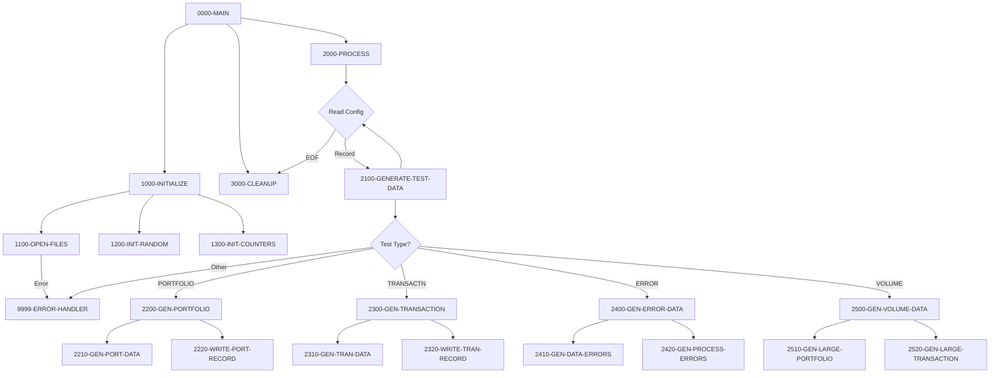

## Overview

TSTGEN00 is a batch COBOL program that generates test data for the Investment Portfolio Management System. It produces synthetic portfolio records, transaction records, error condition data, and high-volume datasets for performance testing.

Key capabilities include:

- **Portfolio Data Generation**: Creates realistic portfolio master records
- **Transaction Data Generation**: Generates transaction test scenarios (buy, sell, transfer, fee)
- **Error Scenario Generation**: Produces intentional data errors for testing error handling
- **Volume Testing Support**: Creates large datasets for performance and stress testing
- **Configurable Output**: Driven by configuration file to control test types and volumes

This program is part of the Test Components layer, working with TSTVAL00 (Test Validation) to support comprehensive system testing.

## Program Structure



## Data Structures

### Working Storage

#### File Status Variables

| Level | Name | Picture | Description |
|-------|------|---------|-------------|
| 01 | WS-FILE-STATUS | - | File status container |
| 05 | WS-CFG-STATUS | XX | Config file status |
| 05 | WS-PORT-STATUS | XX | Portfolio output status |
| 05 | WS-TRAN-STATUS | XX | Transaction output status |
| 05 | WS-RAND-STATUS | XX | Random seed file status |

#### Test Type Constants

| Level | Name | Picture | Value | Description |
|-------|------|---------|-------|-------------|
| 01 | WS-TEST-TYPES | - | - | Valid test type values |
| 05 | WS-PORTFOLIO | X(10) | 'PORTFOLIO' | Portfolio data generation |
| 05 | WS-TRANSACTION | X(10) | 'TRANSACTN' | Transaction data generation |
| 05 | WS-ERROR-TEST | X(10) | 'ERROR' | Error scenario generation |
| 05 | WS-VOLUME-TEST | X(10) | 'VOLUME' | Volume/performance testing |

#### Processing Flags

| Level | Name | Picture | Value | Description |
|-------|------|---------|-------|-------------|
| 01 | WS-PROCESSING-FLAGS | - | - | Control flags |
| 05 | WS-END-OF-CONFIG | X | 'N' | Config EOF indicator |
| 88 | END-OF-CONFIG | VALUE 'Y' | - | End of config reached |

#### Counters

| Level | Name | Picture | Value | Description |
|-------|------|---------|-------|-------------|
| 01 | WS-COUNTERS | - | - | Processing counters |
| 05 | WS-RECORDS-WRITTEN | 9(9) | ZERO | Records generated count |
| 05 | WS-ERROR-COUNT | 9(9) | ZERO | Error count for threshold |

#### Random Number Generation

| Level | Name | Picture | Description |
|-------|------|---------|-------------|
| 01 | WS-RANDOM-VALUES | - | Random value generation |
| 05 | WS-RANDOM-SEED | 9(9) | Seed for random generation |
| 05 | WS-RANDOM-NUM | 9(9) | Generated random number |
| 05 | WS-RANDOM-DECIMAL | 9(9)V99 | Random decimal value |

#### Portfolio Work Area

| Level | Name | Picture | Description |
|-------|------|---------|-------------|
| 01 | WS-PORTFOLIO-DATA | - | Portfolio generation work area |
| 05 | WS-PORT-ID | X(10) | Generated portfolio ID |
| 05 | WS-PORT-NAME | X(30) | Generated portfolio name |
| 05 | WS-PORT-TYPE | X(2) | Portfolio type code |
| 05 | WS-PORT-STATUS | X(1) | Portfolio status |
| 05 | WS-PORT-BALANCE | 9(15)V99 | Generated balance amount |

#### Transaction Work Area

| Level | Name | Picture | Description |
|-------|------|---------|-------------|
| 01 | WS-TRANSACTION-DATA | - | Transaction generation work area |
| 05 | WS-TRAN-ID | X(12) | Generated transaction ID |
| 05 | WS-TRAN-TYPE | X(2) | Transaction type (BU/SL/TR/FE) |
| 05 | WS-TRAN-AMOUNT | 9(15)V99 | Generated amount |
| 05 | WS-TRAN-DATE | X(8) | Transaction date |
| 05 | WS-TRAN-STATUS | X(1) | Transaction status |

### File Section

#### Configuration Record

| Level | Name | Picture | Description |
|-------|------|---------|-------------|
| 01 | CONFIG-RECORD | - | Test configuration record |
| 05 | CFG-TEST-TYPE | X(10) | Type of test data to generate |
| 05 | CFG-VOLUME | 9(6) | Number of records to generate |
| 05 | CFG-PARAMETERS | X(64) | Additional parameters |

#### Output Records

Portfolio and transaction output records use the PORTFLIO and TRNREC copybooks with the REPLACING clause:

```cobol
COPY PORTFLIO REPLACING ==:PREFIX:== BY ==PORT==.
COPY TRNREC REPLACING ==:PREFIX:== BY ==TRAN==.
```

## File I/O

### File Definitions

| File Name | DD Name | Organization | Mode | Description |
|-----------|---------|--------------|------|-------------|
| TEST-CONFIG | TSTCFG | Sequential | INPUT | Test configuration file |
| PORTFOLIO-OUT | PORTOUT | Sequential | OUTPUT | Generated portfolio records |
| TRANSACTION-OUT | TRANOUT | Sequential | OUTPUT | Generated transaction records |
| RANDOM-SEED | RANDSEED | Sequential | INPUT | Random number seed |

### I/O Operations

| Operation | File | Paragraph | Description |
|-----------|------|-----------|-------------|
| OPEN INPUT | TEST-CONFIG | 1100-OPEN-FILES | Open config for reading |
| OPEN OUTPUT | PORTFOLIO-OUT | 1100-OPEN-FILES | Open portfolio output |
| OPEN OUTPUT | TRANSACTION-OUT | 1100-OPEN-FILES | Open transaction output |
| OPEN INPUT | RANDOM-SEED | 1100-OPEN-FILES | Open seed file |
| READ | TEST-CONFIG | 2000-PROCESS | Read config records |
| READ | RANDOM-SEED | 1200-INIT-RANDOM | Read random seed |
| WRITE | PORTFOLIO-OUT | 2220-WRITE-PORT-RECORD | Write portfolio record |
| WRITE | TRANSACTION-OUT | 2320-WRITE-TRAN-RECORD | Write transaction record |
| CLOSE | All files | 3000-CLEANUP | Close all files |

## Control Flow

### Initialization (1000-INITIALIZE)

1. **Open Files** (1100-OPEN-FILES): Opens all input and output files with status checking
2. **Initialize Random** (1200-INIT-RANDOM): Reads seed value for reproducible random generation
3. **Initialize Counters** (1300-INIT-COUNTERS): Resets all processing counters

### Main Processing Loop (2000-PROCESS)

Reads configuration records until end-of-file:

1. **Read Config**: Gets next test configuration record
2. **Dispatch**: Calls appropriate generation routine based on `CFG-TEST-TYPE`

### Test Data Generation (2100-GENERATE-TEST-DATA)

Dispatches to specific generators based on test type:

| Test Type | Handler | Description |
|-----------|---------|-------------|
| PORTFOLIO | 2200-GEN-PORTFOLIO | Generate portfolio records |
| TRANSACTN | 2300-GEN-TRANSACTION | Generate transaction records |
| ERROR | 2400-GEN-ERROR-DATA | Generate error scenarios |
| VOLUME | 2500-GEN-VOLUME-DATA | Generate high-volume data |

### Portfolio Generation (2200-GEN-PORTFOLIO)

Uses `PERFORM VARYING` to generate `CFG-VOLUME` portfolio records:

1. **Generate Data** (2210-GEN-PORT-DATA): Creates random portfolio data
2. **Write Record** (2220-WRITE-PORT-RECORD): Writes to PORTFOLIO-OUT

### Transaction Generation (2300-GEN-TRANSACTION)

Uses `PERFORM VARYING` to generate `CFG-VOLUME` transaction records:

1. **Generate Data** (2310-GEN-TRAN-DATA): Creates random transaction data
2. **Write Record** (2320-WRITE-TRAN-RECORD): Writes to TRANSACTION-OUT

### Error Data Generation (2400-GEN-ERROR-DATA)

Creates intentional error scenarios:

1. **Data Errors** (2410-GEN-DATA-ERRORS): Invalid field values, format errors
2. **Process Errors** (2420-GEN-PROCESS-ERRORS): Scenarios that trigger processing errors

### Volume Data Generation (2500-GEN-VOLUME-DATA)

Creates large datasets for performance testing:

1. **Large Portfolio** (2510-GEN-LARGE-PORTFOLIO): High-volume portfolio data
2. **Large Transaction** (2520-GEN-LARGE-TRANSACTION): High-volume transaction data

### Error Handler (9999-ERROR-HANDLER)

Handles errors with threshold-based termination:

1. Increments `WS-ERROR-COUNT`
2. Displays error message to console
3. If errors exceed 100, sets return code 12 and terminates

## Dependencies

### Copybooks

| Copybook | Location | Purpose |
|----------|----------|---------|
| PORTFLIO | common | Portfolio master record layout |
| TRNREC | common | Transaction record layout |
| RTNCODE | common | Return code management |
| ERRHAND | common | Error handling definitions |

### Related Programs

| Program | Relationship | Description |
|---------|--------------|-------------|
| TSTVAL00 | Sibling | Test validation suite |
| PORTREAD | Consumer | Can read generated portfolio data |
| PORTTRAN | Consumer | Can process generated transactions |

### Programs Sharing Copybooks

**PORTFLIO copybook:**
- PORTADD, PORTDEL, PORTREAD, PORTTEST, PORTUPDT

**TRNREC copybook:**
- RPTPOS00, PORTTRAN, UTLVAL00

**RTNCODE copybook:**
- RPTAUD00, RPTPOS00, RPTSTA00, RTNCDE00, TSTVAL00, UTLMNT00, UTLMON00, UTLVAL00

**ERRHAND copybook:**
- Multiple batch, DB2, portfolio, and utility programs

## Configuration File Format

The test configuration file (TSTCFG) contains records that control test data generation:

| Field | Position | Length | Description |
|-------|----------|--------|-------------|
| CFG-TEST-TYPE | 1-10 | 10 | Test type identifier |
| CFG-VOLUME | 11-16 | 6 | Number of records to generate |
| CFG-PARAMETERS | 17-80 | 64 | Additional test parameters |

### Sample Configuration Records

```
PORTFOLIO 001000                                                          
TRANSACTN 005000                                                          
ERROR     000100                                                          
VOLUME    100000                                                          
```

This configuration would:
1. Generate 1,000 portfolio records
2. Generate 5,000 transaction records
3. Generate 100 error scenario records
4. Generate 100,000 records for volume testing

## JCL Requirements

```jcl
//TSTGEN00 JOB (ACCT#),'TEST DATA GEN',
//             CLASS=A,MSGCLASS=X,MSGLEVEL=(1,1)
//*
//* Test Data Generator
//*
//STEP01   EXEC PGM=TSTGEN00
//STEPLIB  DD   DSN=TEST.LOAD.LIBRARY,DISP=SHR
//TSTCFG   DD   DSN=TEST.CONFIG.FILE,DISP=SHR
//PORTOUT  DD   DSN=TEST.PORTFOLIO.DATA,
//             DISP=(NEW,CATLG,DELETE),
//             SPACE=(CYL,(100,50),RLSE),
//             DCB=(RECFM=FB,LRECL=100,BLKSIZE=0)
//TRANOUT  DD   DSN=TEST.TRANSACTION.DATA,
//             DISP=(NEW,CATLG,DELETE),
//             SPACE=(CYL,(100,50),RLSE),
//             DCB=(RECFM=FB,LRECL=100,BLKSIZE=0)
//RANDSEED DD   DSN=TEST.RANDOM.SEED,DISP=SHR
//SYSOUT   DD   SYSOUT=*
//SYSUDUMP DD   SYSOUT=*
//SYSPRINT DD   SYSOUT=*
```

### DD Statements

| DD Name | Description |
|---------|-------------|
| STEPLIB | Load library containing TSTGEN00 |
| TSTCFG | Test configuration input file |
| PORTOUT | Generated portfolio data output |
| TRANOUT | Generated transaction data output |
| RANDSEED | Random number seed file |
| SYSOUT | Console output |
| SYSUDUMP | Dump output for abends |
| SYSPRINT | Print output |

## Return Codes

| Code | Meaning | Description |
|------|---------|-------------|
| 0 | Success | Test data generated successfully |
| 12 | Error | Error threshold exceeded (>100 errors) |

## Test Data Types

### Portfolio Test Data

Generated portfolio records include:
- Unique portfolio IDs
- Random client names and types (Individual/Corporate/Trust)
- Various status values (Active/Closed/Suspended)
- Realistic financial values (total value, cash balance)
- Audit information

### Transaction Test Data

Generated transaction records include:
- Unique transaction IDs with timestamps
- Transaction types: BUY, SELL, TRANSFER, FEE
- Random quantities, prices, and amounts
- Various status values (Pending/Done/Failed/Reversed)
- Multi-currency support

### Error Scenario Data

Error scenarios for testing system robustness:
- Invalid field formats
- Out-of-range values
- Missing required fields
- Duplicate key scenarios
- Processing error triggers

### Volume Test Data

High-volume datasets for:
- Performance benchmarking
- Stress testing
- Scalability validation
- Resource utilization testing

## Technical Notes

### Random Number Generation

The program uses a seed-based approach for reproducible test data:
- Seed is read from external file (RANDSEED)
- Same seed produces identical test data
- Useful for regression testing

### PERFORM VARYING Loop

The program uses `PERFORM VARYING` for record generation:

```cobol
PERFORM VARYING WS-RECORDS-WRITTEN FROM 1 BY 1
        UNTIL WS-RECORDS-WRITTEN > CFG-VOLUME
    PERFORM 2210-GEN-PORT-DATA
    PERFORM 2220-WRITE-PORT-RECORD
END-PERFORM
```

This loop generates exactly `CFG-VOLUME` records per configuration entry.

### COPY REPLACING Clause

The program uses COPY with REPLACING for flexible record layouts:

```cobol
COPY PORTFLIO REPLACING ==:PREFIX:== BY ==PORT==.
```

This allows the copybook to be used with different prefixes in different contexts.

### Console Output

The program uses `SPECIAL-NAMES` to define console output:

```cobol
SPECIAL-NAMES.
    CONSOLE IS CONS.
```

Error messages are displayed using:
```cobol
DISPLAY WS-ERROR-MESSAGE UPON CONS
```

### Error Threshold

The error handler implements a threshold to prevent runaway processing:
- Maximum 100 errors allowed
- Beyond 100 errors, program terminates with RC=12
- Prevents infinite loops in error conditions

### Output File Specifications

Both output files use:
- RECORDING MODE IS F (Fixed-length records)
- BLOCK CONTAINS 0 RECORDS (system-determined blocking)
- LRECL=100 in JCL DCB
