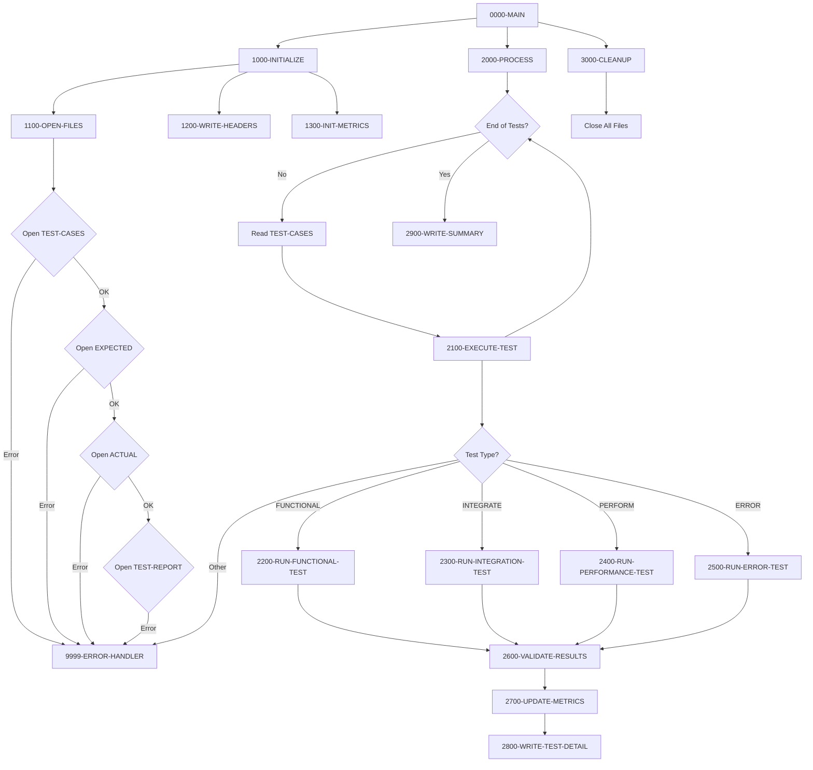

## Overview

TSTVAL00 is a comprehensive test validation suite that automates the execution and validation of test cases for the portfolio management system. It reads test case definitions, executes different types of tests, compares actual results against expected results, and generates a detailed test report with pass/fail metrics.

The program supports four categories of tests: functional tests (verifying correct business logic), integration tests (validating component interactions), performance tests (benchmarking execution speed), and error tests (confirming proper error handling). This categorization allows for organized test management and targeted validation of different system aspects.

TSTVAL00 produces a formatted report that includes individual test results and a summary with total tests executed, pass/fail counts, and overall success rate percentage. The program also tracks elapsed execution time for performance analysis of the test suite itself.

## Program Structure



## Data Structures

### File Section - Test Case Record

| Level | Name | Picture | Description |
|-------|------|---------|-------------|
| 01 | TEST-CASE-RECORD | - | Test case input record (170 bytes) |
| 05 | TEST-ID | X(10) | Unique test identifier |
| 05 | TEST-TYPE | X(10) | Test category (FUNCTIONAL, INTEGRATE, PERFORM, ERROR) |
| 05 | TEST-DESCRIPTION | X(50) | Human-readable test description |
| 05 | TEST-PARAMETERS | X(100) | Test input parameters |

### File Section - Results Records

| Level | Name | Picture | Description |
|-------|------|---------|-------------|
| 01 | EXPECTED-RECORD | X(200) | Expected test result |
| 01 | ACTUAL-RECORD | X(200) | Actual test result |
| 01 | REPORT-RECORD | X(132) | Output report line |

### Working Storage - File Status

| Level | Name | Picture | Description |
|-------|------|---------|-------------|
| 01 | WS-FILE-STATUS | - | File status codes |
| 05 | WS-TEST-STATUS | XX | TEST-CASES file status |
| 05 | WS-EXP-STATUS | XX | EXPECTED-RESULTS file status |
| 05 | WS-ACT-STATUS | XX | ACTUAL-RESULTS file status |
| 05 | WS-RPT-STATUS | XX | TEST-REPORT file status |

### Working Storage - Test Type Constants

| Level | Name | Picture | Value | Description |
|-------|------|---------|-------|-------------|
| 01 | WS-TEST-TYPES | - | - | Test type identifiers |
| 05 | WS-FUNCTIONAL | X(10) | 'FUNCTIONAL' | Functional test type |
| 05 | WS-INTEGRATION | X(10) | 'INTEGRATE' | Integration test type |
| 05 | WS-PERFORMANCE | X(10) | 'PERFORM' | Performance test type |
| 05 | WS-ERROR | X(10) | 'ERROR' | Error condition test type |

### Working Storage - Processing Flags

| Level | Name | Picture | Value | Description |
|-------|------|---------|-------|-------------|
| 01 | WS-PROCESSING-FLAGS | - | - | Processing control flags |
| 05 | WS-END-OF-TESTS | X | 'N' | End of test file flag |
| - | 88 END-OF-TESTS | - | 'Y' | Condition: all tests processed |
| 05 | WS-TEST-PASSED | X | 'N' | Current test passed flag |
| - | 88 TEST-PASSED | - | 'Y' | Condition: test passed |

### Working Storage - Test Metrics

| Level | Name | Picture | Value | Description |
|-------|------|---------|-------|-------------|
| 01 | WS-TEST-METRICS | - | - | Test execution metrics |
| 05 | WS-TOTAL-TESTS | 9(5) | ZERO | Total tests executed |
| 05 | WS-TESTS-PASSED | 9(5) | ZERO | Number of tests passed |
| 05 | WS-TESTS-FAILED | 9(5) | ZERO | Number of tests failed |
| 05 | WS-START-TIME | 9(8) | ZERO | Suite start time (HHMMSSCC) |
| 05 | WS-END-TIME | 9(8) | ZERO | Suite end time (HHMMSSCC) |
| 05 | WS-ELAPSED-TIME | 9(8) | ZERO | Total elapsed time |

### Working Storage - Report Lines

| Level | Name | Picture | Description |
|-------|------|---------|-------------|
| 01 | WS-REPORT-HEADERS | - | Report header lines |
| 05 | WS-HEADER1 | X(132) | All asterisks separator |
| 05 | WS-HEADER2 | - | Title line with 'TEST VALIDATION REPORT' |
| 01 | WS-TEST-DETAIL | - | Test detail output line |
| 05 | WS-TEST-ID-OUT | X(10) | Test ID for output |
| 05 | WS-TEST-TYPE-OUT | X(10) | Test type for output |
| 05 | WS-TEST-DESC-OUT | X(50) | Test description for output |
| 05 | WS-TEST-STATUS-OUT | X(4) | PASS/FAIL status |
| 01 | WS-SUMMARY-LINE | - | Summary output line |
| 05 | WS-TOTAL-OUT | ZZ,ZZ9 | Edited total tests |
| 05 | WS-PASSED-OUT | ZZ,ZZ9 | Edited passed count |
| 05 | WS-FAILED-OUT | ZZ,ZZ9 | Edited failed count |
| 05 | WS-SUCCESS-RATE | ZZ9.99 | Success percentage |

## File I/O

### File Definitions

| File Name | DD Name | Organization | Access | Record Length | Description |
|-----------|---------|--------------|--------|---------------|-------------|
| TEST-CASES | TESTCASE | Sequential | Sequential | 170 | Test case definitions |
| EXPECTED-RESULTS | EXPECTED | Sequential | Sequential | 200 | Expected test results |
| ACTUAL-RESULTS | ACTUAL | Sequential | Sequential | 200 | Actual test results |
| TEST-REPORT | TESTRPT | Sequential | Sequential | 132 | Test validation report |

### I/O Operations

| File | Operation | Paragraph | Purpose |
|------|-----------|-----------|---------|
| TEST-CASES | OPEN INPUT | 1100-OPEN-FILES | Open for reading test cases |
| EXPECTED-RESULTS | OPEN INPUT | 1100-OPEN-FILES | Open for reading expected results |
| ACTUAL-RESULTS | OPEN INPUT | 1100-OPEN-FILES | Open for reading actual results |
| TEST-REPORT | OPEN OUTPUT | 1100-OPEN-FILES | Open for writing report |
| REPORT-RECORD | WRITE | 1200-WRITE-HEADERS | Write report headers |
| TEST-CASES | READ | 2000-PROCESS | Read next test case |
| REPORT-RECORD | WRITE | 2800-WRITE-TEST-DETAIL | Write test detail line |
| REPORT-RECORD | WRITE | 2900-WRITE-SUMMARY | Write summary line |
| All files | CLOSE | 3000-CLEANUP | Close all files |

## Control Flow

### 0000-MAIN (Main Control)

The main paragraph orchestrates the test validation process:
1. Performs initialization (1000-INITIALIZE)
2. Performs main processing loop (2000-PROCESS)
3. Performs cleanup (3000-CLEANUP)
4. Returns to caller via GOBACK

### 1000-INITIALIZE (Setup)

Initializes the test validation environment:
1. Calls 1100-OPEN-FILES to open all input and output files
2. Calls 1200-WRITE-HEADERS to output report header lines
3. Calls 1300-INIT-METRICS to initialize counters and capture start time

### 1100-OPEN-FILES (File Setup)

Opens all four files with error checking:
1. Opens TEST-CASES for input; if error, sets message and calls error handler
2. Opens EXPECTED-RESULTS for input; if error, sets message and calls error handler
3. Opens ACTUAL-RESULTS for input; if error, sets message and calls error handler
4. Opens TEST-REPORT for output; if error, sets message and calls error handler

### 1200-WRITE-HEADERS (Report Headers)

Writes the report header section:
1. Writes WS-HEADER1 (asterisk separator line)
2. Writes WS-HEADER2 (title "TEST VALIDATION REPORT")

### 1300-INIT-METRICS (Metrics Setup)

Prepares test metrics tracking:
1. Initializes WS-TEST-METRICS to zeros
2. Accepts current time into WS-START-TIME using `ACCEPT FROM TIME`

### 2000-PROCESS (Main Loop)

Processes all test cases:
1. Loops until END-OF-TESTS is true
2. Reads next TEST-CASE-RECORD
   - AT END: Sets END-OF-TESTS to true
   - NOT AT END: Calls 2100-EXECUTE-TEST
3. After loop completes, calls 2900-WRITE-SUMMARY

### 2100-EXECUTE-TEST (Test Execution)

Executes a single test based on its type:
1. Evaluates TEST-TYPE:
   - WS-FUNCTIONAL: Performs 2200-RUN-FUNCTIONAL-TEST
   - WS-INTEGRATION: Performs 2300-RUN-INTEGRATION-TEST
   - WS-PERFORMANCE: Performs 2400-RUN-PERFORMANCE-TEST
   - WS-ERROR: Performs 2500-RUN-ERROR-TEST
   - OTHER: Sets error message and calls error handler
2. Performs 2600-VALIDATE-RESULTS to compare actual vs expected
3. Performs 2700-UPDATE-METRICS to update pass/fail counters
4. Performs 2800-WRITE-TEST-DETAIL to output the test result

### 2200-RUN-FUNCTIONAL-TEST through 2500-RUN-ERROR-TEST

These paragraphs execute the specific test type logic. They are designed to be extended with actual test execution code.

### 2600-VALIDATE-RESULTS (Result Comparison)

Compares actual results against expected results and sets the TEST-PASSED flag accordingly.

### 2700-UPDATE-METRICS (Counter Updates)

Updates test metrics:
1. Increments WS-TOTAL-TESTS
2. If TEST-PASSED, increments WS-TESTS-PASSED
3. Otherwise, increments WS-TESTS-FAILED

### 2800-WRITE-TEST-DETAIL (Detail Output)

Writes a detail line for the current test including test ID, type, description, and pass/fail status.

### 2900-WRITE-SUMMARY (Summary Output)

Generates the test summary:
1. Accepts end time using `ACCEPT FROM TIME`
2. Computes elapsed time as end minus start
3. Moves metrics to edited output fields
4. Computes success rate as (passed / total) * 100
5. Writes the summary line to the report

### 3000-CLEANUP (Termination)

Closes all files:
1. Closes TEST-CASES
2. Closes EXPECTED-RESULTS
3. Closes ACTUAL-RESULTS
4. Closes TEST-REPORT

### 9999-ERROR-HANDLER (Error Processing)

Handles errors during test validation:
1. Displays WS-ERROR-MESSAGE to the console (CONS)
2. Sets RETURN-CODE to 12
3. Terminates with GOBACK

## Dependencies

### Copybooks

- **RTNCODE** - Return code management structure with request types, status codes, and analysis data
- **ERRHAND** - Standard error handling definitions with categories, return codes, and message structures

### Called Programs

This program does not call other programs directly. It is a standalone test driver.

### Related Programs

Programs that share the same copybooks:

- **TSTGEN00** - Test data generator (uses RTNCODE and ERRHAND)
- **RTNCDE00** - Return code manager (uses RTNCODE)
- **RPTAUD00** - Audit report (uses RTNCODE and ERRHAND)
- **RPTPOS00** - Position report (uses RTNCODE and ERRHAND)
- **RPTSTA00** - Status report (uses RTNCODE and ERRHAND)

## Technical Notes

### Test Types

| Type | Constant | Purpose |
|------|----------|---------|
| FUNCTIONAL | 'FUNCTIONAL' | Unit tests for individual functions |
| INTEGRATE | 'INTEGRATE' | Integration tests for component interaction |
| PERFORM | 'PERFORM' | Performance and benchmark tests |
| ERROR | 'ERROR' | Error condition and edge case tests |

### Return Codes

| Code | Meaning |
|------|---------|
| 0 | All tests executed successfully |
| 12 | Error during test validation (file open failure, invalid test type) |

### Report Format

The generated report follows this structure:

```
************************************************************
                    TEST VALIDATION REPORT
************************************************************
TEST0001   FUNCTIONAL  Validate account creation       PASS
TEST0002   FUNCTIONAL  Validate balance calculation    PASS
TEST0003   INTEGRATE   End-to-end transaction flow     FAIL
TEST0004   PERFORM     Bulk insert performance         PASS
TEST0005   ERROR       Invalid account handling        PASS
************************************************************
TOTAL TESTS: 5  PASSED: 4  FAILED: 1  SUCCESS: 80.00%
```

### SPECIAL-NAMES Configuration

The program defines `CONSOLE IS CONS` in the SPECIAL-NAMES paragraph, allowing error messages to be displayed to the operator console using `DISPLAY ... UPON CONS`.

### Time Tracking

Test execution time is tracked using:
- `ACCEPT WS-START-TIME FROM TIME` at initialization
- `ACCEPT WS-END-TIME FROM TIME` at summary
- Format is HHMMSSCC (hours, minutes, seconds, hundredths)

### COBOL Features Used

- **SPECIAL-NAMES CONSOLE**: Defines mnemonic name for console output
- **ACCEPT FROM TIME**: Retrieves system time in HHMMSSCC format
- **88-level condition names**: Used for END-OF-TESTS and TEST-PASSED flags
- **EVALUATE**: Multi-way branch for test type selection
- **READ AT END/NOT AT END**: Conditional processing on file read
- **COMPUTE with percentage**: Calculates success rate
- **Edited PIC clauses**: ZZ,ZZ9 and ZZ9.99 for report formatting

### Sample JCL

```jcl
//TSTVAL   EXEC PGM=TSTVAL00
//TESTCASE DD DSN=TEST.CASES.FILE,DISP=SHR
//EXPECTED DD DSN=TEST.EXPECTED.RESULTS,DISP=SHR
//ACTUAL   DD DSN=TEST.ACTUAL.RESULTS,DISP=SHR
//TESTRPT  DD SYSOUT=*
//SYSOUT   DD SYSOUT=*
```

### Extension Points

The test type paragraphs (2200-2500) and validation paragraph (2600) are designed as extension points. To add custom test logic:

1. Add test execution code to the appropriate 2x00 paragraph
2. Implement result comparison in 2600-VALIDATE-RESULTS
3. Set TEST-PASSED flag based on comparison outcome
