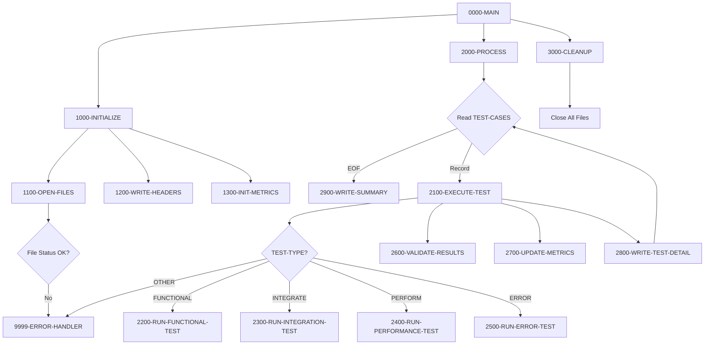

## Overview

TSTVAL00 is a batch test validation program that provides an automated testing framework for COBOL applications. It reads test case definitions, executes different types of tests, compares actual results against expected results, and produces a comprehensive test report with pass/fail statistics.

The program supports four types of tests:
- **Functional Tests** - Verify individual functions work correctly
- **Integration Tests** - Verify components work together properly
- **Performance Tests** - Benchmark execution times and throughput
- **Error Tests** - Verify proper error handling and recovery

This is a key component of the quality assurance infrastructure, enabling automated regression testing and continuous integration workflows.

## Program Structure



## Data Structures

### File Section - Test Case Record

| Level | Field | Picture | Description |
|-------|-------|---------|-------------|
| 01 | TEST-CASE-RECORD | - | Test case definition |
| 05 | TEST-ID | X(10) | Unique test identifier |
| 05 | TEST-TYPE | X(10) | Test type (FUNCTIONAL, INTEGRATE, PERFORM, ERROR) |
| 05 | TEST-DESCRIPTION | X(50) | Human-readable test description |
| 05 | TEST-PARAMETERS | X(100) | Test input parameters |

### File Section - Result Records

| Record | Picture | Description |
|--------|---------|-------------|
| EXPECTED-RECORD | X(200) | Expected test output |
| ACTUAL-RECORD | X(200) | Actual test output |
| REPORT-RECORD | X(132) | Test report output line |

### Working Storage

#### File Status Fields

| Field | Picture | Description |
|-------|---------|-------------|
| WS-TEST-STATUS | XX | TEST-CASES file status |
| WS-EXP-STATUS | XX | EXPECTED-RESULTS file status |
| WS-ACT-STATUS | XX | ACTUAL-RESULTS file status |
| WS-RPT-STATUS | XX | TEST-REPORT file status |

#### Test Type Constants

| Field | Picture | Value | Description |
|-------|---------|-------|-------------|
| WS-FUNCTIONAL | X(10) | 'FUNCTIONAL' | Functional test type |
| WS-INTEGRATION | X(10) | 'INTEGRATE' | Integration test type |
| WS-PERFORMANCE | X(10) | 'PERFORM' | Performance test type |
| WS-ERROR | X(10) | 'ERROR' | Error handling test type |

#### Processing Flags

| Field | Picture | Initial | Level-88 | Description |
|-------|---------|---------|----------|-------------|
| WS-END-OF-TESTS | X | 'N' | END-OF-TESTS = 'Y' | EOF indicator |
| WS-TEST-PASSED | X | 'N' | TEST-PASSED = 'Y' | Current test result |

#### Test Metrics

| Field | Picture | Initial | Description |
|-------|---------|---------|-------------|
| WS-TOTAL-TESTS | 9(5) | ZERO | Total tests executed |
| WS-TESTS-PASSED | 9(5) | ZERO | Count of passed tests |
| WS-TESTS-FAILED | 9(5) | ZERO | Count of failed tests |
| WS-START-TIME | 9(8) | ZERO | Suite start time (HHMMSSTT) |
| WS-END-TIME | 9(8) | ZERO | Suite end time |
| WS-ELAPSED-TIME | 9(8) | ZERO | Total elapsed time |

#### Report Detail Line

| Field | Picture | Description |
|-------|---------|-------------|
| WS-TEST-ID-OUT | X(10) | Test identifier |
| WS-TEST-TYPE-OUT | X(10) | Test type |
| WS-TEST-DESC-OUT | X(50) | Test description |
| WS-TEST-STATUS-OUT | X(4) | PASS or FAIL |

#### Summary Line

| Field | Picture | Description |
|-------|---------|-------------|
| WS-TOTAL-OUT | ZZ,ZZ9 | Total tests (edited) |
| WS-PASSED-OUT | ZZ,ZZ9 | Passed count (edited) |
| WS-FAILED-OUT | ZZ,ZZ9 | Failed count (edited) |
| WS-SUCCESS-RATE | ZZ9.99 | Pass percentage |

## File I/O

### Input Files

#### TEST-CASES (TESTCASE)

| Attribute | Value |
|-----------|-------|
| Organization | Sequential |
| Access Mode | Sequential |
| Recording Mode | F (Fixed) |
| File Status | WS-TEST-STATUS |

Contains test case definitions with ID, type, description, and parameters.

#### EXPECTED-RESULTS (EXPECTED)

| Attribute | Value |
|-----------|-------|
| Organization | Sequential |
| Access Mode | Sequential |
| Recording Mode | F (Fixed) |
| Record Length | 200 bytes |
| File Status | WS-EXP-STATUS |

Contains expected output for each test case.

#### ACTUAL-RESULTS (ACTUAL)

| Attribute | Value |
|-----------|-------|
| Organization | Sequential |
| Access Mode | Sequential |
| Recording Mode | F (Fixed) |
| Record Length | 200 bytes |
| File Status | WS-ACT-STATUS |

Contains actual output from test execution.

### Output File

#### TEST-REPORT (TESTRPT)

| Attribute | Value |
|-----------|-------|
| Organization | Sequential |
| Recording Mode | F (Fixed) |
| Record Length | 132 bytes |
| File Status | WS-RPT-STATUS |

Contains the formatted test validation report.

### File Operations Summary

| Operation | File | Paragraph | Description |
|-----------|------|-----------|-------------|
| OPEN INPUT | TEST-CASES | 1100-OPEN-FILES | Open test case definitions |
| OPEN INPUT | EXPECTED-RESULTS | 1100-OPEN-FILES | Open expected results |
| OPEN INPUT | ACTUAL-RESULTS | 1100-OPEN-FILES | Open actual results |
| OPEN OUTPUT | TEST-REPORT | 1100-OPEN-FILES | Open report for writing |
| READ | TEST-CASES | 2000-PROCESS | Read next test case |
| WRITE | REPORT-RECORD | 1200-WRITE-HEADERS | Write header lines |
| WRITE | REPORT-RECORD | 2800-WRITE-TEST-DETAIL | Write test detail |
| WRITE | REPORT-RECORD | 2900-WRITE-SUMMARY | Write summary line |
| CLOSE | All files | 3000-CLEANUP | Close all files |

## Control Flow

### 0000-MAIN - Main Control

1. Calls 1000-INITIALIZE for setup
2. Calls 2000-PROCESS for test execution
3. Calls 3000-CLEANUP for resource release
4. Returns via GOBACK

### 1000-INITIALIZE - Setup

1. **1100-OPEN-FILES**: Opens all four files with status checking
   - Any file open error triggers 9999-ERROR-HANDLER
2. **1200-WRITE-HEADERS**: Writes report header lines (asterisk border and title)
3. **1300-INIT-METRICS**: Initializes counters and captures start time

### 2000-PROCESS - Main Processing Loop

1. Reads TEST-CASES until EOF
2. For each test case, calls 2100-EXECUTE-TEST
3. After all tests, calls 2900-WRITE-SUMMARY

### 2100-EXECUTE-TEST - Test Dispatcher

1. Evaluates TEST-TYPE and routes to appropriate test runner:
   - FUNCTIONAL → 2200-RUN-FUNCTIONAL-TEST
   - INTEGRATE → 2300-RUN-INTEGRATION-TEST
   - PERFORM → 2400-RUN-PERFORMANCE-TEST
   - ERROR → 2500-RUN-ERROR-TEST
   - OTHER → 9999-ERROR-HANDLER
2. Calls 2600-VALIDATE-RESULTS to compare actual vs expected
3. Calls 2700-UPDATE-METRICS to update counters
4. Calls 2800-WRITE-TEST-DETAIL to write report line

### Test Type Handlers

| Paragraph | Test Type | Purpose |
|-----------|-----------|---------|
| 2200-RUN-FUNCTIONAL-TEST | FUNCTIONAL | Unit/function testing |
| 2300-RUN-INTEGRATION-TEST | INTEGRATE | Integration testing |
| 2400-RUN-PERFORMANCE-TEST | PERFORM | Performance benchmarking |
| 2500-RUN-ERROR-TEST | ERROR | Error handling verification |

*Note: The actual test execution logic for these paragraphs would need to be implemented based on specific testing requirements.*

### 2600-VALIDATE-RESULTS - Result Comparison

Compares ACTUAL-RECORD with EXPECTED-RECORD to determine test pass/fail status.

### 2700-UPDATE-METRICS - Counter Updates

Updates the test counters:
- Increments WS-TOTAL-TESTS
- Increments WS-TESTS-PASSED or WS-TESTS-FAILED based on result

### 2800-WRITE-TEST-DETAIL - Report Writing

Formats and writes a detail line for each test showing:
- Test ID
- Test Type
- Description
- Status (PASS/FAIL)

### 2900-WRITE-SUMMARY - Summary Generation

1. Captures end time using `ACCEPT FROM TIME`
2. Computes elapsed time
3. Calculates success rate percentage
4. Writes summary line with totals and pass rate

### 3000-CLEANUP - Resource Release

Closes all four files in a single CLOSE statement.

### 9999-ERROR-HANDLER - Error Processing

1. Displays error message to console (CONS)
2. Sets RETURN-CODE to 12
3. Terminates via GOBACK

## Report Format

```
************************************************************************...
                              TEST VALIDATION REPORT
TEST0001   FUNCTIONAL  Verify account creation                         PASS
TEST0002   FUNCTIONAL  Verify balance calculation                      PASS
TEST0003   INTEGRATE   Verify end-to-end transaction                   FAIL
TEST0004   PERFORM     Benchmark 1000 transactions                     PASS
TEST0005   ERROR       Verify invalid input handling                   PASS
TOTAL TESTS: 5     PASSED: 4     FAILED: 1     SUCCESS: 80.00%
```

## Dependencies

### Copybooks

- **RTNCODE** - Return code management structures for tracking test execution status
- **ERRHAND** - Standard error handling definitions including error message fields

### Called Programs

None directly - this is a test framework that validates results from other program executions.

### Related Programs

Programs sharing the RTNCODE copybook:

| Program | Description |
|---------|-------------|
| RPTAUD00 | Audit report generator |
| RPTPOS00 | Position report generator |
| RPTSTA00 | Status report generator |
| RTNCDE00 | Return code processor |
| TSTGEN00 | Test data generator |
| UTLMNT00 | Maintenance utility |
| UTLMON00 | Monitoring utility |
| UTLVAL00 | Validation utility |

Programs sharing the ERRHAND copybook are used throughout the system for consistent error handling.

## Return Codes

| Code | Description |
|------|-------------|
| 0 | All tests passed successfully |
| 12 | Error during execution (file open failure, invalid test type) |

## Usage

### JCL Example

```jcl
//TSTVAL   EXEC PGM=TSTVAL00
//STEPLIB  DD DSN=your.loadlib,DISP=SHR
//TESTCASE DD DSN=your.test.cases,DISP=SHR
//EXPECTED DD DSN=your.expected.results,DISP=SHR
//ACTUAL   DD DSN=your.actual.results,DISP=SHR
//TESTRPT  DD DSN=your.test.report,
//            DISP=(NEW,CATLG,DELETE),
//            SPACE=(CYL,(1,1)),
//            DCB=(RECFM=FB,LRECL=132,BLKSIZE=0)
//SYSOUT   DD SYSOUT=*
```

### Test Case File Format

Each test case record should contain:
```
Columns  1-10:  Test ID (e.g., TEST0001)
Columns 11-20:  Test Type (FUNCTIONAL, INTEGRATE, PERFORM, ERROR)
Columns 21-70:  Test Description
Columns 71-170: Test Parameters
```

## Technical Notes

1. **SPECIAL-NAMES CONSOLE**: The `CONSOLE IS CONS` clause defines CONS as an alias for the system console, used for error message display via `DISPLAY ... UPON CONS`.

2. **ACCEPT FROM TIME**: Captures the current time in HHMMSSTT format (hours, minutes, seconds, hundredths). Used for calculating test suite elapsed time.

3. **Edited Pictures**: The summary line uses edited pictures like `ZZ,ZZ9` for numeric display with comma insertion and leading zero suppression, and `ZZ9.99` for the percentage with decimal point.

4. **Recording Mode F**: Fixed-length records without additional control information, standard for batch sequential files.

5. **Block Contains 0**: Lets the system determine optimal block size based on device characteristics.

6. **Test Framework Pattern**: This program implements a common test framework pattern:
   - Read test definitions from file
   - Execute tests based on type
   - Compare actual vs expected results
   - Aggregate metrics and report

7. **Extensibility**: New test types can be added by:
   - Adding a new constant to WS-TEST-TYPES
   - Adding a WHEN clause to the EVALUATE in 2100-EXECUTE-TEST
   - Implementing the corresponding test paragraph

8. **Error Isolation**: Each file open is checked independently, allowing identification of which specific file caused a failure.
